# Developing In A Windows Environment Using Vagrant And Cygwin

This guide will cover how to set up a Windows environment for Discourse development using Vagrant and Cygwin. By the end of the guide, you should have:

1. A Vagrant instance set up with Discourse running.
2. `rsync` running so that Discourse rebuilds the project whenever a file changes.
3. Cygwin terminals running Discourse and `rsync`.
4. Ability to view Discourse at http://localhost:4000 with live reloading of changes.

>**NOTE:** By default, Vagrant uses VirtualBox's shared folders with the VM. However, this is [very slow](https://meta.discourse.org/t/development-mode-super-slow/2179). We use `rsync` instead, which is significantly faster and only requires a few more steps to set up.

## Requirements

1. Windows 7 or higher
2. [VirtualBox](https://www.virtualbox.org/wiki/Downloads) - virtualization software that Vagrant uses
3. [Vagrant 64-bit](https://www.vagrantup.com/downloads.html) - sets up a pre-configured Ubuntu VM to run Discourse in
4. [Cygwin 64-bit](https://cygwin.com/install.html) - needed to SSH into the Vagrant VM and run `rsync`

## Table Of Contents

* [Step 1: Install Required Software](#step-1-install-required-software)
* [Step 2: Set Up And Start Vagrant](#step-2-set-up-and-start-vagrant)
* [Step 3: SSH Into Vagrant Box And Set Up Discourse](#step-3-ssh-into-vagrant-box-and-set-up-discourse)
* [Step 4: Start The Discourse Server](#step-4-start-the-discourse-server)
* [Step 5: Restarting The Discourse Server After A Reboot](#step-5-restarting-the-discourse-server-after-a-reboot)
* [Step 6: Troubleshooting](#step-6-troubleshooting)

## Step 1: Install Required Software

1. Download and install [VirtualBox](https://www.virtualbox.org/wiki/Downloads) with the default options.

2. Download and install [Vagrant 64-bit](https://www.vagrantup.com/downloads.html) with the default options. You will be asked to reboot after the installation is complete. A reboot is not necessary, but you can do it if you like.

3. Download and install [Cygwin 64-bit](https://cygwin.com/install.html). Keep clicking `Next` with the default options until you reach the `Select Packages` page:

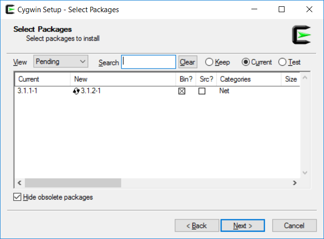

4. Change the `View` dropdown to `Full`, then search for `openssh`. Find the entry with the package `openssh: The OpenSSH server and client programs`, then click on the word `Skip` for that entry until it changes to a version number and the `Bin?` checkbox is checked:

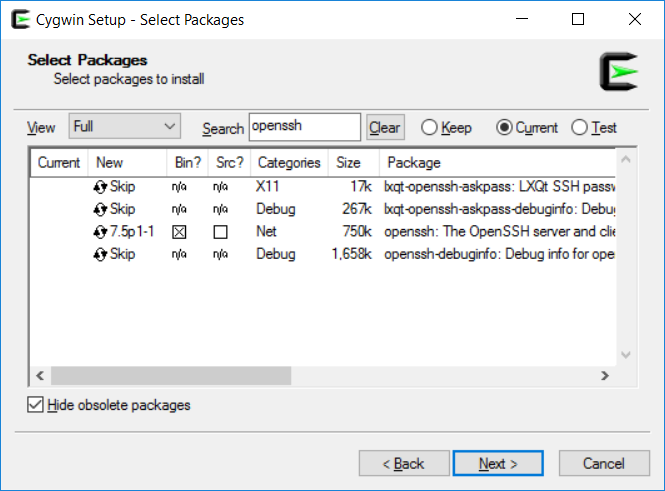

5. Repeat the above step for `rsync`. The entry we want is `rsync: Fast remote file transfer program`:

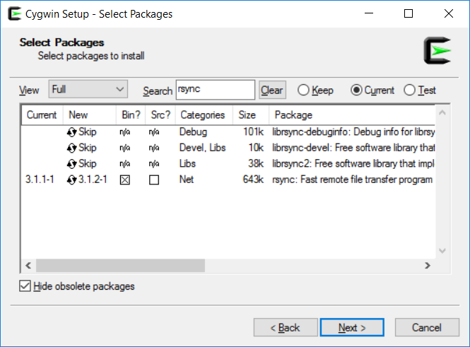

6. Click `Next` and keep going through the installer with the default options until the Cygwin install is finished.

7. We now need to add VirtualBox to the system path. In Windows, search for `environment variables` in the start menu and click on `Edit the system environment variables`:

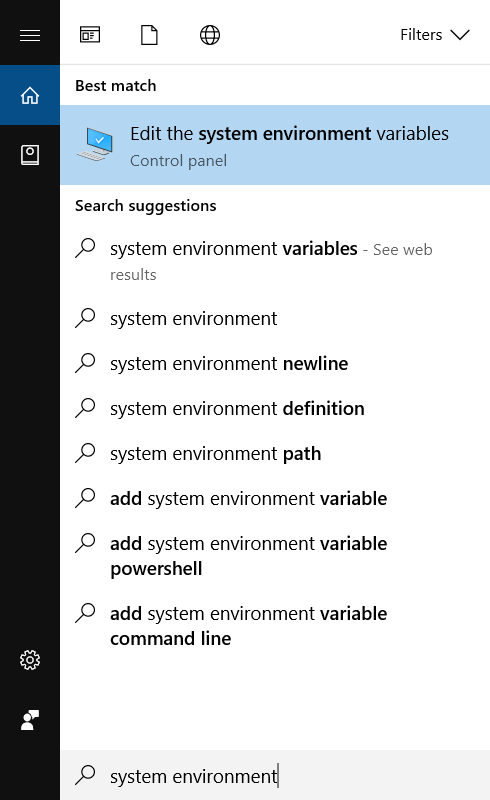

8. In the dialog that pops up, click on the `Environment Variables` button on the lower right:

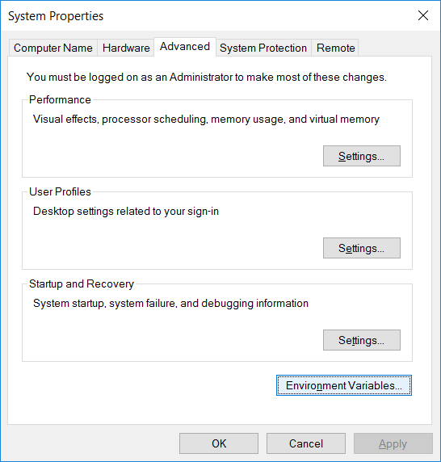

9. A new dialog will display. In the lower `System variables` list, find the entry for `Path`, click on it, then click on the `Edit...` button:

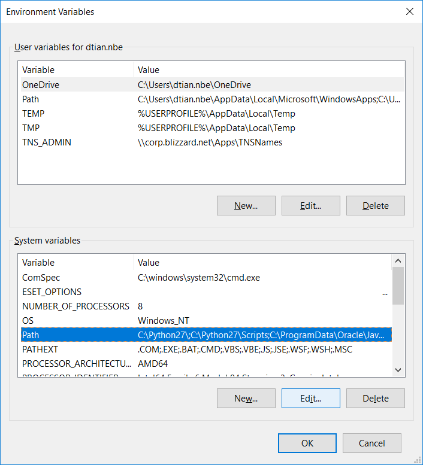

10. A third dialog will show. Click on the `New` button on the upper right, then type in `C:\Program Files\Oracle\VirtualBox` (this is where VirtualBox is installed by default; if you changed the install location, you need to use the location that you installed it to):

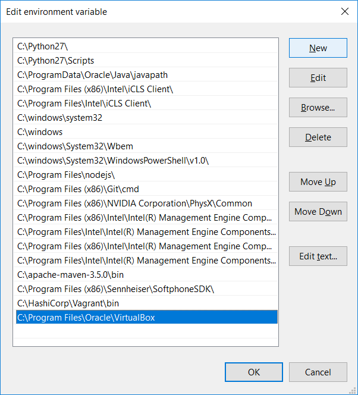

>**NOTE:** If you are using Windows 8 or below, this dialog will look different. It will have a textbox for `Variable name` and `Variable value`. In this case, add `;C:\Program Files\Oracle\VirtualBox` to the end of the `Variable value` textbox.

11. Click `OK` for all 3 dialogs to close them all.

You have now installed all the required software and are ready to start up the Vagrant server.

## Step 2: Set Up And Start Vagrant

1. Clone a copy of Discourse from their [GitHub repo](https://github.com/discourse/discourse) into a local folder on Windows:


2. In the Discourse folder, open the file `Vagrantfile` and find the following line:

```
config.vm.synced_folder ".", "/vagrant", id: "vagrant-root"
```

Change it to:

```
config.vm.synced_folder ".", "/vagrant", id: "vagrant-root", type: "rsync"
```


>**NOTE: DO NOT** commit this edit back to Discourse, it is a Windows-specific setting that will likely break things for people using OSX and Linux.

2. Run `Cygwin64 Terminal`. It will open up a new terminal that looks very similar to the command prompt:


3. Using Cygwin, `cd` to the folder where you cloned Discourse into. To access the Windows `C:\` drive in Cygwin, use the path `/cygdrive/c`. In this guide, we installed Discourse to `C:\Projects\discourse`, so the command is:

```bash
cd /cygdrive/c/Projects/discourse
```


4. Type the following command to start the Vagrant server:

```bash
vagrant up
```

It will take some time to complete. You may be prompted several times by UAC for `VirtualBox Interface`. Make sure you click `Yes` each time.

>**NOTE:** If you get an error message `Could not get lock /var/lib/dpkg/lock - open`, just re-run `vagrant up` again.

You now have a Vagrant instance set up and running!

## Step 3: SSH Into Vagrant Box And Set Up Discourse

1. In a `Cygwin64 Terminal`, `cd` over to the Discourse folder and run the following command to `ssh` into the Vagrant VM:

```bash
vagrant ssh
```

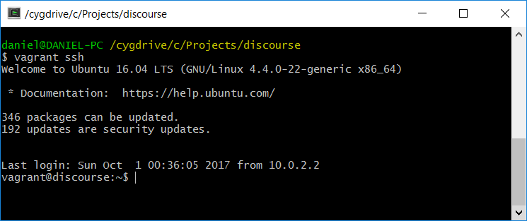

2. `cd` over to `/vagrant`, which is where the Discourse shared folder is mounted, and run `bundle install`. Sit back and relax, the install will take a while:

```bash
cd /vagrant
bundle install
```

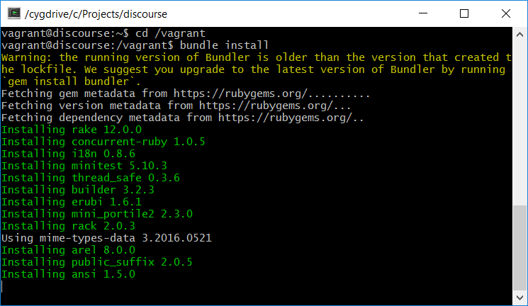

3. Once all the gems are finished installing, run `rake db:migrate`:

```bash
rake db:migrate
```

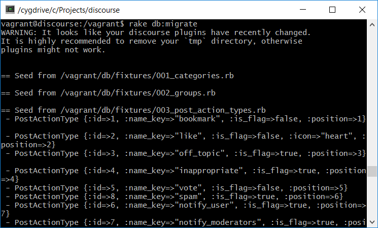

4. Run `rake admin:create` to create an admin account. This is the account you will use to log into Discourse with. `Do you want to grant Admin privileges to this account?` Type `y`:

```bash
rake admin:create
```

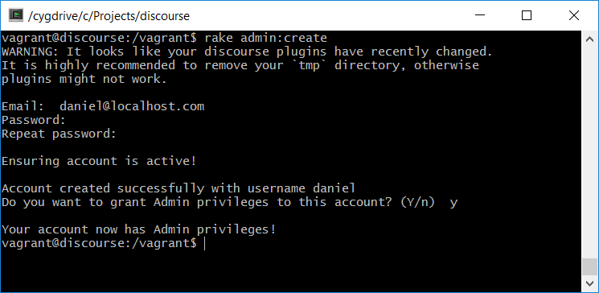

You have finished setting up Discourse and are ready to start the Discourse server.

## Step 4: Start The Discourse Server

1. Open up a new `Cygwin64 Terminal` and `cd` over to the discourse folder:


2. Run `vagrant rsync-auto`. This will run continuously in the Cygwin terminal, so do not close the window:

```bash
vagrant rsync-auto
```

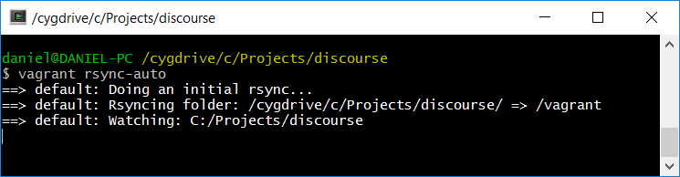

3. You should already have a terminal that's already `ssh`'ed into the VM and `cd`'ed over to `/vagrant`. Run `rails s -b 0.0.0.0` to start up the Discourse web server:

```
rails s -b 0.0.0.0
```

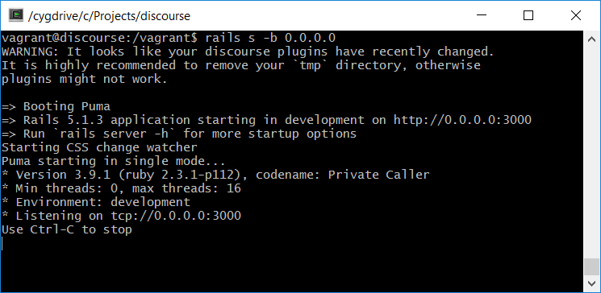

4. In your browser, navigate to http://localhost:4000. It will take a while to load initially, but eventually you should see the Discourse home page:

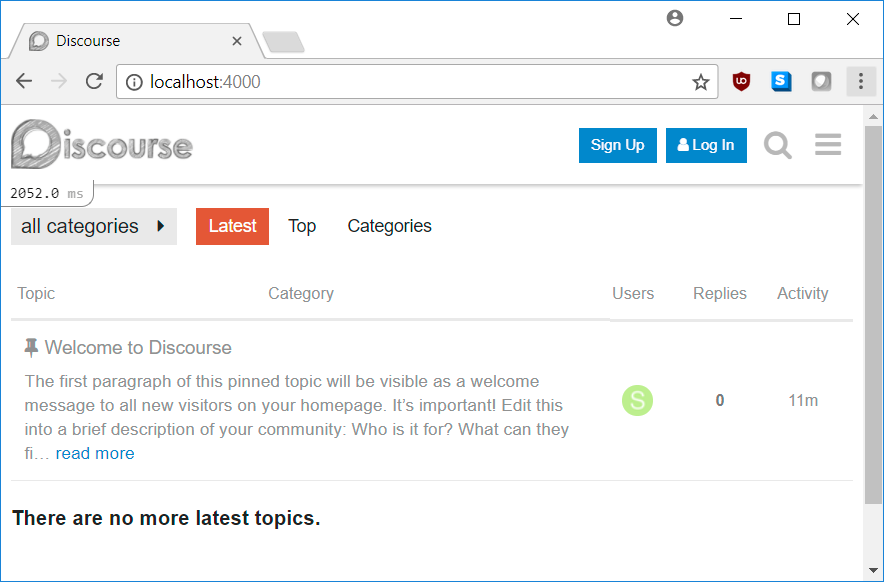

5. Verify that `rsync` is working its magic and notifies Discourse to rebuild the app if you change a file. In your favorite text editor, open the `app/assets/stylesheets/common/components/button.scss`  file that's in the Discourse folder. Add the style `background-color: red;` to the `.btn-small` class near the bottom of the file:

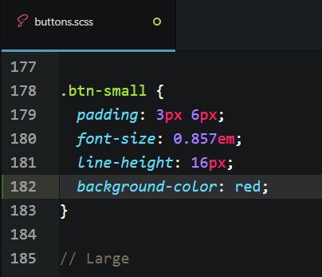

6. Save the file and go back to your browser. In a few seconds, you should see the `Sign Up` and `Log In` buttons turn red:

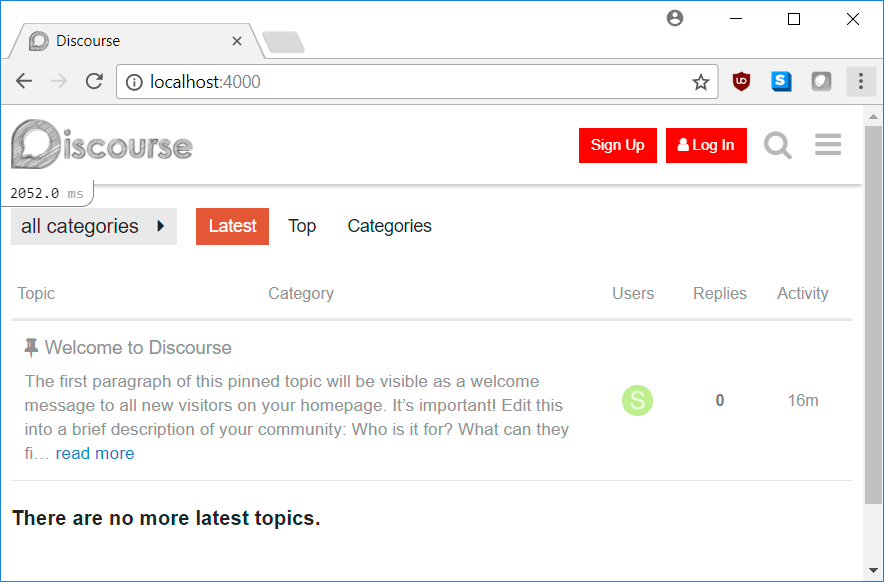

7. Undo the change to `buttons.scss` and save the file again. Go back to the browser, and after a few seconds the `Sign Up` and `Log In` buttons should turn back to blue.

8. Log in with the admin account that you created:

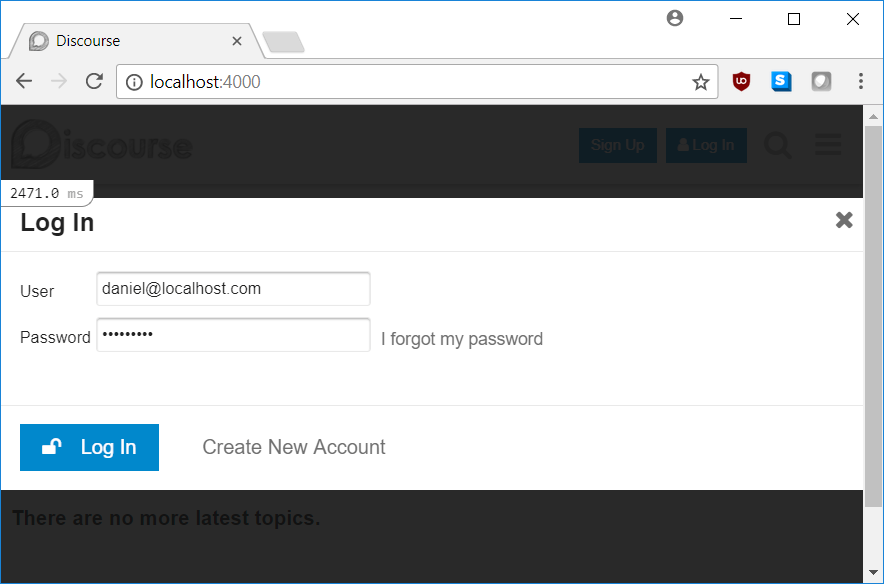

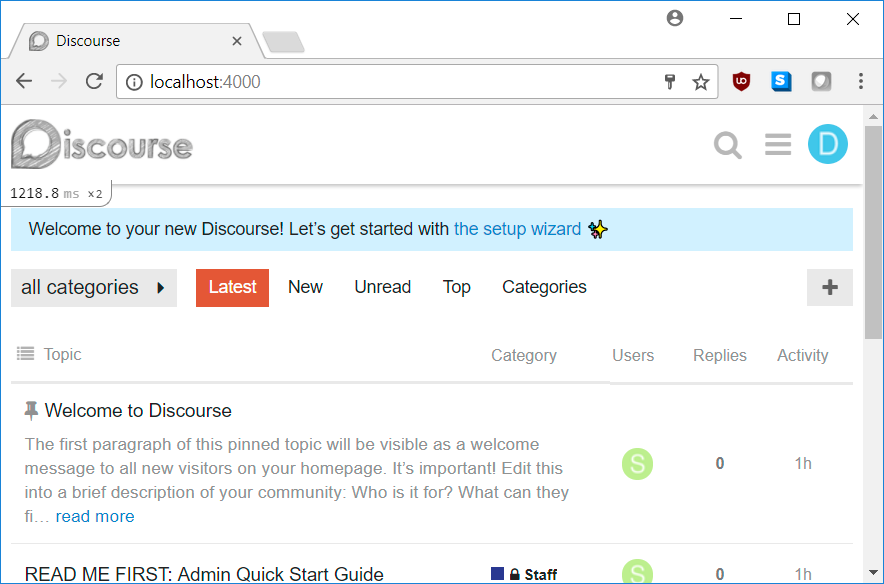

Congratulations, you are now ready for Discourse development!

## Step 5: Restarting The Discourse Server After A Reboot

Vagrant, the Discourse server, and `rsync` need to be restarted every time you reboot your development machine. To do so, open up two `Cygwin64 Terminals`. In the first terminal, run the following commands:

```bash
cd /cygdrive/c/Projects/discourse
vagrant up
vagrant ssh
cd /vagrant
rails s -b 0.0.0.0
```

In the second terminal, run the following commands:

```bash
cd /cygdrive/c/Projects/discourse
vagrant rsync-auto
```

Then open your browser to http://localhost:4000 and you should see the Discourse homepage.


## Step 6: Troubleshooting

If Vagrant is giving you error messages when you run `vagrant up`, check that the VM is not already running. Open `Task Manager`, click on the `Details` tab, and look for the `VBoxHeadless.exe` process. If it's running, end all of them and retry `vagrant up`:

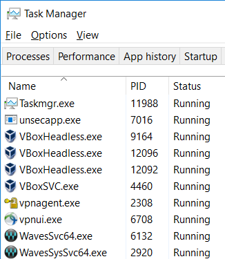
