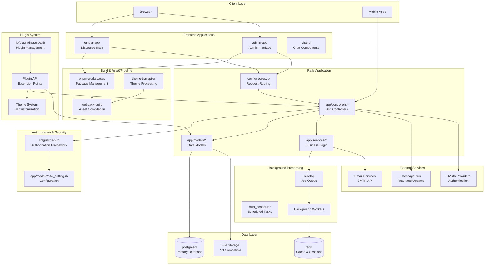
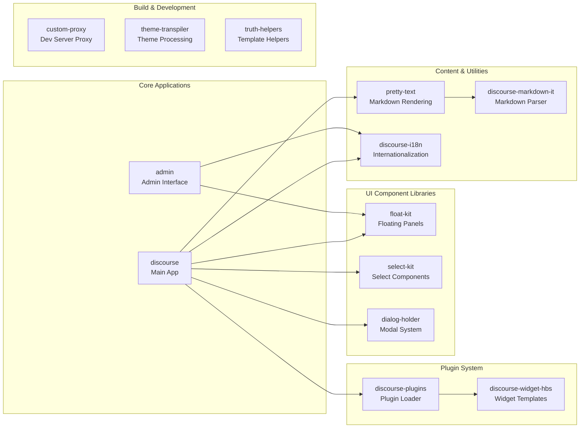
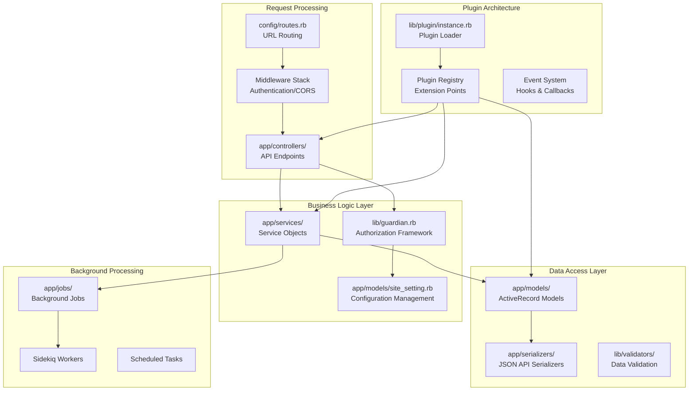

# Overview

Relevant source files

The following files were used as context for generating this wiki page:

- [.licensed.yml](https://github.com/discourse/discourse/blob/8c2d5f9a/.licensed.yml)
- [Gemfile](https://github.com/discourse/discourse/blob/8c2d5f9a/Gemfile)
- [Gemfile.lock](https://github.com/discourse/discourse/blob/8c2d5f9a/Gemfile.lock)
- [app/assets/javascripts/admin/package.json](https://github.com/discourse/discourse/blob/8c2d5f9a/app/assets/javascripts/admin/package.json)
- [app/assets/javascripts/deprecation-silencer/package.json](https://github.com/discourse/discourse/blob/8c2d5f9a/app/assets/javascripts/deprecation-silencer/package.json)
- [app/assets/javascripts/dialog-holder/package.json](https://github.com/discourse/discourse/blob/8c2d5f9a/app/assets/javascripts/dialog-holder/package.json)
- [app/assets/javascripts/discourse-i18n/package.json](https://github.com/discourse/discourse/blob/8c2d5f9a/app/assets/javascripts/discourse-i18n/package.json)
- [app/assets/javascripts/discourse-markdown-it/package.json](https://github.com/discourse/discourse/blob/8c2d5f9a/app/assets/javascripts/discourse-markdown-it/package.json)
- [app/assets/javascripts/discourse-plugins/package.json](https://github.com/discourse/discourse/blob/8c2d5f9a/app/assets/javascripts/discourse-plugins/package.json)
- [app/assets/javascripts/discourse-widget-hbs/package.json](https://github.com/discourse/discourse/blob/8c2d5f9a/app/assets/javascripts/discourse-widget-hbs/package.json)
- [app/assets/javascripts/discourse/package.json](https://github.com/discourse/discourse/blob/8c2d5f9a/app/assets/javascripts/discourse/package.json)
- [app/assets/javascripts/float-kit/package.json](https://github.com/discourse/discourse/blob/8c2d5f9a/app/assets/javascripts/float-kit/package.json)
- [app/assets/javascripts/pretty-text/package.json](https://github.com/discourse/discourse/blob/8c2d5f9a/app/assets/javascripts/pretty-text/package.json)
- [app/assets/javascripts/select-kit/package.json](https://github.com/discourse/discourse/blob/8c2d5f9a/app/assets/javascripts/select-kit/package.json)
- [app/assets/javascripts/theme-transpiler/package.json](https://github.com/discourse/discourse/blob/8c2d5f9a/app/assets/javascripts/theme-transpiler/package.json)
- [app/assets/javascripts/truth-helpers/package.json](https://github.com/discourse/discourse/blob/8c2d5f9a/app/assets/javascripts/truth-helpers/package.json)
- [app/jobs/regular/run_heartbeat.rb](https://github.com/discourse/discourse/blob/8c2d5f9a/app/jobs/regular/run_heartbeat.rb)
- [app/jobs/scheduled/heartbeat.rb](https://github.com/discourse/discourse/blob/8c2d5f9a/app/jobs/scheduled/heartbeat.rb)
- [app/models/post_revision.rb](https://github.com/discourse/discourse/blob/8c2d5f9a/app/models/post_revision.rb)
- [config/application.rb](https://github.com/discourse/discourse/blob/8c2d5f9a/config/application.rb)
- [config/environments/development.rb](https://github.com/discourse/discourse/blob/8c2d5f9a/config/environments/development.rb)
- [config/initializers/100-sidekiq.rb](https://github.com/discourse/discourse/blob/8c2d5f9a/config/initializers/100-sidekiq.rb)
- [config/initializers/101-lograge.rb](https://github.com/discourse/discourse/blob/8c2d5f9a/config/initializers/101-lograge.rb)
- [config/unicorn.conf.rb](https://github.com/discourse/discourse/blob/8c2d5f9a/config/unicorn.conf.rb)
- [db/post_migrate/20250227142351_migrate_sidekiq_jobs.rb](https://github.com/discourse/discourse/blob/8c2d5f9a/db/post_migrate/20250227142351_migrate_sidekiq_jobs.rb)
- [lib/backup_restore/system_interface.rb](https://github.com/discourse/discourse/blob/8c2d5f9a/lib/backup_restore/system_interface.rb)
- [lib/demon/base.rb](https://github.com/discourse/discourse/blob/8c2d5f9a/lib/demon/base.rb)
- [lib/demon/email_sync.rb](https://github.com/discourse/discourse/blob/8c2d5f9a/lib/demon/email_sync.rb)
- [lib/demon/sidekiq.rb](https://github.com/discourse/discourse/blob/8c2d5f9a/lib/demon/sidekiq.rb)
- [lib/discourse.rb](https://github.com/discourse/discourse/blob/8c2d5f9a/lib/discourse.rb)
- [lib/discourse_dev/topic.rb](https://github.com/discourse/discourse/blob/8c2d5f9a/lib/discourse_dev/topic.rb)
- [lib/discourse_logstash_logger.rb](https://github.com/discourse/discourse/blob/8c2d5f9a/lib/discourse_logstash_logger.rb)
- [lib/freedom_patches/message_pack_extensions.rb](https://github.com/discourse/discourse/blob/8c2d5f9a/lib/freedom_patches/message_pack_extensions.rb)
- [lib/freedom_patches/sidekiq.rb](https://github.com/discourse/discourse/blob/8c2d5f9a/lib/freedom_patches/sidekiq.rb)
- [lib/git_utils.rb](https://github.com/discourse/discourse/blob/8c2d5f9a/lib/git_utils.rb)
- [lib/middleware/discourse_public_exceptions.rb](https://github.com/discourse/discourse/blob/8c2d5f9a/lib/middleware/discourse_public_exceptions.rb)
- [lib/sidekiq/discourse_event.rb](https://github.com/discourse/discourse/blob/8c2d5f9a/lib/sidekiq/discourse_event.rb)
- [lib/sidekiq/pausable.rb](https://github.com/discourse/discourse/blob/8c2d5f9a/lib/sidekiq/pausable.rb)
- [lib/sidekiq_logster_reporter.rb](https://github.com/discourse/discourse/blob/8c2d5f9a/lib/sidekiq_logster_reporter.rb)
- [lib/sidekiq_long_running_job_logger.rb](https://github.com/discourse/discourse/blob/8c2d5f9a/lib/sidekiq_long_running_job_logger.rb)
- [lib/sidekiq_migration.rb](https://github.com/discourse/discourse/blob/8c2d5f9a/lib/sidekiq_migration.rb)
- [lib/signal_trap_logger.rb](https://github.com/discourse/discourse/blob/8c2d5f9a/lib/signal_trap_logger.rb)
- [lib/tasks/version_bump.rake](https://github.com/discourse/discourse/blob/8c2d5f9a/lib/tasks/version_bump.rake)
- [lib/twitter_api.rb](https://github.com/discourse/discourse/blob/8c2d5f9a/lib/twitter_api.rb)
- [lib/version.rb](https://github.com/discourse/discourse/blob/8c2d5f9a/lib/version.rb)
- [package.json](https://github.com/discourse/discourse/blob/8c2d5f9a/package.json)
- [pnpm-lock.yaml](https://github.com/discourse/discourse/blob/8c2d5f9a/pnpm-lock.yaml)
- [spec/integration/invalid_request_spec.rb](https://github.com/discourse/discourse/blob/8c2d5f9a/spec/integration/invalid_request_spec.rb)
- [spec/jobs/jobs_spec.rb](https://github.com/discourse/discourse/blob/8c2d5f9a/spec/jobs/jobs_spec.rb)
- [spec/lib/backup_restore/system_interface_spec.rb](https://github.com/discourse/discourse/blob/8c2d5f9a/spec/lib/backup_restore/system_interface_spec.rb)
- [spec/lib/demon/email_sync_spec.rb](https://github.com/discourse/discourse/blob/8c2d5f9a/spec/lib/demon/email_sync_spec.rb)
- [spec/lib/demon/sidekiq_spec.rb](https://github.com/discourse/discourse/blob/8c2d5f9a/spec/lib/demon/sidekiq_spec.rb)
- [spec/lib/discourse_logstash_logger_spec.rb](https://github.com/discourse/discourse/blob/8c2d5f9a/spec/lib/discourse_logstash_logger_spec.rb)
- [spec/lib/discourse_spec.rb](https://github.com/discourse/discourse/blob/8c2d5f9a/spec/lib/discourse_spec.rb)
- [spec/lib/sidekiq/discourse_event_spec.rb](https://github.com/discourse/discourse/blob/8c2d5f9a/spec/lib/sidekiq/discourse_event_spec.rb)
- [spec/lib/sidekiq_long_running_job_logger_spec.rb](https://github.com/discourse/discourse/blob/8c2d5f9a/spec/lib/sidekiq_long_running_job_logger_spec.rb)
- [spec/lib/twitter_api_spec.rb](https://github.com/discourse/discourse/blob/8c2d5f9a/spec/lib/twitter_api_spec.rb)
- [spec/tasks/version_bump_spec.rb](https://github.com/discourse/discourse/blob/8c2d5f9a/spec/tasks/version_bump_spec.rb)

This document provides a comprehensive introduction to Discourse, an open-source community discussion platform built with Ruby on Rails and Ember.js. It covers the overall system architecture, technology stack, and major subsystems that comprise the platform.

For specific subsystem details, see the Build System ([2](#2)), Core Architecture ([3](#3)), User System ([4](#4)), Content System ([5](#5)), UI Components ([6](#6)), Plugin System ([7](#7)), and Chat System ([9](#9)) sections.

## System Purpose and Scope

Discourse is a modern forum platform designed for community discussion. As defined in [app/assets/javascripts/discourse/package.json:5](), it serves as "A platform for community discussion. Free, open, simple." The system provides:

- **Community Forums**: Topic-based discussions with categories, tags, and moderation
- **Real-time Communication**: Live updates via message bus and optional chat functionality  
- **Content Management**: Rich text editing, file uploads, and content organization
- **User Management**: Authentication, authorization, and user profiles
- **Administration**: Comprehensive admin interface for site configuration
- **Extensibility**: Plugin and theme system for customization

## Technology Stack

| Component | Technology | Purpose |
|-----------|------------|---------|
| **Frontend** | Ember.js ~6.6.0 | Single-page application framework |
| **Backend** | Ruby on Rails ~8.0.0 | API server and business logic |
| **Database** | PostgreSQL | Primary data storage with `pg` gem |
| **Cache/Jobs** | Redis + Sidekiq 7.x | Caching and background processing |
| **Build System** | pnpm 9.x + Webpack 5.x | JavaScript bundling and dependency management |
| **Real-time** | MessageBus 4.4.1 | Live updates and notifications |
| **Search** | Built-in full-text search | PostgreSQL-based content indexing |
| **JavaScript Runtime** | mini_racer 0.19.0 | V8 JavaScript execution for server-side rendering |

Sources: [Gemfile:11-17](https://github.com/discourse/discourse/blob/8c2d5f9a/Gemfile#L11-L17), [Gemfile.lock:623-624](https://github.com/discourse/discourse/blob/8c2d5f9a/Gemfile.lock#L623-L624), [package.json:66](https://github.com/discourse/discourse/blob/8c2d5f9a/package.json#L66), [app/assets/javascripts/discourse/package.json:126](https://github.com/discourse/discourse/blob/8c2d5f9a/app/assets/javascripts/discourse/package.json#L126), [Gemfile.lock:607-608](https://github.com/discourse/discourse/blob/8c2d5f9a/Gemfile.lock#L607-L608)

## High-Level System Architecture

Sources: [config/routes.rb:10-500](https://github.com/discourse/discourse/blob/8c2d5f9a/config/routes.rb#L10-L500), [lib/discourse.rb:1-50](https://github.com/discourse/discourse/blob/8c2d5f9a/lib/discourse.rb#L1-L50), [lib/guardian.rb:1-50](https://github.com/discourse/discourse/blob/8c2d5f9a/lib/guardian.rb#L1-L50), [package.json:1-91](https://github.com/discourse/discourse/blob/8c2d5f9a/package.json#L1-L91), [pnpm-lock.yaml:1-100](https://github.com/discourse/discourse/blob/8c2d5f9a/pnpm-lock.yaml#L1-L100)

## Frontend Architecture Overview

The frontend consists of multiple Ember.js applications organized as a monorepo with pnpm workspaces:

### Primary Applications

| Application | Path | Purpose |
|-------------|------|---------|
| **discourse** | `app/assets/javascripts/discourse/` | Main user-facing application |
| **admin** | `app/assets/javascripts/admin/` | Administrative interface |
| **float-kit** | `app/assets/javascripts/float-kit/` | Floating panels and tooltips |
| **select-kit** | `app/assets/javascripts/select-kit/` | Advanced select components |

### Supporting Packages

Sources: [app/assets/javascripts/discourse/package.json:96-150](https://github.com/discourse/discourse/blob/8c2d5f9a/app/assets/javascripts/discourse/package.json#L96-L150), [app/assets/javascripts/admin/package.json:1-52](https://github.com/discourse/discourse/blob/8c2d5f9a/app/assets/javascripts/admin/package.json#L1-L52), [app/assets/javascripts/float-kit/package.json:1-56](https://github.com/discourse/discourse/blob/8c2d5f9a/app/assets/javascripts/float-kit/package.json#L1-L56)

## Backend Architecture Overview  

The Rails backend follows a service-oriented architecture with comprehensive authorization:

### Core Rails Structure

Sources: [config/routes.rb:1-500](https://github.com/discourse/discourse/blob/8c2d5f9a/config/routes.rb#L1-L500), [lib/guardian.rb:1-50](https://github.com/discourse/discourse/blob/8c2d5f9a/lib/guardian.rb#L1-L50), [app/models/site_setting.rb:1-50](https://github.com/discourse/discourse/blob/8c2d5f9a/app/models/site_setting.rb#L1-L50), [lib/discourse.rb:1-50](https://github.com/discourse/discourse/blob/8c2d5f9a/lib/discourse.rb#L1-L50)

## Key Subsystems

### Authentication & Authorization
- **Guardian Framework**: Role-based permission system in [lib/guardian.rb]()
- **User Management**: User models and authentication flows
- **Site Settings**: Configuration system with [config/site_settings.yml]()

### Content Management  
- **Topics & Posts**: Core content models with revision tracking
- **Categories**: Hierarchical organization system
- **Rich Text Editing**: ProseMirror-based composer with markdown support
- **File Uploads**: S3-compatible storage with image optimization

### Real-time Features
- **MessageBus**: Live updates and notifications
- **Chat System**: Optional real-time messaging (see [Chat System](#9))
- **Presence**: User online status and typing indicators

### Administration
- **Admin Interface**: Comprehensive management UI
- **Reports & Analytics**: Built-in analytics and reporting
- **Moderation Tools**: Content moderation and user management
- **Site Configuration**: Extensive settings management

### Extensibility
- **Plugin System**: Ruby-based backend extensions
- **Theme System**: Frontend customization and styling
- **API**: RESTful API for external integrations

## Development Environment

The development setup uses modern JavaScript tooling:

- **Package Management**: pnpm with workspaces for monorepo structure
- **Build System**: Webpack with Ember CLI for asset compilation  
- **Testing**: RSpec for backend, QUnit/Ember testing for frontend
- **Linting**: ESLint, RuboCop, and Prettier for code quality
- **CI/CD**: GitHub Actions with comprehensive test suites

Key development commands are defined in [package.json:42-58]() including `dev`, `lint`, and `test` scripts that coordinate both Rails and Ember.js development servers.

Sources: [package.json:42-91](https://github.com/discourse/discourse/blob/8c2d5f9a/package.json#L42-L91), [pnpm-lock.yaml:1-50](https://github.com/discourse/discourse/blob/8c2d5f9a/pnpm-lock.yaml#L1-L50), [spec/rails_helper.rb:1-100](https://github.com/discourse/discourse/blob/8c2d5f9a/spec/rails_helper.rb#L1-L100), [Gemfile:1-200](https://github.com/discourse/discourse/blob/8c2d5f9a/Gemfile#L1-L200)

## Deployment Architecture

Discourse supports various deployment configurations:

- **Standard Deployment**: Rails server with PostgreSQL and Redis
- **Docker**: Containerized deployment with official Docker images  
- **CDN Integration**: Asset serving via CDN with S3-compatible storage
- **Horizontal Scaling**: Multiple app servers with shared database/Redis
- **Plugin Support**: Runtime plugin loading without application restart

The system is designed for high availability with comprehensive monitoring, logging, and backup systems integrated into the core platform.