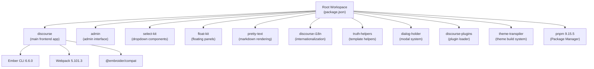
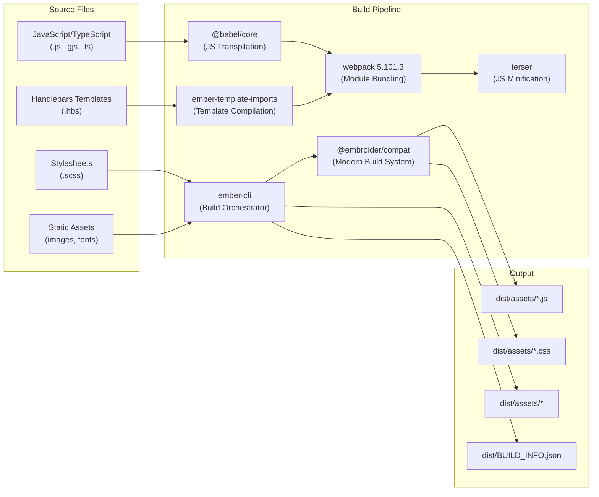
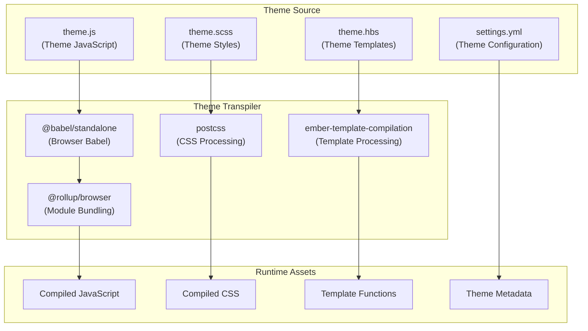
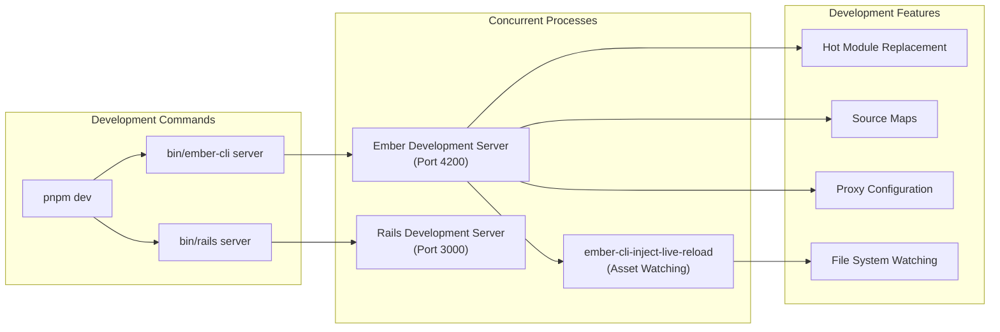
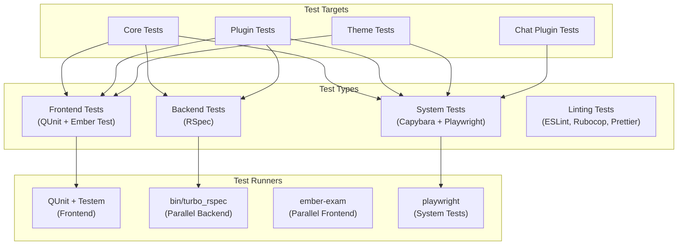
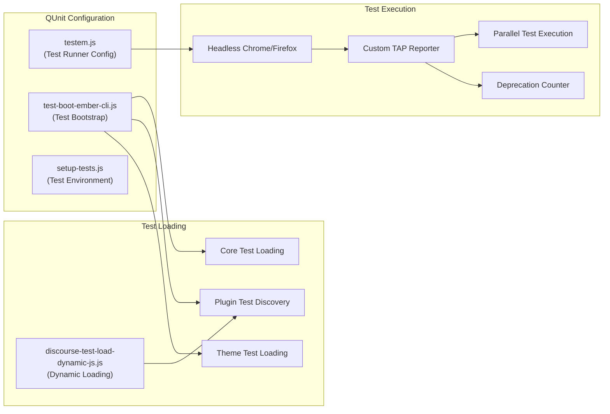
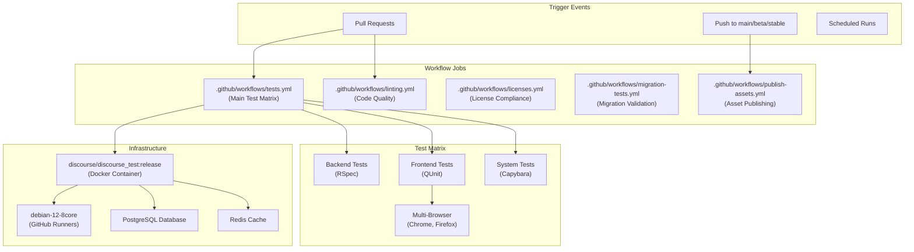
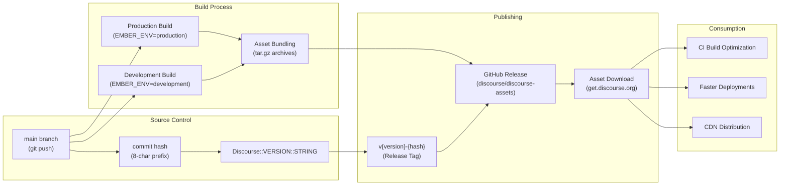

# Build System and Development Environment

Relevant source files

The following files were used as context for generating this wiki page:

- [.github/workflows/check-pr-body.yml](https://github.com/discourse/discourse/blob/8c2d5f9a/.github/workflows/check-pr-body.yml)
- [.github/workflows/dependabot-pnpm-dedupe.yml](https://github.com/discourse/discourse/blob/8c2d5f9a/.github/workflows/dependabot-pnpm-dedupe.yml)
- [.github/workflows/labeler.yml](https://github.com/discourse/discourse/blob/8c2d5f9a/.github/workflows/labeler.yml)
- [.github/workflows/licenses.yml](https://github.com/discourse/discourse/blob/8c2d5f9a/.github/workflows/licenses.yml)
- [.github/workflows/linting.yml](https://github.com/discourse/discourse/blob/8c2d5f9a/.github/workflows/linting.yml)
- [.github/workflows/migration-tests.yml](https://github.com/discourse/discourse/blob/8c2d5f9a/.github/workflows/migration-tests.yml)
- [.github/workflows/publish-assets.yml](https://github.com/discourse/discourse/blob/8c2d5f9a/.github/workflows/publish-assets.yml)
- [.github/workflows/release-notes.yml](https://github.com/discourse/discourse/blob/8c2d5f9a/.github/workflows/release-notes.yml)
- [.github/workflows/stale-pr-closer.yml](https://github.com/discourse/discourse/blob/8c2d5f9a/.github/workflows/stale-pr-closer.yml)
- [.github/workflows/tests.yml](https://github.com/discourse/discourse/blob/8c2d5f9a/.github/workflows/tests.yml)
- [.licensed.yml](https://github.com/discourse/discourse/blob/8c2d5f9a/.licensed.yml)
- [Gemfile](https://github.com/discourse/discourse/blob/8c2d5f9a/Gemfile)
- [Gemfile.lock](https://github.com/discourse/discourse/blob/8c2d5f9a/Gemfile.lock)
- [app/assets/javascripts/admin/package.json](https://github.com/discourse/discourse/blob/8c2d5f9a/app/assets/javascripts/admin/package.json)
- [app/assets/javascripts/deprecation-silencer/package.json](https://github.com/discourse/discourse/blob/8c2d5f9a/app/assets/javascripts/deprecation-silencer/package.json)
- [app/assets/javascripts/dialog-holder/package.json](https://github.com/discourse/discourse/blob/8c2d5f9a/app/assets/javascripts/dialog-holder/package.json)
- [app/assets/javascripts/discourse-i18n/package.json](https://github.com/discourse/discourse/blob/8c2d5f9a/app/assets/javascripts/discourse-i18n/package.json)
- [app/assets/javascripts/discourse-markdown-it/package.json](https://github.com/discourse/discourse/blob/8c2d5f9a/app/assets/javascripts/discourse-markdown-it/package.json)
- [app/assets/javascripts/discourse-plugins/package.json](https://github.com/discourse/discourse/blob/8c2d5f9a/app/assets/javascripts/discourse-plugins/package.json)
- [app/assets/javascripts/discourse-widget-hbs/package.json](https://github.com/discourse/discourse/blob/8c2d5f9a/app/assets/javascripts/discourse-widget-hbs/package.json)
- [app/assets/javascripts/discourse/app/global-compat.js](https://github.com/discourse/discourse/blob/8c2d5f9a/app/assets/javascripts/discourse/app/global-compat.js)
- [app/assets/javascripts/discourse/app/lib/ember-events.js](https://github.com/discourse/discourse/blob/8c2d5f9a/app/assets/javascripts/discourse/app/lib/ember-events.js)
- [app/assets/javascripts/discourse/config/environment.js](https://github.com/discourse/discourse/blob/8c2d5f9a/app/assets/javascripts/discourse/config/environment.js)
- [app/assets/javascripts/discourse/config/optional-features.json.js](https://github.com/discourse/discourse/blob/8c2d5f9a/app/assets/javascripts/discourse/config/optional-features.json.js)
- [app/assets/javascripts/discourse/package.json](https://github.com/discourse/discourse/blob/8c2d5f9a/app/assets/javascripts/discourse/package.json)
- [app/assets/javascripts/discourse/public/assets/scripts/discourse-test-listen-boot.js](https://github.com/discourse/discourse/blob/8c2d5f9a/app/assets/javascripts/discourse/public/assets/scripts/discourse-test-listen-boot.js)
- [app/assets/javascripts/discourse/public/assets/scripts/discourse-test-load-dynamic-js.js](https://github.com/discourse/discourse/blob/8c2d5f9a/app/assets/javascripts/discourse/public/assets/scripts/discourse-test-load-dynamic-js.js)
- [app/assets/javascripts/discourse/testem.js](https://github.com/discourse/discourse/blob/8c2d5f9a/app/assets/javascripts/discourse/testem.js)
- [app/assets/javascripts/discourse/tests/test-boot-ember-cli.js](https://github.com/discourse/discourse/blob/8c2d5f9a/app/assets/javascripts/discourse/tests/test-boot-ember-cli.js)
- [app/assets/javascripts/float-kit/package.json](https://github.com/discourse/discourse/blob/8c2d5f9a/app/assets/javascripts/float-kit/package.json)
- [app/assets/javascripts/pretty-text/package.json](https://github.com/discourse/discourse/blob/8c2d5f9a/app/assets/javascripts/pretty-text/package.json)
- [app/assets/javascripts/select-kit/package.json](https://github.com/discourse/discourse/blob/8c2d5f9a/app/assets/javascripts/select-kit/package.json)
- [app/assets/javascripts/theme-transpiler/package.json](https://github.com/discourse/discourse/blob/8c2d5f9a/app/assets/javascripts/theme-transpiler/package.json)
- [app/assets/javascripts/truth-helpers/package.json](https://github.com/discourse/discourse/blob/8c2d5f9a/app/assets/javascripts/truth-helpers/package.json)
- [app/controllers/qunit_controller.rb](https://github.com/discourse/discourse/blob/8c2d5f9a/app/controllers/qunit_controller.rb)
- [app/jobs/regular/run_heartbeat.rb](https://github.com/discourse/discourse/blob/8c2d5f9a/app/jobs/regular/run_heartbeat.rb)
- [app/jobs/scheduled/heartbeat.rb](https://github.com/discourse/discourse/blob/8c2d5f9a/app/jobs/scheduled/heartbeat.rb)
- [app/models/post_revision.rb](https://github.com/discourse/discourse/blob/8c2d5f9a/app/models/post_revision.rb)
- [config/application.rb](https://github.com/discourse/discourse/blob/8c2d5f9a/config/application.rb)
- [config/environments/development.rb](https://github.com/discourse/discourse/blob/8c2d5f9a/config/environments/development.rb)
- [config/initializers/100-sidekiq.rb](https://github.com/discourse/discourse/blob/8c2d5f9a/config/initializers/100-sidekiq.rb)
- [config/initializers/101-lograge.rb](https://github.com/discourse/discourse/blob/8c2d5f9a/config/initializers/101-lograge.rb)
- [config/unicorn.conf.rb](https://github.com/discourse/discourse/blob/8c2d5f9a/config/unicorn.conf.rb)
- [db/post_migrate/20250227142351_migrate_sidekiq_jobs.rb](https://github.com/discourse/discourse/blob/8c2d5f9a/db/post_migrate/20250227142351_migrate_sidekiq_jobs.rb)
- [jsconfig.json](https://github.com/discourse/discourse/blob/8c2d5f9a/jsconfig.json)
- [lib/backup_restore/system_interface.rb](https://github.com/discourse/discourse/blob/8c2d5f9a/lib/backup_restore/system_interface.rb)
- [lib/demon/base.rb](https://github.com/discourse/discourse/blob/8c2d5f9a/lib/demon/base.rb)
- [lib/demon/email_sync.rb](https://github.com/discourse/discourse/blob/8c2d5f9a/lib/demon/email_sync.rb)
- [lib/demon/sidekiq.rb](https://github.com/discourse/discourse/blob/8c2d5f9a/lib/demon/sidekiq.rb)
- [lib/discourse.rb](https://github.com/discourse/discourse/blob/8c2d5f9a/lib/discourse.rb)
- [lib/discourse_dev/topic.rb](https://github.com/discourse/discourse/blob/8c2d5f9a/lib/discourse_dev/topic.rb)
- [lib/discourse_logstash_logger.rb](https://github.com/discourse/discourse/blob/8c2d5f9a/lib/discourse_logstash_logger.rb)
- [lib/freedom_patches/message_pack_extensions.rb](https://github.com/discourse/discourse/blob/8c2d5f9a/lib/freedom_patches/message_pack_extensions.rb)
- [lib/freedom_patches/sidekiq.rb](https://github.com/discourse/discourse/blob/8c2d5f9a/lib/freedom_patches/sidekiq.rb)
- [lib/git_utils.rb](https://github.com/discourse/discourse/blob/8c2d5f9a/lib/git_utils.rb)
- [lib/middleware/discourse_public_exceptions.rb](https://github.com/discourse/discourse/blob/8c2d5f9a/lib/middleware/discourse_public_exceptions.rb)
- [lib/sidekiq/discourse_event.rb](https://github.com/discourse/discourse/blob/8c2d5f9a/lib/sidekiq/discourse_event.rb)
- [lib/sidekiq/pausable.rb](https://github.com/discourse/discourse/blob/8c2d5f9a/lib/sidekiq/pausable.rb)
- [lib/sidekiq_logster_reporter.rb](https://github.com/discourse/discourse/blob/8c2d5f9a/lib/sidekiq_logster_reporter.rb)
- [lib/sidekiq_long_running_job_logger.rb](https://github.com/discourse/discourse/blob/8c2d5f9a/lib/sidekiq_long_running_job_logger.rb)
- [lib/sidekiq_migration.rb](https://github.com/discourse/discourse/blob/8c2d5f9a/lib/sidekiq_migration.rb)
- [lib/signal_trap_logger.rb](https://github.com/discourse/discourse/blob/8c2d5f9a/lib/signal_trap_logger.rb)
- [lib/tasks/plugin.rake](https://github.com/discourse/discourse/blob/8c2d5f9a/lib/tasks/plugin.rake)
- [lib/tasks/qunit.rake](https://github.com/discourse/discourse/blob/8c2d5f9a/lib/tasks/qunit.rake)
- [lib/tasks/themes.rake](https://github.com/discourse/discourse/blob/8c2d5f9a/lib/tasks/themes.rake)
- [lib/tasks/version_bump.rake](https://github.com/discourse/discourse/blob/8c2d5f9a/lib/tasks/version_bump.rake)
- [lib/theme_metadata.rb](https://github.com/discourse/discourse/blob/8c2d5f9a/lib/theme_metadata.rb)
- [lib/twitter_api.rb](https://github.com/discourse/discourse/blob/8c2d5f9a/lib/twitter_api.rb)
- [lib/version.rb](https://github.com/discourse/discourse/blob/8c2d5f9a/lib/version.rb)
- [package.json](https://github.com/discourse/discourse/blob/8c2d5f9a/package.json)
- [plugins/discourse-adplugin/assets/javascripts/discourse/initializers/initialize-ad-plugin.gjs](https://github.com/discourse/discourse/blob/8c2d5f9a/plugins/discourse-adplugin/assets/javascripts/discourse/initializers/initialize-ad-plugin.gjs)
- [pnpm-lock.yaml](https://github.com/discourse/discourse/blob/8c2d5f9a/pnpm-lock.yaml)
- [script/build_jsconfig.rb](https://github.com/discourse/discourse/blob/8c2d5f9a/script/build_jsconfig.rb)
- [spec/integration/invalid_request_spec.rb](https://github.com/discourse/discourse/blob/8c2d5f9a/spec/integration/invalid_request_spec.rb)
- [spec/jobs/jobs_spec.rb](https://github.com/discourse/discourse/blob/8c2d5f9a/spec/jobs/jobs_spec.rb)
- [spec/lib/backup_restore/system_interface_spec.rb](https://github.com/discourse/discourse/blob/8c2d5f9a/spec/lib/backup_restore/system_interface_spec.rb)
- [spec/lib/demon/email_sync_spec.rb](https://github.com/discourse/discourse/blob/8c2d5f9a/spec/lib/demon/email_sync_spec.rb)
- [spec/lib/demon/sidekiq_spec.rb](https://github.com/discourse/discourse/blob/8c2d5f9a/spec/lib/demon/sidekiq_spec.rb)
- [spec/lib/discourse_logstash_logger_spec.rb](https://github.com/discourse/discourse/blob/8c2d5f9a/spec/lib/discourse_logstash_logger_spec.rb)
- [spec/lib/discourse_spec.rb](https://github.com/discourse/discourse/blob/8c2d5f9a/spec/lib/discourse_spec.rb)
- [spec/lib/sidekiq/discourse_event_spec.rb](https://github.com/discourse/discourse/blob/8c2d5f9a/spec/lib/sidekiq/discourse_event_spec.rb)
- [spec/lib/sidekiq_long_running_job_logger_spec.rb](https://github.com/discourse/discourse/blob/8c2d5f9a/spec/lib/sidekiq_long_running_job_logger_spec.rb)
- [spec/lib/twitter_api_spec.rb](https://github.com/discourse/discourse/blob/8c2d5f9a/spec/lib/twitter_api_spec.rb)
- [spec/tasks/themes_spec.rb](https://github.com/discourse/discourse/blob/8c2d5f9a/spec/tasks/themes_spec.rb)
- [spec/tasks/version_bump_spec.rb](https://github.com/discourse/discourse/blob/8c2d5f9a/spec/tasks/version_bump_spec.rb)

This document covers Discourse's comprehensive build system, development tooling, and CI/CD pipeline. It explains how the frontend and backend assets are compiled, bundled, and deployed, as well as the development environment setup and testing infrastructure.

For information about the plugin and theme extension systems, see [Extension and Plugin System](#7). For details about the Rails application architecture, see [Core Architecture](#3).

## Package Management and Workspace Structure

Discourse uses `pnpm` as its package manager with a monorepo workspace structure. The root workspace coordinates multiple JavaScript packages that make up the frontend application.

**Package Manager Configuration**

The workspace structure is defined with specific engine requirements and overrides:

- **Node.js**: >= 20 (development), >= 18 (packages)
- **pnpm**: ^9 with frozen lockfiles for reproducible builds
- **Package Manager**: Explicitly requires pnpm, blocks npm/yarn usage

**Sources**: [package.json:60-66](), [pnpm-lock.yaml:1-6](), [app/assets/javascripts/discourse/package.json:154-162]()

## Frontend Build Pipeline

The frontend build system centers around Ember.js with modern tooling for JavaScript compilation, asset bundling, and theme/plugin integration.

**Build Commands and Scripts**

The build system provides several build modes controlled through npm scripts:

- `ember build` - Development build with source maps
- `ember build -prod` - Production build with minification
- `pnpm ember` - Workspace-scoped Ember CLI commands

**Build Optimization**

The system includes memory and performance optimizations for different environments:

- **Low Memory**: `--max-old-space-size=2048` when heap limit < 2048MB
- **Multi-core**: Uses up to 2 parallel jobs (`JOBS=2`)
- **CI Environment**: Enables `CI=1` and `CHEAP_SOURCE_MAPS=1` flags

**Sources**: [app/assets/javascripts/discourse/package.json:16-20](), [script/assemble_ember_build.rb:121-137](), [script/assemble_ember_build.rb:47-53]()

## Theme and Asset Compilation System

Discourse includes a sophisticated theme compilation system that allows runtime compilation of themes and plugins using a browser-based transpiler.

**Theme Transpiler Dependencies**

The theme transpiler runs in the browser using a comprehensive set of build tools:

- **Babel**: Core compilation with preset-env for ES2015+ support
- **PostCSS**: CSS processing with autoprefixer and nesting support  
- **Rollup**: Module bundling in the browser environment
- **Content-tag**: Handles `<template>` tag compilation for Glimmer components

**Sources**: [app/assets/javascripts/theme-transpiler/package.json:12-42](), [lib/tasks/themes.rake:225-304]()

## Development Environment Setup

The development environment combines Rails server functionality with frontend hot-reloading and comprehensive testing tools.

### Development Scripts and Commands

**Proxy Configuration**

The development environment includes a custom proxy system for handling theme and plugin requests:

- **Theme Proxy**: Routes `/theme-qunit` requests to Rails backend
- **Plugin Assets**: Proxies plugin JavaScript and CSS to Rails
- **API Requests**: Forwards API calls from Ember dev server to Rails

**Sources**: [package.json:42-43](), [app/assets/javascripts/custom-proxy/package.json:7-26](), [app/assets/javascripts/discourse/testem.js:231-249]()

## Testing Infrastructure

Discourse implements a comprehensive testing matrix covering frontend, backend, and system-level tests with parallel execution capabilities.

### Testing Matrix Architecture

**Test Configuration**

The testing system supports multiple browsers and parallel execution:

- **Browsers**: Chrome (default), Firefox ESR, Firefox Evergreen
- **Parallel Execution**: Configurable via `QUNIT_PARALLEL` and `PARALLEL_TEST_PROCESSORS`
- **Test Isolation**: Each test type runs in isolated processes with separate databases

**Sources**: [.github/workflows/tests.yml:46-65](), [app/assets/javascripts/discourse/testem.js:141-178](), [lib/tasks/qunit.rake:3-158]()

### QUnit Test Framework

**Test Target Selection**

The QUnit system supports flexible test targeting:

- **Core Tests**: `target=core` (default)
- **Plugin Tests**: `target=plugins` or `target=<plugin-name>`
- **Theme Tests**: Automatic detection via theme test files
- **All Tests**: `target=all` runs everything

**Sources**: [app/assets/javascripts/discourse/tests/test-boot-ember-cli.js:25-84](), [app/assets/javascripts/discourse/testem.js:196-207](), [app/assets/javascripts/discourse/public/assets/scripts/discourse-test-load-dynamic-js.js:14-56]()

## CI/CD Pipeline Architecture

The GitHub Actions-based CI/CD system provides comprehensive automated testing, linting, and asset publishing across multiple build matrices.

### CI/CD Workflow Structure

**Build Matrix Configuration**

The CI system uses a comprehensive build matrix covering:

- **Build Types**: `backend`, `frontend`, `system`
- **Targets**: `core`, `plugins`, `themes`, `chat`
- **Browsers**: Chrome, Firefox ESR, Firefox Evergreen (frontend only)
- **Parallel Execution**: Up to `$(nproc) / 2` parallel processes

**Asset Caching Strategy**

The CI pipeline implements sophisticated caching:

- **App State Cache**: Databases and uploads cached by hash of migrations
- **Runtime Cache**: RSpec runtime logs for optimal test distribution  
- **Bundle Cache**: Ruby gems and Node modules cached by lockfile hash

**Sources**: [.github/workflows/tests.yml:24-383](), [.github/workflows/linting.yml:17-103](), [.github/workflows/publish-assets.yml:14-53]()

## Asset Publishing and Prebuilt Assets

Discourse implements an asset prebuilding system that publishes compiled assets for faster deployment and CI optimization.

### Asset Publishing Pipeline

**Build Info Tracking**

The system generates `BUILD_INFO.json` containing:

- **ember_env**: Build environment (`production` or `development`)
- **core_tree_hash**: Git tree hash of current Discourse core state
- **Reusability**: Existing builds reused when tree hash matches

**Prebuilt Asset Usage**

Assets are automatically downloaded when:
- Git working directory is clean (no uncommitted changes)
- Matching version exists in asset repository
- `DISCOURSE_DOWNLOAD_PRE_BUILT_ASSETS` is not set to `"0"`

**Sources**: [script/assemble_ember_build.rb:84-120](), [script/publish_built_assets.rb:1-59](), [script/assemble_ember_build.rb:59-82]()

## Development Tooling and Code Quality

Discourse maintains code quality through an extensive suite of linting, formatting, and static analysis tools integrated into both development workflow and CI pipeline.

### Code Quality Pipeline

```mermaid
graph TB
    subgraph "Linting Tools"
        ESLint["eslint 9.34.0<br/>(JavaScript/TypeScript)"]
        Rubocop["rubocop<br/>(Ruby Code Style)"] 
        SyntaxTree["syntax_tree<br/>(Ruby Formatting)"]
        Prettier["prettier 3.5.3<br/>(JS/CSS/HTML Formatting)"]
        Stylelint["stylelint 16.23.1<br/>(CSS/SCSS Linting)"]
        EmberTemplateLint["ember-template-lint 7.9.3<br/>(Template Linting)"]
    end
    
    subgraph "Type Checking"
        Glint["@glint/core<br/>(Ember TypeScript)"]
        TypeScript["typescript 5.6.x<br/>(Type Checking)"]
        JSConfig["jsconfig.json<br/>(IDE Configuration)"]
    end
    
    subgraph "Quality Gates"
        PreCommit["lefthook<br/>(Git Hooks)"]
        CILinting["Linting Workflow<br/>(GitHub Actions)"]
        LintProgress["lint-to-the-future<br/>(Progressive Improvement)"]
    end
    
    subgraph "Configuration"
        DiscourseConfigs["@discourse/lint-configs<br/>(Shared Configurations)"]
        ESLintConfig[".eslintrc.js"]
        PrettierConfig[".prettierrc.js"] 
        StylelintConfig[".stylelintrc.js"]
    end
    
    DiscourseConfigs --> ESLint
    DiscourseConfigs --> Prettier
    DiscourseConfigs --> Stylelint
    
    ESLintConfig --> ESLint
    PrettierConfig --> Prettier
    StylelintConfig --> Stylelint
    
    PreCommit --> ESLint
    PreCommit --> Rubocop
    PreCommit --> Prettier
    
    CILinting --> ESLint
    CILinting --> Rubocop
    CILinting --> SyntaxTree
    CILinting --> Prettier
    CILinting --> Stylelint
    CILinting --> EmberTemplateLint
    CILinting --> Glint
    
    TypeScript --> Glint
    JSConfig --> Glint
```

**Lint Command Structure**

The build system provides comprehensive linting commands:

- `pnpm lint` - Runs all linters concurrently
- `pnpm lint:fix` - Auto-fixes all auto-fixable issues
- Individual linters: `lint:js`, `lint:css`, `lint:hbs`, `lint:prettier`

**Progressive Lint Improvement**

The system uses `lint-to-the-future` for managing technical debt:

- Ignores existing violations while preventing new ones
- Tracks progress over time in `./lint-progress/` directory  
- Generates HTML reports showing improvement trends