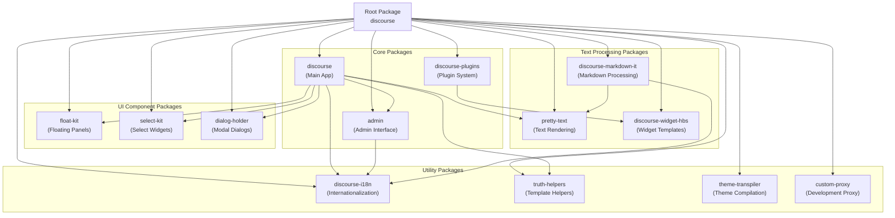
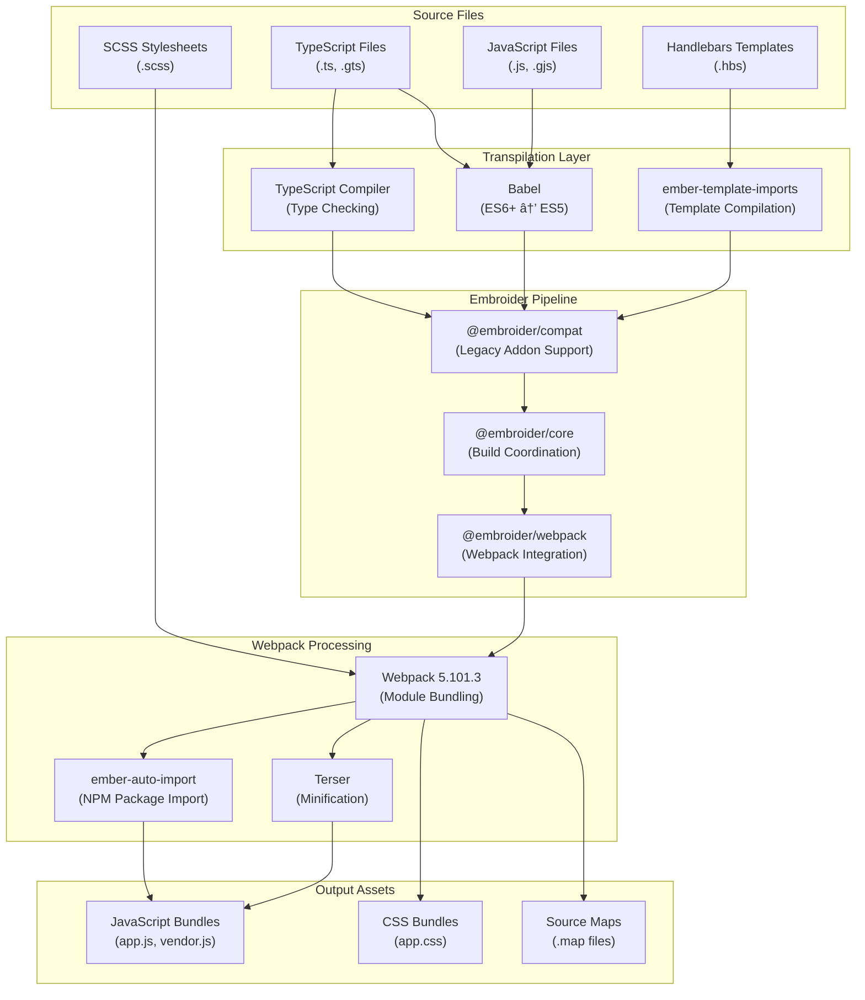
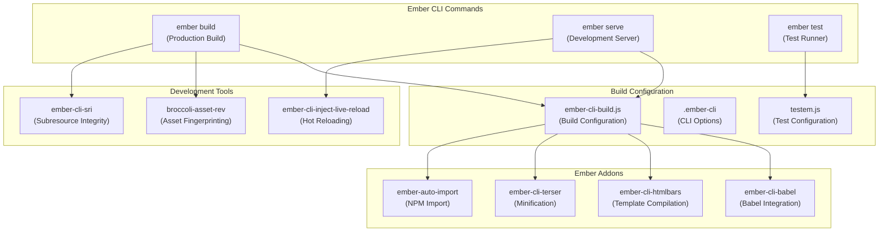
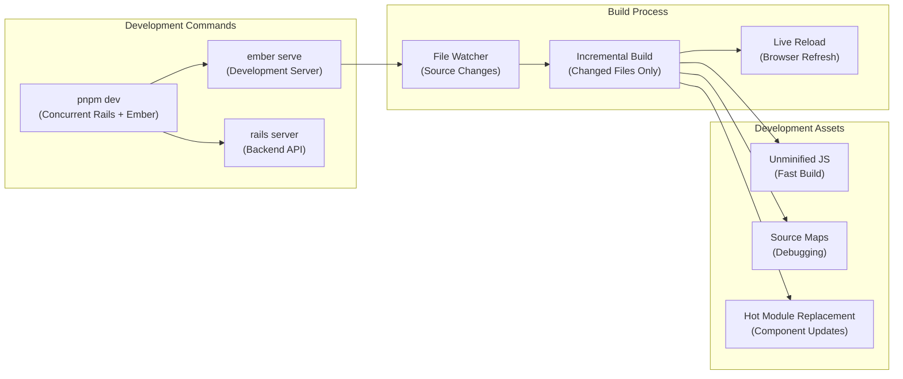
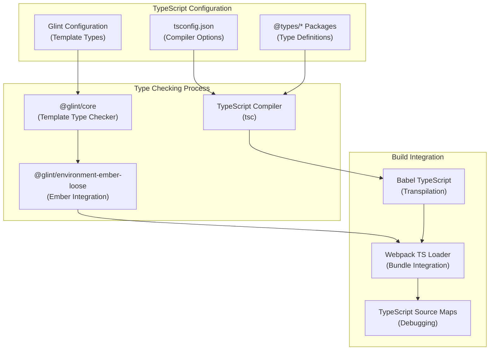

# Frontend Build System

Relevant source files

The following files were used as context for generating this wiki page:

- [app/assets/javascripts/admin/package.json](https://github.com/discourse/discourse/blob/8c2d5f9a/app/assets/javascripts/admin/package.json)
- [app/assets/javascripts/deprecation-silencer/package.json](https://github.com/discourse/discourse/blob/8c2d5f9a/app/assets/javascripts/deprecation-silencer/package.json)
- [app/assets/javascripts/dialog-holder/package.json](https://github.com/discourse/discourse/blob/8c2d5f9a/app/assets/javascripts/dialog-holder/package.json)
- [app/assets/javascripts/discourse-i18n/package.json](https://github.com/discourse/discourse/blob/8c2d5f9a/app/assets/javascripts/discourse-i18n/package.json)
- [app/assets/javascripts/discourse-markdown-it/package.json](https://github.com/discourse/discourse/blob/8c2d5f9a/app/assets/javascripts/discourse-markdown-it/package.json)
- [app/assets/javascripts/discourse-plugins/package.json](https://github.com/discourse/discourse/blob/8c2d5f9a/app/assets/javascripts/discourse-plugins/package.json)
- [app/assets/javascripts/discourse-widget-hbs/package.json](https://github.com/discourse/discourse/blob/8c2d5f9a/app/assets/javascripts/discourse-widget-hbs/package.json)
- [app/assets/javascripts/discourse/package.json](https://github.com/discourse/discourse/blob/8c2d5f9a/app/assets/javascripts/discourse/package.json)
- [app/assets/javascripts/float-kit/package.json](https://github.com/discourse/discourse/blob/8c2d5f9a/app/assets/javascripts/float-kit/package.json)
- [app/assets/javascripts/pretty-text/package.json](https://github.com/discourse/discourse/blob/8c2d5f9a/app/assets/javascripts/pretty-text/package.json)
- [app/assets/javascripts/select-kit/package.json](https://github.com/discourse/discourse/blob/8c2d5f9a/app/assets/javascripts/select-kit/package.json)
- [app/assets/javascripts/theme-transpiler/package.json](https://github.com/discourse/discourse/blob/8c2d5f9a/app/assets/javascripts/theme-transpiler/package.json)
- [app/assets/javascripts/truth-helpers/package.json](https://github.com/discourse/discourse/blob/8c2d5f9a/app/assets/javascripts/truth-helpers/package.json)
- [package.json](https://github.com/discourse/discourse/blob/8c2d5f9a/package.json)
- [pnpm-lock.yaml](https://github.com/discourse/discourse/blob/8c2d5f9a/pnpm-lock.yaml)

This document covers Discourse's JavaScript build pipeline, which transforms the frontend codebase from source files into deployable assets. The system uses pnpm workspaces to manage multiple Ember.js packages, with Embroider and Webpack powering the modern build pipeline.

For information about theme compilation and asset processing, see [Theme and Asset Compilation](#2.2). For backend Ruby build processes, see [Ruby Application Architecture](#3.1).

## Package Management Architecture

Discourse uses a monorepo structure managed by pnpm workspaces, with the main application split into multiple specialized packages. This modular approach enables independent development and testing of different UI components while maintaining shared dependencies.

Sources: [pnpm-lock.yaml:30-1039](https://github.com/discourse/discourse/blob/8c2d5f9a/pnpm-lock.yaml#L30-L1039), [package.json:1-91](https://github.com/discourse/discourse/blob/8c2d5f9a/package.json#L1-L91)

## Workspace Structure

The frontend codebase is organized as a pnpm workspace with each package residing in `app/assets/javascripts/`. Each package has its own `package.json` defining dependencies and build scripts.

| Package | Path | Purpose |
|---------|------|---------|
| `discourse` | `/discourse` | Main Ember.js application |
| `admin` | `/admin` | Administrative interface |
| `float-kit` | `/float-kit` | Floating UI components (tooltips, dropdowns) |
| `select-kit` | `/select-kit` | Select input components |
| `pretty-text` | `/pretty-text` | Text rendering utilities |
| `discourse-i18n` | `/discourse-i18n` | Internationalization system |
| `discourse-markdown-it` | `/discourse-markdown-it` | Markdown processing |
| `theme-transpiler` | `/theme-transpiler` | Theme compilation utilities |

Sources: [app/assets/javascripts/discourse/package.json:1-164](https://github.com/discourse/discourse/blob/8c2d5f9a/app/assets/javascripts/discourse/package.json#L1-L164), [app/assets/javascripts/admin/package.json:1-53](https://github.com/discourse/discourse/blob/8c2d5f9a/app/assets/javascripts/admin/package.json#L1-L53), [app/assets/javascripts/float-kit/package.json:1-57](https://github.com/discourse/discourse/blob/8c2d5f9a/app/assets/javascripts/float-kit/package.json#L1-L57)

## Build Pipeline Architecture

The build system transforms source code through multiple stages, from TypeScript/JavaScript source files to optimized browser bundles. Embroider provides the modern build pipeline while maintaining compatibility with classic Ember addons.

Sources: [app/assets/javascripts/discourse/package.json:66-153](https://github.com/discourse/discourse/blob/8c2d5f9a/app/assets/javascripts/discourse/package.json#L66-L153), [pnpm-lock.yaml:426-440](https://github.com/discourse/discourse/blob/8c2d5f9a/pnpm-lock.yaml#L426-L440)

## Ember CLI Integration

Each package is configured as an Ember CLI application or addon, with standardized build scripts and development workflows. The main `discourse` package serves as the host application while other packages function as in-repo addons.

Sources: [app/assets/javascripts/discourse/package.json:16-20](https://github.com/discourse/discourse/blob/8c2d5f9a/app/assets/javascripts/discourse/package.json#L16-L20), [app/assets/javascripts/admin/package.json:10-15](https://github.com/discourse/discourse/blob/8c2d5f9a/app/assets/javascripts/admin/package.json#L10-L15)

## Dependency Management

The build system manages complex dependency relationships between packages using workspace references and peer dependencies. Critical shared dependencies are coordinated at the root level to prevent version conflicts.

| Dependency Type | Examples | Purpose |
|----------------|----------|---------|
| Framework | `ember-source@~6.6.0`, `@glimmer/component` | Core Ember.js framework |
| Build Tools | `@embroider/webpack`, `webpack@5.101.3` | Modern build pipeline |
| Transpilation | `@babel/core`, `ember-cli-babel` | JavaScript transformation |
| Testing | `qunit`, `ember-qunit`, `@ember/test-helpers` | Test framework integration |
| UI Libraries | `@floating-ui/dom`, `prosemirror-*` | External UI components |

Sources: [app/assets/javascripts/discourse/package.json:66-153](https://github.com/discourse/discourse/blob/8c2d5f9a/app/assets/javascripts/discourse/package.json#L66-L153), [pnpm-lock.yaml:7-28](https://github.com/discourse/discourse/blob/8c2d5f9a/pnpm-lock.yaml#L7-L28)

## Development Workflow

The development environment provides hot reloading, source maps, and integrated testing. The `custom-proxy` package enables proxying between the Ember development server and Rails backend during local development.

Sources: [package.json:42-43](https://github.com/discourse/discourse/blob/8c2d5f9a/package.json#L42-L43), [app/assets/javascripts/custom-proxy/package.json:1-31](https://github.com/discourse/discourse/blob/8c2d5f9a/app/assets/javascripts/custom-proxy/package.json#L1-L31)

## TypeScript Integration

The build system includes TypeScript support with Glint for template type checking. Type definitions are shared across packages through workspace references.

