# Backend Dependencies and Infrastructure

<details>
<summary>Relevant source files</summary>

The following files were used as context for generating this wiki page:

- [.licensed.yml](https://github.com/discourse/discourse/blob/8c2d5f9a/.licensed.yml)
- [Gemfile](https://github.com/discourse/discourse/blob/8c2d5f9a/Gemfile)
- [Gemfile.lock](https://github.com/discourse/discourse/blob/8c2d5f9a/Gemfile.lock)
- [app/jobs/regular/run_heartbeat.rb](https://github.com/discourse/discourse/blob/8c2d5f9a/app/jobs/regular/run_heartbeat.rb)
- [app/jobs/scheduled/heartbeat.rb](https://github.com/discourse/discourse/blob/8c2d5f9a/app/jobs/scheduled/heartbeat.rb)
- [app/models/post_revision.rb](https://github.com/discourse/discourse/blob/8c2d5f9a/app/models/post_revision.rb)
- [config/application.rb](https://github.com/discourse/discourse/blob/8c2d5f9a/config/application.rb)
- [config/environments/development.rb](https://github.com/discourse/discourse/blob/8c2d5f9a/config/environments/development.rb)
- [config/initializers/100-sidekiq.rb](https://github.com/discourse/discourse/blob/8c2d5f9a/config/initializers/100-sidekiq.rb)
- [config/initializers/101-lograge.rb](https://github.com/discourse/discourse/blob/8c2d5f9a/config/initializers/101-lograge.rb)
- [config/unicorn.conf.rb](https://github.com/discourse/discourse/blob/8c2d5f9a/config/unicorn.conf.rb)
- [db/post_migrate/20250227142351_migrate_sidekiq_jobs.rb](https://github.com/discourse/discourse/blob/8c2d5f9a/db/post_migrate/20250227142351_migrate_sidekiq_jobs.rb)
- [lib/backup_restore/system_interface.rb](https://github.com/discourse/discourse/blob/8c2d5f9a/lib/backup_restore/system_interface.rb)
- [lib/demon/base.rb](https://github.com/discourse/discourse/blob/8c2d5f9a/lib/demon/base.rb)
- [lib/demon/email_sync.rb](https://github.com/discourse/discourse/blob/8c2d5f9a/lib/demon/email_sync.rb)
- [lib/demon/sidekiq.rb](https://github.com/discourse/discourse/blob/8c2d5f9a/lib/demon/sidekiq.rb)
- [lib/discourse.rb](https://github.com/discourse/discourse/blob/8c2d5f9a/lib/discourse.rb)
- [lib/discourse_dev/topic.rb](https://github.com/discourse/discourse/blob/8c2d5f9a/lib/discourse_dev/topic.rb)
- [lib/discourse_logstash_logger.rb](https://github.com/discourse/discourse/blob/8c2d5f9a/lib/discourse_logstash_logger.rb)
- [lib/freedom_patches/message_pack_extensions.rb](https://github.com/discourse/discourse/blob/8c2d5f9a/lib/freedom_patches/message_pack_extensions.rb)
- [lib/freedom_patches/sidekiq.rb](https://github.com/discourse/discourse/blob/8c2d5f9a/lib/freedom_patches/sidekiq.rb)
- [lib/git_utils.rb](https://github.com/discourse/discourse/blob/8c2d5f9a/lib/git_utils.rb)
- [lib/middleware/discourse_public_exceptions.rb](https://github.com/discourse/discourse/blob/8c2d5f9a/lib/middleware/discourse_public_exceptions.rb)
- [lib/sidekiq/discourse_event.rb](https://github.com/discourse/discourse/blob/8c2d5f9a/lib/sidekiq/discourse_event.rb)
- [lib/sidekiq/pausable.rb](https://github.com/discourse/discourse/blob/8c2d5f9a/lib/sidekiq/pausable.rb)
- [lib/sidekiq_logster_reporter.rb](https://github.com/discourse/discourse/blob/8c2d5f9a/lib/sidekiq_logster_reporter.rb)
- [lib/sidekiq_long_running_job_logger.rb](https://github.com/discourse/discourse/blob/8c2d5f9a/lib/sidekiq_long_running_job_logger.rb)
- [lib/sidekiq_migration.rb](https://github.com/discourse/discourse/blob/8c2d5f9a/lib/sidekiq_migration.rb)
- [lib/signal_trap_logger.rb](https://github.com/discourse/discourse/blob/8c2d5f9a/lib/signal_trap_logger.rb)
- [lib/tasks/version_bump.rake](https://github.com/discourse/discourse/blob/8c2d5f9a/lib/tasks/version_bump.rake)
- [lib/twitter_api.rb](https://github.com/discourse/discourse/blob/8c2d5f9a/lib/twitter_api.rb)
- [lib/version.rb](https://github.com/discourse/discourse/blob/8c2d5f9a/lib/version.rb)
- [spec/integration/invalid_request_spec.rb](https://github.com/discourse/discourse/blob/8c2d5f9a/spec/integration/invalid_request_spec.rb)
- [spec/jobs/jobs_spec.rb](https://github.com/discourse/discourse/blob/8c2d5f9a/spec/jobs/jobs_spec.rb)
- [spec/lib/backup_restore/system_interface_spec.rb](https://github.com/discourse/discourse/blob/8c2d5f9a/spec/lib/backup_restore/system_interface_spec.rb)
- [spec/lib/demon/email_sync_spec.rb](https://github.com/discourse/discourse/blob/8c2d5f9a/spec/lib/demon/email_sync_spec.rb)
- [spec/lib/demon/sidekiq_spec.rb](https://github.com/discourse/discourse/blob/8c2d5f9a/spec/lib/demon/sidekiq_spec.rb)
- [spec/lib/discourse_logstash_logger_spec.rb](https://github.com/discourse/discourse/blob/8c2d5f9a/spec/lib/discourse_logstash_logger_spec.rb)
- [spec/lib/discourse_spec.rb](https://github.com/discourse/discourse/blob/8c2d5f9a/spec/lib/discourse_spec.rb)
- [spec/lib/sidekiq/discourse_event_spec.rb](https://github.com/discourse/discourse/blob/8c2d5f9a/spec/lib/sidekiq/discourse_event_spec.rb)
- [spec/lib/sidekiq_long_running_job_logger_spec.rb](https://github.com/discourse/discourse/blob/8c2d5f9a/spec/lib/sidekiq_long_running_job_logger_spec.rb)
- [spec/lib/twitter_api_spec.rb](https://github.com/discourse/discourse/blob/8c2d5f9a/spec/lib/twitter_api_spec.rb)
- [spec/tasks/version_bump_spec.rb](https://github.com/discourse/discourse/blob/8c2d5f9a/spec/tasks/version_bump_spec.rb)

</details>


## Purpose and Scope

This document covers Discourse's backend infrastructure dependencies, including the Ruby/Rails dependency stack, application server configuration (Unicorn), background job processing (Sidekiq), logging architecture (Logstash/Lograge), and version management systems. For frontend build dependencies and tooling, see [2.1](#2.1). For the core Rails application structure, see [3.1](#3.1).

---

## Ruby and Rails Dependencies

### Core Framework Dependencies

Discourse runs on **Ruby 3.3** and **Rails 8.0**, as specified in [Gemfile:3]() and [Gemfile:11-17](). The application uses individual Rails components rather than the full Rails gem:

| Component | Version | Purpose |
|-----------|---------|---------|
| `actionmailer` | ~> 8.0.0 | Email delivery |
| `actionpack` | ~> 8.0.0 | HTTP request/response handling |
| `actionview` | ~> 8.0.0 | Template rendering |
| `activemodel` | ~> 8.0.0 | Model validations and callbacks |
| `activerecord` | ~> 8.0.0 | ORM and database interface |
| `activesupport` | ~> 8.0.0 | Core extensions and utilities |
| `railties` | ~> 8.0.0 | Rails framework glue |

### Application Server

Discourse supports two application servers, configured via Rack:

**Unicorn** (default production): A pre-forking HTTP server that uses worker processes. Configuration is in [config/unicorn.conf.rb](). Key features:
- Worker process management ([config/unicorn.conf.rb:24]())
- Preload app for copy-on-write memory efficiency ([config/unicorn.conf.rb:53]())
- Embedded Sidekiq workers ([config/unicorn.conf.rb:85-110]())
- Timeout handling with backtrace dumping ([config/unicorn.conf.rb:149-183]())

**Puma**: Alternative server for development/Docker deployments ([Gemfile:197]())

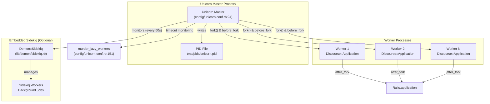

**Sources:** [config/unicorn.conf.rb:1-209](https://github.com/discourse/discourse/blob/8c2d5f9a/config/unicorn.conf.rb#L1-L209), [config/application.rb:1-233](https://github.com/discourse/discourse/blob/8c2d5f9a/config/application.rb#L1-L233), [Gemfile:196-197](https://github.com/discourse/discourse/blob/8c2d5f9a/Gemfile#L196-L197)

### Critical Dependencies

#### Data Stores

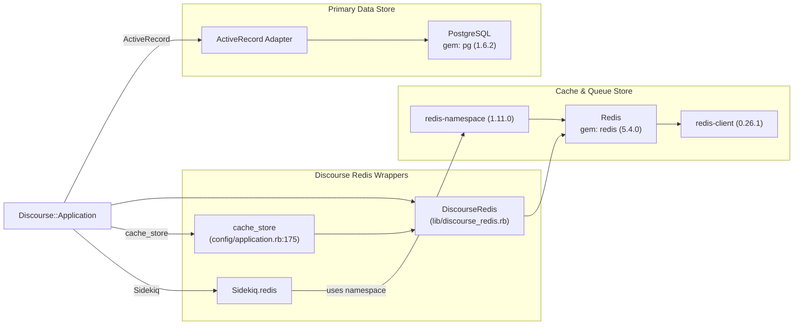

**Sources:** [Gemfile:89-90](https://github.com/discourse/discourse/blob/8c2d5f9a/Gemfile#L89-L90), [Gemfile:36-44](https://github.com/discourse/discourse/blob/8c2d5f9a/Gemfile#L36-L44), [config/application.rb:172-177](https://github.com/discourse/discourse/blob/8c2d5f9a/config/application.rb#L172-L177)

#### Serialization & JSON

| Gem | Version | Purpose |
|-----|---------|---------|
| `oj` | 3.16.11 | Fast JSON parsing/generation |
| `active_model_serializers` | 0.8.3 | API response serialization |
| `multi_json` | 1.17.0 | JSON abstraction layer |
| `msgpack` | 1.8.0 | Binary serialization (sessions) |

The application uses MessagePack for cookie serialization ([config/application.rb:92]()) with custom extensions for `ActiveSupport::SafeBuffer` ([lib/freedom_patches/message_pack_extensions.rb:10-13]()).

**Sources:** [Gemfile:87](https://github.com/discourse/discourse/blob/8c2d5f9a/Gemfile#L87), [Gemfile:50](https://github.com/discourse/discourse/blob/8c2d5f9a/Gemfile#L50), [Gemfile:72](https://github.com/discourse/discourse/blob/8c2d5f9a/Gemfile#L72), [Gemfile.lock:307](https://github.com/discourse/discourse/blob/8c2d5f9a/Gemfile.lock#L307), [config/application.rb:92](https://github.com/discourse/discourse/blob/8c2d5f9a/config/application.rb#L92)

#### Authentication

| Provider | Gem | Configuration |
|----------|-----|---------------|
| Core | `omniauth` (2.1.2) | Base authentication framework |
| Facebook | `omniauth-facebook` | [lib/discourse.rb:495-499]() |
| Google | `omniauth-google-oauth2` | [lib/discourse.rb:500-504]() |
| GitHub | `omniauth-github` | [lib/discourse.rb:505]() |
| Twitter | `omniauth-twitter` | [lib/discourse.rb:506]() |

Authentication providers are registered in `Discourse::BUILTIN_AUTH` ([lib/discourse.rb:489-512]()).

**Sources:** [Gemfile:78-85](https://github.com/discourse/discourse/blob/8c2d5f9a/Gemfile#L78-L85), [lib/discourse.rb:489-530](https://github.com/discourse/discourse/blob/8c2d5f9a/lib/discourse.rb#L489-L530)

#### Background Processing

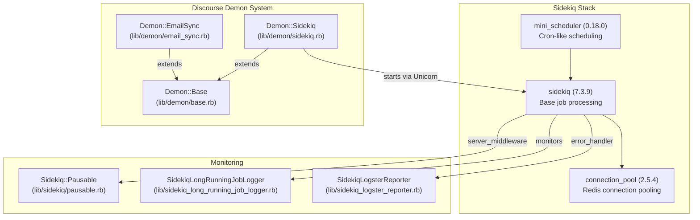

**Sources:** [Gemfile:99-100](https://github.com/discourse/discourse/blob/8c2d5f9a/Gemfile#L99-L100), [lib/demon/sidekiq.rb:1-169](https://github.com/discourse/discourse/blob/8c2d5f9a/lib/demon/sidekiq.rb#L1-L169), [lib/demon/base.rb:1-271](https://github.com/discourse/discourse/blob/8c2d5f9a/lib/demon/base.rb#L1-L271), [config/initializers/100-sidekiq.rb:1-108](https://github.com/discourse/discourse/blob/8c2d5f9a/config/initializers/100-sidekiq.rb#L1-L108)

---

## Background Job Processing with Sidekiq

### Architecture

Sidekiq processes jobs from Redis-backed queues with the following configuration ([lib/demon/sidekiq.rb:127-134]()):

| Queue | Weight | Priority |
|-------|--------|----------|
| `critical` | 8 | Highest |
| `default` | 4 | High |
| `low` | 2 | Normal |
| `ultra_low` | 1 | Lowest |

Queue assignments can be controlled per-host via environment variables like `UNICORN_SIDEKIQ_CRITICAL_QUEUE_HOSTNAME`.

### Demon Process Management

The `Demon::Base` class ([lib/demon/base.rb]()) provides intelligent process forking and lifecycle management:

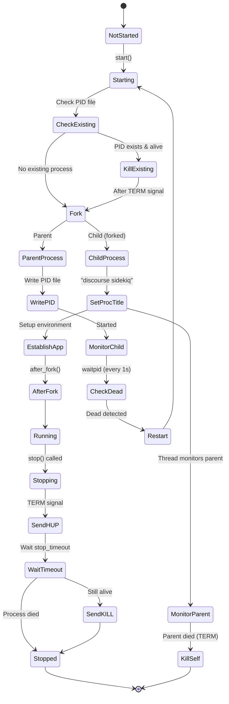

**Sources:** [lib/demon/base.rb:1-271](https://github.com/discourse/discourse/blob/8c2d5f9a/lib/demon/base.rb#L1-L271), [lib/demon/sidekiq.rb:1-169](https://github.com/discourse/discourse/blob/8c2d5f9a/lib/demon/sidekiq.rb#L1-L169)

### Sidekiq Configuration

The Sidekiq server is configured in [config/initializers/100-sidekiq.rb]():

1. **Connection**: Uses `Discourse.sidekiq_redis_config` ([config/initializers/100-sidekiq.rb:9-12]())
2. **Middleware**: 
   - `Sidekiq::Pausable` - enables pausing jobs ([config/initializers/100-sidekiq.rb:16]())
   - `Sidekiq::DiscourseEvent` - triggers `sidekiq_job_ran` events ([config/initializers/100-sidekiq.rb:17]())
3. **Error Handling**: `SidekiqLogsterReporter` logs exceptions to Logster ([config/initializers/100-sidekiq.rb:84]())
4. **Strict Args**: Enforces argument serialization ([config/initializers/100-sidekiq.rb:86]())

### MiniScheduler Integration

`MiniScheduler` ([Gemfile:100]()) provides cron-like scheduled job execution:

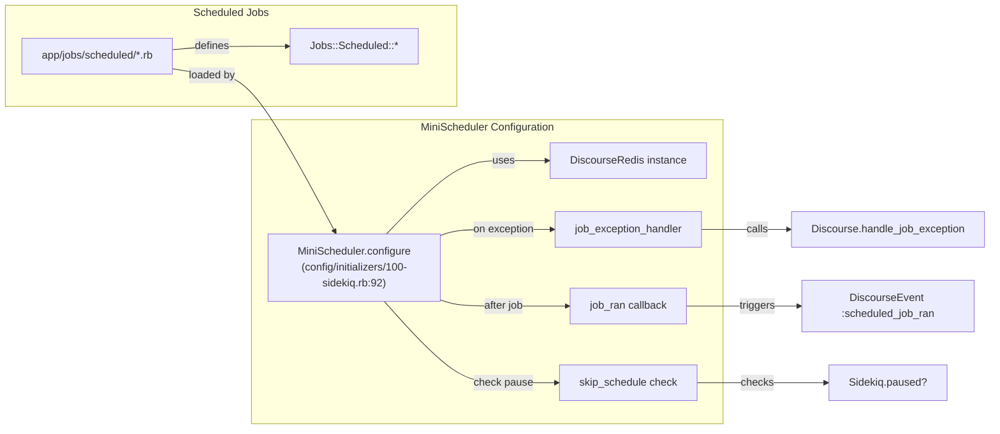

**Sources:** [config/initializers/100-sidekiq.rb:88-107](https://github.com/discourse/discourse/blob/8c2d5f9a/config/initializers/100-sidekiq.rb#L88-L107), [Gemfile:100](https://github.com/discourse/discourse/blob/8c2d5f9a/Gemfile#L100)

### Heartbeat and Memory Monitoring

When Sidekiq is embedded in Unicorn ([config/unicorn.conf.rb:85-110]()), the master process monitors workers:

**Heartbeat Check** ([lib/demon/sidekiq.rb:22-43]()): Every 60 seconds, checks if Sidekiq process has updated its heartbeat within 100 seconds (20 missed beats). Restarts dead workers.

**Memory Check** ([lib/demon/sidekiq.rb:47-69]()): Every 30 minutes, checks RSS memory usage. Default limit is 500MB (`UNICORN_SIDEKIQ_MAX_RSS` env var). Restarts workers exceeding the limit.

**Long-Running Job Logger** ([lib/sidekiq_long_running_job_logger.rb]()): When enabled via `GlobalSetting.sidekiq_report_long_running_jobs_minutes`, logs warnings about jobs running longer than the threshold.

**Sources:** [lib/demon/sidekiq.rb:22-75](https://github.com/discourse/discourse/blob/8c2d5f9a/lib/demon/sidekiq.rb#L22-L75), [config/unicorn.conf.rb:85-148](https://github.com/discourse/discourse/blob/8c2d5f9a/config/unicorn.conf.rb#L85-L148), [config/initializers/100-sidekiq.rb:20-22](https://github.com/discourse/discourse/blob/8c2d5f9a/config/initializers/100-sidekiq.rb#L20-L22)

### Pausable Jobs

`SidekiqPauser` ([lib/sidekiq/pausable.rb]()) allows pausing all job processing:

- `pause!(reason)` - Sets `sidekiq_is_paused_v2` key in Redis with 60s TTL
- Extends lease automatically in a background thread
- Used during backups, migrations, and failover scenarios
- `unpause!` - Removes the pause key

**Sources:** [lib/sidekiq/pausable.rb:1-106](https://github.com/discourse/discourse/blob/8c2d5f9a/lib/sidekiq/pausable.rb#L1-L106), [config/initializers/100-sidekiq.rb:16](https://github.com/discourse/discourse/blob/8c2d5f9a/config/initializers/100-sidekiq.rb#L16)

---

## Logging Infrastructure

### Logstash-based Structured Logging

When `ENABLE_LOGSTASH_LOGGER=1`, Discourse uses structured JSON logging compatible with Logstash/Elasticsearch.

#### DiscourseLogstashLogger

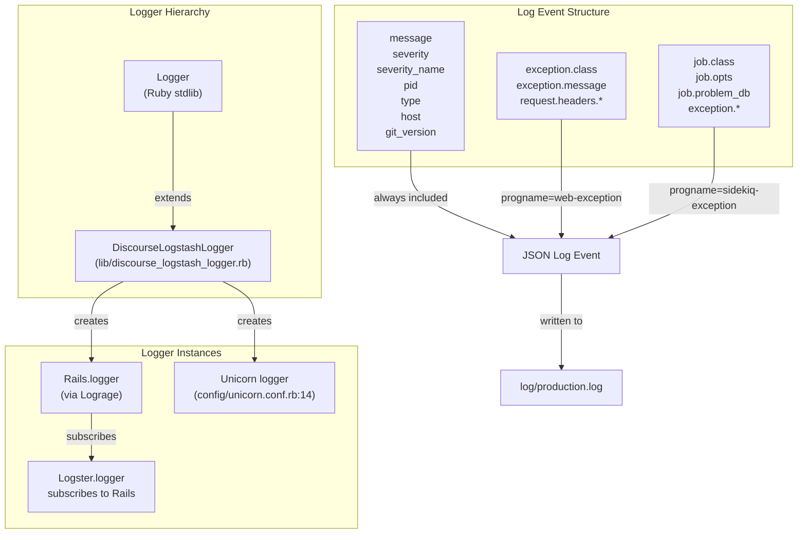

**Sources:** [lib/discourse_logstash_logger.rb:1-128](https://github.com/discourse/discourse/blob/8c2d5f9a/lib/discourse_logstash_logger.rb#L1-L128), [config/initializers/101-lograge.rb:1-173](https://github.com/discourse/discourse/blob/8c2d5f9a/config/initializers/101-lograge.rb#L1-L173)

#### Log Event Fields

Base fields included in all log events ([lib/discourse_logstash_logger.rb:64-72]()):

| Field | Source | Example |
|-------|--------|---------|
| `message` | Log message | `"[200] GET / (ListController#latest)"` |
| `severity` | Logger constant | `1` (INFO) |
| `severity_name` | Logger label | `"INFO"` |
| `pid` | Process ID | `12345` |
| `type` | Logger type | `"rails"`, `"unicorn"`, `"sidekiq"` |
| `host` | Hostname | From `Socket.gethostname` |
| `git_version` | Git SHA | From `GitUtils.git_version` |

**Exception-specific fields** (severity >= WARN):

- **Web Exceptions** ([lib/discourse_logstash_logger.rb:87-99]()): `exception.class`, `exception.message`, `request.headers.*`
- **Sidekiq Exceptions** ([lib/discourse_logstash_logger.rb:101-108]()): `job.class`, `job.opts`, `job.problem_db`, `exception.class`, `exception.message`

**Sources:** [lib/discourse_logstash_logger.rb:50-123](https://github.com/discourse/discourse/blob/8c2d5f9a/lib/discourse_logstash_logger.rb#L50-L123)

### Lograge Integration

Lograge ([config/initializers/101-lograge.rb]()) suppresses Rails' default verbose logging and formats requests as JSON:

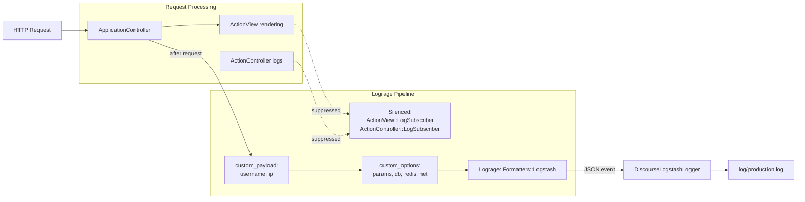

**Custom Payload** ([config/initializers/101-lograge.rb:66-89]()): Adds `username` (from `current_user`) and `ip` (from `remote_ip`)

**Custom Options** ([config/initializers/101-lograge.rb:91-145]()): Adds timing data from `MethodProfiler`:
- `db` / `db_calls` - SQL query time and count
- `redis` / `redis_calls` - Redis operation time and count  
- `net` / `net_calls` - External HTTP time and count
- `heap_live_slots` - GC stats delta
- `params` - Request parameters (excluding `controller`, `action`, `format`, `id`)
- `database` - Current multisite database name

**Sources:** [config/initializers/101-lograge.rb:1-173](https://github.com/discourse/discourse/blob/8c2d5f9a/config/initializers/101-lograge.rb#L1-L173), [lib/discourse_logstash_logger.rb:1-128](https://github.com/discourse/discourse/blob/8c2d5f9a/lib/discourse_logstash_logger.rb#L1-L128)

### Logger Subscription

Logster subscribes to the Lograge logger ([config/initializers/101-lograge.rb:167-169]()), ensuring all logs flow through both Lograge's structured format and Logster's UI/storage.

**Sources:** [config/initializers/101-lograge.rb:167-169](https://github.com/discourse/discourse/blob/8c2d5f9a/config/initializers/101-lograge.rb#L167-L169)

---

## Version Management System

### Version Structure

Discourse version follows semantic versioning with beta/development suffixes, defined in [lib/version.rb:10]():

```
MAJOR.MINOR.TINY[.PRE][-DEV]
```

Examples:
- `3.6.0.beta2-latest` - Latest development version of beta2
- `3.6.0.beta1` - Released beta1  
- `3.1.2` - Stable release

### Version Components

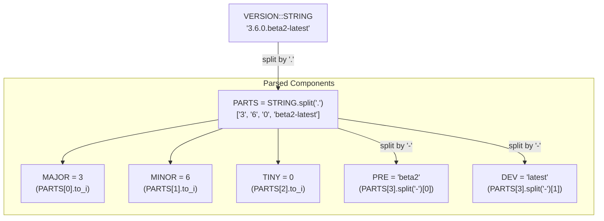

**Sources:** [lib/version.rb:8-21](https://github.com/discourse/discourse/blob/8c2d5f9a/lib/version.rb#L8-L21)

### Version Compatibility System

The version compatibility system allows plugins and themes to specify which Discourse versions they support via `.discourse-compatibility` files.

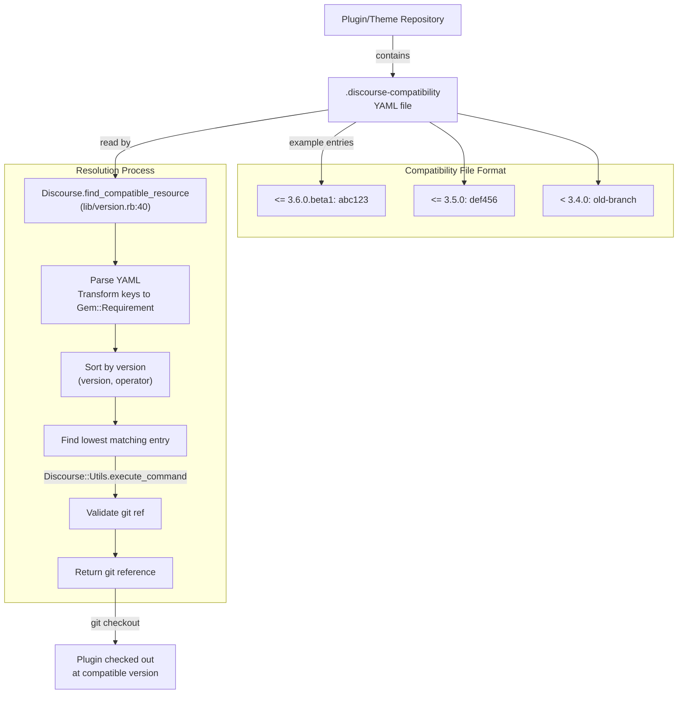

**Resolution Algorithm** ([lib/version.rb:40-92]()):
1. Parse YAML file to hash of `{Gem::Requirement => git_ref}`
2. Sort entries by version (ascending) and operator (`<` before `<=`)
3. Find first entry where requirement is satisfied by current Discourse version
4. Validate git reference format using `git check-ref-format`
5. Return git reference for checkout

**Sources:** [lib/version.rb:26-130](https://github.com/discourse/discourse/blob/8c2d5f9a/lib/version.rb#L26-L130)

### Version Bump Automation

The `version_bump:*` rake tasks ([lib/tasks/version_bump.rake]()) automate version releases:

#### Beta Release Flow

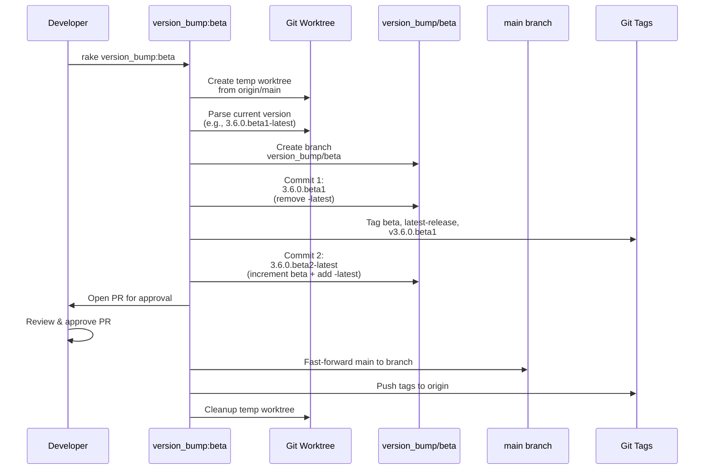

**Key Features**:
- Works in temporary git worktree to avoid affecting developer's working directory
- Creates PR for review before merging
- Only allows fast-forward merges (enforced by script)
- Validates all operations before pushing

**Sources:** [lib/tasks/version_bump.rake:1-271](https://github.com/discourse/discourse/blob/8c2d5f9a/lib/tasks/version_bump.rake#L1-L271)

#### Version Bump Tasks

| Task | Purpose | Branches | Tags Created |
|------|---------|----------|--------------|
| `version_bump:beta` | Beta release | `main` | `beta`, `latest-release`, `vX.Y.Z.betaN` |
| `version_bump:minor_stable` | Patch release | `stable` | `vX.Y.Z` |
| `version_bump:major_stable_prepare` | Prepare stable | `main` → `stable` | None (prep only) |
| `version_bump:major_stable` | Stable release | `stable` | `stable`, `vX.Y.Z` |

**Sources:** [lib/tasks/version_bump.rake:191-271](https://github.com/discourse/discourse/blob/8c2d5f9a/lib/tasks/version_bump.rake#L191-L271)

### GitUtils Helper

`GitUtils` ([lib/git_utils.rb]()) provides version information from git:

| Method | Purpose | Example Output |
|--------|---------|----------------|
| `git_version` | Current commit SHA | `"abc123def456..."` |
| `git_branch` | Current branch | `"main"` |
| `full_version` | Describe with tags | `"v3.6.0.beta1-15-gabc123"` |
| `last_commit_date` | Last commit date | `DateTime` object |
| `has_commit?(hash)` | Check if commit exists | `true/false` |

All methods use `try_git` ([lib/git_utils.rb:29-38]()) which gracefully handles git command failures.

**Sources:** [lib/git_utils.rb:1-40](https://github.com/discourse/discourse/blob/8c2d5f9a/lib/git_utils.rb#L1-L40), [lib/discourse_logstash_logger.rb:10](https://github.com/discourse/discourse/blob/8c2d5f9a/lib/discourse_logstash_logger.rb#L10)

---

## Process Management and Failover

### Demon Process Architecture

The `Demon::Base` class ([lib/demon/base.rb]()) provides a framework for managing long-running background processes:

```mermaid
graph TB
    subgraph "Demon::Base Features"
        PIDManagement["PID File Management<br/>(tmp/pids/{prefix}_{index}.pid)"]
        ParentMonitor["Parent Process Monitoring<br/>Kill self if parent dies"]
        ChildMonitor["Child Process Monitoring<br/>Restart if crashes"]
        SignalHandling["Signal Handling<br/>HUP for clean shutdown"]
        StdioRedirect["STDIO Redirection<br/>/dev/null for daemon mode"]
    end
    
    subgraph "Demon Implementations"
        SidekiqDemon["Demon::Sidekiq<br/>Background jobs"]
        EmailSyncDemon["Demon::EmailSync<br/>Email polling"]
        PluginDemons["Plugin Demons<br/>DiscoursePluginRegistry"]
    end
    
    DemonBase["Demon::Base<br/>(lib/demon/base.rb)"]
    
    DemonBase -->|"provides"| PIDManagement
    DemonBase -->|"provides"| ParentMonitor
    DemonBase -->|"provides"| ChildMonitor
    DemonBase -->|"provides"| SignalHandling
    DemonBase -->|"provides"| StdioRedirect
    
    DemonBase -->|"extended by"| SidekiqDemon
    DemonBase -->|"extended by"| EmailSyncDemon
    DemonBase -->|"extended by"| PluginDemons
    
    UnicornMaster["Unicorn Master Process"]
    UnicornMaster -->|"starts in before_fork"| SidekiqDemon
    UnicornMaster -->|"starts in before_fork"| EmailSyncDemon
    UnicornMaster -->|"monitors every 60s"| SidekiqDemon
```

**Sources:** [lib/demon/base.rb:1-271](https://github.com/discourse/discourse/blob/8c2d5f9a/lib/demon/base.rb#L1-L271), [lib/demon/sidekiq.rb:1-169](https://github.com/discourse/discourse/blob/8c2d5f9a/lib/demon/sidekiq.rb#L1-L169), [config/unicorn.conf.rb:64-148](https://github.com/discourse/discourse/blob/8c2d5f9a/config/unicorn.conf.rb#L64-L148)

### Rails Failover

The `rails_failover` gem ([Gemfile:253]()) provides automatic failover for database and Redis connections:

- **Database Failover** ([config/application.rb:38]()): Monitors PostgreSQL primary/replica health
- **Redis Failover** ([config/application.rb:40]()): Monitors Redis primary/replica health
- **Readonly Mode**: Automatically enables when database becomes read-only

Readonly mode is managed through Redis keys ([lib/discourse.rb:672-689]()):

| Key | TTL | Purpose |
|-----|-----|---------|
| `readonly_mode` | 60s | General readonly mode |
| `readonly_mode:postgres` | 300s | PostgreSQL failover |
| `readonly_mode:user` | None | Manual user setting |
| `readonly_mode:postgres_force` | None | Forced readonly |

**Sources:** [Gemfile:253](https://github.com/discourse/discourse/blob/8c2d5f9a/Gemfile#L253), [config/application.rb:38-40](https://github.com/discourse/discourse/blob/8c2d5f9a/config/application.rb#L38-L40), [lib/discourse.rb:672-827](https://github.com/discourse/discourse/blob/8c2d5f9a/lib/discourse.rb#L672-L827)

### Multisite Support

The `rails_multisite` gem ([Gemfile:59]()) enables running multiple Discourse instances from one codebase:

- Configuration file path: `ENV["DISCOURSE_MULTISITE_CONFIG_PATH"]` or `GlobalSetting.multisite_config_path` ([config/application.rb:103-105]())
- Current database selection via `RailsMultisite::ConnectionManagement.current_db`
- Each site can have independent Redis namespaces
- Logging includes `database` field to distinguish sites ([config/initializers/101-lograge.rb:108]())

**Sources:** [Gemfile:59](https://github.com/discourse/discourse/blob/8c2d5f9a/Gemfile#L59), [config/application.rb:103-105](https://github.com/discourse/discourse/blob/8c2d5f9a/config/application.rb#L103-L105), [lib/discourse.rb:224-228](https://github.com/discourse/discourse/blob/8c2d5f9a/lib/discourse.rb#L224-L228)

---

## Development Dependencies

### Development-Only Gems

| Category | Gems | Purpose |
|----------|------|---------|
| Testing | `rspec`, `rspec-rails`, `capybara`, `webmock`, `fabrication` | Test framework and mocking |
| Profiling | `ruby-prof`, `memory_profiler`, `stackprof`, `rack-mini-profiler` | Performance analysis |
| Debugging | `debug`, `pry-rails`, `pry-stack_explorer`, `better_errors` | Interactive debugging |
| Code Quality | `rubocop-discourse`, `bullet`, `annotaterb` | Linting and N+1 detection |
| Documentation | `yard`, `syntax_tree` | Code documentation |

**Sources:** [Gemfile:122-178](https://github.com/discourse/discourse/blob/8c2d5f9a/Gemfile#L122-L178)

### Test Infrastructure

The test suite uses:
- **RSpec** ([Gemfile:133]()): Primary test framework
- **Fabrication** ([Gemfile:136]()): Test data factories  
- **Capybara + Playwright** ([Gemfile:129]()): Browser automation for system tests
- **WebMock** ([Gemfile:124]()): HTTP request stubbing
- **SimpleCov** ([Gemfile:125]()): Code coverage reporting
- **test-prof** ([Gemfile:126]()): Test profiling

For full testing infrastructure details, see [2.3](#2.3).