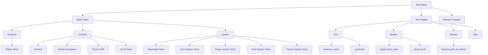
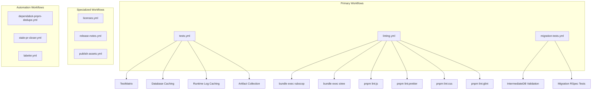
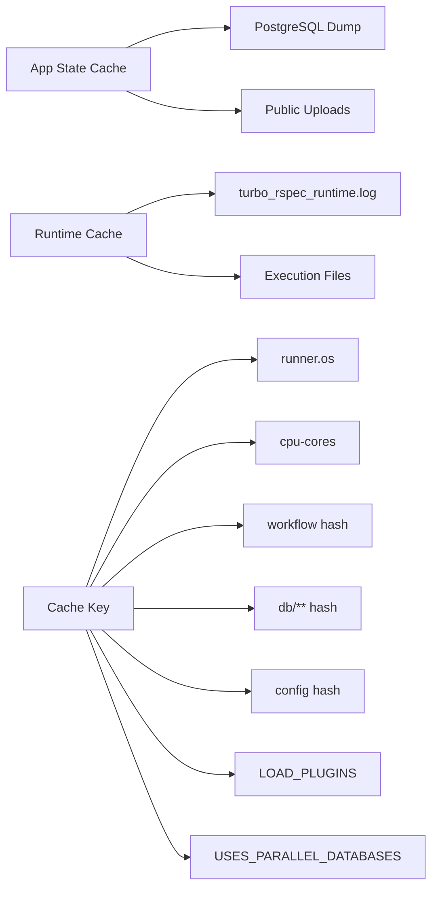
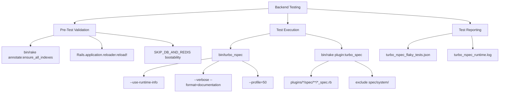
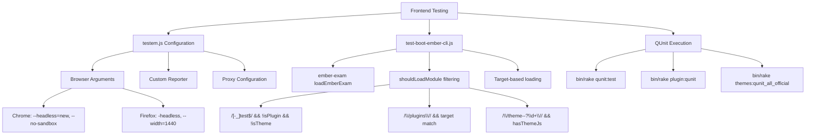
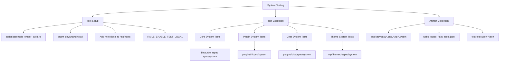
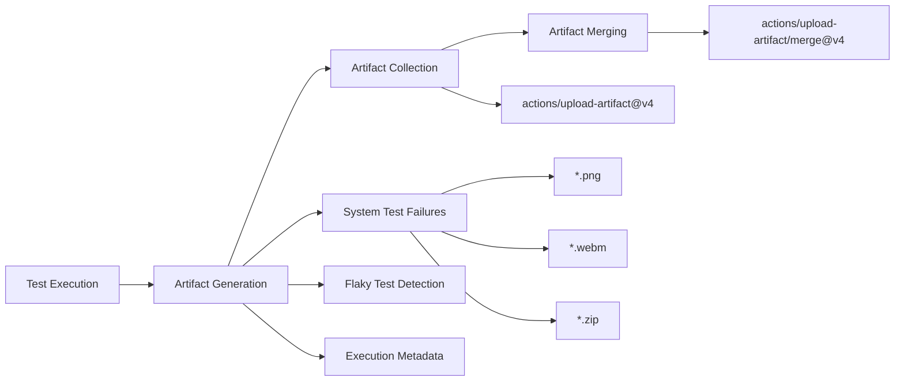
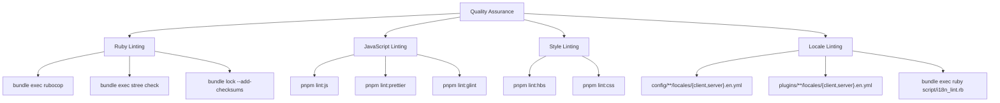

# Testing and CI/CD Pipeline

Relevant source files

The following files were used as context for generating this wiki page:

- [.github/workflows/check-pr-body.yml](https://github.com/discourse/discourse/blob/8c2d5f9a/.github/workflows/check-pr-body.yml)
- [.github/workflows/dependabot-pnpm-dedupe.yml](https://github.com/discourse/discourse/blob/8c2d5f9a/.github/workflows/dependabot-pnpm-dedupe.yml)
- [.github/workflows/labeler.yml](https://github.com/discourse/discourse/blob/8c2d5f9a/.github/workflows/labeler.yml)
- [.github/workflows/licenses.yml](https://github.com/discourse/discourse/blob/8c2d5f9a/.github/workflows/licenses.yml)
- [.github/workflows/linting.yml](https://github.com/discourse/discourse/blob/8c2d5f9a/.github/workflows/linting.yml)
- [.github/workflows/migration-tests.yml](https://github.com/discourse/discourse/blob/8c2d5f9a/.github/workflows/migration-tests.yml)
- [.github/workflows/publish-assets.yml](https://github.com/discourse/discourse/blob/8c2d5f9a/.github/workflows/publish-assets.yml)
- [.github/workflows/release-notes.yml](https://github.com/discourse/discourse/blob/8c2d5f9a/.github/workflows/release-notes.yml)
- [.github/workflows/stale-pr-closer.yml](https://github.com/discourse/discourse/blob/8c2d5f9a/.github/workflows/stale-pr-closer.yml)
- [.github/workflows/tests.yml](https://github.com/discourse/discourse/blob/8c2d5f9a/.github/workflows/tests.yml)
- [app/assets/javascripts/discourse/app/global-compat.js](https://github.com/discourse/discourse/blob/8c2d5f9a/app/assets/javascripts/discourse/app/global-compat.js)
- [app/assets/javascripts/discourse/app/lib/ember-events.js](https://github.com/discourse/discourse/blob/8c2d5f9a/app/assets/javascripts/discourse/app/lib/ember-events.js)
- [app/assets/javascripts/discourse/config/environment.js](https://github.com/discourse/discourse/blob/8c2d5f9a/app/assets/javascripts/discourse/config/environment.js)
- [app/assets/javascripts/discourse/config/optional-features.json.js](https://github.com/discourse/discourse/blob/8c2d5f9a/app/assets/javascripts/discourse/config/optional-features.json.js)
- [app/assets/javascripts/discourse/public/assets/scripts/discourse-test-listen-boot.js](https://github.com/discourse/discourse/blob/8c2d5f9a/app/assets/javascripts/discourse/public/assets/scripts/discourse-test-listen-boot.js)
- [app/assets/javascripts/discourse/public/assets/scripts/discourse-test-load-dynamic-js.js](https://github.com/discourse/discourse/blob/8c2d5f9a/app/assets/javascripts/discourse/public/assets/scripts/discourse-test-load-dynamic-js.js)
- [app/assets/javascripts/discourse/testem.js](https://github.com/discourse/discourse/blob/8c2d5f9a/app/assets/javascripts/discourse/testem.js)
- [app/assets/javascripts/discourse/tests/test-boot-ember-cli.js](https://github.com/discourse/discourse/blob/8c2d5f9a/app/assets/javascripts/discourse/tests/test-boot-ember-cli.js)
- [app/controllers/qunit_controller.rb](https://github.com/discourse/discourse/blob/8c2d5f9a/app/controllers/qunit_controller.rb)
- [jsconfig.json](https://github.com/discourse/discourse/blob/8c2d5f9a/jsconfig.json)
- [lib/tasks/plugin.rake](https://github.com/discourse/discourse/blob/8c2d5f9a/lib/tasks/plugin.rake)
- [lib/tasks/qunit.rake](https://github.com/discourse/discourse/blob/8c2d5f9a/lib/tasks/qunit.rake)
- [lib/tasks/themes.rake](https://github.com/discourse/discourse/blob/8c2d5f9a/lib/tasks/themes.rake)
- [lib/theme_metadata.rb](https://github.com/discourse/discourse/blob/8c2d5f9a/lib/theme_metadata.rb)
- [plugins/discourse-adplugin/assets/javascripts/discourse/initializers/initialize-ad-plugin.gjs](https://github.com/discourse/discourse/blob/8c2d5f9a/plugins/discourse-adplugin/assets/javascripts/discourse/initializers/initialize-ad-plugin.gjs)
- [script/build_jsconfig.rb](https://github.com/discourse/discourse/blob/8c2d5f9a/script/build_jsconfig.rb)
- [spec/tasks/themes_spec.rb](https://github.com/discourse/discourse/blob/8c2d5f9a/spec/tasks/themes_spec.rb)

This document covers Discourse's comprehensive testing infrastructure and continuous integration/continuous deployment (CI/CD) pipeline. It details the test matrix architecture, GitHub Actions workflows, and specialized testing systems for plugins and themes.

For information about the frontend build system that supports testing, see [Frontend Build System](#2.1). For theme compilation processes, see [Theme and Asset Compilation](#2.2).

## Test Matrix Architecture

Discourse employs a multi-dimensional test matrix that validates code across different targets, build types, and browsers. The testing infrastructure is designed to ensure compatibility and reliability across core functionality, plugins, and themes.

**Sources:** [.github/workflows/tests.yml:49-65](https://github.com/discourse/discourse/blob/8c2d5f9a/.github/workflows/tests.yml#L49-L65), [.github/workflows/tests.yml:267-333](https://github.com/discourse/discourse/blob/8c2d5f9a/.github/workflows/tests.yml#L267-L333)

## GitHub Actions CI/CD Workflows

The CI/CD pipeline consists of multiple specialized workflows that handle different aspects of testing, linting, and deployment.

**Sources:** [.github/workflows/tests.yml:1-408](https://github.com/discourse/discourse/blob/8c2d5f9a/.github/workflows/tests.yml#L1-L408), [.github/workflows/linting.yml:1-103](https://github.com/discourse/discourse/blob/8c2d5f9a/.github/workflows/linting.yml#L1-L103), [.github/workflows/migration-tests.yml:1-127](https://github.com/discourse/discourse/blob/8c2d5f9a/.github/workflows/migration-tests.yml#L1-L127)

## Test Environment Configuration

The test infrastructure uses containerized environments with sophisticated caching strategies to optimize build times and maintain consistency across different test scenarios.

| Environment Variable | Purpose | Used In |
|----------------------|---------|---------|
| `RAILS_ENV` | Rails environment setting | Backend/System tests |
| `USES_PARALLEL_DATABASES` | Enable parallel test databases | Backend/System tests |
| `DISCOURSE_TURBO_RSPEC_RETRY_AND_LOG_FLAKY_TESTS` | Flaky test detection | Backend/System tests |
| `CHEAP_SOURCE_MAPS` | Optimize build performance | All environments |
| `LOAD_PLUGINS` | Control plugin loading | Plugin tests |
| `QUNIT_PARALLEL` | Parallel QUnit execution | Frontend tests |

The test runner uses `discourse/discourse_test:release` containers and implements multi-level caching:

**Sources:** [.github/workflows/tests.yml:159-206](https://github.com/discourse/discourse/blob/8c2d5f9a/.github/workflows/tests.yml#L159-L206), [.github/workflows/tests.yml:208-216](https://github.com/discourse/discourse/blob/8c2d5f9a/.github/workflows/tests.yml#L208-L216)

## Backend Testing Infrastructure

Backend tests use RSpec with the `turbo_rspec` parallel test runner. The system includes annotation validation, Zeitwerk reloading checks, and database-free boot validation.

**Sources:** [.github/workflows/tests.yml:217-240](https://github.com/discourse/discourse/blob/8c2d5f9a/.github/workflows/tests.yml#L217-L240), [.github/workflows/tests.yml:267-274](https://github.com/discourse/discourse/blob/8c2d5f9a/.github/workflows/tests.yml#L267-L274), [lib/tasks/plugin.rake:187-213](https://github.com/discourse/discourse/blob/8c2d5f9a/lib/tasks/plugin.rake#L187-L213)

## Frontend Testing Infrastructure

Frontend tests use QUnit with Testem for test execution across multiple browsers. The system supports both core and plugin testing with sophisticated test loading mechanisms.

**Sources:** [app/assets/javascripts/discourse/testem.js:141-250](https://github.com/discourse/discourse/blob/8c2d5f9a/app/assets/javascripts/discourse/testem.js#L141-L250), [app/assets/javascripts/discourse/tests/test-boot-ember-cli.js:9-92](https://github.com/discourse/discourse/blob/8c2d5f9a/app/assets/javascripts/discourse/tests/test-boot-ember-cli.js#L9-L92), [lib/tasks/qunit.rake:3-158](https://github.com/discourse/discourse/blob/8c2d5f9a/lib/tasks/qunit.rake#L3-L158)

## System Testing Infrastructure

System tests use Playwright for browser automation and test core user workflows. The system includes specialized setup for MinIO integration and comprehensive artifact collection.

**Sources:** [.github/workflows/tests.yml:298-333](https://github.com/discourse/discourse/blob/8c2d5f9a/.github/workflows/tests.yml#L298-L333), [script/assemble_ember_build.rb:1-160](https://github.com/discourse/discourse/blob/8c2d5f9a/script/assemble_ember_build.rb#L1-L160), [.github/workflows/tests.yml:334-383](https://github.com/discourse/discourse/blob/8c2d5f9a/.github/workflows/tests.yml#L334-L383)

## Plugin and Theme Testing

Discourse provides comprehensive testing infrastructure for both plugins and themes, including isolated testing environments and specialized rake tasks.

```mermaid
graph TD
    PluginThemeTesting["Plugin & Theme Testing"] --> PluginTasks["Plugin Tasks"]
    PluginThemeTesting --> ThemeTasks["Theme Tasks"]
    PluginThemeTesting --> IsolatedTesting["Isolated Testing"]
    
    PluginTasks --> PluginSpec["plugin:spec / plugin:turbo_spec"]
    PluginTasks --> PluginQUnit["plugin:qunit"]
    PluginTasks --> PluginInstall["plugin:install_all_official"]
    PluginTasks --> PluginUpdate["plugin:update_all"]
    PluginTasks --> PluginCompatible["plugin:pull_compatible_all"]
    
    ThemeTasks --> ThemeInstall["themes:install"]
    ThemeTasks --> ThemeUpdate["themes:update"]
    ThemeTasks --> ThemeQUnit["themes:qunit"]
    ThemeTasks --> ThemeIsolated["themes:isolated_test"]
    ThemeTasks --> ThemeClone["themes:clone_all_official"]
    
    IsolatedTesting --> TemporaryRedis["TemporaryRedis.new"]
    IsolatedTesting --> TemporaryDb["TemporaryDb.new"]
    IsolatedTesting --> ThemeInstallation["Theme Installation"]
    IsolatedTesting --> QUnitExecution["QUnit Test Execution"]
    
    PluginSpec --> SpecFiles["plugins/*/spec/**/*_spec.rb"]
    PluginQUnit --> TestFiles["plugins/*/test/**/*-test.js"]
    ThemeQUnit --> ThemeTestFiles["themes/*/test/**/*.{js,gjs}"]
```

**Sources:** [lib/tasks/plugin.rake:1-418](https://github.com/discourse/discourse/blob/8c2d5f9a/lib/tasks/plugin.rake#L1-L418), [lib/tasks/themes.rake:1-305](https://github.com/discourse/discourse/blob/8c2d5f9a/lib/tasks/themes.rake#L1-L305), [lib/tasks/themes.rake:169-224](https://github.com/discourse/discourse/blob/8c2d5f9a/lib/tasks/themes.rake#L169-L224)

## Test Artifact Management

The CI system collects and manages various test artifacts for debugging and analysis purposes. Failed tests generate screenshots, videos, and detailed execution reports.

| Artifact Type | Source | Purpose |
|--------------|--------|---------|
| Failed System Test Artifacts | `tmp/capybara/` | Screenshots, videos, and DOM dumps from failed system tests |
| Flaky Test Reports | `tmp/turbo_rspec_flaky_tests.json` | Detailed reports of flaky test behavior |
| QUnit Execution Files | `test-execution-*.json` | QUnit test execution metadata |
| Build Info | `dist/BUILD_INFO.json` | Ember build metadata for cache validation |

The artifact collection system automatically merges artifacts from parallel jobs and provides structured reporting for CI analysis.

**Sources:** [.github/workflows/tests.yml:334-407](https://github.com/discourse/discourse/blob/8c2d5f9a/.github/workflows/tests.yml#L334-L407), [script/assemble_ember_build.rb:58-82](https://github.com/discourse/discourse/blob/8c2d5f9a/script/assemble_ember_build.rb#L58-L82)

## Quality Assurance and Linting

The linting workflow ensures code quality across multiple languages and tools. It runs comprehensive checks on Ruby, JavaScript, CSS, and localization files.

