# Core Architecture

Relevant source files

The following files were used as context for generating this wiki page:

- [.licensed.yml](https://github.com/discourse/discourse/blob/8c2d5f9a/.licensed.yml)
- [Gemfile](https://github.com/discourse/discourse/blob/8c2d5f9a/Gemfile)
- [Gemfile.lock](https://github.com/discourse/discourse/blob/8c2d5f9a/Gemfile.lock)
- [app/assets/javascripts/admin/addon/routes/admin-route-map.js](https://github.com/discourse/discourse/blob/8c2d5f9a/app/assets/javascripts/admin/addon/routes/admin-route-map.js)
- [app/assets/javascripts/discourse/app/components/sidebar/filter-no-results.gjs](https://github.com/discourse/discourse/blob/8c2d5f9a/app/assets/javascripts/discourse/app/components/sidebar/filter-no-results.gjs)
- [app/assets/javascripts/discourse/app/components/sidebar/filter.gjs](https://github.com/discourse/discourse/blob/8c2d5f9a/app/assets/javascripts/discourse/app/components/sidebar/filter.gjs)
- [app/assets/javascripts/discourse/app/components/sidebar/panel-header.gjs](https://github.com/discourse/discourse/blob/8c2d5f9a/app/assets/javascripts/discourse/app/components/sidebar/panel-header.gjs)
- [app/assets/javascripts/discourse/app/lib/sidebar/admin-nav-map.js](https://github.com/discourse/discourse/blob/8c2d5f9a/app/assets/javascripts/discourse/app/lib/sidebar/admin-nav-map.js)
- [app/assets/javascripts/discourse/app/lib/sidebar/admin-sidebar.js](https://github.com/discourse/discourse/blob/8c2d5f9a/app/assets/javascripts/discourse/app/lib/sidebar/admin-sidebar.js)
- [app/assets/javascripts/discourse/app/lib/sidebar/base-custom-sidebar-panel.js](https://github.com/discourse/discourse/blob/8c2d5f9a/app/assets/javascripts/discourse/app/lib/sidebar/base-custom-sidebar-panel.js)
- [app/assets/javascripts/discourse/tests/acceptance/admin-sidebar-section-test.js](https://github.com/discourse/discourse/blob/8c2d5f9a/app/assets/javascripts/discourse/tests/acceptance/admin-sidebar-section-test.js)
- [app/assets/stylesheets/common/base/menu-panel.scss](https://github.com/discourse/discourse/blob/8c2d5f9a/app/assets/stylesheets/common/base/menu-panel.scss)
- [app/assets/stylesheets/common/base/sidebar.scss](https://github.com/discourse/discourse/blob/8c2d5f9a/app/assets/stylesheets/common/base/sidebar.scss)
- [app/controllers/posts_controller.rb](https://github.com/discourse/discourse/blob/8c2d5f9a/app/controllers/posts_controller.rb)
- [app/controllers/topics_controller.rb](https://github.com/discourse/discourse/blob/8c2d5f9a/app/controllers/topics_controller.rb)
- [app/jobs/regular/run_heartbeat.rb](https://github.com/discourse/discourse/blob/8c2d5f9a/app/jobs/regular/run_heartbeat.rb)
- [app/jobs/scheduled/heartbeat.rb](https://github.com/discourse/discourse/blob/8c2d5f9a/app/jobs/scheduled/heartbeat.rb)
- [app/models/concerns/limited_edit.rb](https://github.com/discourse/discourse/blob/8c2d5f9a/app/models/concerns/limited_edit.rb)
- [app/models/email_style.rb](https://github.com/discourse/discourse/blob/8c2d5f9a/app/models/email_style.rb)
- [app/models/post.rb](https://github.com/discourse/discourse/blob/8c2d5f9a/app/models/post.rb)
- [app/models/post_revision.rb](https://github.com/discourse/discourse/blob/8c2d5f9a/app/models/post_revision.rb)
- [app/models/site_setting.rb](https://github.com/discourse/discourse/blob/8c2d5f9a/app/models/site_setting.rb)
- [app/models/topic.rb](https://github.com/discourse/discourse/blob/8c2d5f9a/app/models/topic.rb)
- [app/serializers/current_user_serializer.rb](https://github.com/discourse/discourse/blob/8c2d5f9a/app/serializers/current_user_serializer.rb)
- [app/serializers/user_post_bookmark_serializer.rb](https://github.com/discourse/discourse/blob/8c2d5f9a/app/serializers/user_post_bookmark_serializer.rb)
- [app/services/destroy_task.rb](https://github.com/discourse/discourse/blob/8c2d5f9a/app/services/destroy_task.rb)
- [app/services/user_destroyer.rb](https://github.com/discourse/discourse/blob/8c2d5f9a/app/services/user_destroyer.rb)
- [config/application.rb](https://github.com/discourse/discourse/blob/8c2d5f9a/config/application.rb)
- [config/environments/development.rb](https://github.com/discourse/discourse/blob/8c2d5f9a/config/environments/development.rb)
- [config/initializers/100-sidekiq.rb](https://github.com/discourse/discourse/blob/8c2d5f9a/config/initializers/100-sidekiq.rb)
- [config/initializers/101-lograge.rb](https://github.com/discourse/discourse/blob/8c2d5f9a/config/initializers/101-lograge.rb)
- [config/locales/client.en.yml](https://github.com/discourse/discourse/blob/8c2d5f9a/config/locales/client.en.yml)
- [config/locales/server.en.yml](https://github.com/discourse/discourse/blob/8c2d5f9a/config/locales/server.en.yml)
- [config/routes.rb](https://github.com/discourse/discourse/blob/8c2d5f9a/config/routes.rb)
- [config/site_settings.yml](https://github.com/discourse/discourse/blob/8c2d5f9a/config/site_settings.yml)
- [config/unicorn.conf.rb](https://github.com/discourse/discourse/blob/8c2d5f9a/config/unicorn.conf.rb)
- [db/migrate/20231212044856_fill_edit_post_allowed_groups_based_on_deprecated_settings.rb](https://github.com/discourse/discourse/blob/8c2d5f9a/db/migrate/20231212044856_fill_edit_post_allowed_groups_based_on_deprecated_settings.rb)
- [db/post_migrate/20250227142351_migrate_sidekiq_jobs.rb](https://github.com/discourse/discourse/blob/8c2d5f9a/db/post_migrate/20250227142351_migrate_sidekiq_jobs.rb)
- [lib/backup_restore/system_interface.rb](https://github.com/discourse/discourse/blob/8c2d5f9a/lib/backup_restore/system_interface.rb)
- [lib/demon/base.rb](https://github.com/discourse/discourse/blob/8c2d5f9a/lib/demon/base.rb)
- [lib/demon/email_sync.rb](https://github.com/discourse/discourse/blob/8c2d5f9a/lib/demon/email_sync.rb)
- [lib/demon/sidekiq.rb](https://github.com/discourse/discourse/blob/8c2d5f9a/lib/demon/sidekiq.rb)
- [lib/discourse.rb](https://github.com/discourse/discourse/blob/8c2d5f9a/lib/discourse.rb)
- [lib/discourse_dev/topic.rb](https://github.com/discourse/discourse/blob/8c2d5f9a/lib/discourse_dev/topic.rb)
- [lib/discourse_logstash_logger.rb](https://github.com/discourse/discourse/blob/8c2d5f9a/lib/discourse_logstash_logger.rb)
- [lib/freedom_patches/message_pack_extensions.rb](https://github.com/discourse/discourse/blob/8c2d5f9a/lib/freedom_patches/message_pack_extensions.rb)
- [lib/freedom_patches/sidekiq.rb](https://github.com/discourse/discourse/blob/8c2d5f9a/lib/freedom_patches/sidekiq.rb)
- [lib/git_utils.rb](https://github.com/discourse/discourse/blob/8c2d5f9a/lib/git_utils.rb)
- [lib/guardian.rb](https://github.com/discourse/discourse/blob/8c2d5f9a/lib/guardian.rb)
- [lib/guardian/post_guardian.rb](https://github.com/discourse/discourse/blob/8c2d5f9a/lib/guardian/post_guardian.rb)
- [lib/guardian/topic_guardian.rb](https://github.com/discourse/discourse/blob/8c2d5f9a/lib/guardian/topic_guardian.rb)
- [lib/has_errors.rb](https://github.com/discourse/discourse/blob/8c2d5f9a/lib/has_errors.rb)
- [lib/import_export/base_exporter.rb](https://github.com/discourse/discourse/blob/8c2d5f9a/lib/import_export/base_exporter.rb)
- [lib/middleware/discourse_public_exceptions.rb](https://github.com/discourse/discourse/blob/8c2d5f9a/lib/middleware/discourse_public_exceptions.rb)
- [lib/post_creator.rb](https://github.com/discourse/discourse/blob/8c2d5f9a/lib/post_creator.rb)
- [lib/post_destroyer.rb](https://github.com/discourse/discourse/blob/8c2d5f9a/lib/post_destroyer.rb)
- [lib/post_revisor.rb](https://github.com/discourse/discourse/blob/8c2d5f9a/lib/post_revisor.rb)
- [lib/sidekiq/discourse_event.rb](https://github.com/discourse/discourse/blob/8c2d5f9a/lib/sidekiq/discourse_event.rb)
- [lib/sidekiq/pausable.rb](https://github.com/discourse/discourse/blob/8c2d5f9a/lib/sidekiq/pausable.rb)
- [lib/sidekiq_logster_reporter.rb](https://github.com/discourse/discourse/blob/8c2d5f9a/lib/sidekiq_logster_reporter.rb)
- [lib/sidekiq_long_running_job_logger.rb](https://github.com/discourse/discourse/blob/8c2d5f9a/lib/sidekiq_long_running_job_logger.rb)
- [lib/sidekiq_migration.rb](https://github.com/discourse/discourse/blob/8c2d5f9a/lib/sidekiq_migration.rb)
- [lib/signal_trap_logger.rb](https://github.com/discourse/discourse/blob/8c2d5f9a/lib/signal_trap_logger.rb)
- [lib/site_settings/deprecated_settings.rb](https://github.com/discourse/discourse/blob/8c2d5f9a/lib/site_settings/deprecated_settings.rb)
- [lib/tasks/destroy.rake](https://github.com/discourse/discourse/blob/8c2d5f9a/lib/tasks/destroy.rake)
- [lib/tasks/version_bump.rake](https://github.com/discourse/discourse/blob/8c2d5f9a/lib/tasks/version_bump.rake)
- [lib/topic_creator.rb](https://github.com/discourse/discourse/blob/8c2d5f9a/lib/topic_creator.rb)
- [lib/twitter_api.rb](https://github.com/discourse/discourse/blob/8c2d5f9a/lib/twitter_api.rb)
- [lib/version.rb](https://github.com/discourse/discourse/blob/8c2d5f9a/lib/version.rb)
- [plugins/chat/app/serializers/chat/user_message_bookmark_serializer.rb](https://github.com/discourse/discourse/blob/8c2d5f9a/plugins/chat/app/serializers/chat/user_message_bookmark_serializer.rb)
- [spec/fabricators/user_fabricator.rb](https://github.com/discourse/discourse/blob/8c2d5f9a/spec/fabricators/user_fabricator.rb)
- [spec/integration/invalid_request_spec.rb](https://github.com/discourse/discourse/blob/8c2d5f9a/spec/integration/invalid_request_spec.rb)
- [spec/jobs/jobs_spec.rb](https://github.com/discourse/discourse/blob/8c2d5f9a/spec/jobs/jobs_spec.rb)
- [spec/lib/backup_restore/system_interface_spec.rb](https://github.com/discourse/discourse/blob/8c2d5f9a/spec/lib/backup_restore/system_interface_spec.rb)
- [spec/lib/demon/email_sync_spec.rb](https://github.com/discourse/discourse/blob/8c2d5f9a/spec/lib/demon/email_sync_spec.rb)
- [spec/lib/demon/sidekiq_spec.rb](https://github.com/discourse/discourse/blob/8c2d5f9a/spec/lib/demon/sidekiq_spec.rb)
- [spec/lib/discourse_logstash_logger_spec.rb](https://github.com/discourse/discourse/blob/8c2d5f9a/spec/lib/discourse_logstash_logger_spec.rb)
- [spec/lib/discourse_spec.rb](https://github.com/discourse/discourse/blob/8c2d5f9a/spec/lib/discourse_spec.rb)
- [spec/lib/guardian/post_guardian_spec.rb](https://github.com/discourse/discourse/blob/8c2d5f9a/spec/lib/guardian/post_guardian_spec.rb)
- [spec/lib/guardian/topic_guardian_spec.rb](https://github.com/discourse/discourse/blob/8c2d5f9a/spec/lib/guardian/topic_guardian_spec.rb)
- [spec/lib/guardian_spec.rb](https://github.com/discourse/discourse/blob/8c2d5f9a/spec/lib/guardian_spec.rb)
- [spec/lib/post_creator_spec.rb](https://github.com/discourse/discourse/blob/8c2d5f9a/spec/lib/post_creator_spec.rb)
- [spec/lib/post_destroyer_spec.rb](https://github.com/discourse/discourse/blob/8c2d5f9a/spec/lib/post_destroyer_spec.rb)
- [spec/lib/post_revisor_spec.rb](https://github.com/discourse/discourse/blob/8c2d5f9a/spec/lib/post_revisor_spec.rb)
- [spec/lib/sidekiq/discourse_event_spec.rb](https://github.com/discourse/discourse/blob/8c2d5f9a/spec/lib/sidekiq/discourse_event_spec.rb)
- [spec/lib/sidekiq_long_running_job_logger_spec.rb](https://github.com/discourse/discourse/blob/8c2d5f9a/spec/lib/sidekiq_long_running_job_logger_spec.rb)
- [spec/lib/topic_creator_spec.rb](https://github.com/discourse/discourse/blob/8c2d5f9a/spec/lib/topic_creator_spec.rb)
- [spec/lib/twitter_api_spec.rb](https://github.com/discourse/discourse/blob/8c2d5f9a/spec/lib/twitter_api_spec.rb)
- [spec/models/post_spec.rb](https://github.com/discourse/discourse/blob/8c2d5f9a/spec/models/post_spec.rb)
- [spec/models/site_setting_spec.rb](https://github.com/discourse/discourse/blob/8c2d5f9a/spec/models/site_setting_spec.rb)
- [spec/models/topic_spec.rb](https://github.com/discourse/discourse/blob/8c2d5f9a/spec/models/topic_spec.rb)
- [spec/requests/posts_controller_spec.rb](https://github.com/discourse/discourse/blob/8c2d5f9a/spec/requests/posts_controller_spec.rb)
- [spec/requests/topics_controller_spec.rb](https://github.com/discourse/discourse/blob/8c2d5f9a/spec/requests/topics_controller_spec.rb)
- [spec/serializers/current_user_serializer_spec.rb](https://github.com/discourse/discourse/blob/8c2d5f9a/spec/serializers/current_user_serializer_spec.rb)
- [spec/serializers/topic_view_details_serializer_spec.rb](https://github.com/discourse/discourse/blob/8c2d5f9a/spec/serializers/topic_view_details_serializer_spec.rb)
- [spec/services/destroy_task_spec.rb](https://github.com/discourse/discourse/blob/8c2d5f9a/spec/services/destroy_task_spec.rb)
- [spec/services/user_destroyer_spec.rb](https://github.com/discourse/discourse/blob/8c2d5f9a/spec/services/user_destroyer_spec.rb)
- [spec/system/admin_sidebar_navigation_spec.rb](https://github.com/discourse/discourse/blob/8c2d5f9a/spec/system/admin_sidebar_navigation_spec.rb)
- [spec/system/page_objects/components/filter.rb](https://github.com/discourse/discourse/blob/8c2d5f9a/spec/system/page_objects/components/filter.rb)
- [spec/system/private_message_spec.rb](https://github.com/discourse/discourse/blob/8c2d5f9a/spec/system/private_message_spec.rb)
- [spec/tasks/destroy_spec.rb](https://github.com/discourse/discourse/blob/8c2d5f9a/spec/tasks/destroy_spec.rb)
- [spec/tasks/version_bump_spec.rb](https://github.com/discourse/discourse/blob/8c2d5f9a/spec/tasks/version_bump_spec.rb)

This document provides an overview of Discourse's core architectural components and how they interact. It explains the high-level system design, the primary layers of the application, and the key technologies used. For specific details about the frontend implementation, see [JavaScript Application Architecture](https://github.com/discourse/discourse/blob/8c2d5f9a/3.1), and for backend details, see [Ruby Application Architecture](https://github.com/discourse/discourse/blob/8c2d5f9a/3.2).

## Overview

Discourse is built as a modern web application with a clear separation between frontend and backend components. It follows a client-server architecture where a rich JavaScript client (Ember.js) communicates with a Ruby on Rails API server.

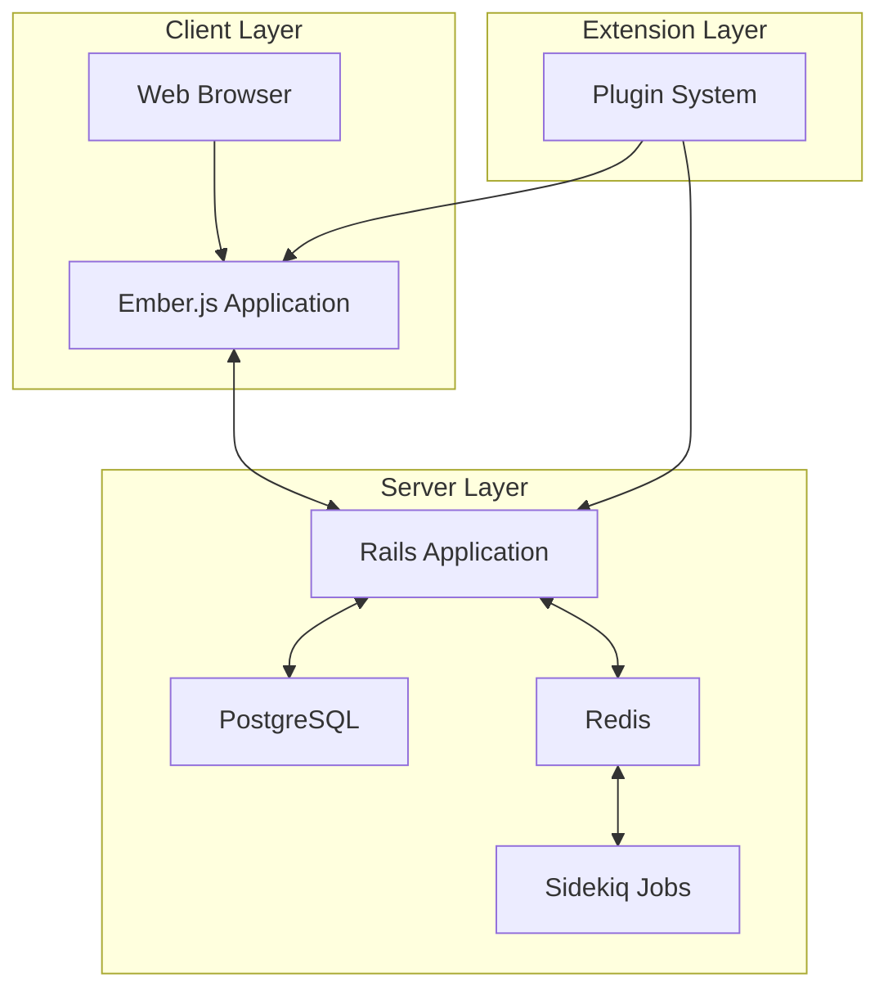

Sources: 
- [lib/discourse.rb](https://github.com/discourse/discourse/blob/8c2d5f9a/lib/discourse.rb)
- [app/controllers/application_controller.rb](https://github.com/discourse/discourse/blob/8c2d5f9a/app/controllers/application_controller.rb)
- [config/application.rb](https://github.com/discourse/discourse/blob/8c2d5f9a/config/application.rb)
- [app/assets/javascripts/discourse/package.json](https://github.com/discourse/discourse/blob/8c2d5f9a/app/assets/javascripts/discourse/package.json)
- [package.json](https://github.com/discourse/discourse/blob/8c2d5f9a/package.json)

## Tech Stack

Discourse's core technology stack includes:

| Layer | Technology | Primary Role |
|-------|------------|--------------|
| Frontend | Ember.js (6.6.0) | Client-side application framework |
| Backend | Ruby on Rails (8.0.x) | API server and request handling |
| Database | PostgreSQL | Primary data store |
| Cache | Redis | Caching, pub/sub, job queue |
| Background Processing | Sidekiq | Asynchronous job processing |
| Server | Unicorn/Puma | Application servers |
| Build System | pnpm (9.x) | Frontend package management |
| Editor | ProseMirror | Rich text editing |
| Templating | Handlebars/GJS | UI templates |
| CSS Processing | SCSS | Styling with Sass |

Sources:
- [Gemfile](https://github.com/discourse/discourse/blob/8c2d5f9a/Gemfile)
- [app/assets/javascripts/discourse/package.json](https://github.com/discourse/discourse/blob/8c2d5f9a/app/assets/javascripts/discourse/package.json)
- [package.json](https://github.com/discourse/discourse/blob/8c2d5f9a/package.json)
- [pnpm-lock.yaml](https://github.com/discourse/discourse/blob/8c2d5f9a/pnpm-lock.yaml)
- [Gemfile.lock](https://github.com/discourse/discourse/blob/8c2d5f9a/Gemfile.lock)

## System Architecture

Discourse follows a multi-layered architecture with clear separation of concerns between components.

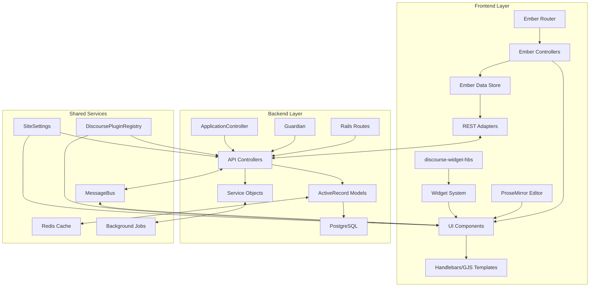

Sources:
- [app/controllers/application_controller.rb](https://github.com/discourse/discourse/blob/8c2d5f9a/app/controllers/application_controller.rb)
- [app/helpers/application_helper.rb](https://github.com/discourse/discourse/blob/8c2d5f9a/app/helpers/application_helper.rb)
- [lib/discourse.rb](https://github.com/discourse/discourse/blob/8c2d5f9a/lib/discourse.rb)
- [app/assets/javascripts/discourse/package.json](https://github.com/discourse/discourse/blob/8c2d5f9a/app/assets/javascripts/discourse/package.json)
- [lib/plugin/instance.rb](https://github.com/discourse/discourse/blob/8c2d5f9a/lib/plugin/instance.rb)
- [app/assets/javascripts/discourse-widget-hbs/package.json](https://github.com/discourse/discourse/blob/8c2d5f9a/app/assets/javascripts/discourse-widget-hbs/package.json)

## Request Lifecycle

A typical request in Discourse follows this path:

1. The browser loads the Ember.js application
2. Ember router matches the URL to a route
3. The route loads data from the Rails API
4. Controllers process the data and render templates
5. User interaction triggers actions that may make additional API calls
6. Background jobs perform asynchronous operations

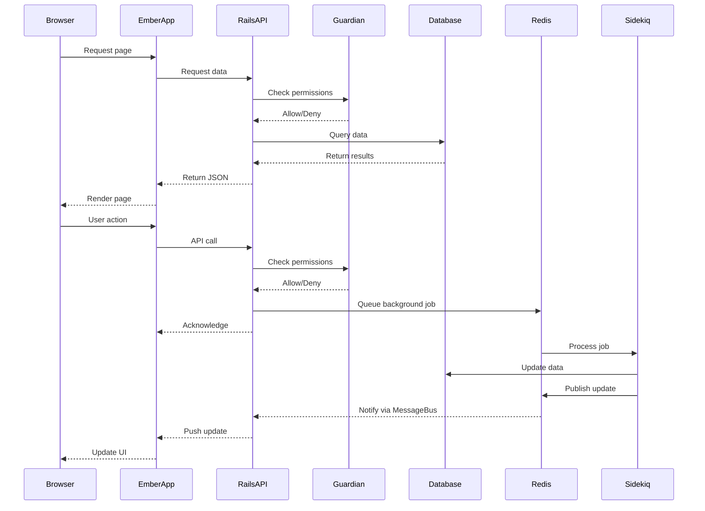

### Middleware Stack

Discourse uses a series of middleware components to process requests before they reach the Rails application:

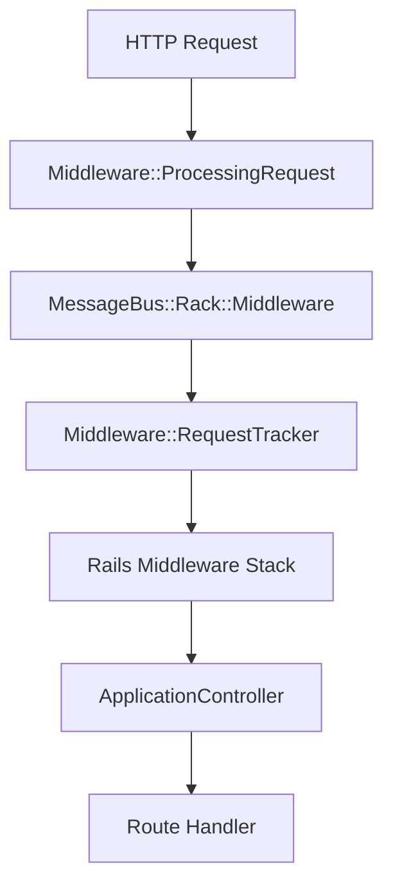

Sources:
- [app/controllers/application_controller.rb](https://github.com/discourse/discourse/blob/8c2d5f9a/app/controllers/application_controller.rb)
- [app/helpers/application_helper.rb](https://github.com/discourse/discourse/blob/8c2d5f9a/app/helpers/application_helper.rb)
- [lib/discourse.rb](https://github.com/discourse/discourse/blob/8c2d5f9a/lib/discourse.rb)
- [config/initializers/100-sidekiq.rb](https://github.com/discourse/discourse/blob/8c2d5f9a/config/initializers/100-sidekiq.rb)
- [config/initializers/200-first_middlewares.rb](https://github.com/discourse/discourse/blob/8c2d5f9a/config/initializers/200-first_middlewares.rb)

## Core Subsystems

### Authentication and Authorization

Discourse implements a robust authentication system through Rails and a Guardian pattern for authorization. The system supports multiple authentication providers (including OAuth providers like Google, Facebook, and Twitter) and maintains user sessions through `UserAuthToken`.

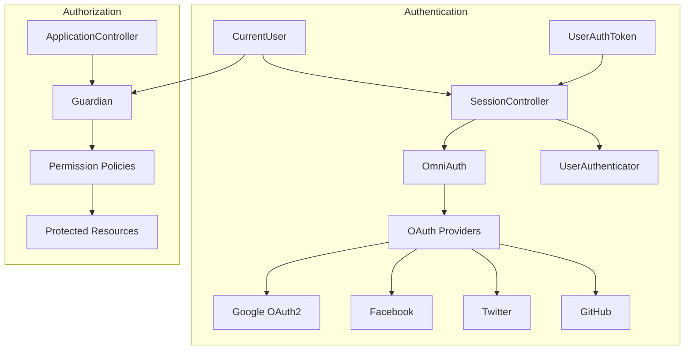

The `UserAuthToken` model handles secure session management, with features like:
- Token rotation for security
- Cross-device session tracking
- OAuth authentication tracking
- IP address validation

Sources:
- [app/controllers/application_controller.rb](https://github.com/discourse/discourse/blob/8c2d5f9a/app/controllers/application_controller.rb)
- [app/models/user_auth_token.rb](https://github.com/discourse/discourse/blob/8c2d5f9a/app/models/user_auth_token.rb)
- [spec/requests/application_controller_spec.rb](https://github.com/discourse/discourse/blob/8c2d5f9a/spec/requests/application_controller_spec.rb)
- [Gemfile:78-85](https://github.com/discourse/discourse/blob/8c2d5f9a/Gemfile#L78-L85) (OmniAuth providers)

### Background Processing

Discourse uses Sidekiq for background job processing, allowing the system to perform resource-intensive operations asynchronously. The `Demon::Sidekiq` class manages Sidekiq worker processes.

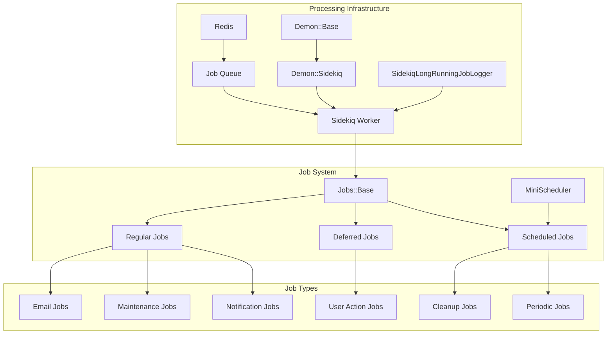

The background job system provides:
- Job queuing and prioritization
- Scheduled job execution
- Error handling and retry mechanisms
- Monitoring and logging of long-running jobs
- Resource usage control

Sources:
- [app/jobs/base.rb](https://github.com/discourse/discourse/blob/8c2d5f9a/app/jobs/base.rb)
- [lib/demon/sidekiq.rb](https://github.com/discourse/discourse/blob/8c2d5f9a/lib/demon/sidekiq.rb)
- [lib/demon/base.rb](https://github.com/discourse/discourse/blob/8c2d5f9a/lib/demon/base.rb)
- [config/initializers/100-sidekiq.rb](https://github.com/discourse/discourse/blob/8c2d5f9a/config/initializers/100-sidekiq.rb)
- [Gemfile:100-101](https://github.com/discourse/discourse/blob/8c2d5f9a/Gemfile#L100-L101) (Sidekiq and mini_scheduler)
- [spec/rails_helper.rb:180](https://github.com/discourse/discourse/blob/8c2d5f9a/spec/rails_helper.rb#L180) (Jobs.run_later!)

### Plugin System

Discourse includes a powerful plugin architecture that allows extending the application at various levels. The system is built around the `Plugin::Instance` class and the `DiscoursePluginRegistry`.

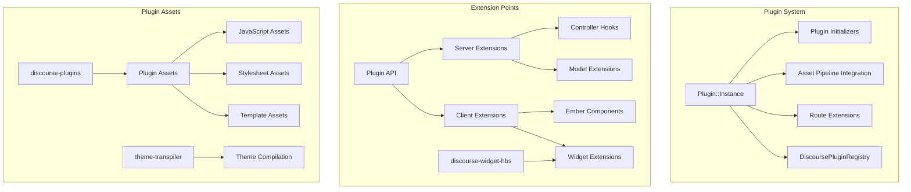

The plugin system provides:
- Modular extension of both server and client functionality
- Hot-loading of plugins without server restart
- Asset compilation and integration
- Hooks into core functionality
- Theme customization capabilities
- Widget extension system for UI customization

Sources:
- [lib/plugin/instance.rb](https://github.com/discourse/discourse/blob/8c2d5f9a/lib/plugin/instance.rb) (referenced in [lib/discourse.rb:5](https://github.com/discourse/discourse/blob/8c2d5f9a/lib/discourse.rb#L5))
- [lib/discourse_plugin_registry.rb](https://github.com/discourse/discourse/blob/8c2d5f9a/lib/discourse_plugin_registry.rb) (referenced in [lib/discourse.rb:12](https://github.com/discourse/discourse/blob/8c2d5f9a/lib/discourse.rb#L12))
- [app/assets/javascripts/discourse-plugins/package.json](https://github.com/discourse/discourse/blob/8c2d5f9a/app/assets/javascripts/discourse-plugins/package.json)
- [app/assets/javascripts/discourse-widget-hbs/package.json](https://github.com/discourse/discourse/blob/8c2d5f9a/app/assets/javascripts/discourse-widget-hbs/package.json)
- [app/assets/javascripts/theme-transpiler/package.json](https://github.com/discourse/discourse/blob/8c2d5f9a/app/assets/javascripts/theme-transpiler/package.json)
- [config/application.rb:10-27](https://github.com/discourse/discourse/blob/8c2d5f9a/config/application.rb#L10-L27) (Plugin loading)

### Real-time Messaging

MessageBus provides real-time messaging capabilities between server and clients, enabling live updates in the user interface. It uses Redis as a backend for pub/sub communication.

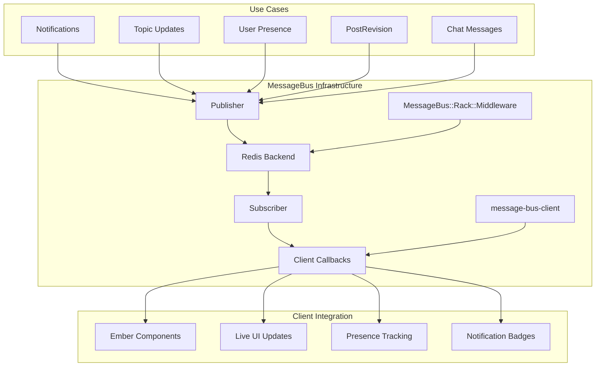

MessageBus is a critical component that enables:
- Real-time updates without polling
- Efficient pub/sub communication
- Channel-based message routing
- Client-specific message filtering
- Cross-instance communication in multi-server deployments

Sources:
- [Gemfile:57](https://github.com/discourse/discourse/blob/8c2d5f9a/Gemfile#L57) (message_bus gem)
- [config/application.rb](https://github.com/discourse/discourse/blob/8c2d5f9a/config/application.rb)
- [config/initializers/200-first_middlewares.rb:12](https://github.com/discourse/discourse/blob/8c2d5f9a/config/initializers/200-first_middlewares.rb#L12) (MessageBus middleware)
- [app/assets/javascripts/discourse/package.json:606](https://github.com/discourse/discourse/blob/8c2d5f9a/app/assets/javascripts/discourse/package.json#L606) (message-bus-client)
- [plugins/chat/spec/system/chat_new_message_spec.rb](https://github.com/discourse/discourse/blob/8c2d5f9a/plugins/chat/spec/system/chat_new_message_spec.rb) (Chat system using MessageBus)

## Deployment Architecture

Discourse is designed to be deployed in a multi-process, multi-server environment for scalability. It supports both Unicorn and Puma as application servers.

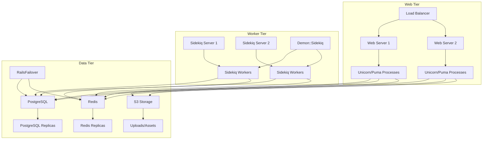

### Multi-site Support

Discourse supports hosting multiple forums (sites) from a single installation through the `RailsMultisite` system:

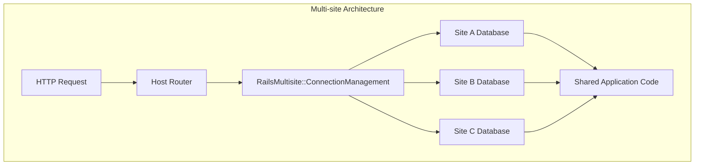

Sources:
- [config/unicorn.conf.rb](https://github.com/discourse/discourse/blob/8c2d5f9a/config/unicorn.conf.rb)
- [lib/demon/sidekiq.rb](https://github.com/discourse/discourse/blob/8c2d5f9a/lib/demon/sidekiq.rb)
- [Gemfile:196](https://github.com/discourse/discourse/blob/8c2d5f9a/Gemfile#L196) (Puma)
- [Gemfile:195](https://github.com/discourse/discourse/blob/8c2d5f9a/Gemfile#L195) (Unicorn)
- [Gemfile:252](https://github.com/discourse/discourse/blob/8c2d5f9a/Gemfile#L252) (RailsFailover)
- [Gemfile:59](https://github.com/discourse/discourse/blob/8c2d5f9a/Gemfile#L59) (rails_multisite)
- [Gemfile:63-66](https://github.com/discourse/discourse/blob/8c2d5f9a/Gemfile#L63-L66) (AWS S3 integration)
- [app/helpers/application_helper.rb:93-131](https://github.com/discourse/discourse/blob/8c2d5f9a/app/helpers/application_helper.rb#L93-L131) (S3 asset handling)

## Logging and Instrumentation

Discourse includes comprehensive logging and instrumentation facilities to monitor application performance and diagnose issues. The `DiscourseLogstashLogger` provides structured logging capabilities.

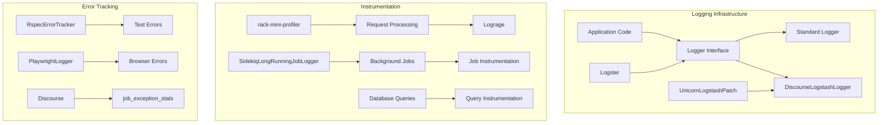

The logging and instrumentation system provides:
- Structured logging for machine parsing
- Performance monitoring and profiling
- Error tracking and reporting
- Request tracing
- Background job monitoring
- Test error capture

Sources:
- [lib/discourse_logstash_logger.rb](https://github.com/discourse/discourse/blob/8c2d5f9a/lib/discourse_logstash_logger.rb)
- [Gemfile:211-213](https://github.com/discourse/discourse/blob/8c2d5f9a/Gemfile#L211-L213) (lograge, logstash-event, logster)
- [Gemfile:193](https://github.com/discourse/discourse/blob/8c2d5f9a/Gemfile#L193) (rack-mini-profiler)
- [spec/rails_helper.rb:32-61](https://github.com/discourse/discourse/blob/8c2d5f9a/spec/rails_helper.rb#L32-L61) (RspecErrorTracker and PlaywrightLogger)
- [lib/discourse.rb:179-183](https://github.com/discourse/discourse/blob/8c2d5f9a/lib/discourse.rb#L179-L183) (job_exception_stats)

## Cross-cutting Security

Security is integrated throughout Discourse's architecture with various protective measures. The `Guardian` class is central to the authorization system.

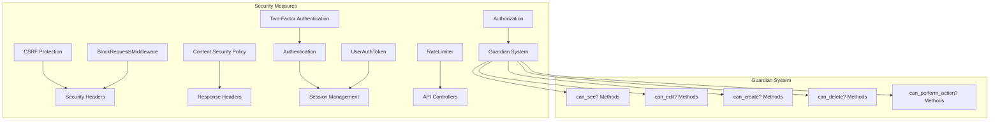

The security system provides:
- CSRF protection for all non-API requests
- Content Security Policy headers
- Secure session management with token rotation
- Fine-grained permission checking through Guardian
- Two-factor authentication support
- Rate limiting to prevent abuse
- Input validation and sanitization

Sources:
- [app/controllers/application_controller.rb:21-31](https://github.com/discourse/discourse/blob/8c2d5f9a/app/controllers/application_controller.rb#L21-L31) (CSRF protection)
- [app/controllers/application_controller.rb:187-206](https://github.com/discourse/discourse/blob/8c2d5f9a/app/controllers/application_controller.rb#L187-L206) (RateLimiter exception handling)
- [app/helpers/application_helper.rb:70-72](https://github.com/discourse/discourse/blob/8c2d5f9a/app/helpers/application_helper.rb#L70-L72) (CSP nonce)
- [app/models/user_auth_token.rb](https://github.com/discourse/discourse/blob/8c2d5f9a/app/models/user_auth_token.rb)
- [spec/requests/application_controller_spec.rb:134-184](https://github.com/discourse/discourse/blob/8c2d5f9a/spec/requests/application_controller_spec.rb#L134-L184) (Two-factor auth)

## Version Management

Discourse maintains version information for compatibility checking and updating.

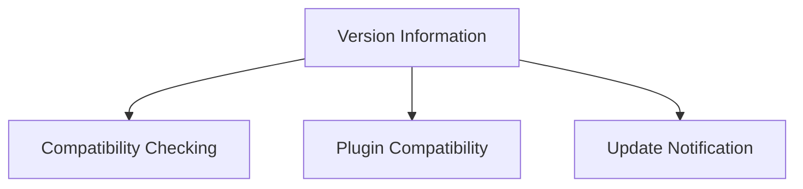

Sources:
- [lib/version.rb](https://github.com/discourse/discourse/blob/8c2d5f9a/lib/version.rb)
- [app/helpers/application_helper.rb:16-56](https://github.com/discourse/discourse/blob/8c2d5f9a/app/helpers/application_helper.rb#L16-L56)