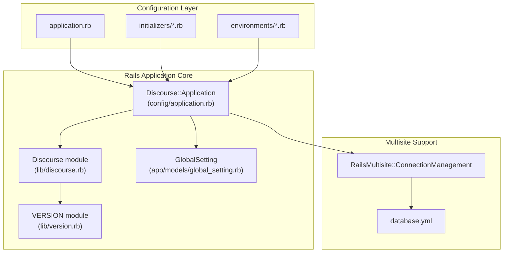
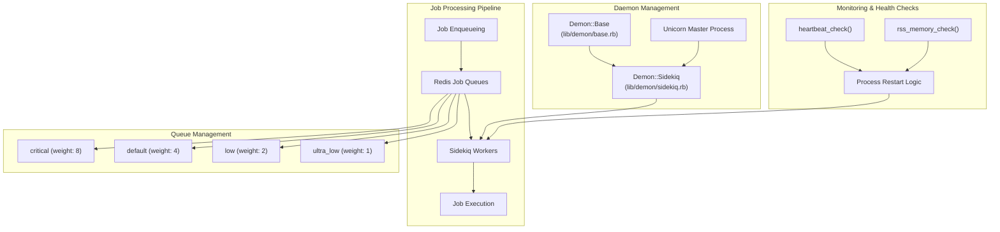
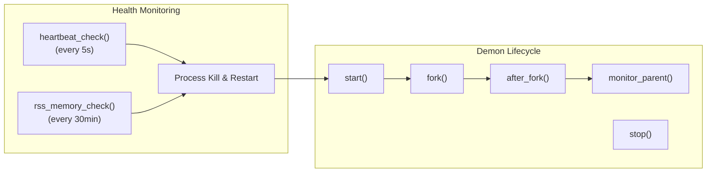
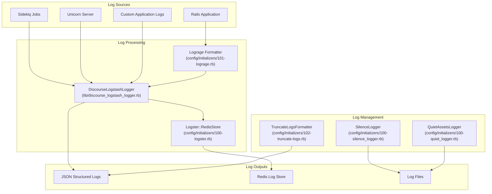
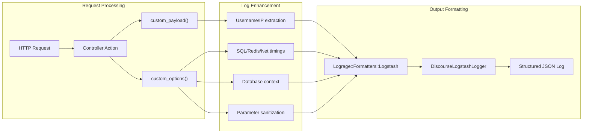
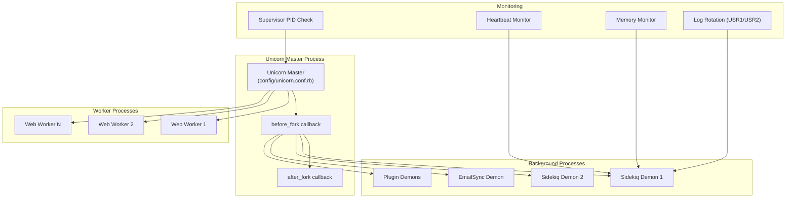
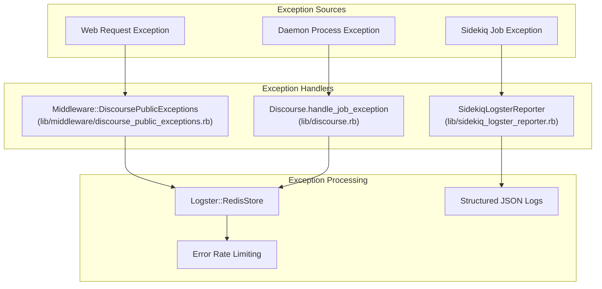

# Ruby Application Architecture

Relevant source files

The following files were used as context for generating this wiki page:

- [.licensed.yml](https://github.com/discourse/discourse/blob/8c2d5f9a/.licensed.yml)
- [Gemfile](https://github.com/discourse/discourse/blob/8c2d5f9a/Gemfile)
- [Gemfile.lock](https://github.com/discourse/discourse/blob/8c2d5f9a/Gemfile.lock)
- [app/controllers/posts_controller.rb](https://github.com/discourse/discourse/blob/8c2d5f9a/app/controllers/posts_controller.rb)
- [app/controllers/topics_controller.rb](https://github.com/discourse/discourse/blob/8c2d5f9a/app/controllers/topics_controller.rb)
- [app/jobs/regular/run_heartbeat.rb](https://github.com/discourse/discourse/blob/8c2d5f9a/app/jobs/regular/run_heartbeat.rb)
- [app/jobs/scheduled/heartbeat.rb](https://github.com/discourse/discourse/blob/8c2d5f9a/app/jobs/scheduled/heartbeat.rb)
- [app/models/email_style.rb](https://github.com/discourse/discourse/blob/8c2d5f9a/app/models/email_style.rb)
- [app/models/post.rb](https://github.com/discourse/discourse/blob/8c2d5f9a/app/models/post.rb)
- [app/models/post_revision.rb](https://github.com/discourse/discourse/blob/8c2d5f9a/app/models/post_revision.rb)
- [app/models/topic.rb](https://github.com/discourse/discourse/blob/8c2d5f9a/app/models/topic.rb)
- [app/serializers/user_post_bookmark_serializer.rb](https://github.com/discourse/discourse/blob/8c2d5f9a/app/serializers/user_post_bookmark_serializer.rb)
- [app/services/destroy_task.rb](https://github.com/discourse/discourse/blob/8c2d5f9a/app/services/destroy_task.rb)
- [app/services/user_destroyer.rb](https://github.com/discourse/discourse/blob/8c2d5f9a/app/services/user_destroyer.rb)
- [config/application.rb](https://github.com/discourse/discourse/blob/8c2d5f9a/config/application.rb)
- [config/environments/development.rb](https://github.com/discourse/discourse/blob/8c2d5f9a/config/environments/development.rb)
- [config/initializers/100-sidekiq.rb](https://github.com/discourse/discourse/blob/8c2d5f9a/config/initializers/100-sidekiq.rb)
- [config/initializers/101-lograge.rb](https://github.com/discourse/discourse/blob/8c2d5f9a/config/initializers/101-lograge.rb)
- [config/unicorn.conf.rb](https://github.com/discourse/discourse/blob/8c2d5f9a/config/unicorn.conf.rb)
- [db/post_migrate/20250227142351_migrate_sidekiq_jobs.rb](https://github.com/discourse/discourse/blob/8c2d5f9a/db/post_migrate/20250227142351_migrate_sidekiq_jobs.rb)
- [lib/backup_restore/system_interface.rb](https://github.com/discourse/discourse/blob/8c2d5f9a/lib/backup_restore/system_interface.rb)
- [lib/demon/base.rb](https://github.com/discourse/discourse/blob/8c2d5f9a/lib/demon/base.rb)
- [lib/demon/email_sync.rb](https://github.com/discourse/discourse/blob/8c2d5f9a/lib/demon/email_sync.rb)
- [lib/demon/sidekiq.rb](https://github.com/discourse/discourse/blob/8c2d5f9a/lib/demon/sidekiq.rb)
- [lib/discourse.rb](https://github.com/discourse/discourse/blob/8c2d5f9a/lib/discourse.rb)
- [lib/discourse_dev/topic.rb](https://github.com/discourse/discourse/blob/8c2d5f9a/lib/discourse_dev/topic.rb)
- [lib/discourse_logstash_logger.rb](https://github.com/discourse/discourse/blob/8c2d5f9a/lib/discourse_logstash_logger.rb)
- [lib/freedom_patches/message_pack_extensions.rb](https://github.com/discourse/discourse/blob/8c2d5f9a/lib/freedom_patches/message_pack_extensions.rb)
- [lib/freedom_patches/sidekiq.rb](https://github.com/discourse/discourse/blob/8c2d5f9a/lib/freedom_patches/sidekiq.rb)
- [lib/git_utils.rb](https://github.com/discourse/discourse/blob/8c2d5f9a/lib/git_utils.rb)
- [lib/has_errors.rb](https://github.com/discourse/discourse/blob/8c2d5f9a/lib/has_errors.rb)
- [lib/import_export/base_exporter.rb](https://github.com/discourse/discourse/blob/8c2d5f9a/lib/import_export/base_exporter.rb)
- [lib/middleware/discourse_public_exceptions.rb](https://github.com/discourse/discourse/blob/8c2d5f9a/lib/middleware/discourse_public_exceptions.rb)
- [lib/post_creator.rb](https://github.com/discourse/discourse/blob/8c2d5f9a/lib/post_creator.rb)
- [lib/post_destroyer.rb](https://github.com/discourse/discourse/blob/8c2d5f9a/lib/post_destroyer.rb)
- [lib/post_revisor.rb](https://github.com/discourse/discourse/blob/8c2d5f9a/lib/post_revisor.rb)
- [lib/sidekiq/discourse_event.rb](https://github.com/discourse/discourse/blob/8c2d5f9a/lib/sidekiq/discourse_event.rb)
- [lib/sidekiq/pausable.rb](https://github.com/discourse/discourse/blob/8c2d5f9a/lib/sidekiq/pausable.rb)
- [lib/sidekiq_logster_reporter.rb](https://github.com/discourse/discourse/blob/8c2d5f9a/lib/sidekiq_logster_reporter.rb)
- [lib/sidekiq_long_running_job_logger.rb](https://github.com/discourse/discourse/blob/8c2d5f9a/lib/sidekiq_long_running_job_logger.rb)
- [lib/sidekiq_migration.rb](https://github.com/discourse/discourse/blob/8c2d5f9a/lib/sidekiq_migration.rb)
- [lib/signal_trap_logger.rb](https://github.com/discourse/discourse/blob/8c2d5f9a/lib/signal_trap_logger.rb)
- [lib/tasks/destroy.rake](https://github.com/discourse/discourse/blob/8c2d5f9a/lib/tasks/destroy.rake)
- [lib/tasks/version_bump.rake](https://github.com/discourse/discourse/blob/8c2d5f9a/lib/tasks/version_bump.rake)
- [lib/topic_creator.rb](https://github.com/discourse/discourse/blob/8c2d5f9a/lib/topic_creator.rb)
- [lib/twitter_api.rb](https://github.com/discourse/discourse/blob/8c2d5f9a/lib/twitter_api.rb)
- [lib/version.rb](https://github.com/discourse/discourse/blob/8c2d5f9a/lib/version.rb)
- [plugins/chat/app/serializers/chat/user_message_bookmark_serializer.rb](https://github.com/discourse/discourse/blob/8c2d5f9a/plugins/chat/app/serializers/chat/user_message_bookmark_serializer.rb)
- [spec/integration/invalid_request_spec.rb](https://github.com/discourse/discourse/blob/8c2d5f9a/spec/integration/invalid_request_spec.rb)
- [spec/jobs/jobs_spec.rb](https://github.com/discourse/discourse/blob/8c2d5f9a/spec/jobs/jobs_spec.rb)
- [spec/lib/backup_restore/system_interface_spec.rb](https://github.com/discourse/discourse/blob/8c2d5f9a/spec/lib/backup_restore/system_interface_spec.rb)
- [spec/lib/demon/email_sync_spec.rb](https://github.com/discourse/discourse/blob/8c2d5f9a/spec/lib/demon/email_sync_spec.rb)
- [spec/lib/demon/sidekiq_spec.rb](https://github.com/discourse/discourse/blob/8c2d5f9a/spec/lib/demon/sidekiq_spec.rb)
- [spec/lib/discourse_logstash_logger_spec.rb](https://github.com/discourse/discourse/blob/8c2d5f9a/spec/lib/discourse_logstash_logger_spec.rb)
- [spec/lib/discourse_spec.rb](https://github.com/discourse/discourse/blob/8c2d5f9a/spec/lib/discourse_spec.rb)
- [spec/lib/post_creator_spec.rb](https://github.com/discourse/discourse/blob/8c2d5f9a/spec/lib/post_creator_spec.rb)
- [spec/lib/post_destroyer_spec.rb](https://github.com/discourse/discourse/blob/8c2d5f9a/spec/lib/post_destroyer_spec.rb)
- [spec/lib/post_revisor_spec.rb](https://github.com/discourse/discourse/blob/8c2d5f9a/spec/lib/post_revisor_spec.rb)
- [spec/lib/sidekiq/discourse_event_spec.rb](https://github.com/discourse/discourse/blob/8c2d5f9a/spec/lib/sidekiq/discourse_event_spec.rb)
- [spec/lib/sidekiq_long_running_job_logger_spec.rb](https://github.com/discourse/discourse/blob/8c2d5f9a/spec/lib/sidekiq_long_running_job_logger_spec.rb)
- [spec/lib/topic_creator_spec.rb](https://github.com/discourse/discourse/blob/8c2d5f9a/spec/lib/topic_creator_spec.rb)
- [spec/lib/twitter_api_spec.rb](https://github.com/discourse/discourse/blob/8c2d5f9a/spec/lib/twitter_api_spec.rb)
- [spec/models/post_spec.rb](https://github.com/discourse/discourse/blob/8c2d5f9a/spec/models/post_spec.rb)
- [spec/models/topic_spec.rb](https://github.com/discourse/discourse/blob/8c2d5f9a/spec/models/topic_spec.rb)
- [spec/requests/posts_controller_spec.rb](https://github.com/discourse/discourse/blob/8c2d5f9a/spec/requests/posts_controller_spec.rb)
- [spec/requests/topics_controller_spec.rb](https://github.com/discourse/discourse/blob/8c2d5f9a/spec/requests/topics_controller_spec.rb)
- [spec/serializers/topic_view_details_serializer_spec.rb](https://github.com/discourse/discourse/blob/8c2d5f9a/spec/serializers/topic_view_details_serializer_spec.rb)
- [spec/services/destroy_task_spec.rb](https://github.com/discourse/discourse/blob/8c2d5f9a/spec/services/destroy_task_spec.rb)
- [spec/services/user_destroyer_spec.rb](https://github.com/discourse/discourse/blob/8c2d5f9a/spec/services/user_destroyer_spec.rb)
- [spec/tasks/destroy_spec.rb](https://github.com/discourse/discourse/blob/8c2d5f9a/spec/tasks/destroy_spec.rb)
- [spec/tasks/version_bump_spec.rb](https://github.com/discourse/discourse/blob/8c2d5f9a/spec/tasks/version_bump_spec.rb)

This document details the core Ruby application architecture of Discourse, covering the Rails application structure, Sidekiq background job processing system, comprehensive logging infrastructure, and daemon management processes. 

For information about frontend build systems, see [Frontend Build System](#2.1). For details about plugin architecture, see [Server-side Plugin Architecture](#7.1).

## Rails Application Foundation

Discourse is built on Rails 8.0 with a custom application structure that extends beyond standard Rails conventions. The application is configured through `Discourse::Application` class and supports multisite deployments.

### Core Application Structure

The `Discourse::Application` class in [config/application.rb:61-233]() serves as the main Rails application class, with extensive customizations including:

- Custom autoload paths for Guardian, i18n, and validators [config/application.rb:110-112]()
- Multisite configuration support [config/application.rb:103-105]()
- Plugin activation during initialization [config/application.rb:192-196]()
- Custom middleware stack configuration [config/application.rb:141-170]()

Sources: config/application.rb, lib/discourse.rb, lib/version.rb

### Dependency Management

The application manages dependencies through Bundler with environment-specific gem loading:

| Environment | Gem Groups | Key Dependencies |
|-------------|------------|------------------|
| Production | `[:default]` | Rails, Sidekiq, Redis |
| Development | `[:default, :development, :test]` | + Debugging tools, Asset watchers |
| Test | `[:default, :test, :development]` | + Testing frameworks, Fabrication |

The [Gemfile:48-56]() implements conditional gem loading based on Rails environment, ensuring minimal dependency footprint in production.

Sources: Gemfile, Gemfile.lock, config/application.rb

## Sidekiq Background Job System

Discourse uses Sidekiq for background job processing with a sophisticated daemon management system and custom job prioritization.

### Sidekiq Architecture

### Sidekiq Configuration

The Sidekiq system is configured in [config/initializers/100-sidekiq.rb:9-23]() with separate client and server configurations. Key features include:

- **Queue Prioritization**: Four priority levels with weighted processing [lib/demon/sidekiq.rb:127-134]()
- **Custom Middleware**: Pausable jobs and event triggering [config/initializers/100-sidekiq.rb:15-18]()
- **Error Handling**: Custom error handlers with Logster integration [config/initializers/100-sidekiq.rb:83-84]()

### Daemon Management

The `Demon::Sidekiq` class extends `Demon::Base` to provide sophisticated process management:

The daemon management system includes:

- **Heartbeat Monitoring**: Checks every 5 seconds, kills unresponsive processes after 20 missed beats [lib/demon/sidekiq.rb:20-43]()
- **Memory Monitoring**: RSS memory checks every 30 minutes with configurable limits [lib/demon/sidekiq.rb:47-69]()
- **Signal Handling**: Graceful shutdown with 5-second timeout plus 5-second buffer [lib/demon/sidekiq.rb:81-88]()

Sources: config/initializers/100-sidekiq.rb, lib/demon/base.rb, lib/demon/sidekiq.rb

## Logging Infrastructure

Discourse implements a comprehensive logging system with structured logging, log aggregation, and custom formatters for different environments and use cases.

### Logging Architecture

### DiscourseLogstashLogger

The `DiscourseLogstashLogger` class provides structured JSON logging with contextual information:

| Field | Source | Description |
|-------|--------|-------------|
| `message` | Log message | Original log message or parsed JSON |
| `severity` | Logger level | Numeric severity (0-4) |
| `severity_name` | Logger constant | Human-readable severity |
| `pid` | `Process.pid` | Process identifier |
| `type` | Constructor | Log type (rails, unicorn, etc.) |
| `host` | `Socket.gethostname` | Server hostname |
| `git_version` | `GitUtils.git_version` | Current git commit hash |

The logger includes special handling for different log types:

- **Web Exceptions**: Extracts exception class and message, includes request headers [lib/discourse_logstash_logger.rb:87-99]()
- **Sidekiq Exceptions**: Includes job class, options, and database context [lib/discourse_logstash_logger.rb:101-107]()
- **JSON Messages**: Parses and merges JSON log messages [lib/discourse_logstash_logger.rb:110-119]()

### Lograge Integration

When `ENABLE_LOGSTASH_LOGGER=1`, the system uses Lograge for structured request logging:

Sources: lib/discourse_logstash_logger.rb, config/initializers/101-lograge.rb, config/initializers/100-logster.rb

### Log Management Features

The logging system includes several management features:

- **Log Truncation**: Limits log line length in production [config/initializers/102-truncate-logs.rb:3-27]()
- **Selective Silencing**: Reduces noise from assets and health checks [config/initializers/100-silence_logger.rb:16-33]()
- **Asset Request Quieting**: Suppresses verbose logging for static assets [config/initializers/100-quiet_logger.rb:5-22]()

Sources: config/initializers/102-truncate-logs.rb, config/initializers/100-silence_logger.rb, config/initializers/100-quiet_logger.rb

## Process Management and Monitoring

Discourse uses Unicorn as the primary web server with integrated daemon management for background processes.

### Unicorn Configuration

### Process Initialization

The Unicorn configuration implements sophisticated process management in the `before_fork` callback [config/unicorn.conf.rb:64-184]():

1. **Preload Rails**: Calls `Discourse.preload_rails!` and `Discourse.before_fork`
2. **Supervisor Monitoring**: Monitors parent supervisor process [config/unicorn.conf.rb:71-84]()
3. **Sidekiq Demon Startup**: Launches configured number of Sidekiq workers [config/unicorn.conf.rb:85-111]()
4. **Email Sync Demon**: Optionally starts email synchronization process [config/unicorn.conf.rb:112-117]()
5. **Plugin Demons**: Starts any plugin-registered daemon processes [config/unicorn.conf.rb:119-122]()

### Signal Handling and Process Control

The system implements comprehensive signal handling for process management:

| Signal | Handler | Purpose |
|--------|---------|---------|
| `USR1` | Log rotation | Reopens log files for rotation |
| `USR2` | Debug/delayed rotation | Dumps thread backtraces, delayed log reopening |
| `TERM` | Graceful shutdown | Terminates processes cleanly |
| `KILL` | Force shutdown | Emergency process termination |

The Unicorn master process includes custom worker timeout handling with thread backtrace dumping [config/unicorn.conf.rb:161-168]().

Sources: config/unicorn.conf.rb, lib/demon/base.rb

### Health Monitoring

The daemon management system implements several health check mechanisms:

- **Process Heartbeat**: Monitors Sidekiq process heartbeats via Redis [lib/demon/sidekiq.rb:22-43]()
- **Memory Usage**: Tracks RSS memory usage with configurable limits [lib/demon/sidekiq.rb:47-75]()
- **Parent Process Monitoring**: Child processes monitor parent and exit if parent dies [lib/demon/base.rb:226-241]()
- **Supervisor Integration**: Optional supervisor process monitoring [config/unicorn.conf.rb:71-84]()

Sources: config/unicorn.conf.rb, lib/demon/sidekiq.rb, lib/demon/base.rb

## Error Handling and Exception Management

The application implements comprehensive error handling across all system components with structured exception reporting and custom error handlers.

### Exception Flow

The exception handling system provides centralized error processing with context preservation and structured logging for debugging and monitoring.