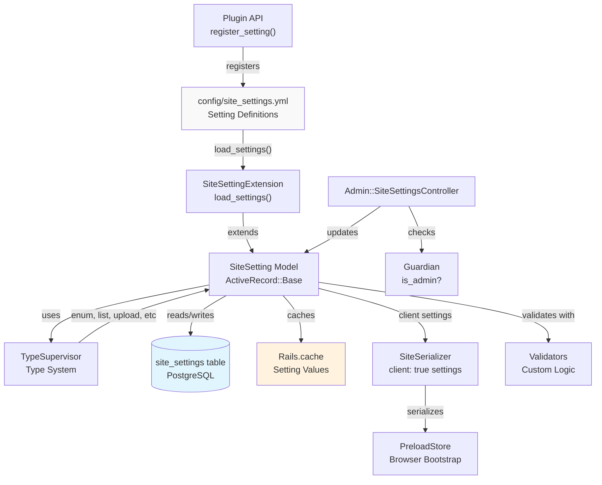
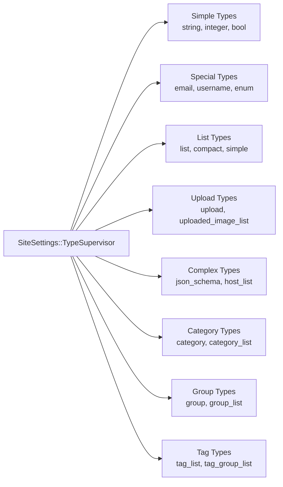
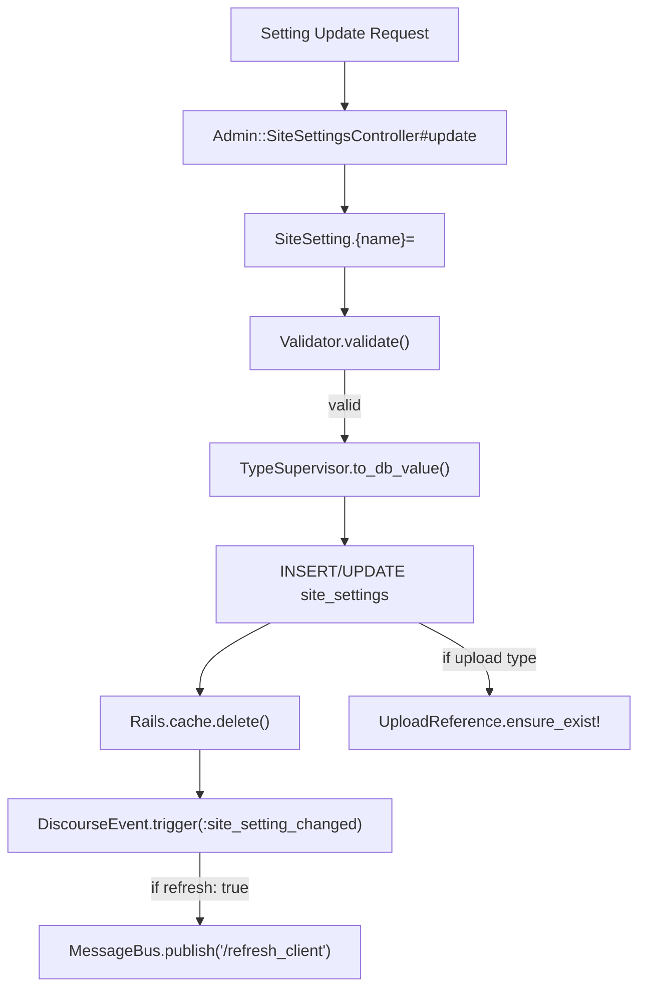
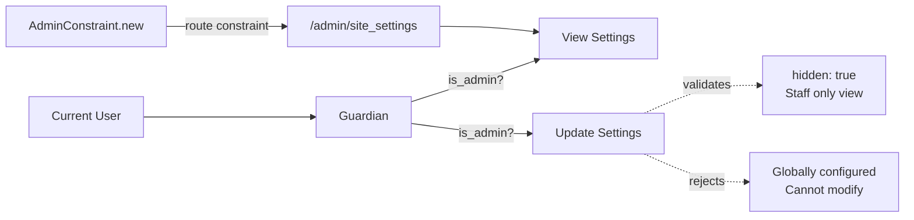
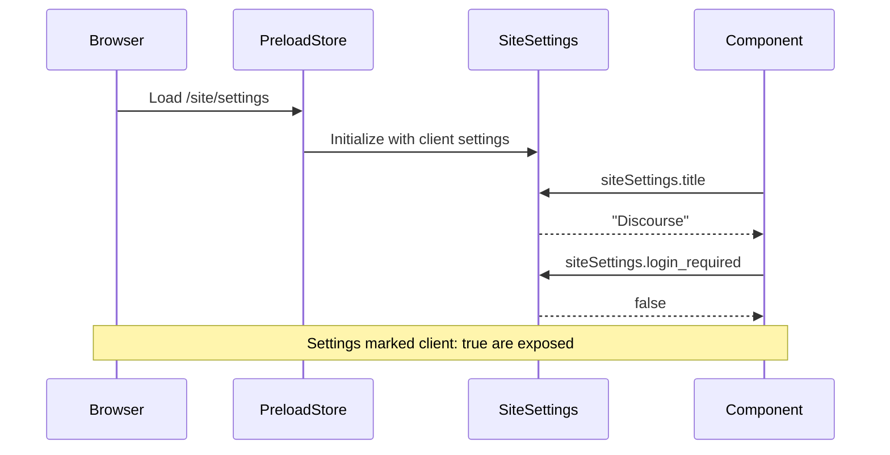
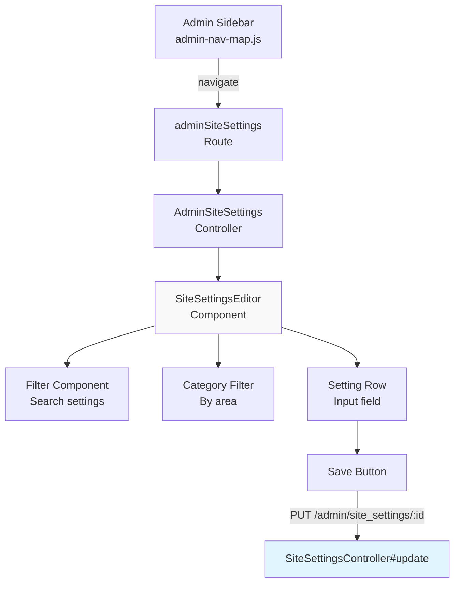
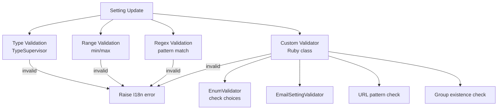
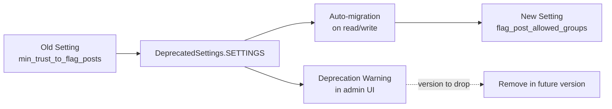

# Configuration and Site Settings

<details>
<summary>Relevant source files</summary>

The following files were used as context for generating this wiki page:

- [app/assets/javascripts/admin/addon/routes/admin-route-map.js](https://github.com/discourse/discourse/blob/8c2d5f9a/app/assets/javascripts/admin/addon/routes/admin-route-map.js)
- [app/assets/javascripts/discourse/app/components/sidebar/filter-no-results.gjs](https://github.com/discourse/discourse/blob/8c2d5f9a/app/assets/javascripts/discourse/app/components/sidebar/filter-no-results.gjs)
- [app/assets/javascripts/discourse/app/components/sidebar/filter.gjs](https://github.com/discourse/discourse/blob/8c2d5f9a/app/assets/javascripts/discourse/app/components/sidebar/filter.gjs)
- [app/assets/javascripts/discourse/app/components/sidebar/panel-header.gjs](https://github.com/discourse/discourse/blob/8c2d5f9a/app/assets/javascripts/discourse/app/components/sidebar/panel-header.gjs)
- [app/assets/javascripts/discourse/app/lib/sidebar/admin-nav-map.js](https://github.com/discourse/discourse/blob/8c2d5f9a/app/assets/javascripts/discourse/app/lib/sidebar/admin-nav-map.js)
- [app/assets/javascripts/discourse/app/lib/sidebar/admin-sidebar.js](https://github.com/discourse/discourse/blob/8c2d5f9a/app/assets/javascripts/discourse/app/lib/sidebar/admin-sidebar.js)
- [app/assets/javascripts/discourse/app/lib/sidebar/base-custom-sidebar-panel.js](https://github.com/discourse/discourse/blob/8c2d5f9a/app/assets/javascripts/discourse/app/lib/sidebar/base-custom-sidebar-panel.js)
- [app/assets/javascripts/discourse/tests/acceptance/admin-sidebar-section-test.js](https://github.com/discourse/discourse/blob/8c2d5f9a/app/assets/javascripts/discourse/tests/acceptance/admin-sidebar-section-test.js)
- [app/assets/stylesheets/common/base/menu-panel.scss](https://github.com/discourse/discourse/blob/8c2d5f9a/app/assets/stylesheets/common/base/menu-panel.scss)
- [app/assets/stylesheets/common/base/sidebar.scss](https://github.com/discourse/discourse/blob/8c2d5f9a/app/assets/stylesheets/common/base/sidebar.scss)
- [app/models/concerns/limited_edit.rb](https://github.com/discourse/discourse/blob/8c2d5f9a/app/models/concerns/limited_edit.rb)
- [app/models/site_setting.rb](https://github.com/discourse/discourse/blob/8c2d5f9a/app/models/site_setting.rb)
- [app/serializers/current_user_serializer.rb](https://github.com/discourse/discourse/blob/8c2d5f9a/app/serializers/current_user_serializer.rb)
- [config/locales/client.en.yml](https://github.com/discourse/discourse/blob/8c2d5f9a/config/locales/client.en.yml)
- [config/locales/server.en.yml](https://github.com/discourse/discourse/blob/8c2d5f9a/config/locales/server.en.yml)
- [config/routes.rb](https://github.com/discourse/discourse/blob/8c2d5f9a/config/routes.rb)
- [config/site_settings.yml](https://github.com/discourse/discourse/blob/8c2d5f9a/config/site_settings.yml)
- [db/migrate/20231212044856_fill_edit_post_allowed_groups_based_on_deprecated_settings.rb](https://github.com/discourse/discourse/blob/8c2d5f9a/db/migrate/20231212044856_fill_edit_post_allowed_groups_based_on_deprecated_settings.rb)
- [lib/guardian.rb](https://github.com/discourse/discourse/blob/8c2d5f9a/lib/guardian.rb)
- [lib/guardian/post_guardian.rb](https://github.com/discourse/discourse/blob/8c2d5f9a/lib/guardian/post_guardian.rb)
- [lib/guardian/topic_guardian.rb](https://github.com/discourse/discourse/blob/8c2d5f9a/lib/guardian/topic_guardian.rb)
- [lib/site_settings/deprecated_settings.rb](https://github.com/discourse/discourse/blob/8c2d5f9a/lib/site_settings/deprecated_settings.rb)
- [spec/fabricators/user_fabricator.rb](https://github.com/discourse/discourse/blob/8c2d5f9a/spec/fabricators/user_fabricator.rb)
- [spec/lib/guardian/post_guardian_spec.rb](https://github.com/discourse/discourse/blob/8c2d5f9a/spec/lib/guardian/post_guardian_spec.rb)
- [spec/lib/guardian/topic_guardian_spec.rb](https://github.com/discourse/discourse/blob/8c2d5f9a/spec/lib/guardian/topic_guardian_spec.rb)
- [spec/lib/guardian_spec.rb](https://github.com/discourse/discourse/blob/8c2d5f9a/spec/lib/guardian_spec.rb)
- [spec/models/site_setting_spec.rb](https://github.com/discourse/discourse/blob/8c2d5f9a/spec/models/site_setting_spec.rb)
- [spec/serializers/current_user_serializer_spec.rb](https://github.com/discourse/discourse/blob/8c2d5f9a/spec/serializers/current_user_serializer_spec.rb)
- [spec/system/admin_sidebar_navigation_spec.rb](https://github.com/discourse/discourse/blob/8c2d5f9a/spec/system/admin_sidebar_navigation_spec.rb)
- [spec/system/page_objects/components/filter.rb](https://github.com/discourse/discourse/blob/8c2d5f9a/spec/system/page_objects/components/filter.rb)
- [spec/system/private_message_spec.rb](https://github.com/discourse/discourse/blob/8c2d5f9a/spec/system/private_message_spec.rb)

</details>


This document describes Discourse's site-wide configuration system, which manages settings that control forum behavior, appearance, and features. For user-specific preferences, see [4.1](#4.1). For theme-specific settings, see [6.1](#6.1).

## Purpose and Scope

The site settings system provides a centralized mechanism for configuring all aspects of a Discourse installation. Settings are defined in YAML, stored in the database, validated on write, and made available to both server-side Ruby code and client-side JavaScript. The system includes:

- YAML-based setting definitions with metadata
- Type system with validation
- Database persistence with caching
- Permission-based access control
- Admin UI for configuration
- Client/server synchronization
- Migration and deprecation handling

---

## System Architecture



**Diagram: Site Settings Architecture**

The system loads setting definitions from YAML files, extends the `SiteSetting` model with dynamic accessors, validates changes through type supervisors and custom validators, persists to PostgreSQL, caches values in memory, and exposes client settings through serialization.

**Sources:** [config/site_settings.yml:1-100](https://github.com/discourse/discourse/blob/8c2d5f9a/config/site_settings.yml#L1-L100), [app/models/site_setting.rb:1-110](https://github.com/discourse/discourse/blob/8c2d5f9a/app/models/site_setting.rb#L1-L110), [lib/site_settings/type_supervisor.rb](https://github.com/discourse/discourse/blob/8c2d5f9a/lib/site_settings/type_supervisor.rb)

---

## Setting Definition Structure

Settings are defined in [config/site_settings.yml]() with metadata that controls their behavior:

```yaml
required:
  title:
    client: true
    default: "Discourse"
    area: "about"
  contact_email:
    default: ""
    type: email
    area: "about|notifications|legal"
    client: true
```

### Setting Metadata Fields

| Field | Purpose | Example |
|-------|---------|---------|
| `default` | Initial value | `"Discourse"` |
| `client` | Expose to JavaScript | `true` |
| `refresh` | Reload page on change | `true` |
| `min` / `max` | Validation bounds | `min: 8` |
| `regex` | Pattern validation | `'^https?:\/\/'` |
| `validator` | Custom validator class | `"EmailSettingValidator"` |
| `type` | Data type override | `email`, `list`, `enum`, `upload` |
| `enum` | Fixed value set | `"TrustLevelSetting"` |
| `secret` | Hide value in logs | `true` |
| `hidden` | Hide from UI | `true` |
| `area` | Categorization | `"about"`, `"security"` |
| `themeable` | Allow theme override | `true` |
| `locale_default` | Locale-specific defaults | `{ ja: '...' }` |

**Sources:** [config/site_settings.yml:1-55](https://github.com/discourse/discourse/blob/8c2d5f9a/config/site_settings.yml#L1-L55)

---

## Setting Types and Type System



**Diagram: Site Settings Type Hierarchy**

### Core Types

**Simple Types:**
- `string` - Text value with optional min/max length
- `integer` - Numeric value with optional min/max bounds
- `bool` - Boolean true/false

**Special Types:**
- `email` - Validated email address
- `username` - Must match existing user
- `enum` - Single value from enumeration class
- `file_size_restriction` - Byte size with validation

**List Types:**
- `list` - Pipe-separated values with choices
- `list_type: simple` - Add/remove UI with reordering
- `list_type: compact` - Tag-like selector
- `emoji_list` - List of emoji names

**Upload Types:**
- `upload` - Single upload ID
- `uploaded_image_list` - List of image upload IDs

**Complex Types:**
- `json_schema` - Structured JSON validated against schema
- `host_list` - Domain names without wildcards
- `category` / `category_list` - Category IDs
- `group` / `group_list` - Group IDs
- `tag_list` / `tag_group_list` - Tag names

**Sources:** [config/site_settings.yml:26-53](https://github.com/discourse/discourse/blob/8c2d5f9a/config/site_settings.yml#L26-L53)

---

## Storage and Persistence



**Diagram: Setting Update Flow**

### Database Schema

The `site_settings` table stores setting values:

```ruby
# Columns:
# - id: integer
# - name: string (unique)
# - data_type: integer (maps to TypeSupervisor type)
# - value: text (serialized based on data_type)
# - created_at: datetime
# - updated_at: datetime
```

### Caching Strategy

Settings are cached aggressively to avoid database lookups:

1. **Load:** YAML definitions are loaded once at boot via `SiteSetting.load_settings()` [app/models/site_setting.rb:92]()
2. **Read:** Values cached in `Rails.cache` with key `site_settings`
3. **Write:** Cache invalidated on update, triggering reload
4. **Refresh:** If `refresh: true`, clients reload via MessageBus

**Sources:** [app/models/site_setting.rb:76-90](https://github.com/discourse/discourse/blob/8c2d5f9a/app/models/site_setting.rb#L76-L90), [lib/site_settings/db_provider.rb](https://github.com/discourse/discourse/blob/8c2d5f9a/lib/site_settings/db_provider.rb)

---

## Access Control and Permissions



**Diagram: Setting Access Control**

### Permission Checks

**View Settings:**
- All settings visible to admins
- Client settings (`client: true`) visible to all users via serialization
- Hidden settings (`hidden: true`) excluded from UI but accessible via code

**Update Settings:**
- Only admins can update settings via [Admin::SiteSettingsController#update]()
- Globally shadowed settings cannot be modified (error: "site_settings_are_shadowed_globally")
- Hidden settings cannot be modified via UI (error: "site_settings_are_hidden")

**Route Protection:**

The admin routes are protected by `AdminConstraint`:

```ruby
resources :site_settings, 
  only: %i[index update], 
  constraints: AdminConstraint.new
```

**Sources:** [config/routes.rb:114-118](https://github.com/discourse/discourse/blob/8c2d5f9a/config/routes.rb#L114-L118), [lib/guardian.rb:123-130](https://github.com/discourse/discourse/blob/8c2d5f9a/lib/guardian.rb#L123-L130), [config/locales/server.en.yml:345-375](https://github.com/discourse/discourse/blob/8c2d5f9a/config/locales/server.en.yml#L345-L375)

---

## Client-Side Access



**Diagram: Client Settings Access**

### Serialization

Client-accessible settings are serialized via `SiteSerializer`:

```javascript
// Settings with client: true are included
{
  "title": "Discourse",
  "logo": "/uploads/default/123/logo.png",
  "login_required": false,
  "min_username_length": 3,
  // ... all client: true settings
}
```

### JavaScript Access

Settings are accessed through the `siteSettings` service:

```javascript
import { service } from "@ember/service";

export default class MyComponent extends Component {
  @service siteSettings;
  
  get showFeature() {
    return this.siteSettings.feature_enabled;
  }
}
```

**Conditional Features:**

Many components check settings to enable/disable features:

```javascript
if (this.siteSettings.enable_user_tips) {
  // Show user tips
}
```

**Sources:** [app/serializers/site_serializer.rb](https://github.com/discourse/discourse/blob/8c2d5f9a/app/serializers/site_serializer.rb), [app/assets/javascripts/discourse/app/services/site-settings.js](https://github.com/discourse/discourse/blob/8c2d5f9a/app/assets/javascripts/discourse/app/services/site-settings.js)

---

## Admin Interface



**Diagram: Admin Settings UI Flow**

### Settings Navigation

The admin sidebar includes a "Site Settings" link:

```javascript
{
  name: "admin_all_site_settings",
  route: "adminSiteSettings",
  label: "admin.config.site_settings.title",
  description: "admin.config.site_settings.header_description",
  icon: "gear",
}
```

**Sources:** [app/assets/javascripts/discourse/app/lib/sidebar/admin-nav-map.js:32-37](https://github.com/discourse/discourse/blob/8c2d5f9a/app/assets/javascripts/discourse/app/lib/sidebar/admin-nav-map.js#L32-L37)

### Setting Categories and Areas

Settings are organized into areas defined in `VALID_AREAS`:

```ruby
VALID_AREAS = %w[
  about analytics badges categories_and_tags
  email embedding emojis experimental flags
  fonts group_permissions interface legal
  localization navigation notifications permalinks
  reports posts_and_topics user_defaults sharing
  site_admin stats_and_thresholds trust_levels users
]
```

The admin interface uses these areas for navigation:

- **About** - Site identity and contact info
- **Security** - Login, 2FA, rate limits
- **Content** - Posts, topics, categories, tags
- **Appearance** - Themes, colors, logos, fonts
- **Email** - SMTP, templates, notifications
- **Users** - Registration, trust levels, permissions

**Sources:** [app/models/site_setting.rb:4-30](https://github.com/discourse/discourse/blob/8c2d5f9a/app/models/site_setting.rb#L4-L30)

### Setting UI Routes

```ruby
# Main settings page
GET /admin/site_settings

# Category-specific settings
GET /admin/site_settings/category/:category_id

# Update setting
PUT /admin/site_settings/:id
```

**Sources:** [config/routes.rb:114-118](https://github.com/discourse/discourse/blob/8c2d5f9a/config/routes.rb#L114-L118), [app/assets/javascripts/admin/addon/routes/admin-route-map.js:20-28](https://github.com/discourse/discourse/blob/8c2d5f9a/app/assets/javascripts/admin/addon/routes/admin-route-map.js#L20-L28)

---

## Validation System



**Diagram: Validation Pipeline**

### Built-in Validation

**Type-based:**
```yaml
min_password_length:
  default: 10
  min: 8
  max: 500
```

**Regex-based:**
```yaml
ga_universal_tracking_code:
  regex: "^(UA|G)-[\\w-]+"
```

**Enum-based:**
```yaml
top_page_default_timeframe:
  type: enum
  choices:
    - all
    - yearly
    - quarterly
```

### Custom Validators

Settings can specify custom validator classes:

```yaml
unicode_usernames:
  validator: "UnicodeUsernameValidator"
```

Validators implement validation logic:

```ruby
class UnicodeUsernameValidator
  def initialize(opts = {})
    @opts = opts
  end

  def valid_value?(val)
    # Custom validation logic
  end

  def error_message
    I18n.t("site_settings.errors.invalid_unicode_usernames")
  end
end
```

**Common Validators:**
- `EmailSettingValidator` - Email format validation
- `EnableSsoValidator` - SSO configuration checks
- `AllowedEmailDomainsValidator` - Domain whitelist validation
- `MaxUsernameLengthValidator` - Username length constraints

**Sources:** [config/site_settings.yml:789-839](https://github.com/discourse/discourse/blob/8c2d5f9a/config/site_settings.yml#L789-L839), [lib/validators/](https://github.com/discourse/discourse/blob/8c2d5f9a/lib/validators/)

---

## Setting Categories and Organization

The admin interface organizes settings into logical categories:

| Category | Route | Settings Area | Example Settings |
|----------|-------|---------------|------------------|
| Dashboard | `admin.dashboard` | - | Site overview |
| About | `adminConfig.about` | `about` | `title`, `site_description` |
| Security | `adminConfig.security` | `security` | `min_password_length` |
| Login | `adminConfig.loginAndAuthentication` | `login` | `enable_local_logins` |
| Users | `adminConfig.userDefaults` | `users` | `min_username_length` |
| Content | `adminConfig.content` | `posts_and_topics` | `max_post_length` |
| Interface | `adminConfig.interface` | `interface` | `top_menu` |
| Email | `adminEmail` | `email` | `notification_email` |

### Area-based Filtering

Settings use the `area` metadata for categorization:

```yaml
contact_email:
  area: "about|notifications|legal"  # Multiple areas
  
min_password_length:
  area: "users"  # Single area
```

**Sources:** [app/assets/javascripts/discourse/app/lib/sidebar/admin-nav-map.js:76-214](https://github.com/discourse/discourse/blob/8c2d5f9a/app/assets/javascripts/discourse/app/lib/sidebar/admin-nav-map.js#L76-L214)

---

## Migration and Deprecation



**Diagram: Setting Deprecation Flow**

### Deprecation Handling

Deprecated settings are defined in `DeprecatedSettings::SETTINGS`:

```ruby
SETTINGS = [
  # [<old setting>, <new_setting>, <override>, <version to drop>]
  ["min_trust_to_flag_posts", "flag_post_allowed_groups", false, "3.3"],
  ["approve_unless_trust_level", "approve_unless_allowed_groups", false, "3.3"],
  # ...
]
```

### Migration Process

When a deprecated setting is accessed:

1. **Read:** Return value from new setting if old setting not explicitly set
2. **Write:** Set new setting value, show deprecation warning
3. **UI:** Display migration notice to admins
4. **Removal:** After version specified, old setting is removed entirely

**Admin Warning Message:**

```
The following settings are deprecated: min_trust_to_flag_posts. 
Use flag_post_allowed_groups instead
```

**Sources:** [lib/site_settings/deprecated_settings.rb:1-100](https://github.com/discourse/discourse/blob/8c2d5f9a/lib/site_settings/deprecated_settings.rb#L1-L100), [config/locales/server.en.yml:348](https://github.com/discourse/discourse/blob/8c2d5f9a/config/locales/server.en.yml#L348)

---

## Plugin Integration

Plugins can register custom settings:

```ruby
# In plugin.rb
enabled_site_setting :my_plugin_enabled

# Register settings
register_site_setting_extension(:my_setting) do
  {
    default: false,
    client: true,
    type: :bool
  }
end
```

**Plugin Settings File:**

Plugins define settings in `config/settings.yml`:

```yaml
plugins:
  my_plugin_enabled:
    default: false
    client: true
  my_plugin_api_key:
    default: ""
    secret: true
```

These settings appear in the admin UI under the plugin's section.

**Sources:** [lib/plugin/instance.rb](https://github.com/discourse/discourse/blob/8c2d5f9a/lib/plugin/instance.rb), Plugin API documentation

---

## Common Patterns

### Feature Flags

```yaml
enable_user_tips:
  client: true
  default: false
  refresh: true
```

Check in code:
```ruby
if SiteSetting.enable_user_tips
  # Feature enabled
end
```

### Group-based Permissions

```yaml
flag_post_allowed_groups:
  type: group_list
  default: "10|11|12|13|14"  # Auto groups
  allow_any: false
  refresh: true
```

### Upload Settings

```yaml
logo:
  default: -5  # References seeded upload
  client: true
  type: upload
```

Uploads create `UploadReference` records on save [app/models/site_setting.rb:81-90]()

### Locale-specific Defaults

```yaml
allowed_unicode_username_characters:
  locale_default:
    ja: '[\p{Han}\p{Katakana}\p{Hiragana}ー]'
    ko: '\p{Hangul}'
    zh_CN: '\p{Han}'
```

**Sources:** [config/site_settings.yml:166-1000](https://github.com/discourse/discourse/blob/8c2d5f9a/config/site_settings.yml#L166-L1000)

---

## Key Classes and Files

| Component | Location | Purpose |
|-----------|----------|---------|
| Setting Definitions | [config/site_settings.yml]() | YAML metadata for all settings |
| Model | [app/models/site_setting.rb]() | ActiveRecord model with extensions |
| Extension | [lib/site_setting_extension.rb]() | Dynamic accessor generation |
| Type System | [lib/site_settings/type_supervisor.rb]() | Type validation and conversion |
| Controller | [app/controllers/admin/site_settings_controller.rb]() | Admin update API |
| Serializer | [app/serializers/site_serializer.rb]() | Client settings exposure |
| Deprecation | [lib/site_settings/deprecated_settings.rb:1-50]() | Migration mappings |
| Validators | [lib/validators/]() | Custom validation classes |
| Admin UI | [app/assets/javascripts/admin/addon/routes/admin-site-settings-route.js]() | Settings interface |