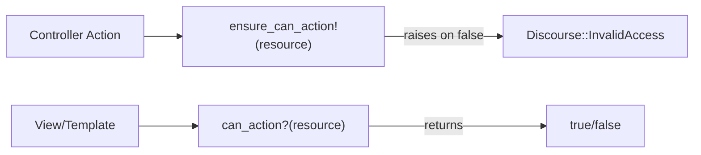
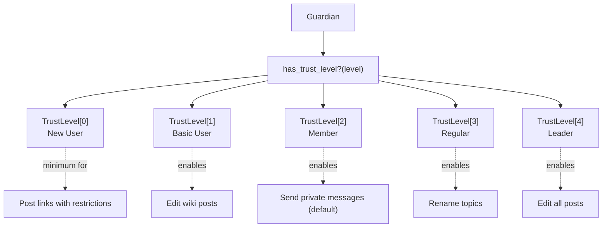
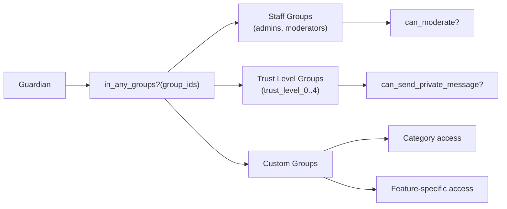
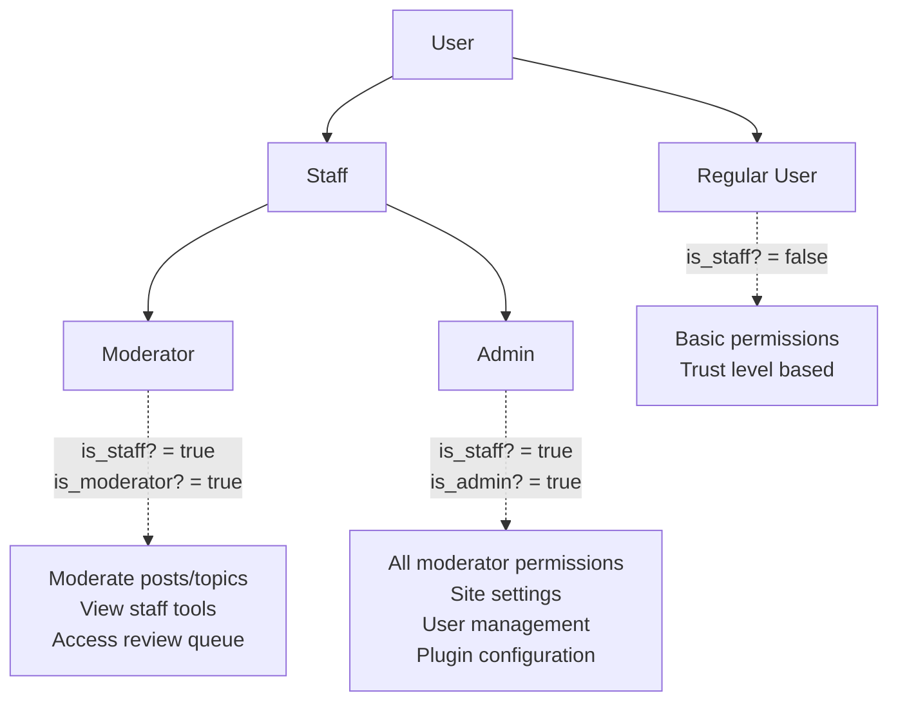
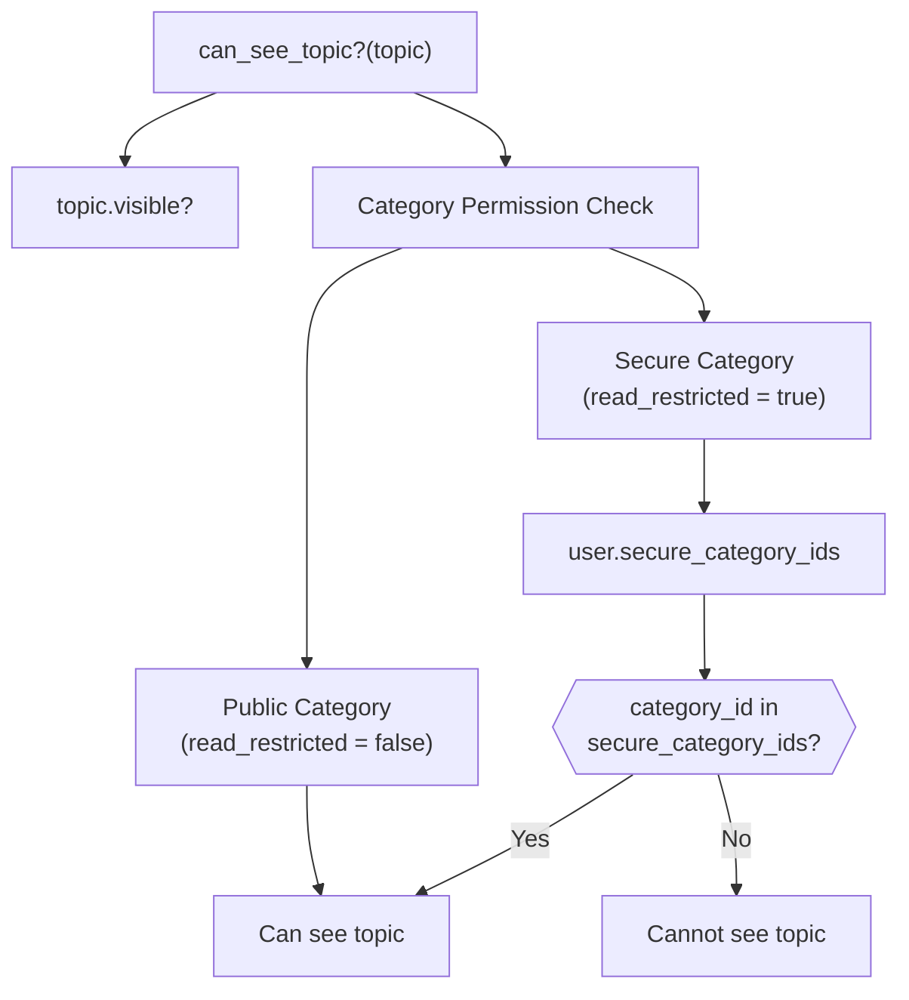
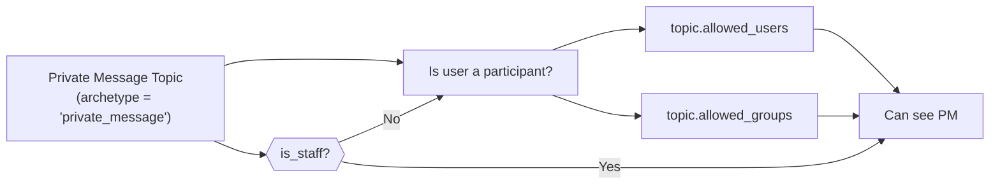
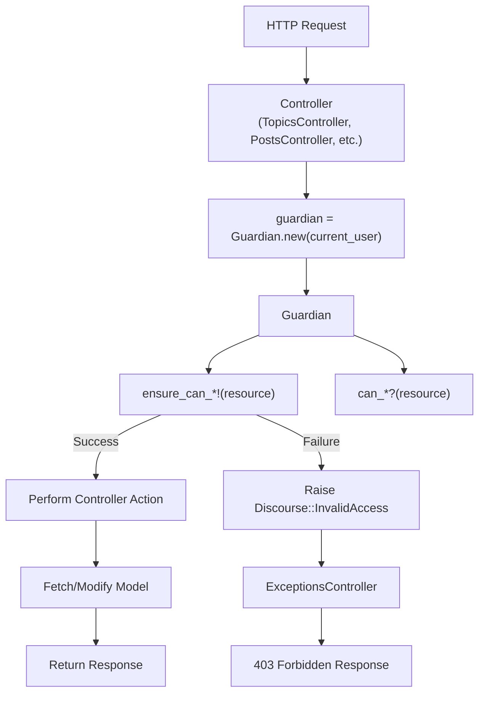
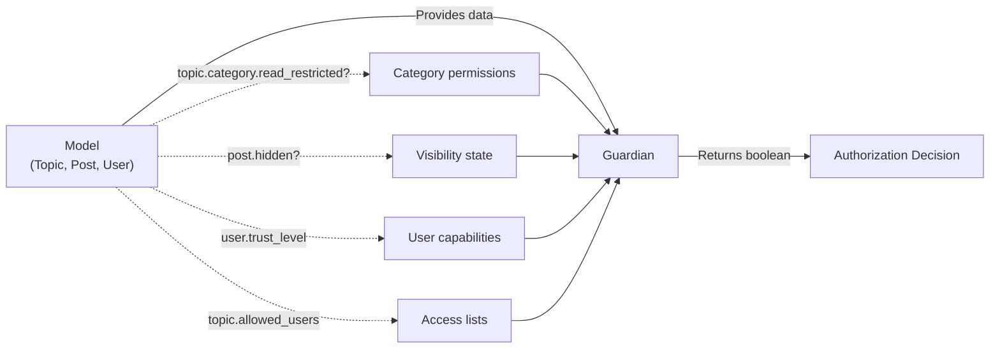
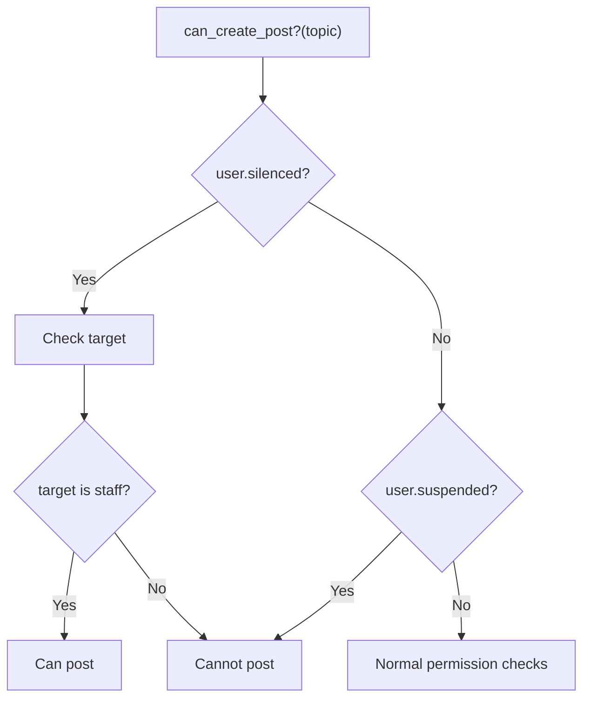

# Authorization System (Guardian)

<details>
<summary>Relevant source files</summary>

The following files were used as context for generating this wiki page:

- [app/assets/javascripts/admin/addon/routes/admin-route-map.js](https://github.com/discourse/discourse/blob/8c2d5f9a/app/assets/javascripts/admin/addon/routes/admin-route-map.js)
- [app/assets/javascripts/discourse/app/components/sidebar/filter-no-results.gjs](https://github.com/discourse/discourse/blob/8c2d5f9a/app/assets/javascripts/discourse/app/components/sidebar/filter-no-results.gjs)
- [app/assets/javascripts/discourse/app/components/sidebar/filter.gjs](https://github.com/discourse/discourse/blob/8c2d5f9a/app/assets/javascripts/discourse/app/components/sidebar/filter.gjs)
- [app/assets/javascripts/discourse/app/components/sidebar/panel-header.gjs](https://github.com/discourse/discourse/blob/8c2d5f9a/app/assets/javascripts/discourse/app/components/sidebar/panel-header.gjs)
- [app/assets/javascripts/discourse/app/lib/sidebar/admin-nav-map.js](https://github.com/discourse/discourse/blob/8c2d5f9a/app/assets/javascripts/discourse/app/lib/sidebar/admin-nav-map.js)
- [app/assets/javascripts/discourse/app/lib/sidebar/admin-sidebar.js](https://github.com/discourse/discourse/blob/8c2d5f9a/app/assets/javascripts/discourse/app/lib/sidebar/admin-sidebar.js)
- [app/assets/javascripts/discourse/app/lib/sidebar/base-custom-sidebar-panel.js](https://github.com/discourse/discourse/blob/8c2d5f9a/app/assets/javascripts/discourse/app/lib/sidebar/base-custom-sidebar-panel.js)
- [app/assets/javascripts/discourse/tests/acceptance/admin-sidebar-section-test.js](https://github.com/discourse/discourse/blob/8c2d5f9a/app/assets/javascripts/discourse/tests/acceptance/admin-sidebar-section-test.js)
- [app/assets/stylesheets/common/base/menu-panel.scss](https://github.com/discourse/discourse/blob/8c2d5f9a/app/assets/stylesheets/common/base/menu-panel.scss)
- [app/assets/stylesheets/common/base/sidebar.scss](https://github.com/discourse/discourse/blob/8c2d5f9a/app/assets/stylesheets/common/base/sidebar.scss)
- [app/controllers/posts_controller.rb](https://github.com/discourse/discourse/blob/8c2d5f9a/app/controllers/posts_controller.rb)
- [app/controllers/topics_controller.rb](https://github.com/discourse/discourse/blob/8c2d5f9a/app/controllers/topics_controller.rb)
- [app/models/concerns/limited_edit.rb](https://github.com/discourse/discourse/blob/8c2d5f9a/app/models/concerns/limited_edit.rb)
- [app/models/email_style.rb](https://github.com/discourse/discourse/blob/8c2d5f9a/app/models/email_style.rb)
- [app/models/post.rb](https://github.com/discourse/discourse/blob/8c2d5f9a/app/models/post.rb)
- [app/models/site_setting.rb](https://github.com/discourse/discourse/blob/8c2d5f9a/app/models/site_setting.rb)
- [app/models/topic.rb](https://github.com/discourse/discourse/blob/8c2d5f9a/app/models/topic.rb)
- [app/serializers/current_user_serializer.rb](https://github.com/discourse/discourse/blob/8c2d5f9a/app/serializers/current_user_serializer.rb)
- [app/serializers/user_post_bookmark_serializer.rb](https://github.com/discourse/discourse/blob/8c2d5f9a/app/serializers/user_post_bookmark_serializer.rb)
- [app/services/destroy_task.rb](https://github.com/discourse/discourse/blob/8c2d5f9a/app/services/destroy_task.rb)
- [app/services/user_destroyer.rb](https://github.com/discourse/discourse/blob/8c2d5f9a/app/services/user_destroyer.rb)
- [config/locales/client.en.yml](https://github.com/discourse/discourse/blob/8c2d5f9a/config/locales/client.en.yml)
- [config/locales/server.en.yml](https://github.com/discourse/discourse/blob/8c2d5f9a/config/locales/server.en.yml)
- [config/routes.rb](https://github.com/discourse/discourse/blob/8c2d5f9a/config/routes.rb)
- [config/site_settings.yml](https://github.com/discourse/discourse/blob/8c2d5f9a/config/site_settings.yml)
- [db/migrate/20231212044856_fill_edit_post_allowed_groups_based_on_deprecated_settings.rb](https://github.com/discourse/discourse/blob/8c2d5f9a/db/migrate/20231212044856_fill_edit_post_allowed_groups_based_on_deprecated_settings.rb)
- [lib/guardian.rb](https://github.com/discourse/discourse/blob/8c2d5f9a/lib/guardian.rb)
- [lib/guardian/post_guardian.rb](https://github.com/discourse/discourse/blob/8c2d5f9a/lib/guardian/post_guardian.rb)
- [lib/guardian/topic_guardian.rb](https://github.com/discourse/discourse/blob/8c2d5f9a/lib/guardian/topic_guardian.rb)
- [lib/has_errors.rb](https://github.com/discourse/discourse/blob/8c2d5f9a/lib/has_errors.rb)
- [lib/import_export/base_exporter.rb](https://github.com/discourse/discourse/blob/8c2d5f9a/lib/import_export/base_exporter.rb)
- [lib/post_creator.rb](https://github.com/discourse/discourse/blob/8c2d5f9a/lib/post_creator.rb)
- [lib/post_destroyer.rb](https://github.com/discourse/discourse/blob/8c2d5f9a/lib/post_destroyer.rb)
- [lib/post_revisor.rb](https://github.com/discourse/discourse/blob/8c2d5f9a/lib/post_revisor.rb)
- [lib/site_settings/deprecated_settings.rb](https://github.com/discourse/discourse/blob/8c2d5f9a/lib/site_settings/deprecated_settings.rb)
- [lib/tasks/destroy.rake](https://github.com/discourse/discourse/blob/8c2d5f9a/lib/tasks/destroy.rake)
- [lib/topic_creator.rb](https://github.com/discourse/discourse/blob/8c2d5f9a/lib/topic_creator.rb)
- [plugins/chat/app/serializers/chat/user_message_bookmark_serializer.rb](https://github.com/discourse/discourse/blob/8c2d5f9a/plugins/chat/app/serializers/chat/user_message_bookmark_serializer.rb)
- [spec/fabricators/user_fabricator.rb](https://github.com/discourse/discourse/blob/8c2d5f9a/spec/fabricators/user_fabricator.rb)
- [spec/lib/guardian/post_guardian_spec.rb](https://github.com/discourse/discourse/blob/8c2d5f9a/spec/lib/guardian/post_guardian_spec.rb)
- [spec/lib/guardian/topic_guardian_spec.rb](https://github.com/discourse/discourse/blob/8c2d5f9a/spec/lib/guardian/topic_guardian_spec.rb)
- [spec/lib/guardian_spec.rb](https://github.com/discourse/discourse/blob/8c2d5f9a/spec/lib/guardian_spec.rb)
- [spec/lib/post_creator_spec.rb](https://github.com/discourse/discourse/blob/8c2d5f9a/spec/lib/post_creator_spec.rb)
- [spec/lib/post_destroyer_spec.rb](https://github.com/discourse/discourse/blob/8c2d5f9a/spec/lib/post_destroyer_spec.rb)
- [spec/lib/post_revisor_spec.rb](https://github.com/discourse/discourse/blob/8c2d5f9a/spec/lib/post_revisor_spec.rb)
- [spec/lib/topic_creator_spec.rb](https://github.com/discourse/discourse/blob/8c2d5f9a/spec/lib/topic_creator_spec.rb)
- [spec/models/post_spec.rb](https://github.com/discourse/discourse/blob/8c2d5f9a/spec/models/post_spec.rb)
- [spec/models/site_setting_spec.rb](https://github.com/discourse/discourse/blob/8c2d5f9a/spec/models/site_setting_spec.rb)
- [spec/models/topic_spec.rb](https://github.com/discourse/discourse/blob/8c2d5f9a/spec/models/topic_spec.rb)
- [spec/requests/posts_controller_spec.rb](https://github.com/discourse/discourse/blob/8c2d5f9a/spec/requests/posts_controller_spec.rb)
- [spec/requests/topics_controller_spec.rb](https://github.com/discourse/discourse/blob/8c2d5f9a/spec/requests/topics_controller_spec.rb)
- [spec/serializers/current_user_serializer_spec.rb](https://github.com/discourse/discourse/blob/8c2d5f9a/spec/serializers/current_user_serializer_spec.rb)
- [spec/serializers/topic_view_details_serializer_spec.rb](https://github.com/discourse/discourse/blob/8c2d5f9a/spec/serializers/topic_view_details_serializer_spec.rb)
- [spec/services/destroy_task_spec.rb](https://github.com/discourse/discourse/blob/8c2d5f9a/spec/services/destroy_task_spec.rb)
- [spec/services/user_destroyer_spec.rb](https://github.com/discourse/discourse/blob/8c2d5f9a/spec/services/user_destroyer_spec.rb)
- [spec/system/admin_sidebar_navigation_spec.rb](https://github.com/discourse/discourse/blob/8c2d5f9a/spec/system/admin_sidebar_navigation_spec.rb)
- [spec/system/page_objects/components/filter.rb](https://github.com/discourse/discourse/blob/8c2d5f9a/spec/system/page_objects/components/filter.rb)
- [spec/system/private_message_spec.rb](https://github.com/discourse/discourse/blob/8c2d5f9a/spec/system/private_message_spec.rb)
- [spec/tasks/destroy_spec.rb](https://github.com/discourse/discourse/blob/8c2d5f9a/spec/tasks/destroy_spec.rb)

</details>


## Purpose and Scope

The Guardian system is Discourse's centralized authorization layer responsible for determining whether a user can perform specific actions on resources throughout the application. This document covers the Guardian class architecture, permission checking mechanisms, and integration with the rest of the application. For information about user authentication and session management, see [4.1](#4.1). For role-based configurations, see [3.2](#3.2).

---

## Overview

The Guardian implements a policy-based authorization system where all permission checks are centralized in a single class hierarchy. Rather than scattering permission logic throughout models and controllers, Guardian provides a consistent interface for asking questions like "can this user edit this post?" or "can this user see this topic?".

**Key Characteristics:**
- **User-centric**: Each Guardian instance is bound to a specific user (or `AnonymousUser`)
- **Policy-based**: Uses methods like `can_edit?(post)` and `can_see?(topic)` 
- **Modular**: Split into domain-specific mixins (PostGuardian, TopicGuardian, etc.)
- **Fail-fast**: Provides `ensure_can_*!` methods that raise exceptions on authorization failure

Sources: [lib/guardian.rb:1-801](https://github.com/discourse/discourse/blob/8c2d5f9a/lib/guardian.rb#L1-L801), [lib/guardian/post_guardian.rb:1-441](https://github.com/discourse/discourse/blob/8c2d5f9a/lib/guardian/post_guardian.rb#L1-L441), [lib/guardian/topic_guardian.rb:1-443](https://github.com/discourse/discourse/blob/8c2d5f9a/lib/guardian/topic_guardian.rb#L1-L443)

---

## Class Architecture

### Guardian Class Structure

```mermaid
graph TB
    Guardian["Guardian<br/>(lib/guardian.rb)"]
    
    Guardian --> BookmarkGuardian["BookmarkGuardian"]
    Guardian --> CategoryGuardian["CategoryGuardian"]
    Guardian --> EnsureMagic["EnsureMagic"]
    Guardian --> FlagGuardian["FlagGuardian"]
    Guardian --> GroupGuardian["GroupGuardian"]
    Guardian --> InviteGuardian["InviteGuardian"]
    Guardian --> PostGuardian["PostGuardian<br/>(lib/guardian/post_guardian.rb)"]
    Guardian --> PostRevisionGuardian["PostRevisionGuardian"]
    Guardian --> LocalizationGuardian["LocalizationGuardian"]
    Guardian --> SidebarGuardian["SidebarGuardian"]
    Guardian --> TagGuardian["TagGuardian"]
    Guardian --> TopicGuardian["TopicGuardian<br/>(lib/guardian/topic_guardian.rb)"]
    Guardian --> UserGuardian["UserGuardian"]
    
    Guardian -.-> AnonymousUser["AnonymousUser<br/>(for unauthenticated)"]
    
    PostGuardian --> can_create_post["can_create_post?"]
    PostGuardian --> can_edit["can_edit?"]
    PostGuardian --> can_delete["can_delete?"]
    PostGuardian --> can_see["can_see?"]
    
    TopicGuardian --> can_see_topic["can_see_topic?"]
    TopicGuardian --> can_edit_topic["can_edit_topic?"]
    TopicGuardian --> can_create_topic["can_create?"]
    
    EnsureMagic --> ensure_can_see["ensure_can_see!"]
    EnsureMagic --> ensure_can_edit["ensure_can_edit!"]
```



Sources: [lib/guardian.rb:1-32](https://github.com/discourse/discourse/blob/8c2d5f9a/lib/guardian.rb#L1-L32), [lib/guardian.rb:103-114](https://github.com/discourse/discourse/blob/8c2d5f9a/lib/guardian.rb#L103-L114)

### AnonymousUser for Unauthenticated Access

The `AnonymousUser` class provides a null-object pattern for unauthenticated users, returning safe defaults for all permission checks:

| Method | Return Value |
|--------|--------------|
| `admin?` | `false` |
| `staff?` | `false` |
| `moderator?` | `false` |
| `anonymous?` | `true` |
| `approved?` | `false` |
| `staged?` | `false` |
| `silenced?` | `false` |
| `secure_category_ids` | `[]` |
| `groups` | `[]` |

Sources: [lib/guardian.rb:33-101](https://github.com/discourse/discourse/blob/8c2d5f9a/lib/guardian.rb#L33-L101)

---

## Permission Checking Patterns

### Standard Permission Check Methods

Guardian uses a consistent naming convention for permission checks:



**Method Types:**

1. **Query Methods** (`can_*?`): Return boolean, safe for conditionals
2. **Enforcement Methods** (`ensure_can_*!`): Raise `Discourse::InvalidAccess` if unauthorized
3. **Helper Methods** (`is_staff?`, `is_admin?`, etc.): Common checks

Sources: [lib/guardian/ensure_magic.rb](https://github.com/discourse/discourse/blob/8c2d5f9a/lib/guardian/ensure_magic.rb) referenced in [lib/guardian.rb:21](https://github.com/discourse/discourse/blob/8c2d5f9a/lib/guardian.rb#L21)

### Common Permission Patterns

#### Post Permissions

```
can_see?(post)           # Can user view the post?
can_edit?(post)          # Can user modify the post?
can_delete?(post)        # Can user delete the post?
can_recover_post?(post)  # Can user undelete the post?
can_wiki?(post)          # Can user convert to wiki?
```

Sources: [lib/guardian/post_guardian.rb:25-441](https://github.com/discourse/discourse/blob/8c2d5f9a/lib/guardian/post_guardian.rb#L25-L441)

#### Topic Permissions

```
can_see_topic?(topic)         # Can user view the topic?
can_edit_topic?(topic)        # Can user modify topic metadata?
can_create?(klass, parent)    # Can user create new topic/post?
can_moderate_topic?(topic)    # Can user perform moderation actions?
```

Sources: [lib/guardian/topic_guardian.rb:1-443](https://github.com/discourse/discourse/blob/8c2d5f9a/lib/guardian/topic_guardian.rb#L1-L443)

---

## Authorization Flow in Request Lifecycle

### Typical Request Authorization

```mermaid
sequenceDiagram
    participant Client
    participant Controller["Controller<br/>(e.g., TopicsController)"]
    participant Guardian
    participant Topic
    participant User
    
    Client->>Controller: GET /t/:id
    Controller->>Controller: guardian = Guardian.new(current_user)
    Controller->>Guardian: ensure_can_see!(topic)
    Guardian->>User: Check user.admin?
    Guardian->>User: Check user.groups
    Guardian->>User: Check user.trust_level
    Guardian->>Topic: Check topic.category.read_restricted?
    Guardian->>Topic: Check topic.visible?
    
    alt Authorized
        Guardian-->>Controller: (no exception)
        Controller->>Topic: fetch topic data
        Controller-->>Client: 200 OK with topic
    else Unauthorized
        Guardian-->>Controller: raise Discourse::InvalidAccess
        Controller-->>Client: 403 Forbidden
    end
```

Sources: [app/controllers/topics_controller.rb:36-104](https://github.com/discourse/discourse/blob/8c2d5f9a/app/controllers/topics_controller.rb#L36-L104), [lib/guardian/topic_guardian.rb:1-443](https://github.com/discourse/discourse/blob/8c2d5f9a/lib/guardian/topic_guardian.rb#L1-L443)

### Guardian Instantiation in Controllers

Controllers instantiate Guardian via the `guardian` helper method:

```ruby
# ApplicationController provides guardian helper
def guardian
  @guardian ||= Guardian.new(current_user)
end
```

Usage in controllers:
```ruby
# TopicsController#show
guardian.ensure_can_see!(topic)

# PostsController#update  
guardian.ensure_can_edit!(post)

# TopicsController#destroy
guardian.ensure_can_delete!(topic)
```

Sources: [app/controllers/topics_controller.rb:40-42](https://github.com/discourse/discourse/blob/8c2d5f9a/app/controllers/topics_controller.rb#L40-L42), [app/controllers/posts_controller.rb:1-1041](https://github.com/discourse/discourse/blob/8c2d5f9a/app/controllers/posts_controller.rb#L1-L1041)

---

## Trust Levels and Group-Based Authorization

### Trust Level Hierarchy

Discourse uses a 0-4 trust level system that Guardian leverages for permission checks:

| Trust Level | Name | Typical Permissions |
|-------------|------|---------------------|
| 0 | New User | Basic read/write, restricted links |
| 1 | Basic User | Can edit wiki posts, more replies |
| 2 | Member | Can invite users, recategorize topics |
| 3 | Regular | Can rename topics, vote on polls |
| 4 | Leader | Can edit all posts, move topics |



Sources: [lib/guardian.rb:103-152](https://github.com/discourse/discourse/blob/8c2d5f9a/lib/guardian.rb#L103-L152), [spec/lib/guardian_spec.rb:17-24](https://github.com/discourse/discourse/blob/8c2d5f9a/spec/lib/guardian_spec.rb#L17-L24), [config/site_settings.yml:925-927](https://github.com/discourse/discourse/blob/8c2d5f9a/config/site_settings.yml#L925-L927)

### Group-Based Permissions

Guardian checks group membership for various actions:



**Common Group-Based Checks:**

| Setting | Guardian Check | Default Groups |
|---------|----------------|----------------|
| `personal_message_enabled_groups` | `can_send_private_message?` | trust_level_1 |
| `whispers_allowed_groups` | `can_whisper?` | staff |
| `anonymous_posting_allowed_groups` | `can_post_anonymously?` | trust_level_1 |
| `post_links_allowed_groups` | `unrestricted_link_posting?` | trust_level_3 |

Sources: [lib/guardian/post_guardian.rb:5-23](https://github.com/discourse/discourse/blob/8c2d5f9a/lib/guardian/post_guardian.rb#L5-L23), [spec/lib/guardian_spec.rb:66-138](https://github.com/discourse/discourse/blob/8c2d5f9a/spec/lib/guardian_spec.rb#L66-L138), [config/site_settings.yml:420-436](https://github.com/discourse/discourse/blob/8c2d5f9a/config/site_settings.yml#L420-L436), [config/site_settings.yml:929-935](https://github.com/discourse/discourse/blob/8c2d5f9a/config/site_settings.yml#L929-L935)

---

## Staff and Administrative Permissions

### Staff Hierarchy



**Key Staff Checks:**

```ruby
# Basic staff check
def is_staff?
  @user && (@user.admin? || @user.moderator?)
end

# Admin-only check  
def is_admin?
  @user && @user.admin?
end

# Moderator-only check
def is_moderator?
  @user && @user.moderator?
end
```

Sources: [lib/guardian.rb:117-127](https://github.com/discourse/discourse/blob/8c2d5f9a/lib/guardian.rb#L117-L127), [spec/lib/guardian_spec.rb:4-23](https://github.com/discourse/discourse/blob/8c2d5f9a/spec/lib/guardian_spec.rb#L4-L23)

### Staff-Only Actions

Many Guardian methods short-circuit to `true` for staff:

```ruby
# Example from PostGuardian
def can_edit?(post)
  return true if is_staff?
  # ... other checks
end

def can_see_post?(post)
  return true if is_staff?
  # ... visibility checks
end
```

Sources: [lib/guardian/post_guardian.rb:25-441](https://github.com/discourse/discourse/blob/8c2d5f9a/lib/guardian/post_guardian.rb#L25-L441)

---

## Category and Topic Visibility

### Secure Categories

Guardian enforces category-level permissions through `secure_category_ids`:



**Implementation:**

```ruby
def secure_category_ids
  @secure_category_ids ||= @user&.secure_category_ids || []
end

def can_see_category?(category)
  return false unless category
  return true unless category.read_restricted?
  secure_category_ids.include?(category.id)
end
```

Sources: [lib/guardian.rb:153-161](https://github.com/discourse/discourse/blob/8c2d5f9a/lib/guardian.rb#L153-L161), [lib/guardian/topic_guardian.rb:1-443](https://github.com/discourse/discourse/blob/8c2d5f9a/lib/guardian/topic_guardian.rb#L1-L443)

### Private Messages (Personal Messages)

Private message visibility follows different rules:



Sources: [lib/guardian/topic_guardian.rb:1-443](https://github.com/discourse/discourse/blob/8c2d5f9a/lib/guardian/topic_guardian.rb#L1-L443), [app/models/topic.rb:1-2541](https://github.com/discourse/discourse/blob/8c2d5f9a/app/models/topic.rb#L1-L2541)

---

## Integration with Models and Controllers

### Controller Integration Pattern



**Example Usage:**

| Controller | Method | Guardian Check | Line Reference |
|------------|--------|----------------|----------------|
| `TopicsController` | `show` | `guardian.ensure_can_see!(topic)` | [app/controllers/topics_controller.rb:36-42]() |
| `PostsController` | `update` | `guardian.ensure_can_edit!(post)` | [app/controllers/posts_controller.rb]() |
| `TopicsController` | `destroy` | `guardian.ensure_can_delete!(topic)` | [app/controllers/topics_controller.rb]() |
| `TopicsController` | `invite` | `guardian.ensure_can_invite_to!(topic, user)` | [app/controllers/topics_controller.rb]() |

Sources: [app/controllers/topics_controller.rb:1-1515](https://github.com/discourse/discourse/blob/8c2d5f9a/app/controllers/topics_controller.rb#L1-L1515), [app/controllers/posts_controller.rb:1-1041](https://github.com/discourse/discourse/blob/8c2d5f9a/app/controllers/posts_controller.rb#L1-L1041)

### Model-Guardian Interaction

Models themselves are permission-agnostic. They don't enforce authorization but provide data that Guardian uses:



Sources: [app/models/post.rb:1-1646](https://github.com/discourse/discourse/blob/8c2d5f9a/app/models/post.rb#L1-L1646), [app/models/topic.rb:1-2541](https://github.com/discourse/discourse/blob/8c2d5f9a/app/models/topic.rb#L1-L2541), [lib/guardian/topic_guardian.rb:1-443](https://github.com/discourse/discourse/blob/8c2d5f9a/lib/guardian/topic_guardian.rb#L1-L443)

---

## Special Permission Cases

### Editing Windows and Time-Based Restrictions

Guardian enforces time-based editing restrictions:

```ruby
def can_edit_post?(post)
  return true if is_staff?
  return false if post.hidden? && !post.user == @user
  
  # Time-based restriction
  if post.created_at > SiteSetting.post_edit_time_limit.minutes.ago
    return false unless @user == post.user
  end
  
  # Wiki posts have special rules
  return true if post.wiki? && has_trust_level?(TrustLevel[1])
  
  # Regular posts can only be edited by author
  @user == post.user
end
```

**Key Settings:**

| Setting | Purpose | Default |
|---------|---------|---------|
| `post_edit_time_limit` | Minutes users can edit their posts | 86400 (60 days) |
| `min_trust_to_edit_wiki_post` | Trust level required to edit wiki | 1 |

Sources: [lib/guardian/post_guardian.rb:25-441](https://github.com/discourse/discourse/blob/8c2d5f9a/lib/guardian/post_guardian.rb#L25-L441), [config/site_settings.yml:1-5200](https://github.com/discourse/discourse/blob/8c2d5f9a/config/site_settings.yml#L1-L5200)

### Silenced and Suspended Users

Guardian restricts actions for punished users:



Sources: [spec/lib/guardian_spec.rb:66-173](https://github.com/discourse/discourse/blob/8c2d5f9a/spec/lib/guardian_spec.rb#L66-L173)

---

## Plugin Extension Points

Guardian can be extended by plugins using modifiers:

```ruby
# Plugin registration
DiscoursePluginRegistry.register_modifier(
  plugin,
  :guardian_can_send_private_message,
  &block
)

# In Guardian
def can_send_private_message?(target)
  # ... base checks ...
  
  DiscoursePluginRegistry.apply_modifier(
    :guardian_can_send_private_message,
    result,
    self,
    target
  )
end
```

**Common Plugin Modifiers:**

| Modifier | Purpose | Example Use Case |
|----------|---------|------------------|
| `:guardian_can_send_private_message` | Control PM sending | Restrict PMs based on custom criteria |
| `:guardian_can_see_category` | Category visibility | Hide categories based on plugin logic |
| `:guardian_post_can_act` | Post action permissions | Restrict likes/flags |

Sources: [spec/lib/guardian_spec.rb:69-111](https://github.com/discourse/discourse/blob/8c2d5f9a/spec/lib/guardian_spec.rb#L69-L111)

---

## Testing Guardian

Guardian has extensive test coverage demonstrating expected behavior:

```ruby
# Basic permission tests
it "allows staff to edit posts" do
  expect(Guardian.new(admin).can_edit?(post)).to be_truthy
end

it "prevents regular users from editing others' posts" do
  expect(Guardian.new(user).can_edit?(other_user_post)).to be_falsey
end

# Trust level tests
it "requires TL2 for sending PMs when configured" do
  SiteSetting.personal_message_enabled_groups = Group::AUTO_GROUPS[:trust_level_2]
  expect(Guardian.new(trust_level_1).can_send_private_message?(user)).to be_falsey
end

# Group-based tests
it "allows group members to perform group actions" do
  group.add(user)
  expect(Guardian.new(user).can_edit_group?(group)).to be_truthy
end
```

Sources: [spec/lib/guardian_spec.rb:1-9862](https://github.com/discourse/discourse/blob/8c2d5f9a/spec/lib/guardian_spec.rb#L1-L9862)

---

## Summary

The Guardian system provides:

1. **Centralized Authorization**: Single source of truth for all permission checks
2. **Modular Design**: Domain-specific mixins (PostGuardian, TopicGuardian, etc.)
3. **User-Centric**: Each Guardian instance bound to a specific user context
4. **Multi-Factor Checks**: Combines trust levels, group membership, staff roles, and custom logic
5. **Controller Integration**: Standard `ensure_can_*!` and `can_*?` patterns throughout controllers
6. **Extensibility**: Plugin modifiers allow custom authorization logic

Guardian ensures consistent authorization across the entire Discourse application, from controller actions to view rendering to background jobs.