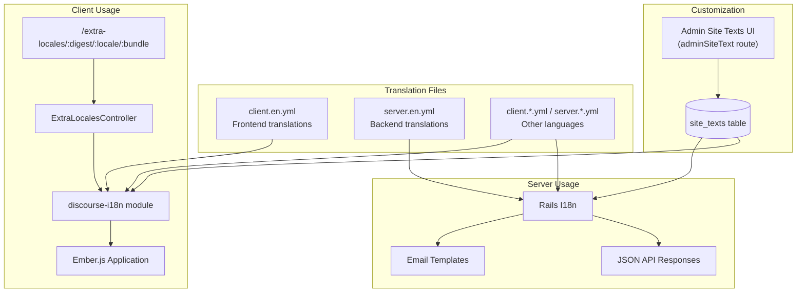
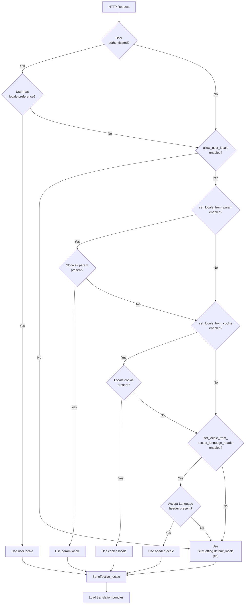
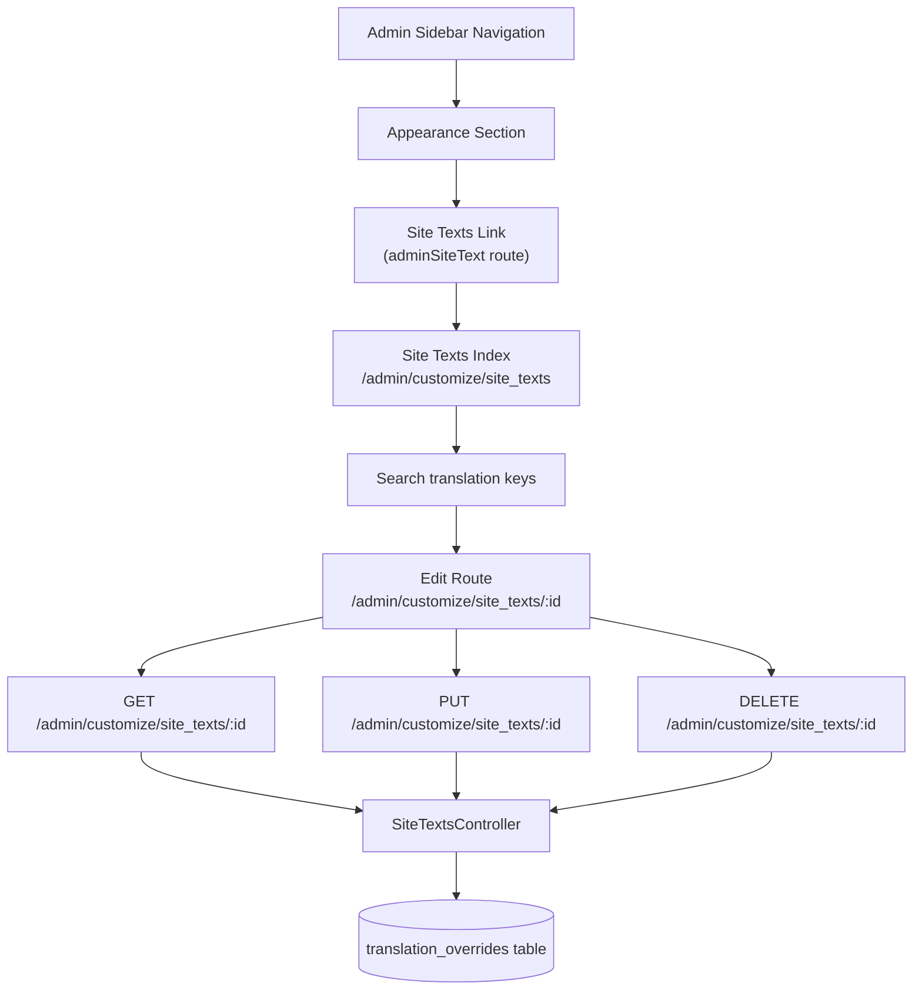

# Localization and Internationalization

<details>
<summary>Relevant source files</summary>

The following files were used as context for generating this wiki page:

- [app/assets/javascripts/admin/addon/routes/admin-route-map.js](https://github.com/discourse/discourse/blob/8c2d5f9a/app/assets/javascripts/admin/addon/routes/admin-route-map.js)
- [app/assets/javascripts/discourse/app/components/sidebar/filter-no-results.gjs](https://github.com/discourse/discourse/blob/8c2d5f9a/app/assets/javascripts/discourse/app/components/sidebar/filter-no-results.gjs)
- [app/assets/javascripts/discourse/app/components/sidebar/filter.gjs](https://github.com/discourse/discourse/blob/8c2d5f9a/app/assets/javascripts/discourse/app/components/sidebar/filter.gjs)
- [app/assets/javascripts/discourse/app/components/sidebar/panel-header.gjs](https://github.com/discourse/discourse/blob/8c2d5f9a/app/assets/javascripts/discourse/app/components/sidebar/panel-header.gjs)
- [app/assets/javascripts/discourse/app/lib/sidebar/admin-nav-map.js](https://github.com/discourse/discourse/blob/8c2d5f9a/app/assets/javascripts/discourse/app/lib/sidebar/admin-nav-map.js)
- [app/assets/javascripts/discourse/app/lib/sidebar/admin-sidebar.js](https://github.com/discourse/discourse/blob/8c2d5f9a/app/assets/javascripts/discourse/app/lib/sidebar/admin-sidebar.js)
- [app/assets/javascripts/discourse/app/lib/sidebar/base-custom-sidebar-panel.js](https://github.com/discourse/discourse/blob/8c2d5f9a/app/assets/javascripts/discourse/app/lib/sidebar/base-custom-sidebar-panel.js)
- [app/assets/javascripts/discourse/tests/acceptance/admin-sidebar-section-test.js](https://github.com/discourse/discourse/blob/8c2d5f9a/app/assets/javascripts/discourse/tests/acceptance/admin-sidebar-section-test.js)
- [app/assets/stylesheets/common/base/menu-panel.scss](https://github.com/discourse/discourse/blob/8c2d5f9a/app/assets/stylesheets/common/base/menu-panel.scss)
- [app/assets/stylesheets/common/base/sidebar.scss](https://github.com/discourse/discourse/blob/8c2d5f9a/app/assets/stylesheets/common/base/sidebar.scss)
- [app/models/concerns/limited_edit.rb](https://github.com/discourse/discourse/blob/8c2d5f9a/app/models/concerns/limited_edit.rb)
- [app/models/site_setting.rb](https://github.com/discourse/discourse/blob/8c2d5f9a/app/models/site_setting.rb)
- [app/serializers/current_user_serializer.rb](https://github.com/discourse/discourse/blob/8c2d5f9a/app/serializers/current_user_serializer.rb)
- [config/locales/client.en.yml](https://github.com/discourse/discourse/blob/8c2d5f9a/config/locales/client.en.yml)
- [config/locales/server.en.yml](https://github.com/discourse/discourse/blob/8c2d5f9a/config/locales/server.en.yml)
- [config/routes.rb](https://github.com/discourse/discourse/blob/8c2d5f9a/config/routes.rb)
- [config/site_settings.yml](https://github.com/discourse/discourse/blob/8c2d5f9a/config/site_settings.yml)
- [db/migrate/20231212044856_fill_edit_post_allowed_groups_based_on_deprecated_settings.rb](https://github.com/discourse/discourse/blob/8c2d5f9a/db/migrate/20231212044856_fill_edit_post_allowed_groups_based_on_deprecated_settings.rb)
- [lib/guardian.rb](https://github.com/discourse/discourse/blob/8c2d5f9a/lib/guardian.rb)
- [lib/guardian/post_guardian.rb](https://github.com/discourse/discourse/blob/8c2d5f9a/lib/guardian/post_guardian.rb)
- [lib/guardian/topic_guardian.rb](https://github.com/discourse/discourse/blob/8c2d5f9a/lib/guardian/topic_guardian.rb)
- [lib/site_settings/deprecated_settings.rb](https://github.com/discourse/discourse/blob/8c2d5f9a/lib/site_settings/deprecated_settings.rb)
- [spec/fabricators/user_fabricator.rb](https://github.com/discourse/discourse/blob/8c2d5f9a/spec/fabricators/user_fabricator.rb)
- [spec/lib/guardian/post_guardian_spec.rb](https://github.com/discourse/discourse/blob/8c2d5f9a/spec/lib/guardian/post_guardian_spec.rb)
- [spec/lib/guardian/topic_guardian_spec.rb](https://github.com/discourse/discourse/blob/8c2d5f9a/spec/lib/guardian/topic_guardian_spec.rb)
- [spec/lib/guardian_spec.rb](https://github.com/discourse/discourse/blob/8c2d5f9a/spec/lib/guardian_spec.rb)
- [spec/models/site_setting_spec.rb](https://github.com/discourse/discourse/blob/8c2d5f9a/spec/models/site_setting_spec.rb)
- [spec/serializers/current_user_serializer_spec.rb](https://github.com/discourse/discourse/blob/8c2d5f9a/spec/serializers/current_user_serializer_spec.rb)
- [spec/system/admin_sidebar_navigation_spec.rb](https://github.com/discourse/discourse/blob/8c2d5f9a/spec/system/admin_sidebar_navigation_spec.rb)
- [spec/system/page_objects/components/filter.rb](https://github.com/discourse/discourse/blob/8c2d5f9a/spec/system/page_objects/components/filter.rb)
- [spec/system/private_message_spec.rb](https://github.com/discourse/discourse/blob/8c2d5f9a/spec/system/private_message_spec.rb)

</details>


This document describes Discourse's internationalization (i18n) and localization (l10n) system, covering translation files, locale selection, text customization, and multi-language support. For information about theme customization and styling, see [Theming and Customization](#6).

---

## Overview

Discourse supports multiple languages through a dual i18n system:
- **Client-side translations** (`client.*.yml`) for JavaScript/Ember.js frontend
- **Server-side translations** (`server.*.yml`) for Ruby/Rails backend

The system provides:
- User-selectable locales (when enabled)
- Automatic locale detection from browser settings
- Admin-customizable text overrides
- RTL (right-to-left) language support
- Unicode username support with locale-specific character sets
- Pluralization and interpolation

**Sources**: [config/locales/client.en.yml:1-100](), [config/locales/server.en.yml:1-100](), [config/site_settings.yml:166-192]()

---

## Translation File Architecture

### File Structure



**Diagram**: Translation file architecture and data flow

### Client Translation Structure

Client translations are organized hierarchically under `en.js`:

[config/locales/client.en.yml:1-100]()
```
en:
  js:
    number:
      format:
        separator: "."
        delimiter: ","
    dates:
      time: "h:mm a"
      long_with_year: "MMM D, YYYY h:mm a"
    languages:
      ar: { name: "Arabic" }
      ...
```

**Key sections**:
- `number` - Number formatting (separators, currency)
- `dates` - Date/time formats using Moment.js syntax
- `languages` - Language name translations
- `share` - Social sharing text
- Application-specific text (topics, posts, user actions)

**Sources**: [config/locales/client.en.yml:1-500]()

### Server Translation Structure

Server translations follow Rails i18n conventions:

[config/locales/server.en.yml:1-100]()
```
en:
  dates:
    short_date: "D MMM, YYYY"
  datetime_formats:
    formats:
      short: "%m-%d-%Y"
  errors:
    messages:
      invalid_locale: "%{invalid_locale} is not a valid locale"
```

**Key sections**:
- `dates` - Server-side date formats
- `errors` - Validation and error messages
- `emails` - Email template text
- `site_settings` - Setting descriptions
- `themes` - Theme-related messages

**Sources**: [config/locales/server.en.yml:1-300]()

---

## Locale Selection and Resolution

### Locale Resolution Flow



**Diagram**: Locale resolution decision tree

### Site Settings for Locale Selection

| Setting | Type | Default | Description |
|---------|------|---------|-------------|
| `allow_user_locale` | boolean | false | Allow users to select their own interface locale |
| `set_locale_from_accept_language_header` | boolean | false | Auto-detect locale from HTTP Accept-Language header |
| `set_locale_from_cookie` | boolean | false | Read locale from `_locale` cookie |
| `set_locale_from_param` | boolean | false | Allow `?locale=` URL parameter to override locale |
| `support_mixed_text_direction` | boolean | false | Enable RTL/LTR mixed text support |

All require `allow_user_locale` to be enabled (validated by `AllowUserLocaleEnabledValidator`).

**Sources**: [config/site_settings.yml:170-192]()

### Effective Locale Serialization

The current user's effective locale is serialized to the client:

[app/serializers/current_user_serializer.rb:81-82]()
```ruby
attributes :can_localize_content?,
           :effective_locale
```

This allows the frontend to know which locale bundle to load.

**Sources**: [app/serializers/current_user_serializer.rb:81-82]()

---

## Translation Loading and Serving

### Extra Locales Route

Dynamic locale bundles are served via:

[config/routes.rb:496-499]()
```ruby
get "extra-locales/:digest/:locale/:bundle" => "extra_locales#show",
    :constraints => {
      format: :js,
    }
```

This route serves JavaScript bundles containing translations for specific locales and bundles (e.g., admin translations, plugin translations).

**Bundle types**:
- Core application translations
- Admin panel translations
- Plugin-specific translations
- Theme-specific translations

**Sources**: [config/routes.rb:496-499]()

### Translation Caching

Translation bundles include a `:digest` parameter for cache busting. When translations change, the digest updates, forcing browsers to fetch new bundles.

---

## Admin Customization Interface

### Site Texts Management

Administrators can customize any translation key through the admin interface:



**Diagram**: Site text customization flow

**Routes** [config/routes.rb:281-290]():
- `GET /admin/customize/site_texts/:id` - Show translation
- `PUT /admin/customize/site_texts/:id` - Update translation
- `DELETE /admin/customize/site_texts/:id` - Revert to default

Translation keys can contain special characters and are URL-encoded (constraint: `/[\w.\-\+\%\&]+/i`).

**Admin navigation** [app/assets/javascripts/discourse/app/lib/sidebar/admin-nav-map.js:288-293]():
```javascript
{
  name: "admin_customize_site_texts",
  route: "adminSiteText",
  label: "admin.config.site_texts.title",
  description: "admin.config.site_texts.header_description",
  icon: "language",
}
```

**Sources**: [config/routes.rb:281-300](), [app/assets/javascripts/discourse/app/lib/sidebar/admin-nav-map.js:288-293](), [app/assets/javascripts/admin/addon/routes/admin-route-map.js:77-82]()

---

## Pluralization and Interpolation

### Pluralization Rules

Discourse uses standard i18n pluralization for both client and server:

**Client example** [config/locales/client.en.yml:63-68]():
```yaml
less_than_x_seconds:
  one: "< %{count}s"
  other: "< %{count}s"
x_minutes:
  one: "%{count} min"
  other: "%{count} mins"
```

**Server example** [config/locales/server.en.yml:288-290]():
```yaml
too_long_validation:
  one: "is limited to %{count} character; you entered %{length}."
  other: "is limited to %{count} characters; you entered %{length}."
```

Pluralization keys:
- `one` - Singular form
- `other` - Plural form (some languages have additional forms like `few`, `many`)

### Interpolation

Variables are interpolated using `%{variable_name}` syntax:

```yaml
topic_category_changed: "From %{from} to %{to}"
invited_user: "Invited %{who} %{when}"
```

**Sources**: [config/locales/client.en.yml:63-100](), [config/locales/server.en.yml:288-320]()

---

## RTL and Mixed Text Direction Support

### Mixed Text Direction Setting

[config/site_settings.yml:189-192]()
```yaml
support_mixed_text_direction:
  client: true
  default: false
  area: "localization"
```

When enabled, this allows content to contain both right-to-left (RTL) and left-to-right (LTR) text, which is important for:
- Arabic, Hebrew, Persian content
- Bilingual posts mixing RTL and LTR languages
- Code snippets in RTL language contexts

**Sources**: [config/site_settings.yml:189-192]()

---

## Unicode and Username Localization

### Unicode Username Support

Discourse supports unicode characters in usernames with locale-specific allowlists:

[config/site_settings.yml:796-812]()
```yaml
unicode_usernames:
  default: false
  client: true
  validator: "UnicodeUsernameValidator"
  area: "localization"
  
allowed_unicode_username_characters:
  validator: "UnicodeUsernameAllowlistValidator"
  default: ""
  locale_default:
    cs: "[ěščřžýáíéóůúďťňĚŠČŘŽÝÁÍÉÓŮÚĎŤŇ]"
    fi: "[åäöÅÄÖ]"
    ja: '[\p{Han}\p{Katakana}\p{Hiragana}ー]'
    ko: '\p{Hangul}'
    zh_CN: '\p{Han}'
    zh_TW: '\p{Han}'
  area: "localization"
```

The `locale_default` mechanism automatically sets allowed characters based on the site's default locale:
- **Czech**: Includes diacritics (ěščřžýáíé...)
- **German**: Includes umlauts (äöüß)
- **Japanese**: Han, Katakana, Hiragana characters
- **Korean**: Hangul characters
- **Chinese**: Han characters

**Sources**: [config/site_settings.yml:796-812]()

---

## Language List and Supported Locales

### Available Languages

Discourse includes translations for 40+ languages [config/locales/client.en.yml:158-256]():

| Code | Language |
|------|----------|
| ar | Arabic |
| de | German |
| en | English (US) |
| en_GB | English (UK) |
| es | Spanish |
| fa_IR | Persian |
| fr | French |
| he | Hebrew |
| it | Italian |
| ja | Japanese |
| ko | Korean |
| pt | Portuguese |
| pt_BR | Portuguese (Brazilian) |
| ru | Russian |
| tr_TR | Turkish |
| zh_CN | Chinese Simplified |
| zh_TW | Chinese Traditional |
| ... | (35+ total) |

Each locale has both client and server translation files.

**Sources**: [config/locales/client.en.yml:158-256]()

---

## Permission System for Localization

### LocalizationGuardian

The `LocalizationGuardian` module provides permission checks for content localization features:

[lib/guardian.rb:15]()
```ruby
require "guardian/localization_guardian"
```

This mixin is included in the main `Guardian` class and provides methods like `can_localize_content?` which is exposed to the current user via serialization:

[app/serializers/current_user_serializer.rb:81]()
```ruby
attributes :can_localize_content?,
           :effective_locale
```

**Sources**: [lib/guardian.rb:15](), [lib/guardian/localization_guardian.rb:1](), [app/serializers/current_user_serializer.rb:81]()

---

## Admin Localization Configuration

### Admin Interface Access

The localization settings are accessible through the admin sidebar:

[app/assets/javascripts/discourse/app/lib/sidebar/admin-nav-map.js:119-126]()
```javascript
{
  name: "admin_localization",
  route: "adminConfig.localization.settings",
  label: "admin.config.localization.title",
  description: "admin.config.localization.header_description",
  keywords: "admin.config.localization.keywords",
  icon: "globe",
  settings_area: "localization",
}
```

This appears in the **Community** section of the admin sidebar and routes to `/admin/config/localization` where all localization-related site settings can be configured.

**Sources**: [app/assets/javascripts/discourse/app/lib/sidebar/admin-nav-map.js:119-126](), [app/assets/javascripts/admin/addon/routes/admin-route-map.js:232-234]()

---

## Date and Time Formatting

### Client-Side Format Strings

Client uses Moment.js format syntax [config/locales/client.en.yml:24-56]():

```yaml
dates:
  time: "h:mm a"
  time_with_zone: "hh:mm a (z)"
  long_no_year: "MMM D, h:mm a"
  long_with_year: "MMM D, YYYY h:mm a"
  full_with_year_no_time: "MMMM Do, YYYY"
```

### Server-Side Format Strings

Server uses Ruby strftime syntax [config/locales/server.en.yml:10-23]():

```yaml
datetime_formats:
  formats:
    short: "%m-%d-%Y"
    short_no_year: "%B %-d"
    date_only: "%B %-d, %Y"
    long: "%B %-d, %Y, %l:%M%P"
```

This dual-format system ensures consistent date/time display across client and server rendering.

**Sources**: [config/locales/client.en.yml:24-56](), [config/locales/server.en.yml:10-23]()

---

## Summary

The Discourse i18n system provides:

1. **Dual translation architecture** - Separate client and server translation files
2. **Flexible locale selection** - Multiple detection methods (user preference, cookie, header, URL param)
3. **Admin customization** - Override any translation key via admin UI
4. **Unicode support** - Locale-specific character sets for usernames
5. **RTL support** - Mixed text direction handling
6. **40+ languages** - Comprehensive language coverage
7. **Standard conventions** - Pluralization, interpolation, and formatting follow i18n best practices

**Key Files**:
- [config/locales/client.en.yml:1-100]() - Frontend translations
- [config/locales/server.en.yml:1-100]() - Backend translations
- [config/site_settings.yml:166-192]() - Localization settings
- [config/routes.rb:496-499]() - Extra locales route
- [lib/guardian/localization_guardian.rb:1]() - Permission checks