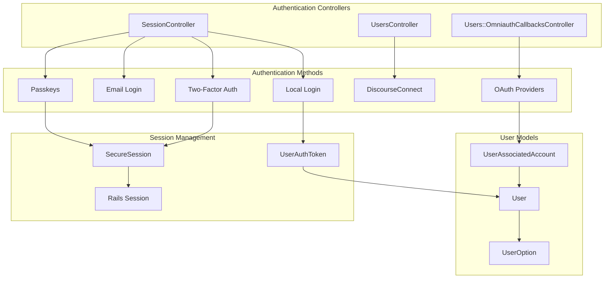
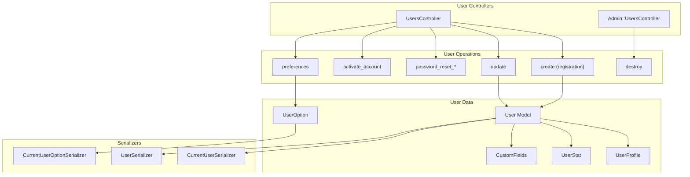
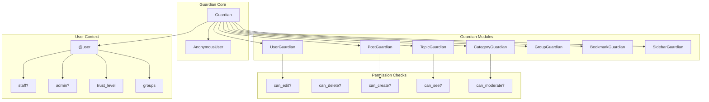
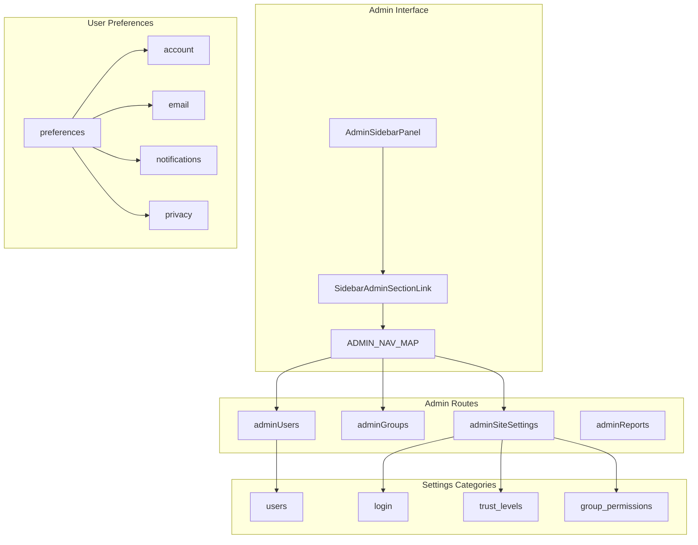
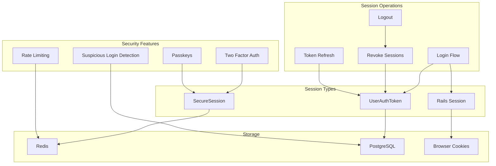
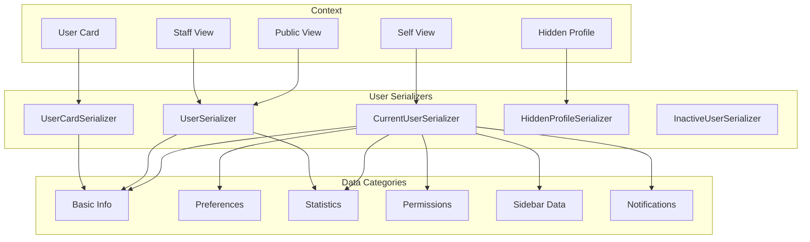

# User System

Relevant source files

The following files were used as context for generating this wiki page:

- [app/assets/javascripts/admin/addon/routes/admin-route-map.js](https://github.com/discourse/discourse/blob/8c2d5f9a/app/assets/javascripts/admin/addon/routes/admin-route-map.js)
- [app/assets/javascripts/discourse/app/components/sidebar/filter-no-results.gjs](https://github.com/discourse/discourse/blob/8c2d5f9a/app/assets/javascripts/discourse/app/components/sidebar/filter-no-results.gjs)
- [app/assets/javascripts/discourse/app/components/sidebar/filter.gjs](https://github.com/discourse/discourse/blob/8c2d5f9a/app/assets/javascripts/discourse/app/components/sidebar/filter.gjs)
- [app/assets/javascripts/discourse/app/components/sidebar/panel-header.gjs](https://github.com/discourse/discourse/blob/8c2d5f9a/app/assets/javascripts/discourse/app/components/sidebar/panel-header.gjs)
- [app/assets/javascripts/discourse/app/lib/sidebar/admin-nav-map.js](https://github.com/discourse/discourse/blob/8c2d5f9a/app/assets/javascripts/discourse/app/lib/sidebar/admin-nav-map.js)
- [app/assets/javascripts/discourse/app/lib/sidebar/admin-sidebar.js](https://github.com/discourse/discourse/blob/8c2d5f9a/app/assets/javascripts/discourse/app/lib/sidebar/admin-sidebar.js)
- [app/assets/javascripts/discourse/app/lib/sidebar/base-custom-sidebar-panel.js](https://github.com/discourse/discourse/blob/8c2d5f9a/app/assets/javascripts/discourse/app/lib/sidebar/base-custom-sidebar-panel.js)
- [app/assets/javascripts/discourse/tests/acceptance/admin-sidebar-section-test.js](https://github.com/discourse/discourse/blob/8c2d5f9a/app/assets/javascripts/discourse/tests/acceptance/admin-sidebar-section-test.js)
- [app/assets/stylesheets/common/base/menu-panel.scss](https://github.com/discourse/discourse/blob/8c2d5f9a/app/assets/stylesheets/common/base/menu-panel.scss)
- [app/assets/stylesheets/common/base/sidebar.scss](https://github.com/discourse/discourse/blob/8c2d5f9a/app/assets/stylesheets/common/base/sidebar.scss)
- [app/controllers/invites_controller.rb](https://github.com/discourse/discourse/blob/8c2d5f9a/app/controllers/invites_controller.rb)
- [app/controllers/session_controller.rb](https://github.com/discourse/discourse/blob/8c2d5f9a/app/controllers/session_controller.rb)
- [app/controllers/users/omniauth_callbacks_controller.rb](https://github.com/discourse/discourse/blob/8c2d5f9a/app/controllers/users/omniauth_callbacks_controller.rb)
- [app/controllers/users_controller.rb](https://github.com/discourse/discourse/blob/8c2d5f9a/app/controllers/users_controller.rb)
- [app/models/concerns/limited_edit.rb](https://github.com/discourse/discourse/blob/8c2d5f9a/app/models/concerns/limited_edit.rb)
- [app/models/site_setting.rb](https://github.com/discourse/discourse/blob/8c2d5f9a/app/models/site_setting.rb)
- [app/serializers/current_user_serializer.rb](https://github.com/discourse/discourse/blob/8c2d5f9a/app/serializers/current_user_serializer.rb)
- [app/services/user_activator.rb](https://github.com/discourse/discourse/blob/8c2d5f9a/app/services/user_activator.rb)
- [app/services/user_authenticator.rb](https://github.com/discourse/discourse/blob/8c2d5f9a/app/services/user_authenticator.rb)
- [app/views/application/_header.html.erb](https://github.com/discourse/discourse/blob/8c2d5f9a/app/views/application/_header.html.erb)
- [config/initializers/009-omniauth.rb](https://github.com/discourse/discourse/blob/8c2d5f9a/config/initializers/009-omniauth.rb)
- [config/locales/client.en.yml](https://github.com/discourse/discourse/blob/8c2d5f9a/config/locales/client.en.yml)
- [config/locales/server.en.yml](https://github.com/discourse/discourse/blob/8c2d5f9a/config/locales/server.en.yml)
- [config/routes.rb](https://github.com/discourse/discourse/blob/8c2d5f9a/config/routes.rb)
- [config/site_settings.yml](https://github.com/discourse/discourse/blob/8c2d5f9a/config/site_settings.yml)
- [db/migrate/20231212044856_fill_edit_post_allowed_groups_based_on_deprecated_settings.rb](https://github.com/discourse/discourse/blob/8c2d5f9a/db/migrate/20231212044856_fill_edit_post_allowed_groups_based_on_deprecated_settings.rb)
- [lib/guardian.rb](https://github.com/discourse/discourse/blob/8c2d5f9a/lib/guardian.rb)
- [lib/guardian/post_guardian.rb](https://github.com/discourse/discourse/blob/8c2d5f9a/lib/guardian/post_guardian.rb)
- [lib/guardian/topic_guardian.rb](https://github.com/discourse/discourse/blob/8c2d5f9a/lib/guardian/topic_guardian.rb)
- [lib/middleware/omniauth_bypass_middleware.rb](https://github.com/discourse/discourse/blob/8c2d5f9a/lib/middleware/omniauth_bypass_middleware.rb)
- [lib/site_settings/deprecated_settings.rb](https://github.com/discourse/discourse/blob/8c2d5f9a/lib/site_settings/deprecated_settings.rb)
- [plugins/discourse-apple-auth/spec/requests/auth_apple_spec.rb](https://github.com/discourse/discourse/blob/8c2d5f9a/plugins/discourse-apple-auth/spec/requests/auth_apple_spec.rb)
- [plugins/discourse-lti/lib/discourse_lti/lti_omniauth_strategy.rb](https://github.com/discourse/discourse/blob/8c2d5f9a/plugins/discourse-lti/lib/discourse_lti/lti_omniauth_strategy.rb)
- [plugins/discourse-lti/plugin.rb](https://github.com/discourse/discourse/blob/8c2d5f9a/plugins/discourse-lti/plugin.rb)
- [plugins/discourse-lti/spec/requests/lti_spec.rb](https://github.com/discourse/discourse/blob/8c2d5f9a/plugins/discourse-lti/spec/requests/lti_spec.rb)
- [spec/fabricators/user_fabricator.rb](https://github.com/discourse/discourse/blob/8c2d5f9a/spec/fabricators/user_fabricator.rb)
- [spec/lib/guardian/post_guardian_spec.rb](https://github.com/discourse/discourse/blob/8c2d5f9a/spec/lib/guardian/post_guardian_spec.rb)
- [spec/lib/guardian/topic_guardian_spec.rb](https://github.com/discourse/discourse/blob/8c2d5f9a/spec/lib/guardian/topic_guardian_spec.rb)
- [spec/lib/guardian_spec.rb](https://github.com/discourse/discourse/blob/8c2d5f9a/spec/lib/guardian_spec.rb)
- [spec/models/site_setting_spec.rb](https://github.com/discourse/discourse/blob/8c2d5f9a/spec/models/site_setting_spec.rb)
- [spec/rails_helper.rb](https://github.com/discourse/discourse/blob/8c2d5f9a/spec/rails_helper.rb)
- [spec/requests/invites_controller_spec.rb](https://github.com/discourse/discourse/blob/8c2d5f9a/spec/requests/invites_controller_spec.rb)
- [spec/requests/omniauth_callbacks_controller_spec.rb](https://github.com/discourse/discourse/blob/8c2d5f9a/spec/requests/omniauth_callbacks_controller_spec.rb)
- [spec/requests/session_controller_spec.rb](https://github.com/discourse/discourse/blob/8c2d5f9a/spec/requests/session_controller_spec.rb)
- [spec/requests/users_controller_spec.rb](https://github.com/discourse/discourse/blob/8c2d5f9a/spec/requests/users_controller_spec.rb)
- [spec/serializers/current_user_serializer_spec.rb](https://github.com/discourse/discourse/blob/8c2d5f9a/spec/serializers/current_user_serializer_spec.rb)
- [spec/services/user_authenticator_spec.rb](https://github.com/discourse/discourse/blob/8c2d5f9a/spec/services/user_authenticator_spec.rb)
- [spec/system/admin_sidebar_navigation_spec.rb](https://github.com/discourse/discourse/blob/8c2d5f9a/spec/system/admin_sidebar_navigation_spec.rb)
- [spec/system/page_objects/components/filter.rb](https://github.com/discourse/discourse/blob/8c2d5f9a/spec/system/page_objects/components/filter.rb)
- [spec/system/private_message_spec.rb](https://github.com/discourse/discourse/blob/8c2d5f9a/spec/system/private_message_spec.rb)

The User System encompasses all functionality related to user accounts, authentication, authorization, and profile management in Discourse. This includes user registration and login flows, session management, permission systems, user preferences, and administrative user management interfaces.

For information about content creation and management, see [Content System](#5). For UI components and styling, see [UI Components and Styling](#6).

## Authentication Architecture

Discourse implements a multi-layered authentication system supporting various login methods including local authentication, OAuth providers, DiscourseConnect (SSO), two-factor authentication, and passkeys.

**Authentication Flow Diagram**

Sources: [app/controllers/session_controller.rb:1-1000](https://github.com/discourse/discourse/blob/8c2d5f9a/app/controllers/session_controller.rb#L1-L1000), [app/controllers/users_controller.rb:1-200](https://github.com/discourse/discourse/blob/8c2d5f9a/app/controllers/users_controller.rb#L1-L200), [app/controllers/users/omniauth_callbacks_controller.rb:1-50](https://github.com/discourse/discourse/blob/8c2d5f9a/app/controllers/users/omniauth_callbacks_controller.rb#L1-L50)

The `SessionController` serves as the primary authentication endpoint, handling login attempts through various methods. Local authentication validates username/password combinations, while OAuth flows are managed through the `Users::OmniauthCallbacksController`. Two-factor authentication and passkeys require additional verification steps managed through secure sessions.

## User Account Management

The user account system is centered around the `UsersController` which handles all user-related operations including registration, profile updates, password management, and account settings.

**User Account Management Architecture**

Sources: [app/controllers/users_controller.rb:1-500](https://github.com/discourse/discourse/blob/8c2d5f9a/app/controllers/users_controller.rb#L1-L500), [app/serializers/current_user_serializer.rb:1-100](https://github.com/discourse/discourse/blob/8c2d5f9a/app/serializers/current_user_serializer.rb#L1-L100), [config/site_settings.yml:798-1000](https://github.com/discourse/discourse/blob/8c2d5f9a/config/site_settings.yml#L798-L1000)

The `UsersController` provides endpoints for user registration ([app/controllers/users_controller.rb:24-56]()), account activation, password reset flows, and profile management. User data is serialized differently based on context - `CurrentUserSerializer` provides comprehensive data for the logged-in user, while `UserSerializer` provides public profile information.

## Guardian Authorization System

The Guardian system implements a comprehensive permission framework that controls access to all resources and operations within Discourse.

**Guardian Authorization Architecture**

Sources: [lib/guardian.rb:1-200](https://github.com/discourse/discourse/blob/8c2d5f9a/lib/guardian.rb#L1-L200), [lib/guardian/user_guardian.rb:1-100](https://github.com/discourse/discourse/blob/8c2d5f9a/lib/guardian/user_guardian.rb#L1-L100), [lib/guardian/post_guardian.rb:1-100](https://github.com/discourse/discourse/blob/8c2d5f9a/lib/guardian/post_guardian.rb#L1-L100), [spec/lib/guardian_spec.rb:1-200](https://github.com/discourse/discourse/blob/8c2d5f9a/spec/lib/guardian_spec.rb#L1-L200)

The Guardian class ([lib/guardian.rb:105-108]()) initializes with a user context and provides permission checking methods across all system resources. Each guardian module specializes in permissions for specific entities - `UserGuardian` handles user profile access, `PostGuardian` manages post operations, and `TopicGuardian` controls topic permissions. Anonymous users are represented by a special `AnonymousUser` class ([lib/guardian.rb:33-101]()) that consistently returns false for all permission checks.

## User Interface and Administration

The user system includes comprehensive administrative interfaces and user preference management through the admin sidebar and user settings pages.

**User Interface and Administration Structure**

Sources: [app/assets/javascripts/discourse/app/lib/sidebar/admin-sidebar.js:1-350](https://github.com/discourse/discourse/blob/8c2d5f9a/app/assets/javascripts/discourse/app/lib/sidebar/admin-sidebar.js#L1-L350), [app/assets/javascripts/discourse/app/lib/sidebar/admin-nav-map.js:1-100](https://github.com/discourse/discourse/blob/8c2d5f9a/app/assets/javascripts/discourse/app/lib/sidebar/admin-nav-map.js#L1-L100), [app/assets/javascripts/discourse/app/templates/preferences/account.gjs:1-50](https://github.com/discourse/discourse/blob/8c2d5f9a/app/assets/javascripts/discourse/app/templates/preferences/account.gjs#L1-L50)

The admin sidebar provides structured navigation to user management features through the `AdminSidebarPanel` ([app/assets/javascripts/discourse/app/lib/sidebar/admin-sidebar.js:302-350]()). The `ADMIN_NAV_MAP` configuration ([app/assets/javascripts/discourse/app/lib/sidebar/admin-nav-map.js:1-50]()) defines the hierarchical structure of admin sections including user management, groups, and site settings.

## Site Settings and Configuration

User system behavior is controlled through an extensive set of site settings that configure authentication methods, user permissions, and feature availability.

| Setting Category | Key Settings | Purpose |
|------------------|--------------|---------|
| Login & Authentication | `enable_local_logins`, `enable_google_oauth2_logins`, `enable_discourse_connect` | Controls available authentication methods |
| User Management | `must_approve_users`, `invite_only`, `min_username_length`, `max_username_length` | User registration and validation |
| Trust Levels | Trust level permissions and thresholds | Graduated permission system |
| Privacy | `hide_user_profiles_from_public`, `allow_anonymous_mode` | User privacy controls |
| Groups & Permissions | Various `*_allowed_groups` settings | Feature access control |

Sources: [config/site_settings.yml:580-1000](https://github.com/discourse/discourse/blob/8c2d5f9a/config/site_settings.yml#L580-L1000), [app/models/site_setting.rb:1-100](https://github.com/discourse/discourse/blob/8c2d5f9a/app/models/site_setting.rb#L1-L100)

The site settings system ([config/site_settings.yml:580-700]()) provides granular control over user system behavior. Authentication settings control which login methods are available, while user management settings configure registration requirements and validation rules. The trust level system ([config/site_settings.yml:950-1000]()) provides graduated permissions based on user activity and community standing.

## Session and Security Management

Discourse implements sophisticated session management with support for multiple concurrent sessions, secure session handling for sensitive operations, and comprehensive security features.

**Session and Security Architecture**

Sources: [app/controllers/session_controller.rb:1-200](https://github.com/discourse/discourse/blob/8c2d5f9a/app/controllers/session_controller.rb#L1-L200), [spec/requests/session_controller_spec.rb:1-100](https://github.com/discourse/discourse/blob/8c2d5f9a/spec/requests/session_controller_spec.rb#L1-L100), [spec/requests/users_controller_spec.rb:1-200](https://github.com/discourse/discourse/blob/8c2d5f9a/spec/requests/users_controller_spec.rb#L1-L200)

The session management system uses multiple layers for different security requirements. Standard Rails sessions handle basic state, while `UserAuthToken` provides persistent login across browser sessions. `SecureSession` ([app/controllers/session_controller.rb:18-20]()) is used for sensitive operations like two-factor authentication setup and password changes. Rate limiting and suspicious login detection provide additional security layers.

## User Data Serialization

The user system employs different serialization strategies based on the context and the viewer's permissions to ensure appropriate data exposure.

**User Data Serialization Strategy**

Sources: [app/serializers/current_user_serializer.rb:1-100](https://github.com/discourse/discourse/blob/8c2d5f9a/app/serializers/current_user_serializer.rb#L1-L100), [app/controllers/users_controller.rb:118-150](https://github.com/discourse/discourse/blob/8c2d5f9a/app/controllers/users_controller.rb#L118-L150)