# Authentication and Session Management

<details>
<summary>Relevant source files</summary>

The following files were used as context for generating this wiki page:

- [app/controllers/invites_controller.rb](https://github.com/discourse/discourse/blob/8c2d5f9a/app/controllers/invites_controller.rb)
- [app/controllers/session_controller.rb](https://github.com/discourse/discourse/blob/8c2d5f9a/app/controllers/session_controller.rb)
- [app/controllers/users/omniauth_callbacks_controller.rb](https://github.com/discourse/discourse/blob/8c2d5f9a/app/controllers/users/omniauth_callbacks_controller.rb)
- [app/controllers/users_controller.rb](https://github.com/discourse/discourse/blob/8c2d5f9a/app/controllers/users_controller.rb)
- [app/services/user_activator.rb](https://github.com/discourse/discourse/blob/8c2d5f9a/app/services/user_activator.rb)
- [app/services/user_authenticator.rb](https://github.com/discourse/discourse/blob/8c2d5f9a/app/services/user_authenticator.rb)
- [app/views/application/_header.html.erb](https://github.com/discourse/discourse/blob/8c2d5f9a/app/views/application/_header.html.erb)
- [config/initializers/009-omniauth.rb](https://github.com/discourse/discourse/blob/8c2d5f9a/config/initializers/009-omniauth.rb)
- [lib/middleware/omniauth_bypass_middleware.rb](https://github.com/discourse/discourse/blob/8c2d5f9a/lib/middleware/omniauth_bypass_middleware.rb)
- [plugins/discourse-apple-auth/spec/requests/auth_apple_spec.rb](https://github.com/discourse/discourse/blob/8c2d5f9a/plugins/discourse-apple-auth/spec/requests/auth_apple_spec.rb)
- [plugins/discourse-lti/lib/discourse_lti/lti_omniauth_strategy.rb](https://github.com/discourse/discourse/blob/8c2d5f9a/plugins/discourse-lti/lib/discourse_lti/lti_omniauth_strategy.rb)
- [plugins/discourse-lti/plugin.rb](https://github.com/discourse/discourse/blob/8c2d5f9a/plugins/discourse-lti/plugin.rb)
- [plugins/discourse-lti/spec/requests/lti_spec.rb](https://github.com/discourse/discourse/blob/8c2d5f9a/plugins/discourse-lti/spec/requests/lti_spec.rb)
- [spec/rails_helper.rb](https://github.com/discourse/discourse/blob/8c2d5f9a/spec/rails_helper.rb)
- [spec/requests/invites_controller_spec.rb](https://github.com/discourse/discourse/blob/8c2d5f9a/spec/requests/invites_controller_spec.rb)
- [spec/requests/omniauth_callbacks_controller_spec.rb](https://github.com/discourse/discourse/blob/8c2d5f9a/spec/requests/omniauth_callbacks_controller_spec.rb)
- [spec/requests/session_controller_spec.rb](https://github.com/discourse/discourse/blob/8c2d5f9a/spec/requests/session_controller_spec.rb)
- [spec/requests/users_controller_spec.rb](https://github.com/discourse/discourse/blob/8c2d5f9a/spec/requests/users_controller_spec.rb)
- [spec/services/user_authenticator_spec.rb](https://github.com/discourse/discourse/blob/8c2d5f9a/spec/services/user_authenticator_spec.rb)

</details>


This document describes how users authenticate and maintain sessions in Discourse. It covers all supported authentication methods (local login, OAuth, email login, passkeys, SSO), user registration flows, account activation, two-factor authentication, and session lifecycle management.

For information about authorization and permissions after authentication, see [Authorization System (Guardian)](#3.3). For user account lifecycle beyond registration, see [User Registration and Invitations](#4.2).

---

## Overview

Discourse supports multiple authentication mechanisms to accommodate different deployment scenarios:

| Authentication Method | Controller | Primary Use Case |
|----------------------|------------|------------------|
| Local Login | `SessionController#create` | Username/password authentication |
| Email Login | `SessionController#email_login` | Passwordless magic link login |
| Passkeys | `SessionController#passkey_login` | WebAuthn-based passwordless login |
| OAuth/OmniAuth | `Users::OmniauthCallbacksController#complete` | Third-party identity providers (Google, Facebook, etc.) |
| DiscourseConnect | `SessionController#sso_login` | Single Sign-On from external system |
| DiscourseConnect Provider | `SessionController#sso_provider` | Discourse as SSO provider for other apps |

All authentication flows converge on session creation managed through `CurrentUser` module and stored via `UserAuthToken` records.

**Sources:** [app/controllers/session_controller.rb:1-700](https://github.com/discourse/discourse/blob/8c2d5f9a/app/controllers/session_controller.rb#L1-L700), [app/controllers/users/omniauth_callbacks_controller.rb:1-228](https://github.com/discourse/discourse/blob/8c2d5f9a/app/controllers/users/omniauth_callbacks_controller.rb#L1-L228)

---

## Authentication Architecture

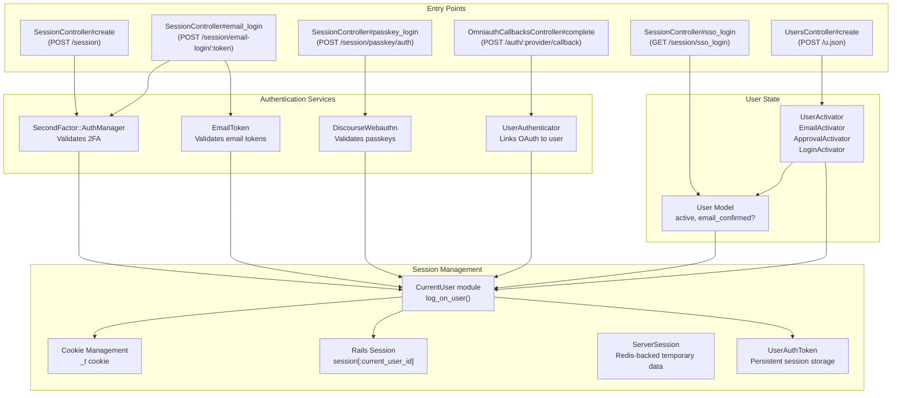

**Sources:** [app/controllers/session_controller.rb:327-380](https://github.com/discourse/discourse/blob/8c2d5f9a/app/controllers/session_controller.rb#L327-L380), [app/services/user_authenticator.rb:1-72](https://github.com/discourse/discourse/blob/8c2d5f9a/app/services/user_authenticator.rb#L1-L72), [app/services/user_activator.rb:1-79](https://github.com/discourse/discourse/blob/8c2d5f9a/app/services/user_activator.rb#L1-L79)

---

## Local Login (Username/Password)

Local login authenticates users via username/email and password. The flow includes optional 2FA verification before session creation.

### Login Flow

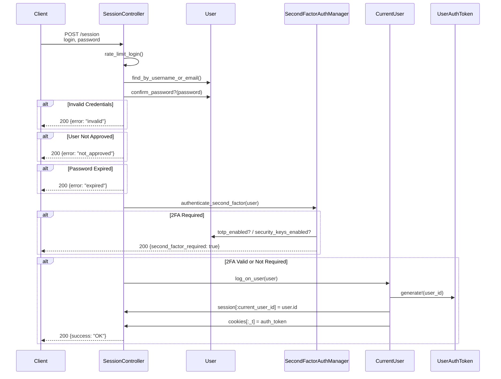

### Key Components

- **`SessionController#create`** [app/controllers/session_controller.rb:327-380](): Main login endpoint
- **`User#confirm_password?`**: Verifies password using `PasswordValidator`
- **`SecondFactorAuthManager#authenticate_second_factor`**: Validates TOTP, security keys, or backup codes
- **`CurrentUser#log_on_user`**: Creates session and auth token
- **Rate Limiting**: `rate_limit_login` prevents brute force attacks [app/controllers/session_controller.rb:6]()

### Session Creation

When authentication succeeds, `log_on_user` performs:

1. Creates `UserAuthToken` record with unique token
2. Sets `session[:current_user_id]`
3. Sets `_t` cookie with auth token (httponly, secure)
4. Updates user's `last_seen_at`
5. Publishes MessageBus event for other tabs

**Sources:** [app/controllers/session_controller.rb:327-380](https://github.com/discourse/discourse/blob/8c2d5f9a/app/controllers/session_controller.rb#L327-L380), [spec/requests/session_controller_spec.rb:1-1000](https://github.com/discourse/discourse/blob/8c2d5f9a/spec/requests/session_controller_spec.rb#L1-L1000)

---

## OAuth/OmniAuth Authentication

Discourse uses OmniAuth for authentication with third-party providers (Google, Facebook, Twitter, GitHub, Apple, etc.). The system is extensible via plugins.

### OAuth Flow

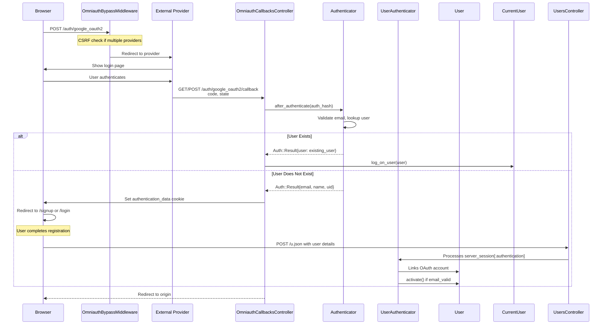

### OmniAuth Configuration

OmniAuth is configured via middleware bypass for performance:

- **`Middleware::OmniauthBypassMiddleware`** [lib/middleware/omniauth_bypass_middleware.rb:1-54](): Only activates OmniAuth for `/auth/*` paths
- **CSRF Protection**: Required for POST requests unless only one provider enabled [config/initializers/009-omniauth.rb:14-27]()
- **Session State**: `session[:auth_reconnect]` indicates account linking vs new signup

### Authenticator System

Each provider has an authenticator class (e.g., `Auth::GoogleOAuth2Authenticator`) that:

1. Registers middleware via `register_middleware()`
2. Implements `after_authenticate(auth_hash)` to process OAuth response
3. Returns `Auth::Result` with user lookup/creation data
4. Can implement `after_create_account()` for post-registration hooks

**Sources:** [app/controllers/users/omniauth_callbacks_controller.rb:1-228](https://github.com/discourse/discourse/blob/8c2d5f9a/app/controllers/users/omniauth_callbacks_controller.rb#L1-L228), [lib/middleware/omniauth_bypass_middleware.rb:1-54](https://github.com/discourse/discourse/blob/8c2d5f9a/lib/middleware/omniauth_bypass_middleware.rb#L1-L54), [config/initializers/009-omniauth.rb:1-59](https://github.com/discourse/discourse/blob/8c2d5f9a/config/initializers/009-omniauth.rb#L1-L59)

### Auth::Result Structure

The `Auth::Result` object carries authentication data through the flow:

```ruby
{
  user: User | nil,                    # Existing user if found
  email: "user@example.com",           # Email from provider
  email_valid: true,                   # Whether provider verified email
  name: "Full Name",                   # Display name
  username: "suggested_username",      # Suggested username
  authenticator_name: "google_oauth2", # Provider identifier
  extra_data: { uid: "...", ... },    # Provider-specific data
  failed: false,                       # Whether auth failed
  failed_reason: nil                   # Error message if failed
}
```

**Sources:** [app/services/user_authenticator.rb:12-14](https://github.com/discourse/discourse/blob/8c2d5f9a/app/services/user_authenticator.rb#L12-L14), [app/controllers/users/omniauth_callbacks_controller.rb:146-154](https://github.com/discourse/discourse/blob/8c2d5f9a/app/controllers/users/omniauth_callbacks_controller.rb#L146-L154)

---

## Email Login (Magic Links)

Email login provides passwordless authentication via time-limited tokens sent to the user's email address.

### Email Login Flow

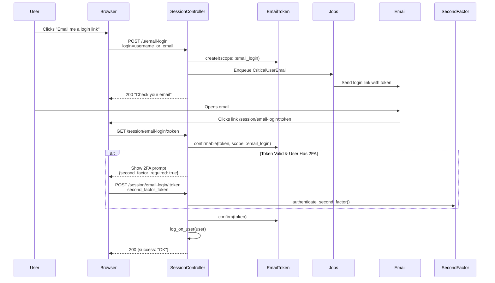

### Email Token System

- **`EmailToken` Model**: Stores tokens with scope (`:email_login`, `:signup`, `:password_reset`)
- **Token Lifecycle**: Expires after configured period (default 24 hours)
- **Confirmation**: `EmailToken.confirm()` marks token as used and confirms email
- **Security**: Tokens are single-use and scope-limited

### Settings

- `enable_local_logins_via_email`: Master toggle for email login
- `email_token_valid_hours`: Token expiration time
- Admin bypass: Admins can use email login even if disabled (for account recovery)

**Sources:** [app/controllers/session_controller.rb:410-477](https://github.com/discourse/discourse/blob/8c2d5f9a/app/controllers/session_controller.rb#L410-L477), [spec/requests/session_controller_spec.rb:131-404](https://github.com/discourse/discourse/blob/8c2d5f9a/spec/requests/session_controller_spec.rb#L131-L404)

---

## Passkeys / WebAuthn

Passkeys provide passwordless authentication using WebAuthn (FIDO2) security keys or platform authenticators.

### Passkey Login Flow

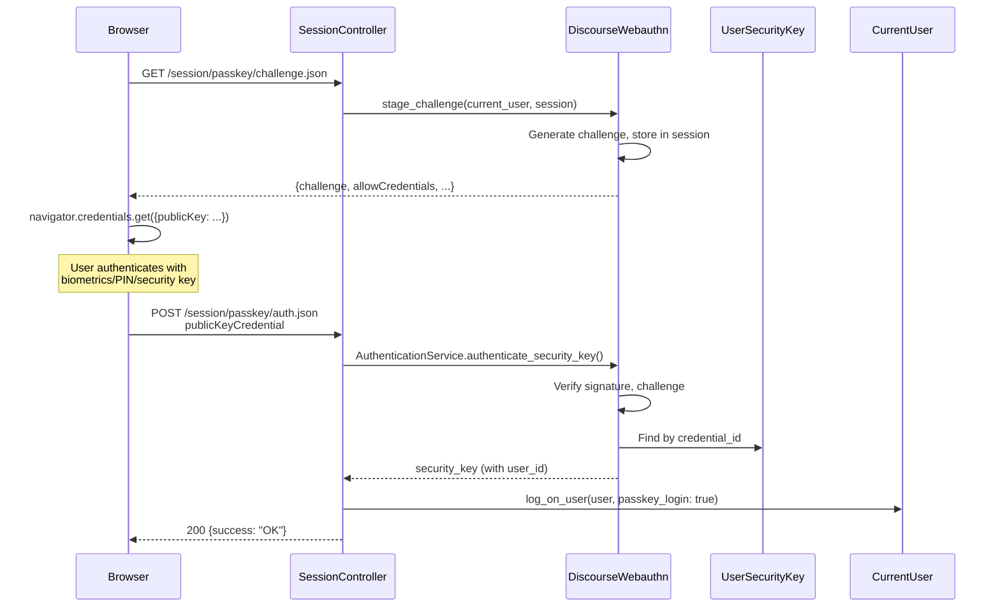

### WebAuthn Components

- **Challenge Management**: Stored in `server_session` for CSRF protection
- **Credential Storage**: `UserSecurityKey` model stores public keys and credential IDs
- **Verification**: `DiscourseWebauthn::AuthenticationService` validates assertions
- **Factor Types**: `first_factor` (passwordless) vs `second_factor` (2FA)

### Settings

- `enable_passkeys`: Master toggle
- `enable_local_logins`: Must also be enabled
- Users can register multiple passkeys from profile settings

**Sources:** [app/controllers/session_controller.rb:382-408](https://github.com/discourse/discourse/blob/8c2d5f9a/app/controllers/session_controller.rb#L382-L408), [spec/requests/session_controller_spec.rb:1-1000](https://github.com/discourse/discourse/blob/8c2d5f9a/spec/requests/session_controller_spec.rb#L1-L1000)

---

## DiscourseConnect (SSO)

DiscourseConnect is Discourse's proprietary SSO protocol for integrating with external authentication systems.

### DiscourseConnect Login Flow

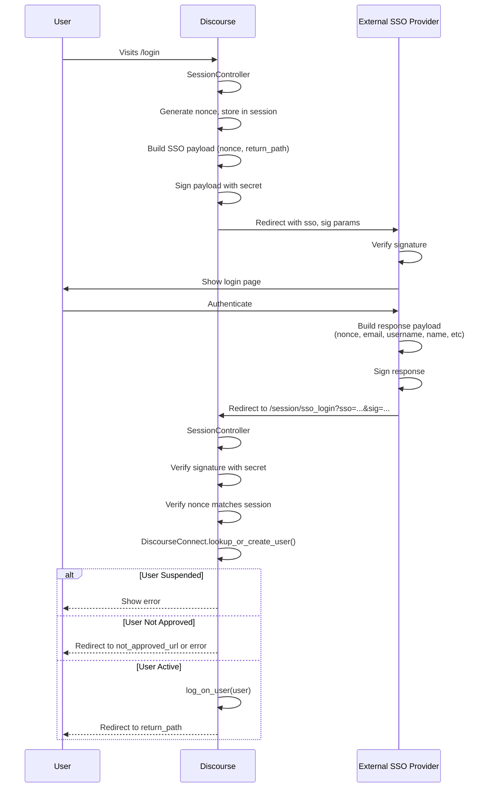

### DiscourseConnect Configuration

Settings in `SiteSettings`:
- `enable_discourse_connect`: Enables SSO, disables other auth methods
- `discourse_connect_url`: External SSO provider URL
- `discourse_connect_secret`: Shared secret for signing
- `discourse_connect_overrides_*`: Whether SSO can update email, username, name, avatar

### Payload Structure

**Request to SSO Provider:**
```
sso=<base64(nonce=...&return_sso_url=...)>
sig=<hmac_sha256(sso, secret)>
```

**Response from SSO Provider:**
```
sso=<base64(
  nonce=...
  email=...
  external_id=...
  username=...
  name=...
  avatar_url=...
  admin=true/false
  moderator=true/false
)>
sig=<hmac_sha256(sso, secret)>
```

### Security Features

- **Nonce Validation**: Prevents replay attacks [app/controllers/session_controller.rb:191-193]()
- **Signature Verification**: HMAC-SHA256 with shared secret
- **Single-Use Nonces**: Expired after use via `expire_nonce!`
- **IP Blocking**: Respects `ScreenedIpAddress` rules

**Sources:** [app/controllers/session_controller.rb:25-318](https://github.com/discourse/discourse/blob/8c2d5f9a/app/controllers/session_controller.rb#L25-L318), [spec/requests/session_controller_spec.rb:1-1000](https://github.com/discourse/discourse/blob/8c2d5f9a/spec/requests/session_controller_spec.rb#L1-L1000)

---

## User Registration

User registration creates new accounts with various activation methods depending on site settings.

### Registration Flow

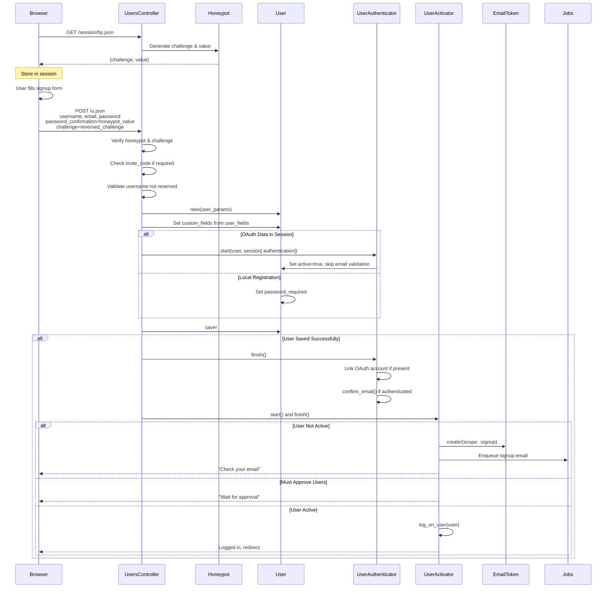

### Honeypot & Challenge

Discourse uses two anti-spam mechanisms:

1. **Honeypot**: Hidden field that should equal session value
2. **Challenge**: Value that should be reversed

These are generated via `GET /session/hp.json` and validated in `honeypot_or_challenge_fails?`

**Sources:** [spec/requests/users_controller_spec.rb:24-56](https://github.com/discourse/discourse/blob/8c2d5f9a/spec/requests/users_controller_spec.rb#L24-L56)

### User Activation Strategies

The `UserActivator` service selects activation strategy based on user state:

| Activator Class | Condition | Behavior |
|----------------|-----------|----------|
| `EmailActivator` | `!user.active?` | Sends confirmation email |
| `ApprovalActivator` | `must_approve_users? && !invited` | Waits for admin approval |
| `LoginActivator` | User already active | Logs in immediately |

**Sources:** [app/services/user_activator.rb:1-79](https://github.com/discourse/discourse/blob/8c2d5f9a/app/services/user_activator.rb#L1-L79), [app/services/user_authenticator.rb:1-72](https://github.com/discourse/discourse/blob/8c2d5f9a/app/services/user_authenticator.rb#L1-L72)

### Account Activation

When user clicks email confirmation link:

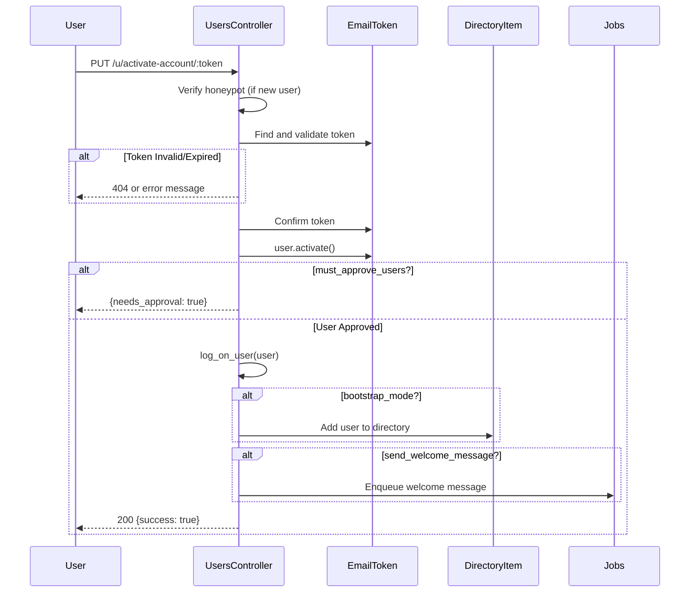

**Sources:** [spec/requests/users_controller_spec.rb:58-222](https://github.com/discourse/discourse/blob/8c2d5f9a/spec/requests/users_controller_spec.rb#L58-L222), [app/controllers/users_controller.rb:1-1500](https://github.com/discourse/discourse/blob/8c2d5f9a/app/controllers/users_controller.rb#L1-L1500)

---

## Two-Factor Authentication

Discourse supports multiple 2FA methods: TOTP (Time-based One-Time Passwords), security keys (WebAuthn), and backup codes.

### 2FA Authentication Flow

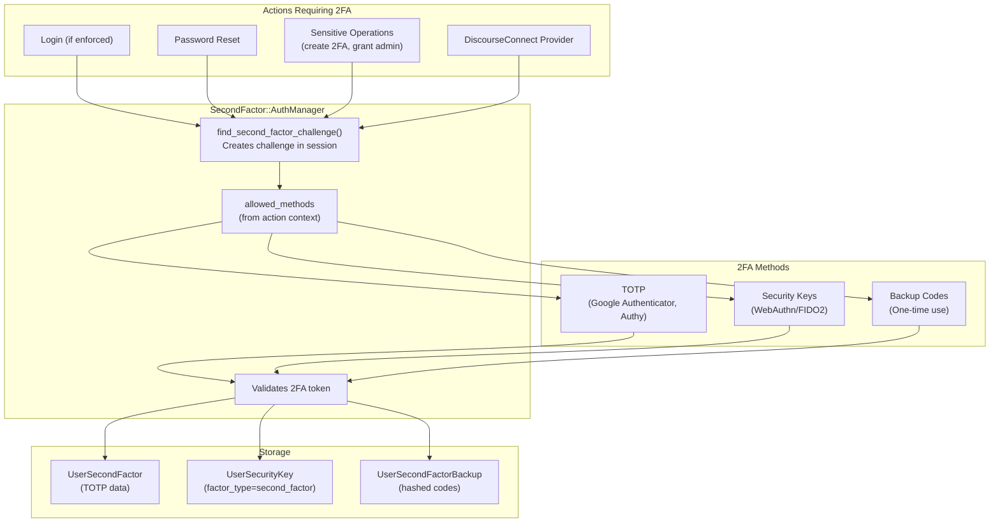

### 2FA During Login

When user has 2FA enabled, the login flow is modified:

1. Username/password validated
2. `authenticate_second_factor(user)` called
3. If 2FA not provided: Returns `{second_factor_required: true, totp_enabled: ..., security_key_required: ...}`
4. Client prompts for 2FA
5. Client resubmits with `second_factor_token` and `second_factor_method`
6. Server validates token via `User#authenticate_second_factor`

### 2FA Challenge System

For sensitive operations beyond login, Discourse uses a challenge/response system:

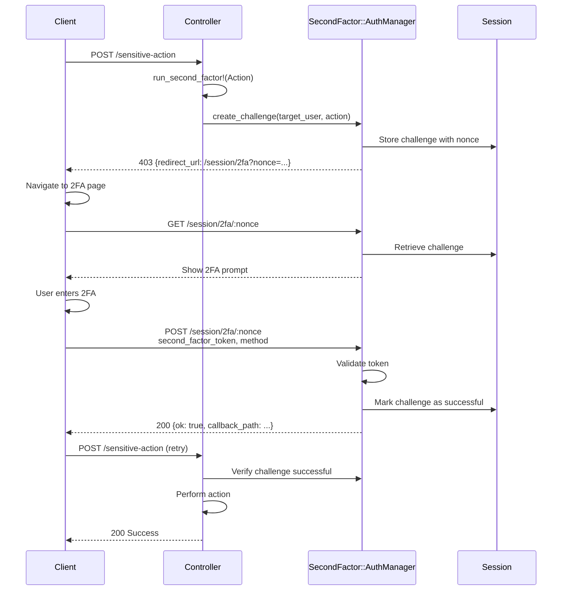

**Sources:** [app/controllers/session_controller.rb:500-612](https://github.com/discourse/discourse/blob/8c2d5f9a/app/controllers/session_controller.rb#L500-L612), [spec/requests/session_controller_spec.rb:1-1000](https://github.com/discourse/discourse/blob/8c2d5f9a/spec/requests/session_controller_spec.rb#L1-L1000)

### Managing 2FA

Users manage 2FA from their profile security settings:

- **Enable TOTP**: `POST /u/:username/second_factors.json` (requires confirmed session)
- **Add Security Key**: `POST /u/:username/security-key.json` (WebAuthn registration)
- **Generate Backup Codes**: `PUT /u/:username/second-factors-backup.json`
- **Disable 2FA**: `PUT /u/:username/second_factor.json` (requires 2FA to disable)

Confirmed session requirement: Users must re-authenticate within 5 minutes before enabling/disabling 2FA via `check_confirmed_session` before_action.

**Sources:** [app/controllers/users_controller.rb:69-80](https://github.com/discourse/discourse/blob/8c2d5f9a/app/controllers/users_controller.rb#L69-L80), [spec/requests/users_controller_spec.rb:1-3000](https://github.com/discourse/discourse/blob/8c2d5f9a/spec/requests/users_controller_spec.rb#L1-L3000)

---

## Session Management

Sessions persist user authentication state across requests using a combination of Rails sessions, cookies, and database tokens.

### Session Storage Architecture

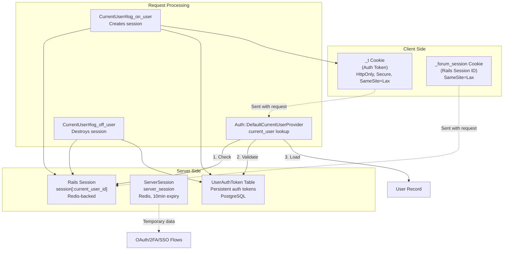

### CurrentUserProvider

The `Auth::DefaultCurrentUserProvider` resolves the current user:

1. **Check `session[:current_user_id]`**: Fast path if session valid
2. **Check `_t` cookie**: Look up `UserAuthToken` by token
3. **Validate token**: Ensure not expired, IP matches (if enforced)
4. **Load user**: Return `User` object or `nil`

Session refresh: Updates `UserAuthToken.seen_at` periodically for activity tracking.

**Sources:** [spec/rails_helper.rb:907-919](https://github.com/discourse/discourse/blob/8c2d5f9a/spec/rails_helper.rb#L907-L919)

### Auth Token Lifecycle

`UserAuthToken` records provide persistent authentication:

| Field | Purpose |
|-------|---------|
| `auth_token` | Unique token (stored in cookie) |
| `user_id` | Owner of token |
| `prev_auth_token` | Previous token for rotation |
| `rotated_at` | When token was last rotated |
| `seen_at` | Last activity timestamp |
| `user_agent` | Browser fingerprint |

Token rotation: Tokens are rotated periodically to limit exposure. Previous token remains valid briefly during rotation.

**Sources:** [spec/requests/users_controller_spec.rb:378-420](https://github.com/discourse/discourse/blob/8c2d5f9a/spec/requests/users_controller_spec.rb#L378-L420)

### Session Destruction

Logout destroys session state:

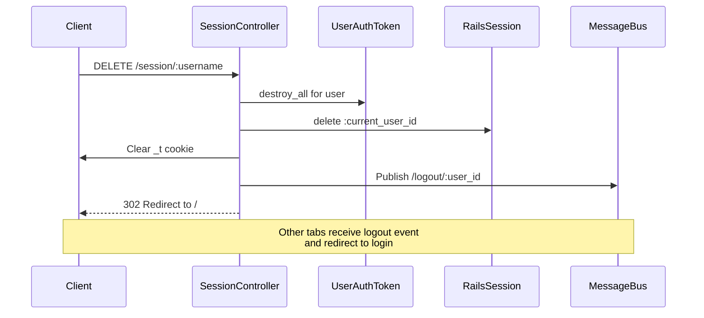

**Sources:** [app/controllers/session_controller.rb:1-700](https://github.com/discourse/discourse/blob/8c2d5f9a/app/controllers/session_controller.rb#L1-L700), [spec/requests/session_controller_spec.rb:1-1000](https://github.com/discourse/discourse/blob/8c2d5f9a/spec/requests/session_controller_spec.rb#L1-L1000)

### Server Session

`ServerSession` (accessed via `request.server_session`) provides short-lived storage (10 minute expiry) for:

- OAuth state during authentication flow
- 2FA challenges
- DiscourseConnect nonces
- Temporary destination URLs

Stored in Redis with automatic expiration to prevent memory bloat.

**Sources:** [spec/requests/invites_controller_spec.rb:284-287](https://github.com/discourse/discourse/blob/8c2d5f9a/spec/requests/invites_controller_spec.rb#L284-L287)

---

## Security Features

### Rate Limiting

Multiple rate limiters protect authentication endpoints:

| Endpoint | Limiter | Default Limit |
|----------|---------|---------------|
| Login attempts | `rate_limit_login` | IP and username-based |
| Password reset | Per-username | 6 per day |
| 2FA attempts | `rate_limit_second_factor!` | Per user |
| Email verification | Per IP | 10 per minute |

**Sources:** [app/controllers/session_controller.rb:6](https://github.com/discourse/discourse/blob/8c2d5f9a/app/controllers/session_controller.rb#L6), [spec/requests/users_controller_spec.rb:500-551](https://github.com/discourse/discourse/blob/8c2d5f9a/spec/requests/users_controller_spec.rb#L500-L551)

### IP Address Screening

`ScreenedIpAddress` model blocks or restricts IPs:

- **Block Login**: Prevents any authentication
- **Admin Whitelist**: Restricts admin login to approved IPs
- Checked during login, SSO, and OAuth flows

**Sources:** [app/controllers/session_controller.rb:196-200](https://github.com/discourse/discourse/blob/8c2d5f9a/app/controllers/session_controller.rb#L196-L200), [spec/requests/session_controller_spec.rb:268-314](https://github.com/discourse/discourse/blob/8c2d5f9a/spec/requests/session_controller_spec.rb#L268-L314)

### CSRF Protection

- **Rails CSRF tokens**: Required for state-changing requests
- **OmniAuth CSRF**: Disabled for GET if only one provider, enabled for POST
- **SSO nonces**: Prevent replay attacks
- **WebAuthn challenges**: Prevent credential reuse

**Sources:** [config/initializers/009-omniauth.rb:14-27](https://github.com/discourse/discourse/blob/8c2d5f9a/config/initializers/009-omniauth.rb#L14-L27), [spec/requests/omniauth_callbacks_controller_spec.rb:189-223](https://github.com/discourse/discourse/blob/8c2d5f9a/spec/requests/omniauth_callbacks_controller_spec.rb#L189-L223)

### Password Security

- **Minimum length**: Configurable (default 10 characters)
- **Maximum length**: 200 characters (prevents DOS)
- **Password reuse**: Tracked via `UserPasswordHistory`
- **Compromised passwords**: Optional check against known breaches
- **Password expiration**: Optional forced reset after X days

**Sources:** [spec/requests/users_controller_spec.rb:686-720](https://github.com/discourse/discourse/blob/8c2d5f9a/spec/requests/users_controller_spec.rb#L686-L720)

### Account Recovery

Multiple recovery mechanisms prevent lockout:

1. **Email password reset**: Time-limited token sent to email
2. **Admin password reset**: Admins can reset any user's password
3. **Email login**: Bypass password entirely
4. **Backup codes**: Recover from lost 2FA device
5. **Admin bypass**: Admins can use email login even if disabled

**Sources:** [spec/requests/users_controller_spec.rb:311-746](https://github.com/discourse/discourse/blob/8c2d5f9a/spec/requests/users_controller_spec.rb#L311-L746)

---

## Staff-Only and Readonly Modes

Discourse supports restricted access modes:

### Readonly Mode

When enabled, only admins can authenticate:

- Regular users: Blocked from login, email login, OAuth
- Moderators: Blocked
- Admins: Can login via email login or admin login link

**Sources:** [spec/requests/session_controller_spec.rb:136-158](https://github.com/discourse/discourse/blob/8c2d5f9a/spec/requests/session_controller_spec.rb#L136-L158)

### Staff Writes Only Mode

When enabled, only staff can authenticate:

- Regular users: Blocked from all authentication
- Moderators and Admins: Can login normally
- Use case: Maintenance with staff-only access

**Sources:** [spec/requests/session_controller_spec.rb:160-182](https://github.com/discourse/discourse/blob/8c2d5f9a/spec/requests/session_controller_spec.rb#L160-L182), [spec/requests/users_controller_spec.rb:722-744](https://github.com/discourse/discourse/blob/8c2d5f9a/spec/requests/users_controller_spec.rb#L722-L744)

---

## Integration Points

### Plugins and Extensions

Authentication system provides hooks for plugins:

- `DiscourseEvent.trigger(:before_auth, authenticator, auth, session, cookies, request)`
- `DiscourseEvent.trigger(:after_auth, authenticator, auth_result, session, cookies, request)`
- `DiscourseEvent.trigger(:user_logged_in, user)`
- Custom authenticators via `DiscoursePluginRegistry.register_auth_provider()`

Example: LTI plugin uses `:after_auth` to redirect new users to invite links stored in OAuth custom claims.

**Sources:** [plugins/discourse-lti/plugin.rb:21-71](https://github.com/discourse/discourse/blob/8c2d5f9a/plugins/discourse-lti/plugin.rb#L21-L71), [app/controllers/users/omniauth_callbacks_controller.rb:34-38](https://github.com/discourse/discourse/blob/8c2d5f9a/app/controllers/users/omniauth_callbacks_controller.rb#L34-L38)

### MessageBus Integration

Real-time events for authentication state:

- `/logout/:user_id`: Notifies other tabs to logout
- User presence updates on login
- Live session count updates

**Sources:** [spec/rails_helper.rb:883-889](https://github.com/discourse/discourse/blob/8c2d5f9a/spec/rails_helper.rb#L883-L889)

---

## Testing Support

Test helpers for authentication:

```ruby
# Sign in user for request specs
sign_in(user)

# Stub server session (for 2FA, OAuth tests)
stub_server_session_confirmed

# Mock OAuth provider response
OmniAuth.config.test_mode = true
OmniAuth.config.mock_auth[:google_oauth2] = OmniAuth::AuthHash.new({...})

# Become any user (development/test only)
ENV['DISCOURSE_DEV_ALLOW_ANON_TO_IMPERSONATE'] = '1'
get '/session/become/admin'
```