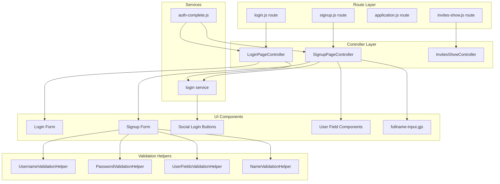
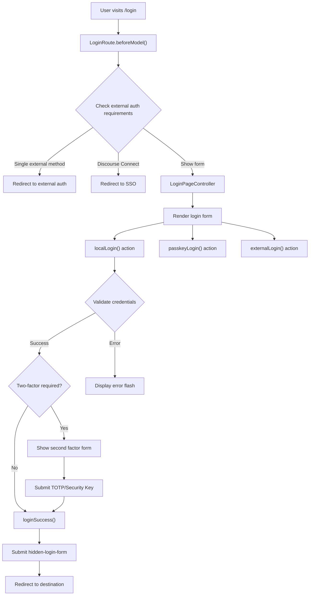
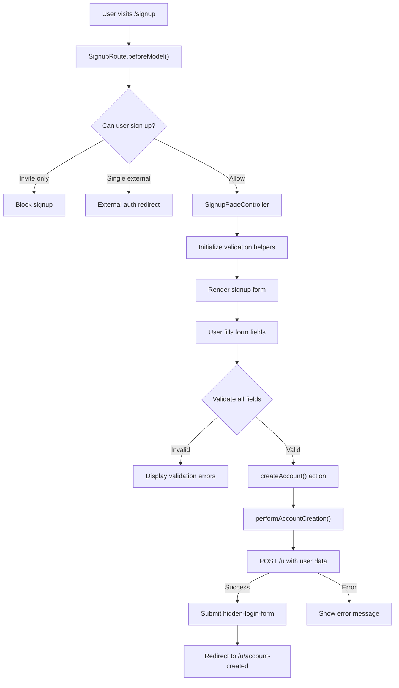
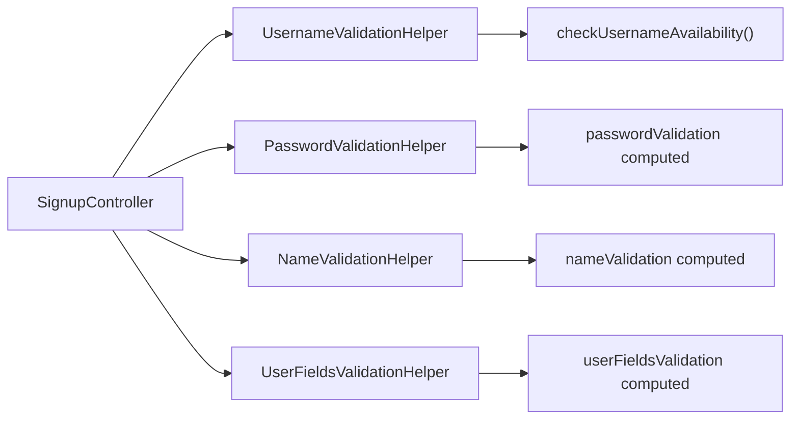
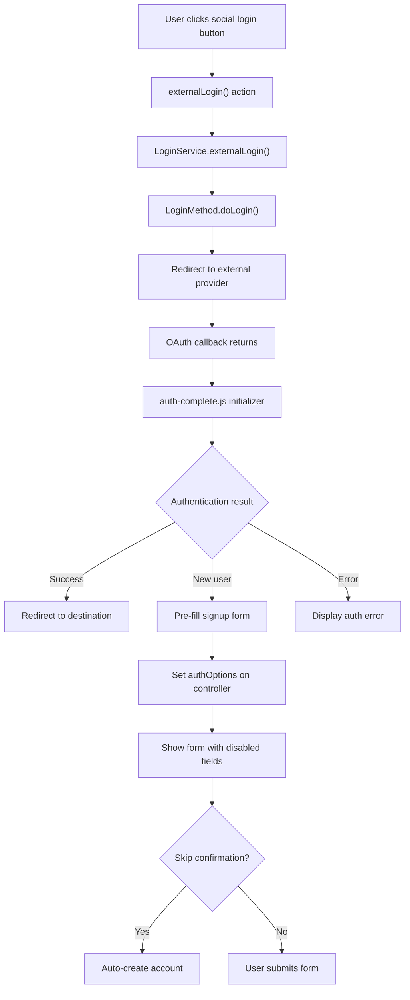
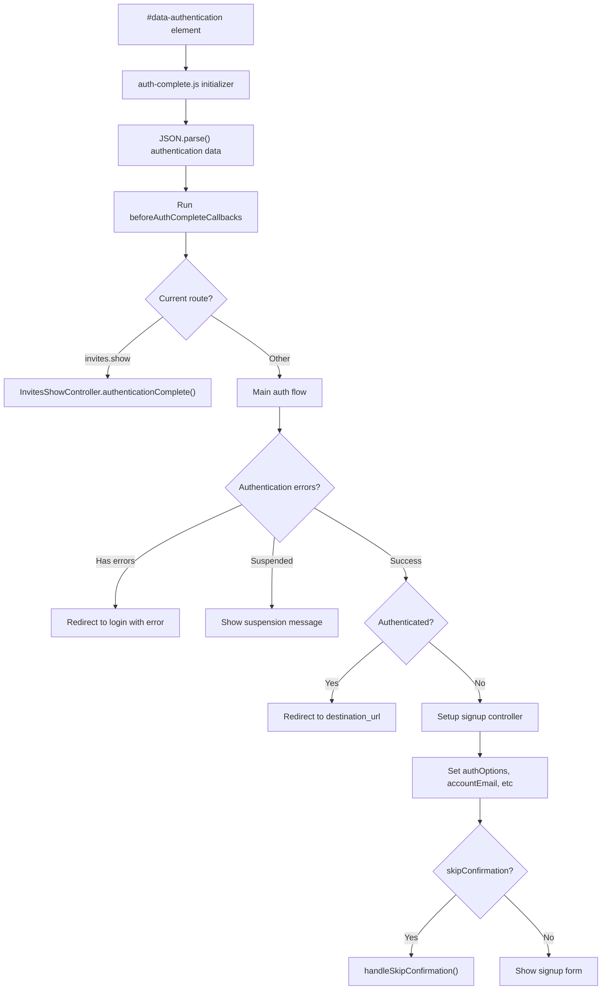

# Login and Registration UI

Relevant source files

The following files were used as context for generating this wiki page:

- [app/controllers/invites_controller.rb](https://github.com/discourse/discourse/blob/8c2d5f9a/app/controllers/invites_controller.rb)
- [app/controllers/session_controller.rb](https://github.com/discourse/discourse/blob/8c2d5f9a/app/controllers/session_controller.rb)
- [app/controllers/users/omniauth_callbacks_controller.rb](https://github.com/discourse/discourse/blob/8c2d5f9a/app/controllers/users/omniauth_callbacks_controller.rb)
- [app/controllers/users_controller.rb](https://github.com/discourse/discourse/blob/8c2d5f9a/app/controllers/users_controller.rb)
- [app/services/user_activator.rb](https://github.com/discourse/discourse/blob/8c2d5f9a/app/services/user_activator.rb)
- [app/services/user_authenticator.rb](https://github.com/discourse/discourse/blob/8c2d5f9a/app/services/user_authenticator.rb)
- [app/views/application/_header.html.erb](https://github.com/discourse/discourse/blob/8c2d5f9a/app/views/application/_header.html.erb)
- [config/initializers/009-omniauth.rb](https://github.com/discourse/discourse/blob/8c2d5f9a/config/initializers/009-omniauth.rb)
- [lib/middleware/omniauth_bypass_middleware.rb](https://github.com/discourse/discourse/blob/8c2d5f9a/lib/middleware/omniauth_bypass_middleware.rb)
- [plugins/discourse-apple-auth/spec/requests/auth_apple_spec.rb](https://github.com/discourse/discourse/blob/8c2d5f9a/plugins/discourse-apple-auth/spec/requests/auth_apple_spec.rb)
- [plugins/discourse-lti/lib/discourse_lti/lti_omniauth_strategy.rb](https://github.com/discourse/discourse/blob/8c2d5f9a/plugins/discourse-lti/lib/discourse_lti/lti_omniauth_strategy.rb)
- [plugins/discourse-lti/plugin.rb](https://github.com/discourse/discourse/blob/8c2d5f9a/plugins/discourse-lti/plugin.rb)
- [plugins/discourse-lti/spec/requests/lti_spec.rb](https://github.com/discourse/discourse/blob/8c2d5f9a/plugins/discourse-lti/spec/requests/lti_spec.rb)
- [spec/rails_helper.rb](https://github.com/discourse/discourse/blob/8c2d5f9a/spec/rails_helper.rb)
- [spec/requests/invites_controller_spec.rb](https://github.com/discourse/discourse/blob/8c2d5f9a/spec/requests/invites_controller_spec.rb)
- [spec/requests/omniauth_callbacks_controller_spec.rb](https://github.com/discourse/discourse/blob/8c2d5f9a/spec/requests/omniauth_callbacks_controller_spec.rb)
- [spec/requests/session_controller_spec.rb](https://github.com/discourse/discourse/blob/8c2d5f9a/spec/requests/session_controller_spec.rb)
- [spec/requests/users_controller_spec.rb](https://github.com/discourse/discourse/blob/8c2d5f9a/spec/requests/users_controller_spec.rb)
- [spec/services/user_authenticator_spec.rb](https://github.com/discourse/discourse/blob/8c2d5f9a/spec/services/user_authenticator_spec.rb)

## Purpose and Scope

This document covers the frontend user interface components and flows for user authentication in Discourse, including login forms, registration forms, social authentication, and form validation. This focuses specifically on the client-side UI components, controllers, and user experience flows.

For backend authentication models, user management, and server-side authentication logic, see [User Model and Authentication](#4.1). For broader user system architecture, see [User System](#4).

## Overview

The login and registration UI system provides comprehensive user authentication interfaces through multiple pathways: local account creation, social authentication, email-based login, and various specialized flows for invitations and external integrations.

### Core UI Architecture

**Sources:** [app/assets/javascripts/discourse/app/routes/login.js:1-94](https://github.com/discourse/discourse/blob/8c2d5f9a/app/assets/javascripts/discourse/app/routes/login.js#L1-L94), [app/assets/javascripts/discourse/app/routes/signup.js:1-107](https://github.com/discourse/discourse/blob/8c2d5f9a/app/assets/javascripts/discourse/app/routes/signup.js#L1-L107), [app/assets/javascripts/discourse/app/controllers/login.js:1-325](https://github.com/discourse/discourse/blob/8c2d5f9a/app/assets/javascripts/discourse/app/controllers/login.js#L1-L325), [app/assets/javascripts/discourse/app/controllers/signup.js:1-590](https://github.com/discourse/discourse/blob/8c2d5f9a/app/assets/javascripts/discourse/app/controllers/signup.js#L1-L590)

## Login UI Flow

The login interface supports multiple authentication methods and handles complex flows including two-factor authentication, password reset, and email-based login.

### Login Flow Architecture

**Sources:** [app/assets/javascripts/discourse/app/routes/login.js:22-80](https://github.com/discourse/discourse/blob/8c2d5f9a/app/assets/javascripts/discourse/app/routes/login.js#L22-L80), [app/assets/javascripts/discourse/app/controllers/login.js:187-298](https://github.com/discourse/discourse/blob/8c2d5f9a/app/assets/javascripts/discourse/app/controllers/login.js#L187-L298)

### Login Controller Features

The `LoginPageController` manages multiple authentication states and methods:

| Property | Purpose |
|----------|---------|
| `loggingIn` | Tracks form submission state |
| `showSecondFactor` | Controls 2FA UI visibility |
| `showSecurityKey` | Controls WebAuthn UI |
| `loginName` | Username/email input value |
| `loginPassword` | Password input value |
| `secondFactorToken` | TOTP/backup code value |

**Key Methods:**
- `localLogin()` - Handles username/password authentication at [app/assets/javascripts/discourse/app/controllers/login.js:187-298]()
- `passkeyLogin()` - WebAuthn/passkey authentication at [app/assets/javascripts/discourse/app/controllers/login.js:119-154]()
- `externalLogin()` - Social authentication trigger at [app/assets/javascripts/discourse/app/controllers/login.js:301-307]()

**Sources:** [app/assets/javascripts/discourse/app/controllers/login.js:23-325](https://github.com/discourse/discourse/blob/8c2d5f9a/app/assets/javascripts/discourse/app/controllers/login.js#L23-L325)

## Registration/Signup UI Flow

The signup system provides comprehensive account creation with validation, custom fields, social authentication, and invite-based registration.

### Signup Flow Architecture

**Sources:** [app/assets/javascripts/discourse/app/routes/signup.js:23-93](https://github.com/discourse/discourse/blob/8c2d5f9a/app/assets/javascripts/discourse/app/routes/signup.js#L23-L93), [app/assets/javascripts/discourse/app/controllers/signup.js:554-588](https://github.com/discourse/discourse/blob/8c2d5f9a/app/assets/javascripts/discourse/app/controllers/signup.js#L554-L588)

### Signup Controller Validation System

The `SignupPageController` uses multiple validation helpers for comprehensive form validation:

**Core Validation Properties:**
- `usernameValidation` - Real-time username availability checking at [app/assets/javascripts/discourse/app/controllers/signup.js:94-96]()
- `passwordValidation` - Password strength and requirements at [app/assets/javascripts/discourse/app/controllers/signup.js:99-101]()
- `emailValidation` - Email format and availability validation at [app/assets/javascripts/discourse/app/controllers/signup.js:237-293]()
- `userFieldsValidation` - Custom user field validation at [app/assets/javascripts/discourse/app/controllers/signup.js:89-91]()

**Sources:** [app/assets/javascripts/discourse/app/controllers/signup.js:26-590](https://github.com/discourse/discourse/blob/8c2d5f9a/app/assets/javascripts/discourse/app/controllers/signup.js#L26-L590), [app/assets/javascripts/discourse/app/lib/username-validation-helper.js:21-136](https://github.com/discourse/discourse/blob/8c2d5f9a/app/assets/javascripts/discourse/app/lib/username-validation-helper.js#L21-L136)

## Social Authentication UI

Social authentication integrates external OAuth providers with the signup and login flows, providing seamless third-party authentication.

### Social Authentication Flow

**Sources:** [app/assets/javascripts/discourse/app/instance-initializers/auth-complete.js:25-118](https://github.com/discourse/discourse/blob/8c2d5f9a/app/assets/javascripts/discourse/app/instance-initializers/auth-complete.js#L25-L118), [app/assets/javascripts/discourse/app/services/login.js:11-21](https://github.com/discourse/discourse/blob/8c2d5f9a/app/assets/javascripts/discourse/app/services/login.js#L11-L21)

### Social Provider Integration

The system supports multiple OAuth providers through a unified interface:

| Provider | Configuration | Features |
|----------|---------------|----------|
| Facebook | `enable_facebook_logins` | Full profile import |
| Google | `enable_google_oauth2_logins` | Email verification |
| GitHub | `enable_github_logins` | Username suggestions |
| Twitter | `enable_twitter_logins` | Manual email entry |
| Discord | `enable_discord_logins` | Username/email import |
| LinkedIn | `enable_linkedin_oidc_logins` | Professional profile |

**Sources:** [spec/system/social_authentication_spec.rb:16-536](https://github.com/discourse/discourse/blob/8c2d5f9a/spec/system/social_authentication_spec.rb#L16-L536)

## Form Validation System

The validation system provides real-time feedback and comprehensive field validation across all authentication forms.

### Validation Helper Architecture

```mermaid
graph TB
    subgraph "Username Validation"
        UsernameHelper["UsernameValidationHelper"] 
        UsernameHelper --> BasicValidation["basicUsernameValidation()"]
        UsernameHelper --> AvailabilityCheck["checkUsernameAvailability()"]
        BasicValidation --> LengthCheck["Length requirements"]
        AvailabilityCheck --> ServerCheck["User.checkUsername()"]
    end
    
    subgraph "Password Validation"
        PasswordHelper["PasswordValidationHelper"]
        PasswordHelper --> StrengthCheck["Password strength"]
        PasswordHelper --> CommonCheck["Common password check"]
        PasswordHelper --> SimilarityCheck["Username/email similarity"]
    end
    
    subgraph "User Fields Validation"
        UserFieldsHelper["UserFieldsValidationHelper"]
        UserFieldsHelper --> TrackedUserField["TrackedUserField instances"]
        TrackedUserField --> RequiredCheck["Required field validation"]
        TrackedUserField --> CustomValidation["Custom validation callbacks"]
    end
    
    subgraph "Email Validation"
        EmailValidation["emailValidation computed property"]
        EmailValidation --> FormatCheck["Email format validation"]
        EmailValidation --> ServerValidation["User.checkEmail()"]
        EmailValidation --> DomainCheck["Blocked domain check"]
    end
```

**Validation States:**
- `ok: true` - Field is valid, show success indicator
- `failed: true` - Field is invalid, show error message  
- `shouldCheck: true` - Trigger server-side validation
- `reason` - Specific validation message to display

**Sources:** [app/assets/javascripts/discourse/app/lib/username-validation-helper.js:78-135](https://github.com/discourse/discourse/blob/8c2d5f9a/app/assets/javascripts/discourse/app/lib/username-validation-helper.js#L78-L135), [app/assets/javascripts/discourse/app/lib/password-validation-helper.js:40-103](https://github.com/discourse/discourse/blob/8c2d5f9a/app/assets/javascripts/discourse/app/lib/password-validation-helper.js#L40-L103), [app/assets/javascripts/discourse/app/lib/user-fields-validation-helper.js:78-116](https://github.com/discourse/discourse/blob/8c2d5f9a/app/assets/javascripts/discourse/app/lib/user-fields-validation-helper.js#L78-L116)

## Authentication Completion Flow

The authentication completion system handles post-authentication redirects and account setup through the `auth-complete.js` initializer.

### Auth Completion Process

**Error Handling:**
The system handles various authentication errors defined in `AuthErrors` array:
- `admin_not_allowed_from_ip_address`
- `awaiting_activation` 
- `awaiting_approval`
- `not_allowed_from_ip_address`
- `requires_invite`

**Sources:** [app/assets/javascripts/discourse/app/instance-initializers/auth-complete.js:7-118](https://github.com/discourse/discourse/blob/8c2d5f9a/app/assets/javascripts/discourse/app/instance-initializers/auth-complete.js#L7-L118)

## Invite-Based Registration

The invite system provides specialized registration flows for users accepting invitations to join the forum.

### Invite Controller Features

The `InvitesShowController` extends the base signup functionality with invite-specific features:

- **Email Handling**: Pre-populates or validates against invite email at [app/assets/javascripts/discourse/app/controllers/invites-show.js:225-296]()
- **External Auth Integration**: Supports OAuth with invite context at [app/assets/javascripts/discourse/app/controllers/invites-show.js:96-108]()  
- **User Field Support**: Includes custom user fields in invite signup at [app/assets/javascripts/discourse/app/controllers/invites-show.js:63-70]()
- **Validation Integration**: Uses the same validation helpers as regular signup at [app/assets/javascripts/discourse/app/controllers/invites-show.js:25-44]()