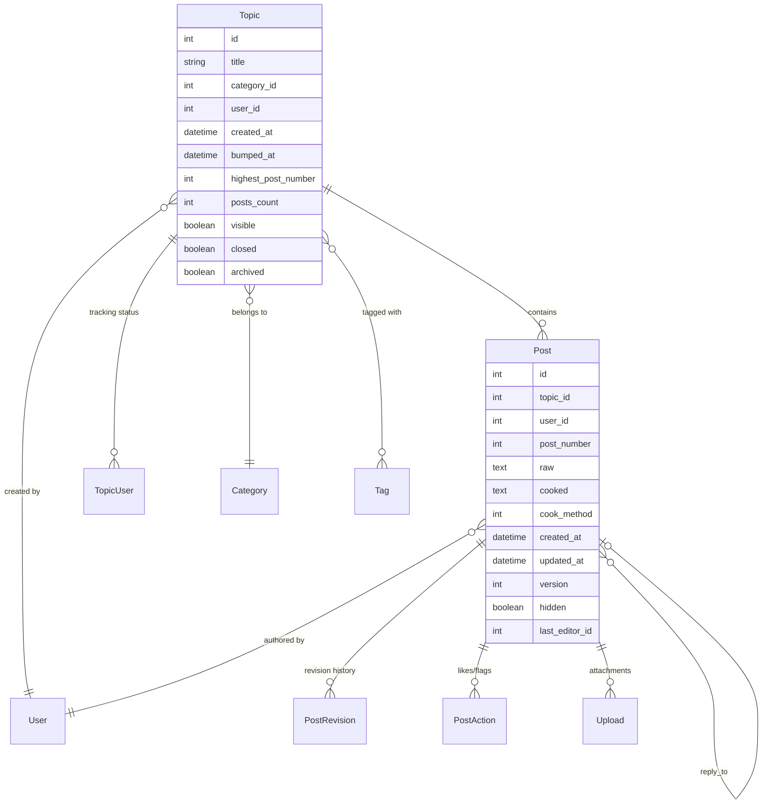
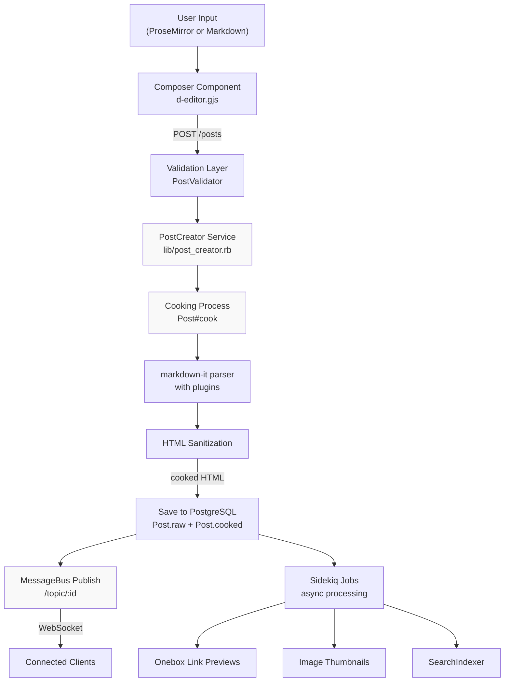
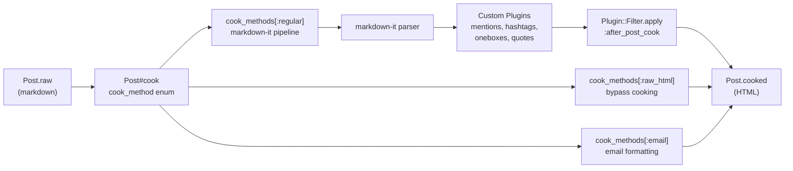
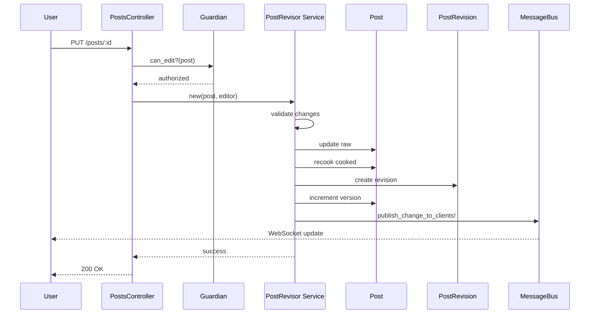
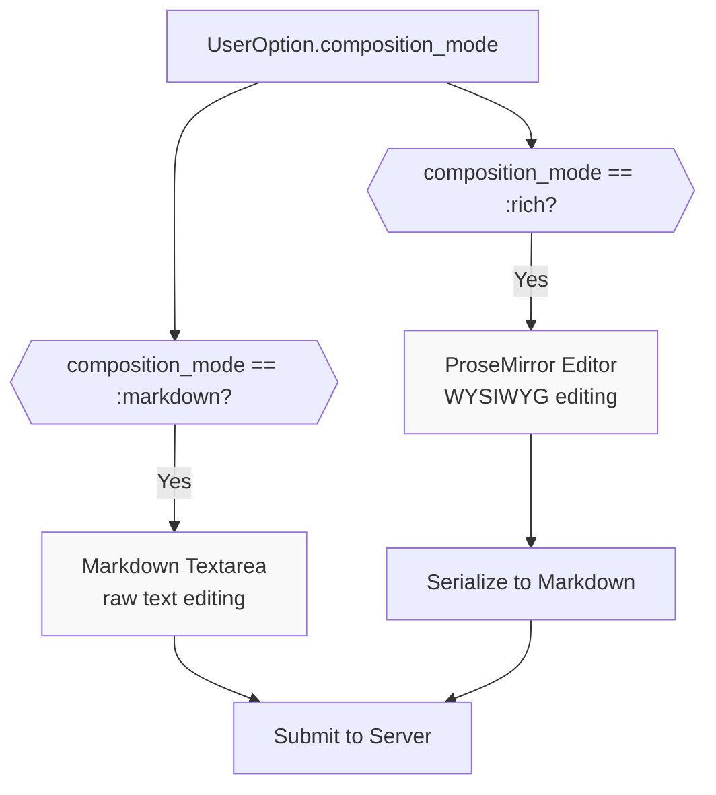
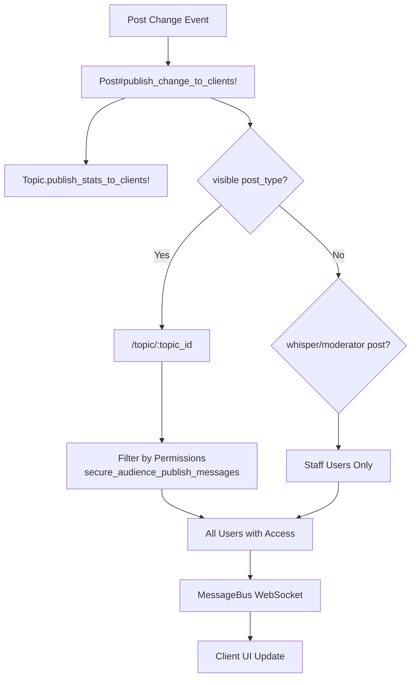
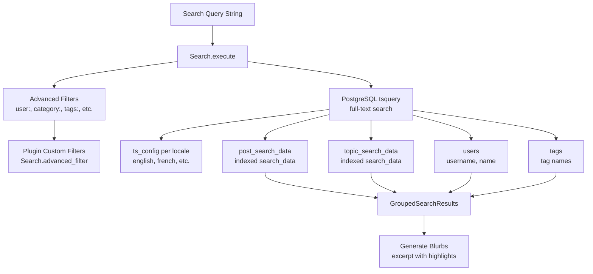
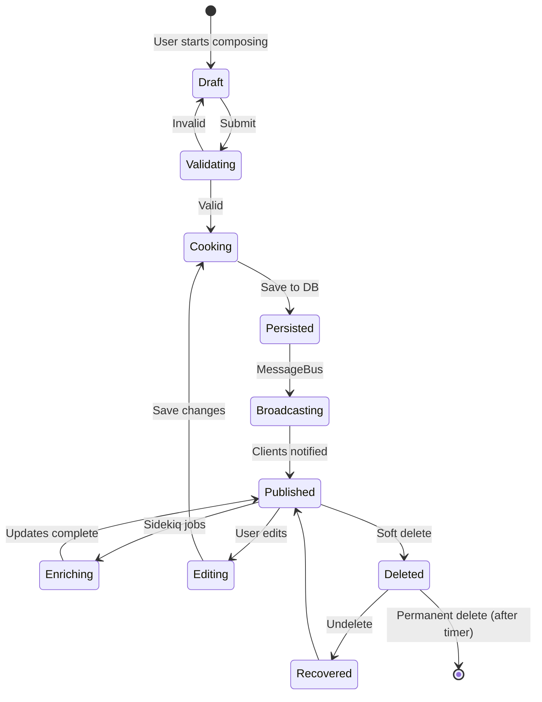

# Content System

<details>
<summary>Relevant source files</summary>

The following files were used as context for generating this wiki page:

- [app/assets/javascripts/discourse-markdown-it/src/features/onebox.js](https://github.com/discourse/discourse/blob/8c2d5f9a/app/assets/javascripts/discourse-markdown-it/src/features/onebox.js)
- [app/assets/javascripts/discourse/app/components/composer/toolbar-buttons.gjs](https://github.com/discourse/discourse/blob/8c2d5f9a/app/assets/javascripts/discourse/app/components/composer/toolbar-buttons.gjs)
- [app/assets/javascripts/discourse/app/components/d-editor.gjs](https://github.com/discourse/discourse/blob/8c2d5f9a/app/assets/javascripts/discourse/app/components/d-editor.gjs)
- [app/assets/javascripts/discourse/app/components/modal/upsert-hyperlink.gjs](https://github.com/discourse/discourse/blob/8c2d5f9a/app/assets/javascripts/discourse/app/components/modal/upsert-hyperlink.gjs)
- [app/assets/javascripts/discourse/app/components/tag-info.gjs](https://github.com/discourse/discourse/blob/8c2d5f9a/app/assets/javascripts/discourse/app/components/tag-info.gjs)
- [app/assets/javascripts/discourse/app/initializers/deprecation-this-property-fallback-handler.js](https://github.com/discourse/discourse/blob/8c2d5f9a/app/assets/javascripts/discourse/app/initializers/deprecation-this-property-fallback-handler.js)
- [app/assets/javascripts/discourse/app/lib/composer/rich-editor-extensions.js](https://github.com/discourse/discourse/blob/8c2d5f9a/app/assets/javascripts/discourse/app/lib/composer/rich-editor-extensions.js)
- [app/assets/javascripts/discourse/app/lib/composer/toolbar.js](https://github.com/discourse/discourse/blob/8c2d5f9a/app/assets/javascripts/discourse/app/lib/composer/toolbar.js)
- [app/assets/javascripts/discourse/app/lib/highlight-syntax.js](https://github.com/discourse/discourse/blob/8c2d5f9a/app/assets/javascripts/discourse/app/lib/highlight-syntax.js)
- [app/assets/javascripts/discourse/app/static/prosemirror/components/image-alt-text-input.gjs](https://github.com/discourse/discourse/blob/8c2d5f9a/app/assets/javascripts/discourse/app/static/prosemirror/components/image-alt-text-input.gjs)
- [app/assets/javascripts/discourse/app/static/prosemirror/components/image-node-view.gjs](https://github.com/discourse/discourse/blob/8c2d5f9a/app/assets/javascripts/discourse/app/static/prosemirror/components/image-node-view.gjs)
- [app/assets/javascripts/discourse/app/static/prosemirror/components/prosemirror-editor.gjs](https://github.com/discourse/discourse/blob/8c2d5f9a/app/assets/javascripts/discourse/app/static/prosemirror/components/prosemirror-editor.gjs)
- [app/assets/javascripts/discourse/app/static/prosemirror/core/inputrules.js](https://github.com/discourse/discourse/blob/8c2d5f9a/app/assets/javascripts/discourse/app/static/prosemirror/core/inputrules.js)
- [app/assets/javascripts/discourse/app/static/prosemirror/core/keymap.js](https://github.com/discourse/discourse/blob/8c2d5f9a/app/assets/javascripts/discourse/app/static/prosemirror/core/keymap.js)
- [app/assets/javascripts/discourse/app/static/prosemirror/extensions/bullet-list.js](https://github.com/discourse/discourse/blob/8c2d5f9a/app/assets/javascripts/discourse/app/static/prosemirror/extensions/bullet-list.js)
- [app/assets/javascripts/discourse/app/static/prosemirror/extensions/code-block.js](https://github.com/discourse/discourse/blob/8c2d5f9a/app/assets/javascripts/discourse/app/static/prosemirror/extensions/code-block.js)
- [app/assets/javascripts/discourse/app/static/prosemirror/extensions/emoji.js](https://github.com/discourse/discourse/blob/8c2d5f9a/app/assets/javascripts/discourse/app/static/prosemirror/extensions/emoji.js)
- [app/assets/javascripts/discourse/app/static/prosemirror/extensions/hashtag.js](https://github.com/discourse/discourse/blob/8c2d5f9a/app/assets/javascripts/discourse/app/static/prosemirror/extensions/hashtag.js)
- [app/assets/javascripts/discourse/app/static/prosemirror/extensions/heading.js](https://github.com/discourse/discourse/blob/8c2d5f9a/app/assets/javascripts/discourse/app/static/prosemirror/extensions/heading.js)
- [app/assets/javascripts/discourse/app/static/prosemirror/extensions/html-inline.js](https://github.com/discourse/discourse/blob/8c2d5f9a/app/assets/javascripts/discourse/app/static/prosemirror/extensions/html-inline.js)
- [app/assets/javascripts/discourse/app/static/prosemirror/extensions/image.js](https://github.com/discourse/discourse/blob/8c2d5f9a/app/assets/javascripts/discourse/app/static/prosemirror/extensions/image.js)
- [app/assets/javascripts/discourse/app/static/prosemirror/extensions/link-toolbar.js](https://github.com/discourse/discourse/blob/8c2d5f9a/app/assets/javascripts/discourse/app/static/prosemirror/extensions/link-toolbar.js)
- [app/assets/javascripts/discourse/app/static/prosemirror/extensions/link.js](https://github.com/discourse/discourse/blob/8c2d5f9a/app/assets/javascripts/discourse/app/static/prosemirror/extensions/link.js)
- [app/assets/javascripts/discourse/app/static/prosemirror/extensions/markdown-paste.js](https://github.com/discourse/discourse/blob/8c2d5f9a/app/assets/javascripts/discourse/app/static/prosemirror/extensions/markdown-paste.js)
- [app/assets/javascripts/discourse/app/static/prosemirror/extensions/mention.js](https://github.com/discourse/discourse/blob/8c2d5f9a/app/assets/javascripts/discourse/app/static/prosemirror/extensions/mention.js)
- [app/assets/javascripts/discourse/app/static/prosemirror/extensions/onebox.js](https://github.com/discourse/discourse/blob/8c2d5f9a/app/assets/javascripts/discourse/app/static/prosemirror/extensions/onebox.js)
- [app/assets/javascripts/discourse/app/static/prosemirror/extensions/ordered-list.js](https://github.com/discourse/discourse/blob/8c2d5f9a/app/assets/javascripts/discourse/app/static/prosemirror/extensions/ordered-list.js)
- [app/assets/javascripts/discourse/app/static/prosemirror/extensions/register-default.js](https://github.com/discourse/discourse/blob/8c2d5f9a/app/assets/javascripts/discourse/app/static/prosemirror/extensions/register-default.js)
- [app/assets/javascripts/discourse/app/static/prosemirror/extensions/trailing-paragraph.js](https://github.com/discourse/discourse/blob/8c2d5f9a/app/assets/javascripts/discourse/app/static/prosemirror/extensions/trailing-paragraph.js)
- [app/assets/javascripts/discourse/app/static/prosemirror/lib/glimmer-node-view.js](https://github.com/discourse/discourse/blob/8c2d5f9a/app/assets/javascripts/discourse/app/static/prosemirror/lib/glimmer-node-view.js)
- [app/assets/javascripts/discourse/app/static/prosemirror/lib/plugin-utils.js](https://github.com/discourse/discourse/blob/8c2d5f9a/app/assets/javascripts/discourse/app/static/prosemirror/lib/plugin-utils.js)
- [app/assets/javascripts/discourse/app/static/prosemirror/lib/text-manipulation.js](https://github.com/discourse/discourse/blob/8c2d5f9a/app/assets/javascripts/discourse/app/static/prosemirror/lib/text-manipulation.js)
- [app/assets/javascripts/discourse/tests/acceptance/tags-intersection-test.js](https://github.com/discourse/discourse/blob/8c2d5f9a/app/assets/javascripts/discourse/tests/acceptance/tags-intersection-test.js)
- [app/assets/javascripts/discourse/tests/helpers/rich-editor-helper.gjs](https://github.com/discourse/discourse/blob/8c2d5f9a/app/assets/javascripts/discourse/tests/helpers/rich-editor-helper.gjs)
- [app/assets/javascripts/discourse/tests/integration/components/prosemirror-editor/emoji-test.js](https://github.com/discourse/discourse/blob/8c2d5f9a/app/assets/javascripts/discourse/tests/integration/components/prosemirror-editor/emoji-test.js)
- [app/assets/javascripts/discourse/tests/integration/components/prosemirror-editor/hashtag-test.js](https://github.com/discourse/discourse/blob/8c2d5f9a/app/assets/javascripts/discourse/tests/integration/components/prosemirror-editor/hashtag-test.js)
- [app/assets/javascripts/discourse/tests/integration/components/prosemirror-editor/html-inline-test.js](https://github.com/discourse/discourse/blob/8c2d5f9a/app/assets/javascripts/discourse/tests/integration/components/prosemirror-editor/html-inline-test.js)
- [app/assets/javascripts/discourse/tests/integration/components/prosemirror-editor/image-test.js](https://github.com/discourse/discourse/blob/8c2d5f9a/app/assets/javascripts/discourse/tests/integration/components/prosemirror-editor/image-test.js)
- [app/assets/javascripts/discourse/tests/integration/components/prosemirror-editor/link-test.js](https://github.com/discourse/discourse/blob/8c2d5f9a/app/assets/javascripts/discourse/tests/integration/components/prosemirror-editor/link-test.js)
- [app/assets/javascripts/discourse/tests/integration/components/prosemirror-editor/mention-test.js](https://github.com/discourse/discourse/blob/8c2d5f9a/app/assets/javascripts/discourse/tests/integration/components/prosemirror-editor/mention-test.js)
- [app/assets/javascripts/discourse/tests/integration/components/prosemirror-editor/prosemirror-editor-test.gjs](https://github.com/discourse/discourse/blob/8c2d5f9a/app/assets/javascripts/discourse/tests/integration/components/prosemirror-editor/prosemirror-editor-test.gjs)
- [app/assets/javascripts/discourse/tests/integration/components/prosemirror-editor/prosemirror-markdown-test.js](https://github.com/discourse/discourse/blob/8c2d5f9a/app/assets/javascripts/discourse/tests/integration/components/prosemirror-editor/prosemirror-markdown-test.js)
- [app/assets/javascripts/discourse/tests/integration/components/prosemirror-editor/quote-test.js](https://github.com/discourse/discourse/blob/8c2d5f9a/app/assets/javascripts/discourse/tests/integration/components/prosemirror-editor/quote-test.js)
- [app/assets/javascripts/discourse/tests/integration/components/prosemirror-editor/strikethrough-test.js](https://github.com/discourse/discourse/blob/8c2d5f9a/app/assets/javascripts/discourse/tests/integration/components/prosemirror-editor/strikethrough-test.js)
- [app/assets/stylesheets/common/d-editor.scss](https://github.com/discourse/discourse/blob/8c2d5f9a/app/assets/stylesheets/common/d-editor.scss)
- [app/assets/stylesheets/common/rich-editor/rich-editor.scss](https://github.com/discourse/discourse/blob/8c2d5f9a/app/assets/stylesheets/common/rich-editor/rich-editor.scss)
- [app/controllers/list_controller.rb](https://github.com/discourse/discourse/blob/8c2d5f9a/app/controllers/list_controller.rb)
- [app/controllers/posts_controller.rb](https://github.com/discourse/discourse/blob/8c2d5f9a/app/controllers/posts_controller.rb)
- [app/controllers/tags_controller.rb](https://github.com/discourse/discourse/blob/8c2d5f9a/app/controllers/tags_controller.rb)
- [app/controllers/topics_controller.rb](https://github.com/discourse/discourse/blob/8c2d5f9a/app/controllers/topics_controller.rb)
- [app/controllers/users/associate_accounts_controller.rb](https://github.com/discourse/discourse/blob/8c2d5f9a/app/controllers/users/associate_accounts_controller.rb)
- [app/models/discourse_connect.rb](https://github.com/discourse/discourse/blob/8c2d5f9a/app/models/discourse_connect.rb)
- [app/models/email_style.rb](https://github.com/discourse/discourse/blob/8c2d5f9a/app/models/email_style.rb)
- [app/models/post.rb](https://github.com/discourse/discourse/blob/8c2d5f9a/app/models/post.rb)
- [app/models/topic.rb](https://github.com/discourse/discourse/blob/8c2d5f9a/app/models/topic.rb)
- [app/models/topic_list.rb](https://github.com/discourse/discourse/blob/8c2d5f9a/app/models/topic_list.rb)
- [app/serializers/user_post_bookmark_serializer.rb](https://github.com/discourse/discourse/blob/8c2d5f9a/app/serializers/user_post_bookmark_serializer.rb)
- [app/services/destroy_task.rb](https://github.com/discourse/discourse/blob/8c2d5f9a/app/services/destroy_task.rb)
- [app/services/user_destroyer.rb](https://github.com/discourse/discourse/blob/8c2d5f9a/app/services/user_destroyer.rb)
- [lib/discourse_plugin_registry.rb](https://github.com/discourse/discourse/blob/8c2d5f9a/lib/discourse_plugin_registry.rb)
- [lib/discourse_webauthn.rb](https://github.com/discourse/discourse/blob/8c2d5f9a/lib/discourse_webauthn.rb)
- [lib/has_errors.rb](https://github.com/discourse/discourse/blob/8c2d5f9a/lib/has_errors.rb)
- [lib/import_export/base_exporter.rb](https://github.com/discourse/discourse/blob/8c2d5f9a/lib/import_export/base_exporter.rb)
- [lib/plugin/instance.rb](https://github.com/discourse/discourse/blob/8c2d5f9a/lib/plugin/instance.rb)
- [lib/post_creator.rb](https://github.com/discourse/discourse/blob/8c2d5f9a/lib/post_creator.rb)
- [lib/post_destroyer.rb](https://github.com/discourse/discourse/blob/8c2d5f9a/lib/post_destroyer.rb)
- [lib/post_revisor.rb](https://github.com/discourse/discourse/blob/8c2d5f9a/lib/post_revisor.rb)
- [lib/search.rb](https://github.com/discourse/discourse/blob/8c2d5f9a/lib/search.rb)
- [lib/second_factor/auth_manager.rb](https://github.com/discourse/discourse/blob/8c2d5f9a/lib/second_factor/auth_manager.rb)
- [lib/server_session.rb](https://github.com/discourse/discourse/blob/8c2d5f9a/lib/server_session.rb)
- [lib/tasks/destroy.rake](https://github.com/discourse/discourse/blob/8c2d5f9a/lib/tasks/destroy.rake)
- [lib/topic_creator.rb](https://github.com/discourse/discourse/blob/8c2d5f9a/lib/topic_creator.rb)
- [lib/topic_query.rb](https://github.com/discourse/discourse/blob/8c2d5f9a/lib/topic_query.rb)
- [lib/topics_filter.rb](https://github.com/discourse/discourse/blob/8c2d5f9a/lib/topics_filter.rb)
- [plugins/chat/app/serializers/chat/user_message_bookmark_serializer.rb](https://github.com/discourse/discourse/blob/8c2d5f9a/plugins/chat/app/serializers/chat/user_message_bookmark_serializer.rb)
- [plugins/discourse-assign/plugin.rb](https://github.com/discourse/discourse/blob/8c2d5f9a/plugins/discourse-assign/plugin.rb)
- [plugins/discourse-assign/spec/components/topic_query_spec.rb](https://github.com/discourse/discourse/blob/8c2d5f9a/plugins/discourse-assign/spec/components/topic_query_spec.rb)
- [plugins/discourse-local-dates/assets/javascripts/lib/rich-editor-extension.js](https://github.com/discourse/discourse/blob/8c2d5f9a/plugins/discourse-local-dates/assets/javascripts/lib/rich-editor-extension.js)
- [plugins/discourse-solved/lib/discourse_solved/register_filters.rb](https://github.com/discourse/discourse/blob/8c2d5f9a/plugins/discourse-solved/lib/discourse_solved/register_filters.rb)
- [spec/lib/freedom_patches/translate_accelerator_spec.rb](https://github.com/discourse/discourse/blob/8c2d5f9a/spec/lib/freedom_patches/translate_accelerator_spec.rb)
- [spec/lib/plugin/instance_spec.rb](https://github.com/discourse/discourse/blob/8c2d5f9a/spec/lib/plugin/instance_spec.rb)
- [spec/lib/post_creator_spec.rb](https://github.com/discourse/discourse/blob/8c2d5f9a/spec/lib/post_creator_spec.rb)
- [spec/lib/post_destroyer_spec.rb](https://github.com/discourse/discourse/blob/8c2d5f9a/spec/lib/post_destroyer_spec.rb)
- [spec/lib/post_revisor_spec.rb](https://github.com/discourse/discourse/blob/8c2d5f9a/spec/lib/post_revisor_spec.rb)
- [spec/lib/search_spec.rb](https://github.com/discourse/discourse/blob/8c2d5f9a/spec/lib/search_spec.rb)
- [spec/lib/second_factor/auth_manager_spec.rb](https://github.com/discourse/discourse/blob/8c2d5f9a/spec/lib/second_factor/auth_manager_spec.rb)
- [spec/lib/server_session_spec.rb](https://github.com/discourse/discourse/blob/8c2d5f9a/spec/lib/server_session_spec.rb)
- [spec/lib/topic_creator_spec.rb](https://github.com/discourse/discourse/blob/8c2d5f9a/spec/lib/topic_creator_spec.rb)
- [spec/lib/topic_query_spec.rb](https://github.com/discourse/discourse/blob/8c2d5f9a/spec/lib/topic_query_spec.rb)
- [spec/lib/topics_filter_spec.rb](https://github.com/discourse/discourse/blob/8c2d5f9a/spec/lib/topics_filter_spec.rb)
- [spec/models/discourse_connect_spec.rb](https://github.com/discourse/discourse/blob/8c2d5f9a/spec/models/discourse_connect_spec.rb)
- [spec/models/post_spec.rb](https://github.com/discourse/discourse/blob/8c2d5f9a/spec/models/post_spec.rb)
- [spec/models/topic_spec.rb](https://github.com/discourse/discourse/blob/8c2d5f9a/spec/models/topic_spec.rb)
- [spec/requests/list_controller_spec.rb](https://github.com/discourse/discourse/blob/8c2d5f9a/spec/requests/list_controller_spec.rb)
- [spec/requests/posts_controller_spec.rb](https://github.com/discourse/discourse/blob/8c2d5f9a/spec/requests/posts_controller_spec.rb)
- [spec/requests/tags_controller_spec.rb](https://github.com/discourse/discourse/blob/8c2d5f9a/spec/requests/tags_controller_spec.rb)
- [spec/requests/topics_controller_spec.rb](https://github.com/discourse/discourse/blob/8c2d5f9a/spec/requests/topics_controller_spec.rb)
- [spec/serializers/topic_view_details_serializer_spec.rb](https://github.com/discourse/discourse/blob/8c2d5f9a/spec/serializers/topic_view_details_serializer_spec.rb)
- [spec/services/destroy_task_spec.rb](https://github.com/discourse/discourse/blob/8c2d5f9a/spec/services/destroy_task_spec.rb)
- [spec/services/user_destroyer_spec.rb](https://github.com/discourse/discourse/blob/8c2d5f9a/spec/services/user_destroyer_spec.rb)
- [spec/support/integration_helpers.rb](https://github.com/discourse/discourse/blob/8c2d5f9a/spec/support/integration_helpers.rb)
- [spec/system/composer/prosemirror_editor_spec.rb](https://github.com/discourse/discourse/blob/8c2d5f9a/spec/system/composer/prosemirror_editor_spec.rb)
- [spec/system/page_objects/components/composer.rb](https://github.com/discourse/discourse/blob/8c2d5f9a/spec/system/page_objects/components/composer.rb)
- [spec/system/page_objects/modals/upsert_hyperlink.rb](https://github.com/discourse/discourse/blob/8c2d5f9a/spec/system/page_objects/modals/upsert_hyperlink.rb)
- [spec/system/tags_intersection_spec.rb](https://github.com/discourse/discourse/blob/8c2d5f9a/spec/system/tags_intersection_spec.rb)
- [spec/tasks/destroy_spec.rb](https://github.com/discourse/discourse/blob/8c2d5f9a/spec/tasks/destroy_spec.rb)

</details>


## Purpose and Scope

The Content System is the core of Discourse's forum functionality, responsible for creating, storing, editing, and rendering all user-generated content. This document provides an overview of how topics and posts are managed throughout their lifecycle—from initial creation through editing, rendering, and real-time distribution to clients.

For information about the rich text editor interface, see [Rich Text Editor (ProseMirror)](#5.2). For details on search and filtering capabilities, see [Search and Topic Filtering](#5.3). For information about topics and posts CRUD operations and services, see [Topics and Posts](#5.1).

---

## Core Data Models

Discourse organizes content into a hierarchical structure where `Topic` represents a discussion thread and `Post` represents individual messages within that thread.

### Topic and Post Relationship



**Key Model Characteristics:**

| Model | Primary File | Key Attributes | Purpose |
|-------|-------------|----------------|---------|
| `Topic` | [app/models/topic.rb:1-450]() | `title`, `category_id`, `user_id`, `posts_count` | Container for discussion thread |
| `Post` | [app/models/post.rb:1-100]() | `raw`, `cooked`, `topic_id`, `post_number` | Individual message in a topic |
| `PostRevision` | (via associations) | `post_id`, `number`, `modifications` | Tracks edit history |
| `TopicUser` | (via associations) | `topic_id`, `user_id`, `notification_level` | Per-user topic tracking |

**Sources:** [app/models/topic.rb:255-318](https://github.com/discourse/discourse/blob/8c2d5f9a/app/models/topic.rb#L255-L318), [app/models/post.rb:35-75](https://github.com/discourse/discourse/blob/8c2d5f9a/app/models/post.rb#L35-L75)

---

## Content Creation Pipeline

Content creation in Discourse follows a well-defined pipeline that transforms user input into persisted, rendered content with real-time distribution.



**Pipeline Stages:**

1. **User Input**: Content entered in ProseMirror rich editor or markdown textarea
2. **Validation**: [app/models/post.rb:76-78]() - `PostValidator` checks length, censored words, etc.
3. **Post Creation**: Service object handles business logic and side effects
4. **Cooking**: [app/models/post.rb:322-371]() - Transforms `raw` markdown to `cooked` HTML
5. **Persistence**: Saves both `raw` and `cooked` versions to database
6. **Real-time Broadcast**: [app/models/post.rb:226-257]() - Publishes updates via MessageBus
7. **Async Enrichment**: Background jobs process oneboxes, thumbnails, search indexing

**Sources:** [app/models/post.rb:322-371](https://github.com/discourse/discourse/blob/8c2d5f9a/app/models/post.rb#L322-L371), [app/controllers/posts_controller.rb:1-35](https://github.com/discourse/discourse/blob/8c2d5f9a/app/controllers/posts_controller.rb#L1-L35), [spec/requests/posts_controller_spec.rb:1-250](https://github.com/discourse/discourse/blob/8c2d5f9a/spec/requests/posts_controller_spec.rb#L1-L250)

---

## Content Cooking and Rendering

The "cooking" process is central to Discourse's content system, converting markdown to HTML with custom extensions.

### Cooking Architecture



**Cook Methods Enum:**

| Value | Name | Purpose |
|-------|------|---------|
| 1 | `regular` | Standard markdown-it pipeline with custom plugins |
| 2 | `raw_html` | Raw HTML passthrough (e.g., RSS imports) |
| 3 | `email` | Email-specific formatting |

**Key Cooking Options:**

- `omit_nofollow`: [app/models/post.rb:313-320]() - Remove nofollow for trusted users
- `user_id`: [app/models/post.rb:336]() - Used for Guardian checks in hashtag/category rendering
- `post_id`: [app/models/post.rb:338]() - Context for secure upload URLs
- `secure uploads`: [app/models/post.rb:340-356]() - Rewrites upload URLs for secure topics

**Sources:** [app/models/post.rb:322-371](https://github.com/discourse/discourse/blob/8c2d5f9a/app/models/post.rb#L322-L371), [app/models/post.rb:186-188](https://github.com/discourse/discourse/blob/8c2d5f9a/app/models/post.rb#L186-L188)

---

## Content Editing and Versioning

Post editing is handled by the `PostRevisor` service, which manages edit permissions, validation, and revision tracking.

### Edit Flow



**Edit Validation:**

- **Edit Window**: [app/models/post.rb:1-13]() - `LimitedEdit` mixin enforces time limits
- **Grace Period**: Edits within grace period don't create revisions
- **Permissions**: [app/models/post.rb:1-13]() - Guardian checks ownership or moderator status
- **Conflict Detection**: [app/controllers/topics_controller.rb:360-373]() - Checks `original_title` for concurrent edits

**Revision Tracking:**

Post revisions store:
- Old and new values for changed fields
- Editor user ID and timestamp
- Revision number (sequential)
- Hidden flag (for staff-only revisions)

**Sources:** [lib/post_revisor.rb:1-27](https://github.com/discourse/discourse/blob/8c2d5f9a/lib/post_revisor.rb#L1-L27), [spec/lib/post_revisor_spec.rb:1-20](https://github.com/discourse/discourse/blob/8c2d5f9a/spec/lib/post_revisor_spec.rb#L1-L20), [app/controllers/posts_controller.rb:1-35](https://github.com/discourse/discourse/blob/8c2d5f9a/app/controllers/posts_controller.rb#L1-L35)

---

## Rich Text Editor Integration

Discourse supports two editing modes: a ProseMirror-based rich editor and a traditional markdown textarea.

### Editor Mode Selection



**Editor Preference Storage:**

- Stored in `UserOption.composition_mode` enum: [spec/system/composer/prosemirror_editor_spec.rb:56-71]()
- Values: `USER_OPTION_COMPOSITION_MODES[:rich]` or `[:markdown]`
- Toggle via keyboard shortcut (Ctrl+M): [spec/system/composer/prosemirror_editor_spec.rb:678-695]()

**ProseMirror Extensions:**

The rich editor uses a plugin-based architecture with default extensions:

| Extension | Purpose | File |
|-----------|---------|------|
| `emoji` | Emoji autocomplete and rendering | [app/assets/javascripts/discourse/app/static/prosemirror/extensions/register-default.js:6]() |
| `mention` | User/group @mentions | [app/assets/javascripts/discourse/app/static/prosemirror/extensions/register-default.js:14]() |
| `hashtag` | Category/tag #hashtags | [app/assets/javascripts/discourse/app/static/prosemirror/extensions/register-default.js:6]() |
| `onebox` | Link previews | [app/assets/javascripts/discourse/app/static/prosemirror/extensions/register-default.js:15]() |
| `image` | Image upload and display | [app/assets/javascripts/discourse/app/static/prosemirror/extensions/register-default.js:10]() |
| `quote` | Quote block formatting | [app/assets/javascripts/discourse/app/static/prosemirror/extensions/register-default.js:17]() |

**Sources:** [app/assets/javascripts/discourse/app/static/prosemirror/extensions/register-default.js:25-54](https://github.com/discourse/discourse/blob/8c2d5f9a/app/assets/javascripts/discourse/app/static/prosemirror/extensions/register-default.js#L25-L54), [spec/system/composer/prosemirror_editor_spec.rb:1-50](https://github.com/discourse/discourse/blob/8c2d5f9a/spec/system/composer/prosemirror_editor_spec.rb#L1-L50)

---

## Real-time Updates via MessageBus

Content changes are broadcast to connected clients using MessageBus, enabling instant UI updates without polling.

### MessageBus Publication Channels



**Message Types:**

Published messages include:
- `type`: Change type (e.g., "created", "revised", "deleted")
- `id`: Post ID
- `post_number`: Sequential number in topic
- `version`: Post version number
- `user_id`: Author ID
- `last_editor_id`: Last editor ID

**Audience Filtering:**

[app/models/post.rb:247-257]() - Messages are filtered based on:
- Topic category permissions
- Topic allowed users (for PMs)
- Post type (whispers only to staff)

**Sources:** [app/models/post.rb:226-257](https://github.com/discourse/discourse/blob/8c2d5f9a/app/models/post.rb#L226-L257), [app/models/topic.rb:1-450](https://github.com/discourse/discourse/blob/8c2d5f9a/app/models/topic.rb#L1-L450)

---

## Search and Filtering Systems

Content discovery relies on two complementary systems: full-text search and topic filtering.

### Search Architecture



**Search Configuration:**

- **Text Search Config**: [lib/search.rb:30-72]() - Locale-specific dictionaries
- **Accent Handling**: [lib/search.rb:74-84]() - Optional accent insensitivity via `unaccent()`
- **Custom Ranking**: [spec/lib/search_spec.rb:155-177]() - Configurable ranking weights

**Topic Filtering:**

The `TopicsFilter` class provides structured filtering:

| Filter | Syntax | Example |
|--------|--------|---------|
| Category | `category:slug` | `category:support` |
| Tag | `tag:name` | `tag:bug` |
| Status | `status:open` | `status:closed` |
| Activity | `activity-after:date` | `activity-after:2024-01-01` |
| Created | `created-by:username` | `created-by:sam` |
| Custom | `plugin-defined` | Plugin-specific filters |

**Sources:** [lib/search.rb:1-100](https://github.com/discourse/discourse/blob/8c2d5f9a/lib/search.rb#L1-L100), [lib/topics_filter.rb:1-50](https://github.com/discourse/discourse/blob/8c2d5f9a/lib/topics_filter.rb#L1-L50), [lib/topic_query.rb:1-100](https://github.com/discourse/discourse/blob/8c2d5f9a/lib/topic_query.rb#L1-L100)

---

## Plugin Extension Points

The Content System provides numerous extension points for plugins to customize behavior.

### Post and Topic Extension Points

| Extension Point | Method | Purpose | Example Use Case |
|----------------|--------|---------|------------------|
| Custom Fields | `register_post_custom_field_type` | Add custom metadata | Voting scores, AI flags |
| Serializer Extensions | `add_to_serializer(:post, :attr)` | Add API data | Custom post attributes |
| Validation | `validate(Post, :method)` | Custom validation | Content restrictions |
| After Create Callbacks | `add_model_callback(:post, :after_create)` | Post-creation logic | Analytics tracking |
| Post Filters | `register_topic_view_posts_filter` | Filter posts in TopicView | Hide certain post types |
| Search Filters | `register_search_advanced_filter` | Custom search syntax | Search custom fields |
| Topic Filters | `register_custom_filter_by_status` | Custom status filters | Custom topic states |

**Example: Custom Post Field**

[lib/plugin/instance.rb:682-686]():
```ruby
# In plugin.rb
register_post_custom_field_type("word_count", :integer)
```

**Example: Search Extension**

[lib/plugin/instance.rb:307-313]():
```ruby
# In plugin.rb
register_search_advanced_filter(/^min_chars:(\d+)$/) do |posts, match|
  posts.where("LENGTH(raw) >= ?", match.to_i)
end
```

**Example: Topic Filter Extension**

[lib/plugin/instance.rb:291-297]():
```ruby
# In plugin.rb
register_custom_filter_by_status("archived") do |scope|
  scope.where(archived: true)
end
```

**Sources:** [lib/plugin/instance.rb:260-313](https://github.com/discourse/discourse/blob/8c2d5f9a/lib/plugin/instance.rb#L260-L313), [lib/plugin/instance.rb:668-700](https://github.com/discourse/discourse/blob/8c2d5f9a/lib/plugin/instance.rb#L668-L700), [spec/lib/plugin/instance_spec.rb:1-220](https://github.com/discourse/discourse/blob/8c2d5f9a/spec/lib/plugin/instance_spec.rb#L1-L220)

---

## Content Lifecycle Summary



**State Transitions:**

1. **Draft**: Content in composer, not submitted
2. **Validating**: Server-side validation of content
3. **Cooking**: Markdown to HTML transformation
4. **Persisted**: Saved to database with version 1
5. **Broadcasting**: Real-time notification to clients
6. **Published**: Visible to authorized users
7. **Enriching**: Async processing (oneboxes, thumbnails)
8. **Editing**: User modifies content, increments version
9. **Deleted**: Soft deleted, recoverable
10. **Permanent Delete**: After `PERMANENT_DELETE_TIMER` [app/models/post.rb:30]()