# Crop depth compatibility

The corrected crop operation matches ImageMagick depth in all eight production-image cases: 8-bit when stripping metadata, 16-bit otherwise. All outputs are 640×480. The 16-bit inputs use independent low-order bits and include RGB, grayscale, RGB+alpha and grayscale+alpha. Libvips has a lower warm median  in these eight cases; this does not imply a general speedup.

Source 81f71327e66f0db320939fc8def0826e2e4ea1e0. Measurements ran on the supplied Linux host in `discourse/base:2.0.20260812-0036`, digest `sha256:837e8ed4b5916baa36856b842ad84fe262b6b1b5550701f8844b13cc7acad7a5`, with Landlock, 2 CPUs and 2 GiB limits and UID 1000. The results record UID, runtime versions and digest; the console records Docker image inspection. This is the official launcher default, with no independently confirmed deployment override.

Before means the legacy ImageMagick renderer; after means the corrected libvips renderer. Each row has 31 alternating warm calls per backend. Timing includes wrapper, sandbox child, IPC where applicable and encoding, but excludes Rails boot, quality probing, evidence decoding and the optimizer. PNG does not require a quality probe.

| Input / strip metadata | Before median  / p95 ms | After median  / p95 ms | Before / after depth | Before / after bytes | Visible mean / maximum difference |
| --- | ---: | ---: | --- | ---: | ---: |
| rgb16-strip-false | 363.69 / 500.00 | 192.96 / 228.29 | 16 / 16 | 1,768,132 / 1,808,664 | 3.790 / 16 |
| rgb16-strip-true | 283.17 / 380.10 | 132.13 / 153.45 | 8 / 8 | 896,715 / 901,112 | 5.505 / 53 |
| rgba16-strip-false | 411.09 / 582.39 | 213.55 / 266.47 | 16 / 16 | 2,462,739 / 2,461,726 | 2.657 / 20 |
| rgba16-strip-true | 486.76 / 624.29 | 214.20 / 325.39 | 8 / 8 | 1,125,821 / 1,168,263 | 4.083 / 33 |
| grey16-strip-false | 198.80 / 240.14 | 115.52 / 128.88 | 16 / 16 | 591,929 / 603,589 | 3.792 / 18 |
| grey16-strip-true | 482.63 / 581.81 | 111.05 / 124.82 | 8 / 8 | 300,522 / 300,749 | 5.678 / 50 |
| greya16-strip-false | 279.97 / 367.09 | 157.15 / 193.20 | 16 / 16 | 1,231,921 / 1,231,605 | 2.653 / 20 |
| greya16-strip-true | 269.07 / 354.66 | 184.52 / 220.91 | 8 / 8 | 574,608 / 589,601 | 4.231 / 36 |

Visible differences use 8-bit sRGB previews composited over black and white; the table shows the larger result. Outputs are not pixel-identical. [Native-depth measurements](native-depth.json) also retain original sample formats, bands, alpha, depth and differences including hidden RGB. Native 16-bit differences use 0–65535 units; do not compare them directly with 8-bit differences. Strong random detail and transparent pixels expose resampling/sharpening differences. The fix promises compatible depth, not identical pixels.

## Before/after outputs

### rgb16-strip-false

| ImageMagick | libvips |
| --- | --- |
| 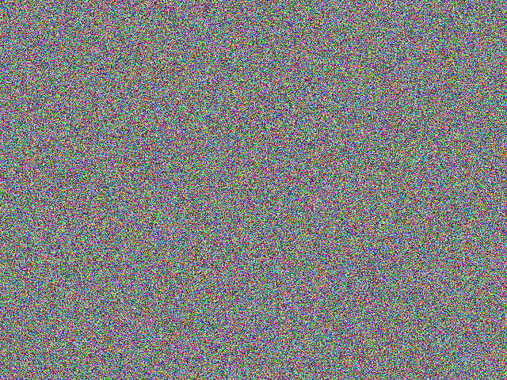 | 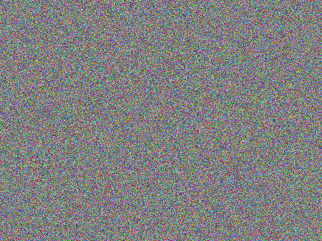 |

### rgb16-strip-true

| ImageMagick | libvips |
| --- | --- |
| 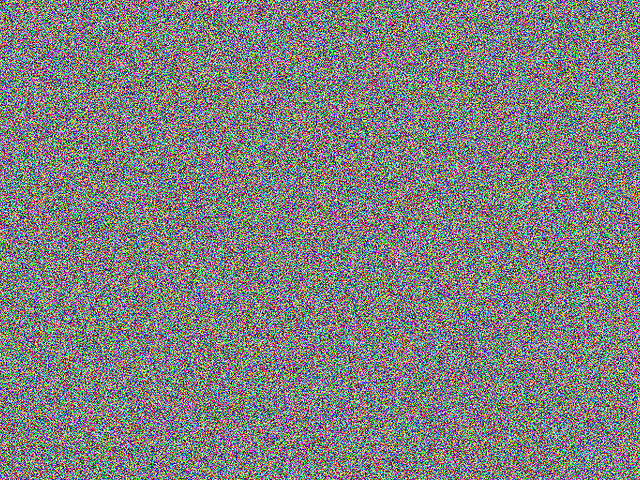 | 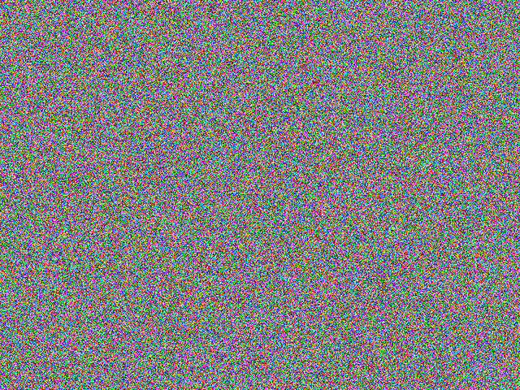 |

### rgba16-strip-false

| ImageMagick | libvips |
| --- | --- |
| 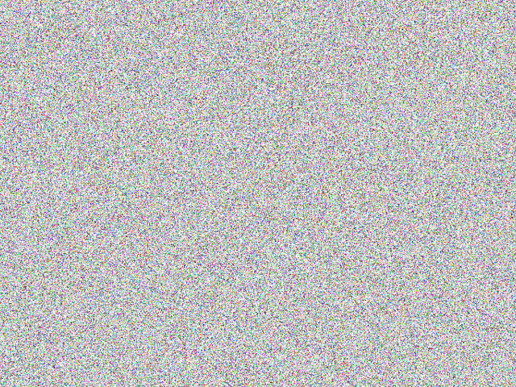 | 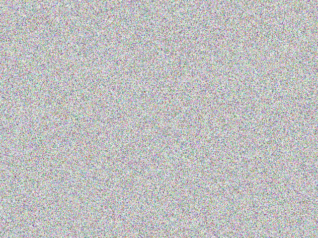 |

### rgba16-strip-true

| ImageMagick | libvips |
| --- | --- |
| 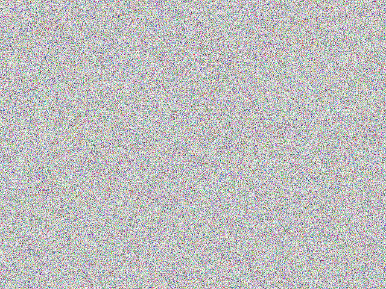 | 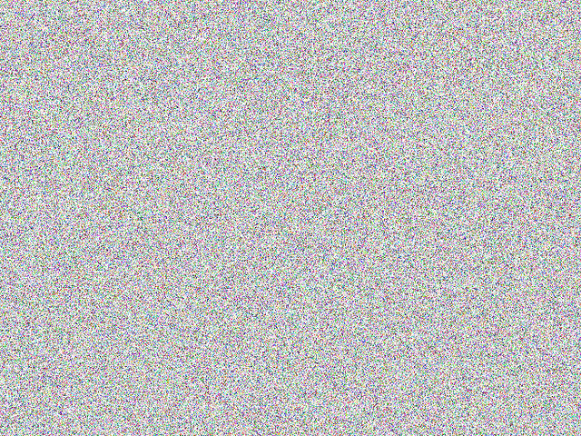 |

### grey16-strip-false

| ImageMagick | libvips |
| --- | --- |
| 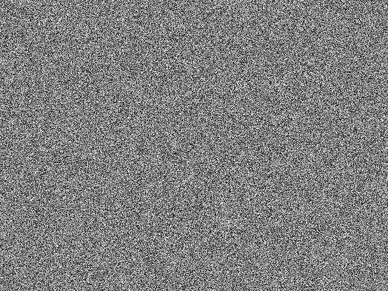 | 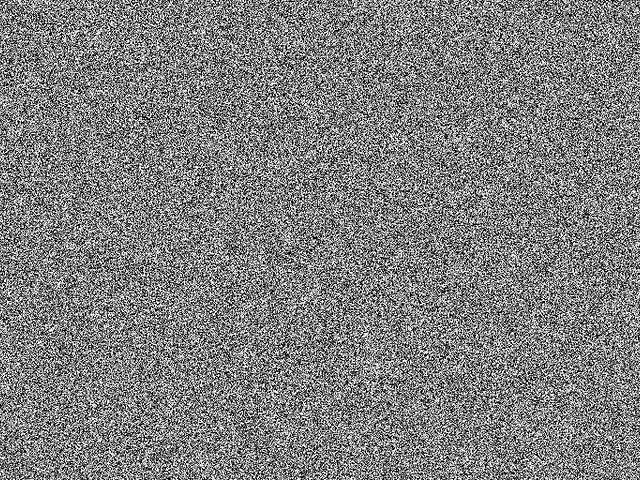 |

### grey16-strip-true

| ImageMagick | libvips |
| --- | --- |
| 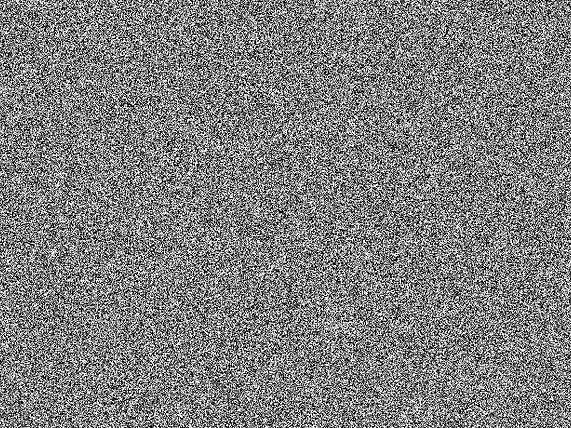 | 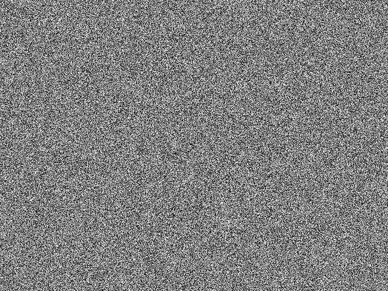 |

### greya16-strip-false

| ImageMagick | libvips |
| --- | --- |
| 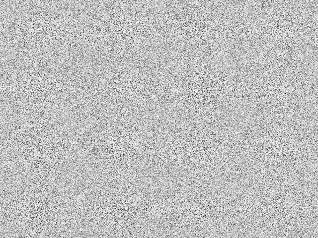 | 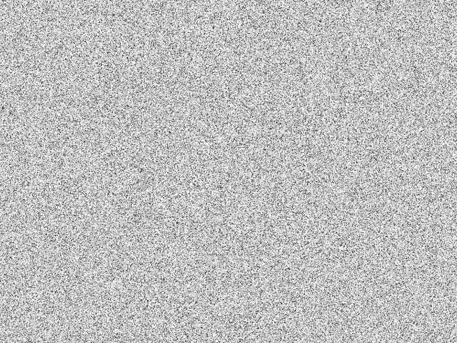 |

### greya16-strip-true

| ImageMagick | libvips |
| --- | --- |
| 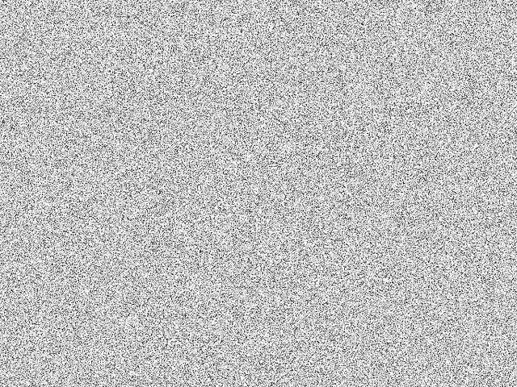 | 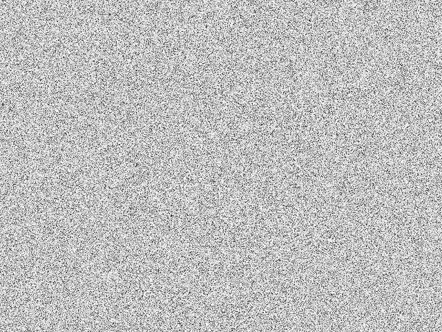 |

Five fresh native workers on rgb16-strip-false had median 551.54ms (range 472.86–572.30ms). This includes startup and conversion; there is no equivalent fresh-worker ImageMagick series.

## Full caller and optimizer

Separate local DV checks exercised actual `OptimizedImage.crop` with the real optimizer on these same four inputs, both metadata settings, and both feature-flag values (16 outputs). These are behavioral checks, not production timing measurements. All succeeded with 640×480 outputs and matching depth modes. The grayscale 8-bit outputs are below the 500k PNG-quantization threshold; the optimizer was left enabled. The other raw outputs exceed that threshold.

| Input | Strip | ImageMagick depth / final bytes | libvips depth / final bytes |
| --- | --- | ---: | ---: |
| rgb16 | False | 16 / 1,763,650 | 16 / 1,794,448 |
| rgb16 | True | 8 / 874,938 | 8 / 896,775 |
| rgba16 | False | 16 / 2,445,472 | 16 / 2,453,322 |
| rgba16 | True | 8 / 1,123,091 | 8 / 1,150,463 |
| grey16 | False | 16 / 589,054 | 16 / 598,988 |
| grey16 | True | 8 / 292,009 | 8 / 299,439 |
| greya16 | False | 16 / 1,225,338 | 16 / 1,228,004 |
| greya16 | True | 8 / 569,920 | 8 / 583,179 |

Caller output files, hashes, script and execution log are in[caller/](caller/). This does not claim full upload/adoption performance.

## Reproduction and audit

[Raw timings](crop-results.json),[source/input manifest](manifest.json),[native-depth results](native-depth.json) and[40 verified hashes](verification.json) are retained. The source snapshot, input fixtures, encoded outputs and generator are supplied. All 31-value arrays and their median /p95 were independently checked. Only retained outputs are hashed; the harness overwrites the warm output path on each iteration.

Mount this bundle at `/bench` in the pinned image, owned by UID 1000, and install its locked gems into a separate `/gems`mount. Preserve recorded results before rerunning. Set `BUNDLE_PATH=/gems`, `OPERATION=crop` and `BENCH_IMAGE_DIGEST=sha256:837e8ed4b5916baa36856b842ad84fe262b6b1b5550701f8844b13cc7acad7a5`, then run as `discourse`:

```sh
bundle exec ruby generate.rb
bundle exec ruby boot.rb
bundle exec ruby native_depth.rb
```

The generation recipe uses seeds 123–126 and independent 16-bit samples. It creates 768×512 inputs, cropped/resampled to 640×480. Alpha inputs include low nonzero, partial and full-opacity samples. It replays the existing crop instruction template; these are new measurements, not historical baseline captures.

The original reported 512×512 RGB16 case was also rerun through the actual caller: legacy output remained 656,280 bytes / 8-bit; corrected native output is 672,570 bytes / 8-bit, down from the pre-fix 1,345,588 bytes / 16-bit. [Execution log](original-case-after.log).
