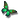

North-aligned crops currently use ImageMagick to scale an image to cover the requested size, retain its top edge, and sharpen the result.

This commit routes `OptimizedImage.crop` through the sandboxed libvips worker when `GlobalSetting.enable_vips_image_processing` is enabled. It preserves the requested dimensions, north gravity, horizontal centering with floor offsets, first-frame and orientation handling, output format overrides, and the caller’s optimization boundary. The flag remains default-off. Source quality still uses `ImageMagick.image_quality`; replacing that probe requires a separate decision.

The displayed rows come from two measured source snapshots. **2ba** means base commit `2ba8357019543403265a8b4cd24c906815484efe`, used for the raster cases and expected SVG-output failures. **c63** means `c63ee831d4d2e332c466f1a272793eec94d9c22d`, used only for the corrected SVG-input reruns. The base commits alone do not identify their working-tree snapshots; each report records exact source-file hashes. [sample-map.json](sample-map.json) maps every displayed case to its raw report. This is not a single-snapshot benchmark.

The original [42-case report](results.json) and outputs retain the superseded SVG result and its alpha mismatch. The corrected SVG reports for [metadata retention](svg-white-false/results.json) and [metadata stripping](svg-white-true/results.json) supply only those two displayed rows. The original raster path measurements and cold-run output files are retained from the archived pre-fix bundle. No raw measurements were edited or merged.

The displayed corpus has 40 successful pairs with matching dimensions, decoded depth, and ICC hashes, plus two SVG-output failures. This is not a pixel-identity claim: sharpened alpha edges and lossy JPEG/WebP/AVIF outputs differ. The SVG-input pairs alone are now pixel- and alpha-identical over black and white at 30×20.

The separate [50-case SVG geometry proof](../svg-geometry/README.md) covers namespace variants, colored and partially transparent shapes, backgrounds, and all three operations. Background and alpha checks pass; colored-edge rasterization still differs (worst case MAE 1.498/max channel 23). This is broader SVG evidence, not a universal pixel-identity guarantee.

Measurements ran on the designated Linux server (2 CPUs, approximately 2 GiB RAM), as `discourse` with Landlock enabled, in `discourse/base:2.0.20260812-0036` at digest `sha256:837e8ed4b5916baa36856b842ad84fe262b6b1b5550701f8844b13cc7acad7a5`. The deployment-specific image override has not been verified. Runtime: Ruby 3.4.10, libvips 8.18.4, ImageMagick 7.1.2-27 Q16-HDRI.

The timed core includes the wrapper, IPC, sandbox child, priority 10, decoding, crop, sharpening, and encoder. It excludes Rails boot, source-quality probing, evidence decoding, and `FileHelper` optimization. Eligible pairs run 31 alternating warm iterations after one validation per backend. Failed cases are recorded once and excluded from paired runtime summaries. Source-quality probes take 28.34–38.39 ms outside the transform clock; the photograph probes take 28.34 ms with metadata retained and 33.60 ms with stripping enabled. Explicit quality takes precedence; otherwise JPEG source quality is estimated, lossless WebP uses 100, and defaults are JPEG 92, WebP 75, AVIF 50.

Both `strip_image_metadata` modes are measured. The false mode preserves source metadata through resize and sharpen; true uses the thumbnail-style path and removes metadata other than ICC in the worker. The four profile-bearing pairs retain identical ICC bytes, including both metadata modes for the profile grid and natural photograph. All recorded decoded outputs are `uchar`. These are raw-core observations: the existing final optimizer may strip ICC for supported codecs, and complete caller/post-optimizer evidence remains separate. The supplied corpus does not prove colorimetric accuracy across arbitrary profiles.

For metadata retention, native output adds 180 bytes of decoded EXIF where ImageMagick records none for palette, ICO-first, GIF-first, WebP-first, and SVG inputs. Both backends record zero decoded EXIF when stripping is enabled. Corrected SVG output encodes as 1-bit grayscale with ImageMagick and 8-bit RGB with libvips, although decoded pixels and alpha match.

The geometry checks preserve the top edge and horizontal center. North and horizontal-center grids are pixel-identical; odd 17×17 cover crops have visible MAE 0.773/0.847 (metadata false/true), max 13/14. The 75×50 enlargement has MAE 0.959/0.639, max 25/17. JPEG quality 63 grids remain visibly different (MAE 7.301/7.239, max 60); inferred JPEG quality has MAE 5.364/5.297. The photograph has MAE 2.509/2.569, max 32. Equal dimensions and sampling do not imply equal JPEG pixels.

Alpha differences are localized but real. Maximum alpha errors are 5/6 for the alpha and palette grids, 7/8 for PNG→WebP, 9/7 for PNG→AVIF, 12/44 for GIF-first→PNG, and 15/29 for WebP-first→PNG (metadata false/true). Visible error is measured over both black and white backgrounds; hidden RGB is excluded. The GIF-first strip-true case has visible MAE 0.446/max 28 despite its alpha maximum of 44. These differences should not be described as exact alpha preservation.

Of the 38 raster pairs, 33 have slower libvips medians. Tiny north-grid crops take 41.49→59.18 ms with metadata retained and 38.14→61.81 ms with stripping. A 120×120 avatar takes 55.61→59.81 ms or 60.87→60.60 ms. The 846×1129 photograph cropped to 320×180 improves from 168.36→84.39 ms or 175.29→79.92 ms. WebP first-frame crops improve from 197.61→87.35 ms or 178.71→62.66 ms. Reported SVG medians are separate reruns: 325.29→345.02 ms (false) and 357.03→374.96 ms (true).

Five fresh-worker photograph crops with metadata retained take 387.19–431.19 ms (median 396.05 ms). Fresh-worker SVG calls take 673.76–712.63 ms (median 703.05 ms) with retention and 724.69–805.80 ms (median 781.51 ms) with stripping. Each includes startup plus the operation with warm filesystem caches; no cold ImageMagick pairs were measured.

The table includes all 42 outcomes. Timings are median / p95 milliseconds; visible MAE/max use the worse of black and white composites after evidence decoding to 8-bit sRGB. Names ending in `strip-false` and `strip-true` identify metadata mode. “Both fail” means ImageMagick’s production `potrace` delegate fails and native SVG output is unsupported; behavior on a differently configured ImageMagick installation is not established.

| Case | Source | Geometry | Output dimensions | Quality | IM median / p95 ms | libvips median / p95 ms | Visible MAE / max | Alpha max | Outcome |
| --- | --- | --- | --- | ---: | ---: | ---: | ---: | ---: | --- |
| `north-strip-false` | 2ba | `60×20` | 60×20 | — | 41.49 / 48.67 | 59.18 / 63.98 | 0.000 / 0 | 0 | Dimensions/ICC/decoded depth match |
| `horizontal-center-strip-false` | 2ba | `20×40` | 20×40 | — | 39.94 / 49.14 | 57.83 / 61.95 | 0.000 / 0 | 0 | Dimensions/ICC/decoded depth match |
| `odd-cover-strip-false` | 2ba | `17×17` | 17×17 | — | 40.08 / 47.77 | 66.36 / 75.06 | 0.773 / 13 | 0 | Dimensions/ICC/decoded depth match |
| `upscale-strip-false` | 2ba | `75×50` | 75×50 | — | 44.35 / 50.94 | 66.30 / 72.44 | 0.959 / 25 | 0 | Dimensions/ICC/decoded depth match |
| `alpha-strip-false` | 2ba | `17×17` | 17×17 | — | 39.86 / 45.81 | 69.95 / 76.10 | 0.286 / 5 | 5 | Dimensions/ICC/decoded depth match |
| `palette-strip-false` | 2ba | `17×17` | 17×17 | — | 40.46 / 49.39 | 68.01 / 79.13 | 0.161 / 5 | 5 | Dimensions/ICC/decoded depth match |
| `profile-strip-false` | 2ba | `30×20` | 30×20 | — | 44.37 / 67.15 | 74.06 / 117.36 | 0.318 / 3 | 0 | Dimensions/ICC/decoded depth match |
| `jpeg-inferred-quality-strip-false` | 2ba | `30×20` | 30×20 | 74 | 42.89 / 55.06 | 72.29 / 87.59 | 5.364 / 37 | 0 | Dimensions/ICC/decoded depth match |
| `jpeg-explicit-quality-strip-false` | 2ba | `30×20` | 30×20 | 63 | 36.74 / 44.80 | 66.32 / 74.55 | 7.301 / 60 | 0 | Dimensions/ICC/decoded depth match |
| `orientation-strip-false` | 2ba | `20×30` | 20×30 | 87 | 36.68 / 43.44 | 69.14 / 80.71 | 3.551 / 25 | 0 | Dimensions/ICC/decoded depth match |
| `alpha-to-jpeg-strip-false` | 2ba | `60×20` | 60×20 | 87 | 38.22 / 48.55 | 77.53 / 91.39 | 0.261 / 3 | 0 | Dimensions/ICC/decoded depth match |
| `png-to-webp-strip-false` | 2ba | `30×20` | 30×20 | 83 | 39.36 / 47.44 | 82.90 / 90.51 | 1.576 / 15 | 7 | Dimensions/ICC/decoded depth match |
| `filename-override-strip-false` | 2ba | `30×20` | 30×20 | — | 40.69 / 46.19 | 62.21 / 71.70 | 0.318 / 3 | 0 | Dimensions/ICC/decoded depth match |
| `png-to-avif-strip-false` | 2ba | `30×20` | 30×20 | 63 | 47.99 / 58.26 | 80.43 / 86.89 | 1.687 / 17 | 9 | Dimensions/ICC/decoded depth match |
| `svg-to-png-strip-false` | c63 | `30×20` | 30×20 | — | 325.29 / 353.34 | 345.02 / 421.10 | 0.000 / 0 | 0 | Dimensions/ICC/decoded depth match |
| `ico-first-to-png-strip-false` | 2ba | `20×20` | 20×20 | — | 41.19 / 47.01 | 74.39 / 86.85 | 0.538 / 6 | 0 | Dimensions/ICC/decoded depth match |
| `png-to-svg-strip-false` | 2ba | `30×20` | — | — | — | — | — | — | Both fail; no warm timing |
| `animated-gif-first-strip-false` | 2ba | `20×20` | 20×20 | — | 52.52 / 87.14 | 82.21 / 132.40 | 0.255 / 8 | 12 | Dimensions/ICC/decoded depth match |
| `animated-webp-first-strip-false` | 2ba | `20×20` | 20×20 | — | 197.61 / 234.86 | 87.35 / 102.81 | 1.420 / 14 | 15 | Dimensions/ICC/decoded depth match |
| `north-strip-true` | 2ba | `60×20` | 60×20 | — | 38.14 / 45.52 | 61.81 / 67.62 | 0.000 / 0 | 0 | Dimensions/ICC/decoded depth match |
| `horizontal-center-strip-true` | 2ba | `20×40` | 20×40 | — | 39.13 / 43.70 | 61.58 / 74.03 | 0.000 / 0 | 0 | Dimensions/ICC/decoded depth match |
| `odd-cover-strip-true` | 2ba | `17×17` | 17×17 | — | 36.05 / 42.43 | 70.12 / 80.27 | 0.847 / 14 | 0 | Dimensions/ICC/decoded depth match |
| `upscale-strip-true` | 2ba | `75×50` | 75×50 | — | 42.84 / 46.71 | 70.60 / 81.14 | 0.639 / 17 | 0 | Dimensions/ICC/decoded depth match |
| `alpha-strip-true` | 2ba | `17×17` | 17×17 | — | 38.01 / 44.41 | 68.06 / 76.32 | 0.825 / 6 | 6 | Dimensions/ICC/decoded depth match |
| `palette-strip-true` | 2ba | `17×17` | 17×17 | — | 43.87 / 56.60 | 76.74 / 93.52 | 0.677 / 6 | 6 | Dimensions/ICC/decoded depth match |
| `profile-strip-true` | 2ba | `30×20` | 30×20 | — | 39.08 / 48.09 | 69.49 / 81.67 | 0.191 / 3 | 0 | Dimensions/ICC/decoded depth match |
| `jpeg-inferred-quality-strip-true` | 2ba | `30×20` | 30×20 | 74 | 39.30 / 192.61 | 68.37 / 84.44 | 5.297 / 39 | 0 | Dimensions/ICC/decoded depth match |
| `jpeg-explicit-quality-strip-true` | 2ba | `30×20` | 30×20 | 63 | 37.38 / 44.45 | 66.99 / 75.06 | 7.239 / 60 | 0 | Dimensions/ICC/decoded depth match |
| `orientation-strip-true` | 2ba | `20×30` | 20×30 | 87 | 37.90 / 45.65 | 69.66 / 74.33 | 3.636 / 25 | 0 | Dimensions/ICC/decoded depth match |
| `alpha-to-jpeg-strip-true` | 2ba | `60×20` | 60×20 | 87 | 38.67 / 48.09 | 61.94 / 66.54 | 0.261 / 3 | 0 | Dimensions/ICC/decoded depth match |
| `png-to-webp-strip-true` | 2ba | `30×20` | 30×20 | 83 | 41.92 / 47.38 | 66.39 / 75.96 | 1.137 / 9 | 8 | Dimensions/ICC/decoded depth match |
| `filename-override-strip-true` | 2ba | `30×20` | 30×20 | — | 35.99 / 41.80 | 60.32 / 67.08 | 0.191 / 3 | 0 | Dimensions/ICC/decoded depth match |
| `png-to-avif-strip-true` | 2ba | `30×20` | 30×20 | 63 | 46.54 / 53.83 | 70.46 / 77.46 | 0.971 / 10 | 7 | Dimensions/ICC/decoded depth match |
| `svg-to-png-strip-true` | c63 | `30×20` | 30×20 | — | 357.03 / 398.55 | 374.96 / 419.95 | 0.000 / 0 | 0 | Dimensions/ICC/decoded depth match |
| `ico-first-to-png-strip-true` | 2ba | `20×20` | 20×20 | — | 39.38 / 46.43 | 63.08 / 65.90 | 2.193 / 33 | 0 | Dimensions/ICC/decoded depth match |
| `png-to-svg-strip-true` | 2ba | `30×20` | — | — | — | — | — | — | Both fail; no warm timing |
| `animated-gif-first-strip-true` | 2ba | `20×20` | 20×20 | — | 47.33 / 59.20 | 72.90 / 108.35 | 0.446 / 28 | 44 | Dimensions/ICC/decoded depth match |
| `animated-webp-first-strip-true` | 2ba | `20×20` | 20×20 | — | 178.71 / 207.44 | 62.66 / 71.79 | 2.051 / 27 | 29 | Dimensions/ICC/decoded depth match |
| `natural-photo-strip-false` | 2ba | `320×180` | 320×180 | 89 | 168.36 / 209.42 | 84.39 / 97.51 | 2.509 / 32 | 0 | Dimensions/ICC/decoded depth match |
| `natural-photo-strip-true` | 2ba | `320×180` | 320×180 | 89 | 175.29 / 210.96 | 79.92 / 91.06 | 2.569 / 32 | 0 | Dimensions/ICC/decoded depth match |
| `avatar-square-strip-false` | 2ba | `120×120` | 120×120 | — | 55.61 / 73.78 | 59.81 / 76.27 | 0.123 / 10 | 0 | Dimensions/ICC/decoded depth match |
| `avatar-square-strip-true` | 2ba | `120×120` | 120×120 | — | 60.87 / 70.48 | 60.60 / 67.56 | 0.272 / 33 | 0 | Dimensions/ICC/decoded depth match |

Every successful pair is shown below to expose differences across metadata modes and geometry/codec cases. Previews are retained decoded PNGs; the corresponding reports link the original encoded paths and hashes. The SVG previews use the c63 reruns; all other previews use 2ba.

| Case | Source | ImageMagick | libvips |
| --- | --- | --- | --- |
| `north-strip-false` | 2ba |  |  |
| `horizontal-center-strip-false` | 2ba |  |  |
| `odd-cover-strip-false` | 2ba |  |  |
| `upscale-strip-false` | 2ba |  |  |
| `alpha-strip-false` | 2ba |  |  |
| `palette-strip-false` | 2ba |  |  |
| `profile-strip-false` | 2ba |  |  |
| `jpeg-inferred-quality-strip-false` | 2ba |  |  |
| `jpeg-explicit-quality-strip-false` | 2ba |  |  |
| `orientation-strip-false` | 2ba |  |  |
| `alpha-to-jpeg-strip-false` | 2ba |  |  |
| `png-to-webp-strip-false` | 2ba |  |  |
| `filename-override-strip-false` | 2ba |  |  |
| `png-to-avif-strip-false` | 2ba |  |  |
| `svg-to-png-strip-false` | c63 |  |  |
| `ico-first-to-png-strip-false` | 2ba |  |  |
| `animated-gif-first-strip-false` | 2ba |  |  |
| `animated-webp-first-strip-false` | 2ba |  |  |
| `north-strip-true` | 2ba |  |  |
| `horizontal-center-strip-true` | 2ba |  |  |
| `odd-cover-strip-true` | 2ba |  |  |
| `upscale-strip-true` | 2ba |  |  |
| `alpha-strip-true` | 2ba |  |  |
| `palette-strip-true` | 2ba |  |  |
| `profile-strip-true` | 2ba |  |  |
| `jpeg-inferred-quality-strip-true` | 2ba |  |  |
| `jpeg-explicit-quality-strip-true` | 2ba |  |  |
| `orientation-strip-true` | 2ba |  |  |
| `alpha-to-jpeg-strip-true` | 2ba |  |  |
| `png-to-webp-strip-true` | 2ba |  |  |
| `filename-override-strip-true` | 2ba |  |  |
| `png-to-avif-strip-true` | 2ba |  |  |
| `svg-to-png-strip-true` | c63 |  |  |
| `ico-first-to-png-strip-true` | 2ba |  |  |
| `animated-gif-first-strip-true` | 2ba |  |  |
| `animated-webp-first-strip-true` | 2ba |  |  |
| `natural-photo-strip-false` | 2ba |  |  |
| `natural-photo-strip-true` | 2ba |  |  |
| `avatar-square-strip-false` | 2ba |  |  |
| `avatar-square-strip-true` | 2ba |  |  |

[Artifact verification](verification.json) validates exact source/input/output hashes and recomputes every displayed timing distribution. This is source-snapshot evidence; final formatted-head tests, formal review, individual PR CI, and complete caller/post-optimizer evidence are separate.

Publication sequence: `tgxworld/vips-review-11-crop` targets `tgxworld/vips-review-10-resize`. Final heads and the immutable evidence commit are pending.
