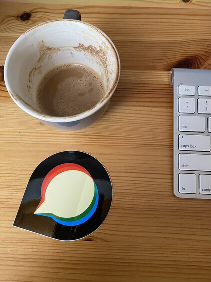

Upload downsize requests currently use ImageMagick for percentage, bounding-box, and area geometry before the existing image optimizer runs.

This commit routes `OptimizedImage.downsize` through the sandboxed libvips worker when `GlobalSetting.enable_vips_image_processing` is enabled. The flag remains default-off. Source JPEG/WebP quality still uses `ImageMagick.image_quality`; replacing that probe requires a separate decision.

The displayed rows come from two measured source snapshots. **2ba** means base commit `2ba8357019543403265a8b4cd24c906815484efe`, used for the raster cases and expected SVG-output failures. **c63** means `c63ee831d4d2e332c466f1a272793eec94d9c22d`, used only for the corrected SVG-input reruns. The base commits alone do not identify their working-tree snapshots; each report records exact source-file hashes. [sample-map.json](sample-map.json) maps every displayed case to its raw report. This is not a single-snapshot benchmark.

The original [35-case report](results.json) and outputs retain the superseded SVG result and its alpha mismatch. The [corrected SVG report](svg-white/results.json) supplies only the displayed SVG row. The original raster path measurements and cold-run output files are retained from the archived pre-fix bundle. No raw measurements were edited or merged.

The displayed results cover 33 successful input cases with matching output dimensions, decoded depth, and ICC hashes; all alpha comparisons are exact. Two SVG-output cases fail in both backends and have no paired warm timing. The initial 34-case run remains separate under [historical evidence](historical/README.md).

The corrected SVG→PNG pair produces the same opaque white 50×25 image in both backends, with zero visible and alpha error. It is not byte-identical: ImageMagick writes 1-bit grayscale PNG, while libvips writes 8-bit RGB PNG and adds 180 bytes of decoded EXIF. Both decode to `uchar`. Its median is 330.17→334.57 ms (+1.3%); five fresh-worker SVG calls take 606.61–657.61 ms, median 641.59 ms. These SVG timings are separate from the photograph cold series below.

The separate [50-case SVG geometry proof](../svg-geometry/README.md) covers namespace variants, colored and partially transparent shapes, backgrounds, and all three operations. Background and alpha checks pass; colored-edge rasterization still differs (worst case MAE 1.498/max channel 23). This is broader SVG evidence, not a universal pixel-identity guarantee.

Measurements ran on the designated Linux server (2 CPUs, approximately 2 GiB RAM), as `discourse` with Landlock enabled, in `discourse/base:2.0.20260812-0036` at digest `sha256:837e8ed4b5916baa36856b842ad84fe262b6b1b5550701f8844b13cc7acad7a5`. The deployment-specific image override has not been verified. Runtime: Ruby 3.4.10, libvips 8.18.4, ImageMagick 7.1.2-27 Q16-HDRI.

The timed core includes the wrapper, IPC, sandbox child, priority 10, decoding, transformation, and encoding. It excludes Rails boot, the source-quality probe, evidence decoding, and `FileHelper` optimization. Each backend is validated once; eligible pairs then run 31 alternating warm iterations. Failures are recorded once and receive no paired warm measurements. The [standalone harness](benchmark/geometry_evidence.rb) runs with `OPERATION=downsize` and a fresh `RESULT_PATH` through `bundle exec ruby boot.rb` from the bundle directory.

Source-quality probes took 30.74–86.82 ms outside the transform clock; the photograph's probe took 50.82 ms. Quality is explicit at the native call: preserve estimated JPEG quality or lossless WebP quality 100, otherwise use JPEG 92, WebP 75, or AVIF 50. Original ImageMagick instruction arrays retain their recorded options. These transform timings are not end-to-end upload timings.

Of the 32 successful raster cases, 29 have slower libvips warm medians. Small fixtures expose wrapper and IPC costs: the 60×40 PNG grid reduced to 30×20 takes 35.43→37.02 ms; its alpha variant takes 34.49→50.45 ms. The 846×1129 natural photograph reduced to 423×565 takes 181.39→103.00 ms (43.2% lower). Animated GIF and WebP first-frame processing improves from 216.94→78.40 ms and 213.86→73.35 ms. These gains should not be generalized to small avatars: the 96×96 avatar result takes 53.05→61.66 ms.

Five fresh-worker photograph calls succeeded in 455.76–631.40 ms (median 487.79 ms), including startup and transformation with warm filesystem caches. No paired cold ImageMagick series was measured.

All 32 raster pairs retain exact alpha in decoded comparisons. The 16-bit PNG remains `ushort`. Three profile-bearing pairs retain matching ICC hashes: PNG grid, JPEG grid, and photograph. The CMYK cases do not establish colorimetric profile accuracy: both decoded outputs have no ICC, and this ImageMagick image reports missing LCMS support. Native output adds 180 bytes of decoded EXIF metadata for animated WebP and ICO→PNG where ImageMagick records none; metadata is not byte-identical across all outputs.

Selective JPEG sampling now matches the measured photograph and PNG→JPEG outputs (4:4:4), and the JPEG grid and orientation fixture (4:2:0). JPEG pixels still differ: photograph visible MAE 1.800/max 28; JPEG grid 5.488/max 50; rotated grid 5.556/max 44. Enlargement differences remain measurable (125% MAE 1.133/max 24; 200% MAE 0.477/max 17). These are not pixel-identical results.

The table includes all 35 cases. Timings are median / p95 milliseconds. Visible MAE/max use the worse of black and white composites after evidence decoding to 8-bit sRGB; hidden RGB beneath transparent pixels is excluded. “Both fail” means the production ImageMagick `potrace` delegate fails and native SVG output is unsupported; it does not establish behavior on a differently configured ImageMagick installation. A separate historical SVG→SVG record lacked generated instructions and remains excluded in the manifest.

| Case | Source | Geometry | Output dimensions | Quality | IM median / p95 ms | libvips median / p95 ms | Visible MAE / max | Alpha max | Outcome |
| --- | --- | --- | --- | ---: | ---: | ---: | ---: | ---: | --- |
| `png-grid` | 2ba | `50%` | 30×20 | — | 35.43 / 45.92 | 37.02 / 43.59 | 0.344 / 4 | 0 | Dimensions/ICC/decoded depth match |
| `png-grid-alpha` | 2ba | `50%` | 30×20 | — | 34.49 / 41.87 | 50.45 / 56.92 | 0.000 / 0 | 0 | Dimensions/ICC/decoded depth match |
| `png-grid-16bit` | 2ba | `50%` | 30×20 | — | 37.01 / 46.96 | 49.85 / 54.38 | 0.000 / 0 | 0 | Dimensions/ICC/decoded depth match |
| `png-grid-profile` | 2ba | `50%` | 30×20 | — | 36.19 / 45.06 | 51.62 / 59.60 | 0.344 / 4 | 0 | Dimensions/ICC/decoded depth match |
| `jpg-grid` | 2ba | `50%` | 30×20 | 74 | 38.64 / 47.22 | 54.87 / 70.15 | 5.488 / 50 | 0 | Dimensions/ICC/decoded depth match |
| `jpg-grid-profile` | 2ba | `50%` | 30×20 | 74 | 39.08 / 56.41 | 60.13 / 77.74 | 5.488 / 50 | 0 | Dimensions/ICC/decoded depth match |
| `jpg-grid-cmyk` | 2ba | `50%` | 30×20 | 87 | 67.61 / 98.13 | 93.35 / 123.25 | 2.095 / 30 | 0 | Dimensions/ICC/decoded depth match |
| `jpg-grid-cmyk-profile` | 2ba | `50%` | 30×20 | 87 | 63.41 / 78.84 | 88.22 / 104.10 | 2.095 / 30 | 0 | Dimensions/ICC/decoded depth match |
| `webp-grid` | 2ba | `50%` | 30×20 | 75 | 43.37 / 50.48 | 60.68 / 74.60 | 0.000 / 0 | 0 | Dimensions/ICC/decoded depth match |
| `webp-grid-lossless` | 2ba | `50%` | 30×20 | 100 | 43.74 / 50.12 | 66.16 / 87.97 | 0.000 / 0 | 0 | Dimensions/ICC/decoded depth match |
| `avif-grid` | 2ba | `50%` | 30×20 | 50 | 54.69 / 66.23 | 84.12 / 94.32 | 0.000 / 0 | 0 | Dimensions/ICC/decoded depth match |
| `png-large-ico-source` | 2ba | `50%` | 150×100 | — | 53.54 / 59.69 | 60.27 / 67.30 | 0.017 / 2 | 0 | Dimensions/ICC/decoded depth match |
| `animated-gif` | 2ba | `50%` | 160×160 | — | 216.94 / 247.45 | 78.40 / 94.44 | 0.059 / 5 | 0 | Dimensions/ICC/decoded depth match |
| `animated-webp` | 2ba | `50%` | 125×125 | 75 | 213.86 / 234.13 | 73.35 / 92.11 | 0.066 / 12 | 0 | Dimensions/ICC/decoded depth match |
| `ico-to-ico` | 2ba | `50%` | 32×32 | — | 42.29 / 49.95 | 57.00 / 64.50 | 0.029 / 2 | 0 | Dimensions/ICC/decoded depth match |
| `ico-first-to-png` | 2ba | `50%` | 32×32 | — | 38.81 / 55.28 | 51.84 / 57.94 | 0.029 / 2 | 0 | Dimensions/ICC/decoded depth match |
| `large-ico` | 2ba | `100%` | 300×200 | — | 43.24 / 47.24 | 48.08 / 56.79 | 0.000 / 0 | 0 | Dimensions/ICC/decoded depth match |
| `png-to-jpg` | 2ba | `50%` | 30×20 | 92 | 38.68 / 44.30 | 47.59 / 51.99 | 1.237 / 16 | 0 | Dimensions/ICC/decoded depth match |
| `alpha-png-to-jpg` | 2ba | `50%` | 30×20 | 92 | 65.20 / 111.86 | 106.39 / 139.20 | 0.958 / 27 | 0 | Dimensions/ICC/decoded depth match |
| `png-to-webp` | 2ba | `50%` | 30×20 | 75 | 56.21 / 77.50 | 75.25 / 111.32 | 1.558 / 12 | 0 | Dimensions/ICC/decoded depth match |
| `alpha-png-to-webp` | 2ba | `50%` | 30×20 | 75 | 46.63 / 60.37 | 68.40 / 84.65 | 0.000 / 0 | 0 | Dimensions/ICC/decoded depth match |
| `png-to-avif` | 2ba | `50%` | 30×20 | 50 | 46.26 / 62.99 | 70.26 / 77.75 | 1.650 / 22 | 0 | Dimensions/ICC/decoded depth match |
| `alpha-png-to-avif` | 2ba | `50%` | 30×20 | 50 | 48.20 / 57.15 | 68.38 / 79.29 | 0.000 / 0 | 0 | Dimensions/ICC/decoded depth match |
| `png-to-svg` | 2ba | `50%` | — | — | — | — | — | — | Both fail; no warm timing |
| `alpha-png-to-svg` | 2ba | `50%` | — | — | — | — | — | — | Both fail; no warm timing |
| `png-to-ico` | 2ba | `50%` | 30×20 | — | 42.03 / 51.37 | 63.02 / 74.30 | 0.344 / 4 | 0 | Dimensions/ICC/decoded depth match |
| `alpha-png-to-ico` | 2ba | `50%` | 30×20 | — | 39.06 / 45.58 | 58.93 / 65.86 | 0.000 / 0 | 0 | Dimensions/ICC/decoded depth match |
| `natural-photo` | 2ba | `50%` | 423×565 | 89 | 181.39 / 225.71 | 103.00 / 116.05 | 1.800 / 28 | 0 | Dimensions/ICC/decoded depth match |
| `orientation-added` | 2ba | `50%` | 20×30 | 74 | 38.94 / 47.87 | 62.19 / 69.39 | 5.556 / 44 | 0 | Dimensions/ICC/decoded depth match |
| `avatar-half` | 2ba | `50%` | 180×180 | — | 64.23 / 79.96 | 64.60 / 75.55 | 0.013 / 2 | 0 | Dimensions/ICC/decoded depth match |
| `avatar-bounding-box` | 2ba | `96x96>` | 96×96 | — | 53.05 / 66.34 | 61.66 / 76.36 | 0.048 / 3 | 0 | Dimensions/ICC/decoded depth match |
| `avatar-area` | 2ba | `4096@` | 64×64 | — | 52.48 / 59.52 | 62.90 / 70.65 | 0.086 / 5 | 0 | Dimensions/ICC/decoded depth match |
| `grid-enlarge-125` | 2ba | `125%` | 75×50 | — | 40.17 / 45.55 | 53.73 / 64.27 | 1.133 / 24 | 0 | Dimensions/ICC/decoded depth match |
| `grid-enlarge-200` | 2ba | `200%` | 120×80 | — | 58.73 / 107.10 | 76.09 / 115.10 | 0.477 / 17 | 0 | Dimensions/ICC/decoded depth match |
| `svg-to-png` | c63 | `50%` | 50×25 | — | 330.17 / 391.87 | 334.57 / 379.17 | 0.000 / 0 | 0 | Dimensions/ICC/decoded depth match |

The following pairs cover geometry edges, alpha, high bit depth, profiles, CMYK, first-frame behavior, output formats, avatars, a photograph, and the corrected SVG case. PNG previews are the retained decoded outputs; original encoded files and their SHA-256 hashes are available through results.json. Transparency uses the viewer’s background.

| Case | ImageMagick | libvips |
| --- | --- | --- |
| `png-grid` |  |  |
| `png-grid-alpha` |  |  |
| `png-grid-16bit` |  |  |
| `png-grid-profile` |  |  |
| `jpg-grid` |  |  |
| `jpg-grid-cmyk` |  |  |
| `webp-grid` |  |  |
| `avif-grid` |  |  |
| `animated-gif` |  |  |
| `animated-webp` |  |  |
| `ico-to-ico` |  |  |
| `large-ico` |  |  |
| `png-to-jpg` |  |  |
| `alpha-png-to-jpg` |  |  |
| `png-to-webp` |  |  |
| `png-to-avif` |  |  |
| `alpha-png-to-ico` |  |  |
| `natural-photo` |  |  |
| `orientation-added` |  |  |
| `avatar-area` |  |  |
| `grid-enlarge-125` |  |  |
| `grid-enlarge-200` |  |  |
| `svg-to-png` |  |  |

[Artifact verification](verification.json) checks the measured source, manifest, harness, inputs, encoded outputs, and raw timing distributions. Complete caller/post-optimizer evidence remains separate and pending. Integrated migration tests have run, but this report does not establish tests or CI for the final formatted PR head. Formal review and individual PR CI remain pending.

Publication sequence: `tgxworld/vips-review-09-downsize` targets `tgxworld/vips-review-08-orientation`. Final heads and immutable evidence commit are pending. Measurements cover the two recorded snapshots; final-head alignment remains separate.
