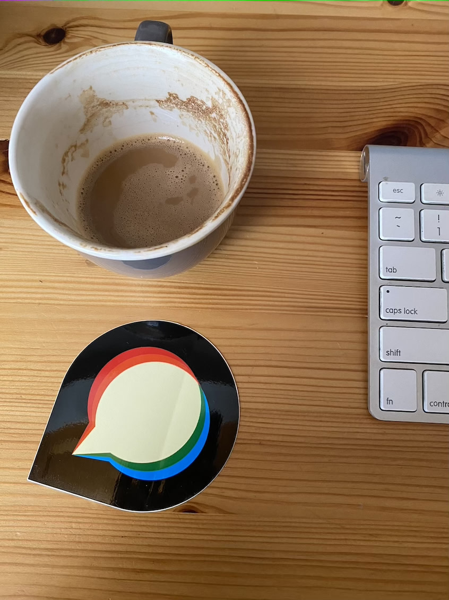

HEIF uploads need JPEG conversion before Discourse adopts the image for normal upload processing. That conversion currently invokes ImageMagick.

This commit converts HEIF uploads through the existing sandboxed libvips worker when `GlobalSetting.enable_vips_image_processing` is enabled. It retains white flattening, JPEG output, container rotation/mirroring, and the caller’s temporary-file adoption and cleanup behavior.

The measured worker SHA-256 is `817c1eab89ffbf9fead9905de81f297abe5a8891276d19e1184eb89f9abbd97e`. [Raw results](results.json) and [the source manifest](benchmark/source-manifest.json) identify the complete measured snapshot. The benchmark supplies seven successful HEIF inputs: 8/12-bit opaque and alpha grids, container rotation and mirroring, and a natural photograph.

The run used `discourse/base:2.0.20260812-0036` at `sha256:837e8ed4b5916baa36856b842ad84fe262b6b1b5550701f8844b13cc7acad7a5`, on the designated Linux server with 2 CPUs and approximately 2 GiB RAM, as `discourse`, with Landlock enabled. The deployment-specific image override has not been verified. Runtime: Ruby 3.4.10, libvips 8.18.4, ImageMagick 7.1.2-27 Q16-HDRI.

Thirty-one alternating warm iterations include the operation wrapper, IPC, sandbox child, decoder, and encoder. Rails boot and later upload optimization/persistence are excluded. The native encoder explicitly uses JPEG quality 92; ImageMagick uses the recorded conversion defaults. Equal output dimensions do not imply identical JPEG pixels.

| Input | Dimensions | IM median / p95 (ms) | libvips median / p95 (ms) | Median change | Decoded JPEG channel MAE / max | JPEG bytes, before → after |
| --- | --- | ---: | ---: | ---: | ---: | ---: |
| `heif-color-grid-12bit.heic` | 60×40 | 37.54 / 44.44 | 33.27 / 37.71 | -11.4% | 0.702 / 10 | 888 → 1,449 |
| `heif-color-grid-8bit.heic` | 60×40 | 34.87 / 40.49 | 31.74 / 34.88 | -9.0% | 0.343 / 12 | 880 → 1,447 |
| `heif-color-grid-alpha-12bit.heic` | 60×40 | 37.59 / 43.27 | 36.26 / 43.64 | -3.5% | 0.572 / 14 | 870 → 1,431 |
| `heif-color-grid-alpha-8bit.heic` | 60×40 | 37.30 / 43.50 | 36.15 / 48.54 | -3.1% | 0.358 / 13 | 870 → 1,431 |
| `heif-color-grid-mirrored.heic` | 60×40 | 36.86 / 43.56 | 33.72 / 45.98 | -8.5% | 0.343 / 12 | 879 → 1,443 |
| `heif-color-grid-rotated.heic` | 40×60 | 36.46 / 43.03 | 32.98 / 41.48 | -9.5% | 0.382 / 13 | 927 → 1,492 |
| `should_be_jpeg.heic` | 846×1129 | 232.37 / 260.87 | 137.64 / 172.25 | -40.8% | 1.092 / 18 | 250,814 → 225,503 |

All seven warm medians improve in this run. Tail latency regresses for the alpha-8-bit and mirrored fixtures, and slightly for alpha-12-bit; the small grid JPEGs also grow. Five fresh-worker photograph conversions measured 370.47–440.42 ms (median 395.99 ms), including conversion plus startup. No cold ImageMagick pair was measured.

The rotated grid is 40×60 and the mirrored grid remains 60×40 in both backends. The HEIF loader applies container transforms before saving; the operation does not apply a second EXIF rotation. Twelve-bit alpha is flattened at the source sample range before JPEG conversion. ICC preservation and failed-conversion cleanup have dedicated specs, but this timing report does not record ICC hashes or malformed-input outcomes; it is not evidence that those checks passed at the extracted review head.

| Production case | ImageMagick | libvips |
| --- | --- | --- |
| `heif-color-grid-12bit.heic` |  |  |
| `heif-color-grid-8bit.heic` |  |  |
| `heif-color-grid-alpha-12bit.heic` |  |  |
| `heif-color-grid-alpha-8bit.heic` |  |  |
| `heif-color-grid-mirrored.heic` |  |  |
| `heif-color-grid-rotated.heic` |  |  |
| `should_be_jpeg.heic` |  |  |

The flag remains default-off. These are seven successful-case measurements, not a stress or malformed-file benchmark. The caller, ICC, and cleanup specs passed during integration. These measurements do not establish a pass for the final formatted PR head. Formal high-risk review selection, final source alignment, and individual PR CI remain pending.

The [lockfile retrieved from the measured remote bundle](benchmark/Gemfile.lock) is now included. Its SHA-256 is `8216230887180790674978519528753b061bc9e201510b90d8fe3710a04346fb`; all 18 exact Gemfile pins match. The original timing report did not contain a lockfile digest, so this digest identifies the retrieved artifact rather than a value recorded during timing.

[Artifact verification](verification.json) checked 28 recorded source/input/output hashes and all 14 warm timing distributions. The distributions were recalculated from the 31 raw values per backend; this check did not rerun the image operations.

Publication sequence: `tgxworld/vips-review-05-heif` targets `tgxworld/vips-review-04-og`. Final formatted branch heads are pending. The measured source snapshot remains identified above.
