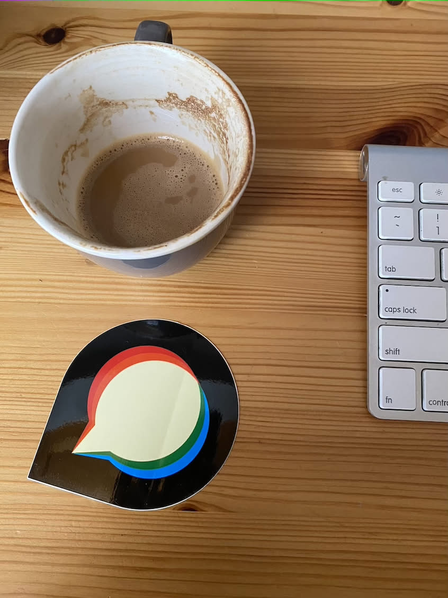
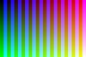
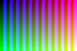
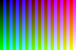
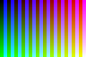

JPEG conversion runs in the existing libvips worker when `GlobalSetting.enable_vips_image_processing` is enabled. The caller retains white flattening, orientation handling, ICC preservation, and its size-saving acceptance checks. The switch remains default-off; the existing ImageMagick quality probe is still a separate pending migration.

The final benchmark measured source `2ba8357019543403265a8b4cd24c906815484efe`. The later `c63ee831d4d2e332c466f1a272793eec94d9c22d` changes only SVG geometry loading, leaving the measured JPEG path unchanged. [Verification](verification.json) records the source diff and hash audit. The [standalone bundle](final-selective/), [source manifest](final-selective/source-manifest.json), and [raw report](final-selective/final-selective.json) retain all inputs, outputs and individual timings. Earlier [results](results.json), [bundle](benchmark/) and [local DV evidence](local-dv/results.json) remain historical artifacts.

Measurements ran on the designated Linux server (2 CPUs, 2 GiB RAM), as `discourse`, with Landlock enabled, using `discourse/base:2.0.20260812-0036` at digest `sha256:837e8ed4b5916baa36856b842ad84fe262b6b1b5550701f8844b13cc7acad7a5`. This is the launcher default image; a deployment-specific override remains unconfirmed. Runtime: Ruby 3.4.10, libvips 8.18.4, ImageMagick 7.1.2-27 Q16-HDRI.

Each ordinary sample has one warm-up per backend and 31 alternating measured conversions. Timings include the real wrapper, IPC, sandbox child and codec operation, but exclude Rails boot and subsequent upload optimization/adoption. Both encoders receive explicit quality 75. Equal numeric quality does not imply equal quantization or pixels, and this corpus does not validate inferred/default quality policy. Twelve ordinary pairs agree on dimensions and ICC bytes (seven pairs have nonempty ICC profiles). General EXIF/metadata parity and pixel error were not measured in this run.

| Sample | Dimensions | ImageMagick median / p95 ms | libvips median / p95 ms | Median change | Bytes IM → libvips |
| --- | --- | ---: | ---: | ---: | ---: |
| `alpha16.png` | 64×64 | 29.30 / 35.17 | 32.27 / 37.52 | +10.2% | 311 → 849 |
| `cmyk.jpg` | 64×64 | 30.46 / 36.98 | 29.30 / 32.50 | -3.8% | 654 → 1,222 |
| `gray.jpg` | 64×64 | 37.15 / 55.73 | 37.71 / 50.64 | +1.5% | 395 → 590 |
| `jpeg-sampling-422.jpg` | 96×64 | 34.93 / 41.83 | 35.35 / 40.58 | +1.2% | 1,377 → 2,943 |
| `jpeg-sampling-440.jpg` | 96×64 | 30.08 / 38.11 | 39.70 / 49.11 | +32.0% | 1,336 → 3,631 |
| `photo-profile.jpg` | 846×1129 | 143.29 / 180.66 | 77.62 / 92.35 | -45.8% | 158,390 → 147,545 |
| `photo.jpg` | 846×1129 | 149.00 / 174.76 | 79.89 / 90.63 | -46.4% | 133,366 → 122,521 |
| `rgb.jpg` | 64×64 | 28.83 / 33.86 | 42.99 / 48.03 | +49.1% | 26,239 → 26,721 |
| `source.png` | 64×64 | 30.22 / 37.56 | 44.13 / 50.81 | +46.0% | 26,164 → 26,588 |
| `static.avif` | 64×64 | 54.83 / 66.39 | 78.36 / 95.87 | +42.9% | 26,167 → 26,554 |
| `static.gif` | 64×64 | 28.66 / 32.52 | 51.83 / 58.87 | +80.8% | 25,974 → 26,588 |
| `static.webp` | 64×64 | 29.50 / 33.07 | 45.52 / 52.24 | +54.3% | 26,192 → 26,586 |

Positive changes are slower native medians. Nine of twelve ordinary cases are slower; the two photographs and CMYK sample are faster. Ten native files are larger; the two photographs are smaller. These measurements do not support a general speedup claim.

The thirteenth input is a 79-megapixel stress JPEG with one attempt per backend. ImageMagick reached its 20-second timeout (20.690 seconds observed); libvips completed in 1.727 seconds. This censored outcome is not a speedup ratio or repeated benchmark. The report does not record stress output dimensions, ICC or a hash. Five fresh-worker conversions took 391.08–694.91 ms (median 446.43 ms), including startup and conversion with a warm filesystem. There is no paired cold ImageMagick result.

Common JPEG 4:4:4 and 4:2:0 sampling is retained. Uncommon 4:2:2 and 4:4:0 sources are saved as 4:4:4 because this encoder cannot emit their original factors. This avoids adding chroma subsampling on another axis, but does not preserve the original encoding. At Q75 the 4:2:2 output grows from 1,377 to 2,943 bytes and 4:4:0 from 1,336 to 3,631 bytes relative to ImageMagick.

Separate [full-chroma experiment results](sampling-context/full-chroma-experiment-results.json) explain that quality choice. At Q89/Q90, conversion of the same 4:2:2 source had source-relative mean RGB errors of 0.715/0.583 with full-chroma native output versus 8.855/8.727 with ImageMagick; maximum native channel error was 3/255. For 4:4:0, native means were 0.567/0.485 versus ImageMagick 0.224/0.914. Thus native is not uniformly closer than ImageMagick. This was an explicitly overridden experimental worker, not the final selective source, and its pixel metrics do not describe these Q75 timing outputs. The [earlier sampling results](sampling-context/original-results.json) preserve the comparison before that experiment.

[All twelve production before/after pairs](samples.md) include both photos, uncommon sampling, alpha, CMYK, grayscale and every represented input codec.

| Production output | ImageMagick | libvips |
| --- | --- | --- |
| Photograph with ICC |  |  |
| 4:2:2 source |  |  |
| 4:4:0 source |  |  |

To rerun in the recorded Linux image, use a writable copy of `final-selective/` as `/benchmark`, install the locked bundle, then run as the unprivileged `discourse` user:

```sh
cd /benchmark
bundle install
RESULT_PATH=/benchmark/rerun.json bundle exec ruby boot.rb
```

The harness verifies source hashes before execution. A fresh result path reruns every case; output files in that copy are overwritten. Retain this checked-in evidence untouched.

Review branch 07 remains unpublished. Final review-head source alignment, targeted verification, lint at push time and CI remain pending; these measurements do not establish a final-head verdict. The historical [review stack manifest](../review-stack-manifest.json) records separate review identities and must be refreshed by the coordinator before publication.

[Final 80-case JPEG sampling evidence](../jpeg-sampling/README.md) verifies the selective policy across all five operations, including measured pixel differences and file-size costs.
