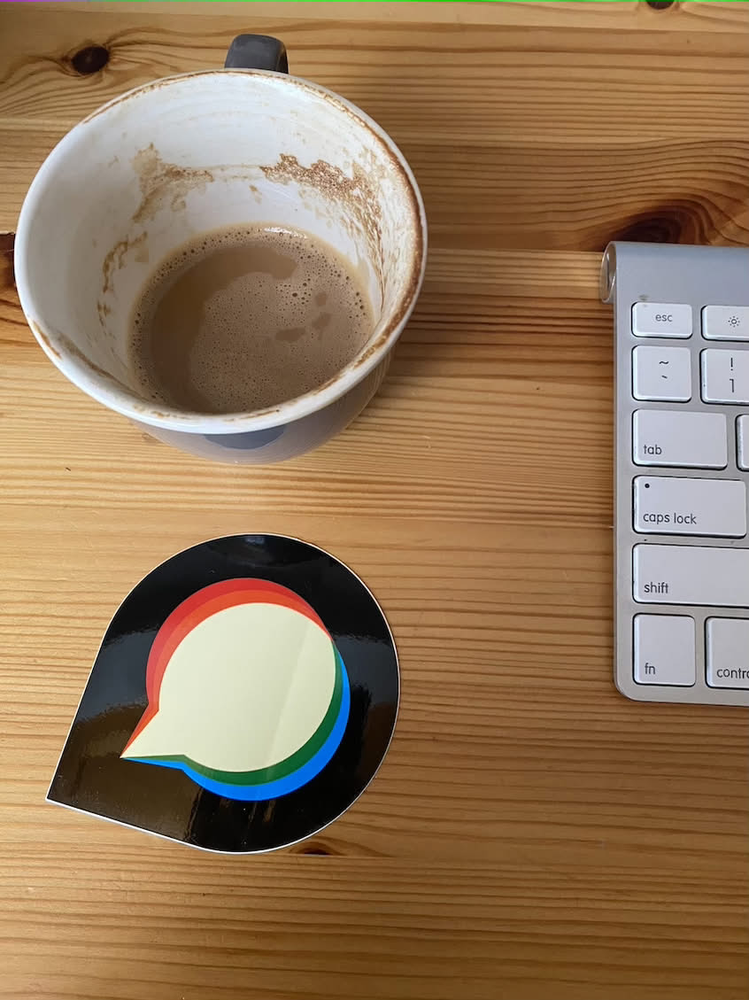

All pairs below are the final production Q75 outputs. Dimensions and ICC bytes agree per pair; encoded pixels and sizes can differ. CMYK display depends on the viewer’s color management. The stress timeout has no valid paired ImageMagick result.

| Input | ImageMagick | libvips |
| --- | --- | --- |
| [alpha16.png](final-selective/inputs/alpha16.png) |  |  |
| [cmyk.jpg](final-selective/inputs/cmyk.jpg) |  |  |
| [gray.jpg](final-selective/inputs/gray.jpg) |  |  |
| [jpeg-sampling-422.jpg](final-selective/inputs/jpeg-sampling-422.jpg) |  |  |
| [jpeg-sampling-440.jpg](final-selective/inputs/jpeg-sampling-440.jpg) |  |  |
| [photo-profile.jpg](final-selective/inputs/photo-profile.jpg) |  |  |
| [photo.jpg](final-selective/inputs/photo.jpg) |  |  |
| [rgb.jpg](final-selective/inputs/rgb.jpg) |  |  |
| [source.png](final-selective/inputs/source.png) |  |  |
| [static.avif](final-selective/inputs/static.avif) |  |  |
| [static.gif](final-selective/inputs/static.gif) |  |  |
| [static.webp](final-selective/inputs/static.webp) |  |  |
