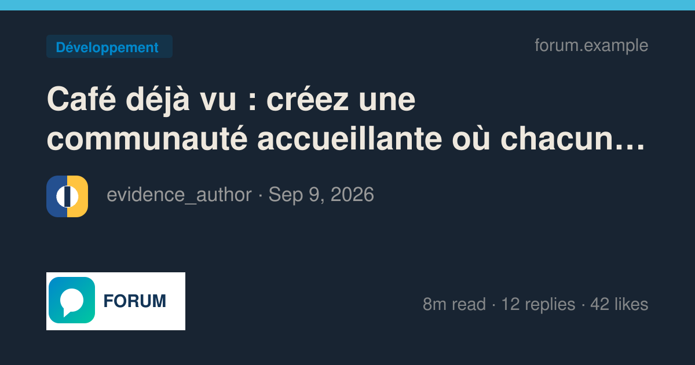
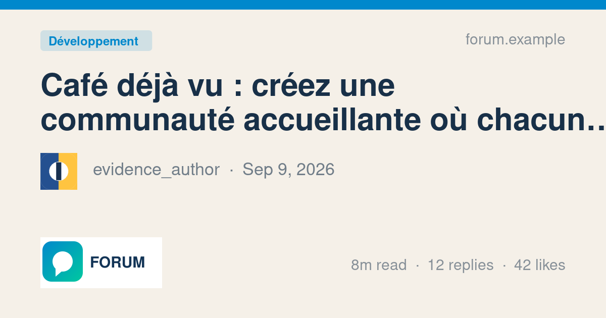
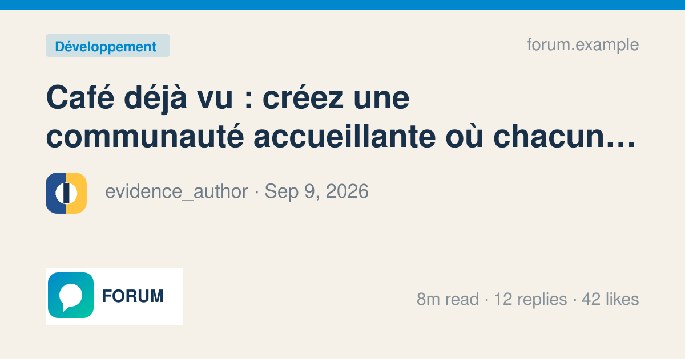
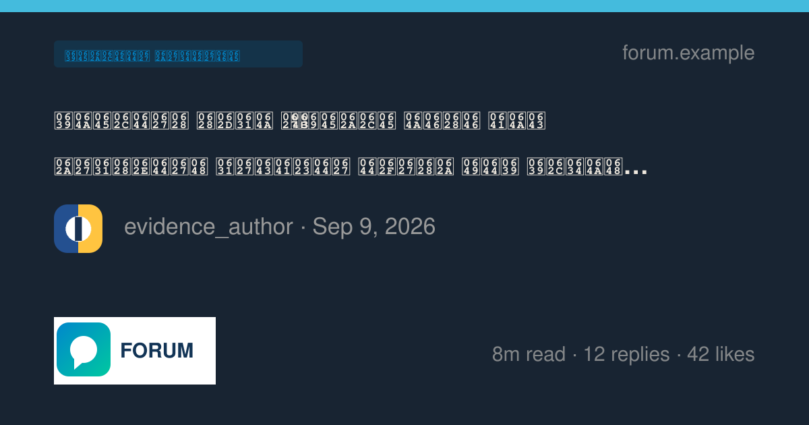
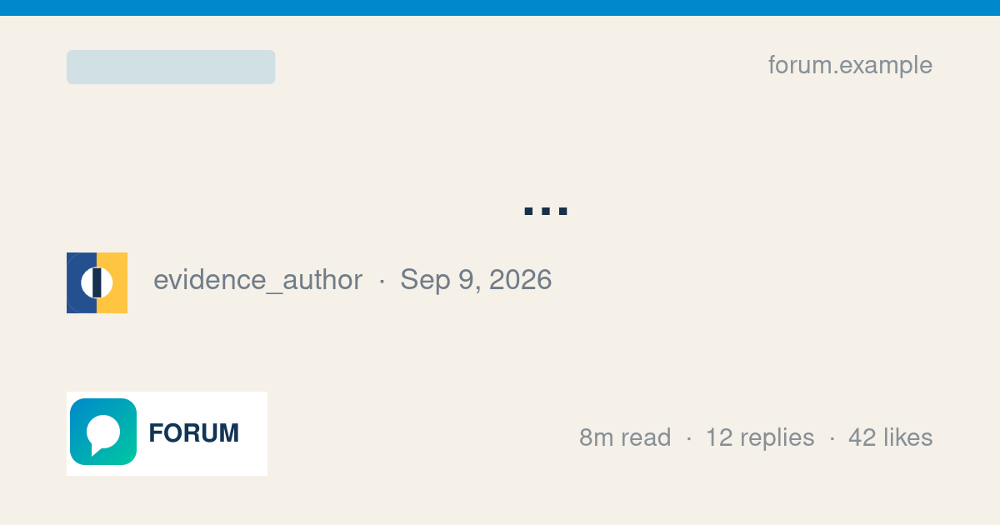
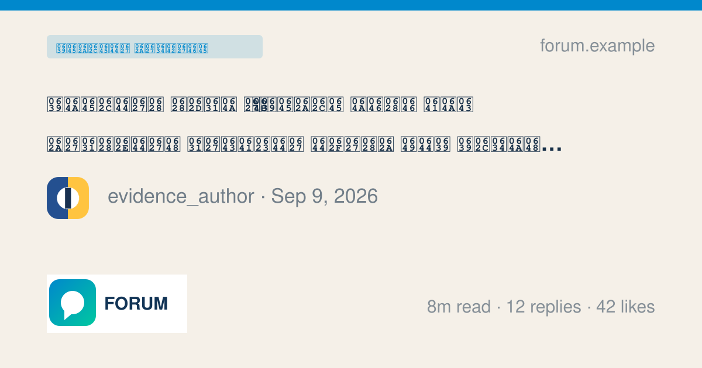
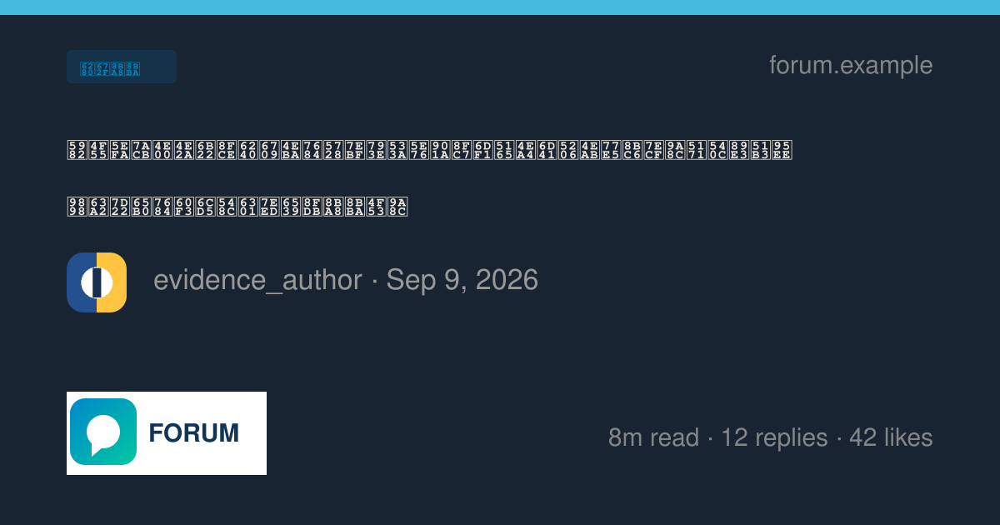
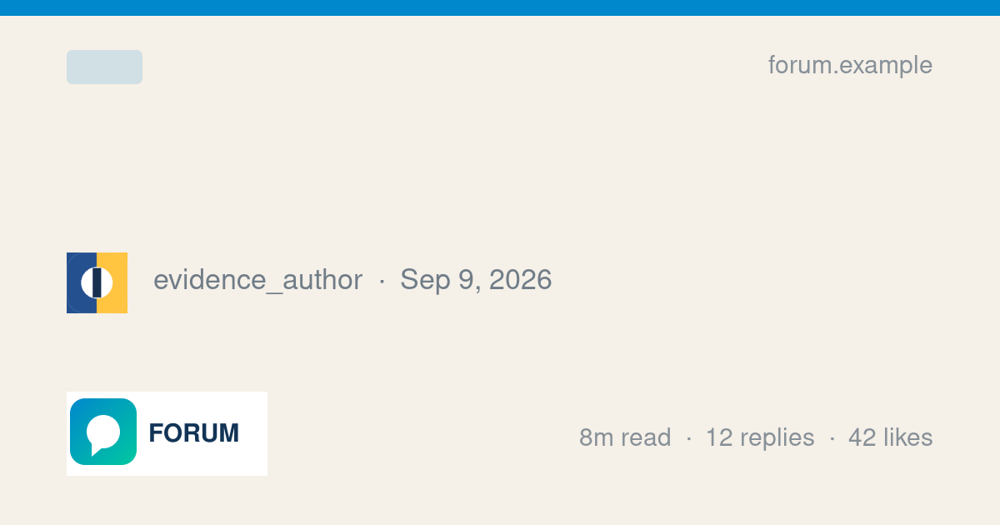
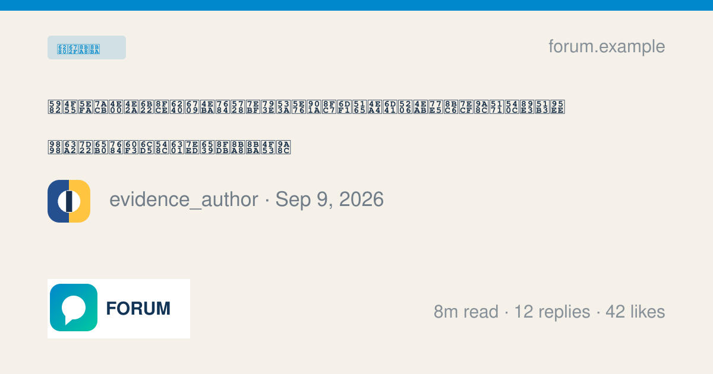

Previously, topic Open Graph cards rasterized their generated SVG through ImageMagick.

Current publication and review status: all twelve draft PRs are open and the final cumulative source passed all three selected reviewers. See [current heads](../published-prs.json), [source alignment](../current-stack-source-alignment.md), and [review verdicts](../review-final-verdicts.md). Any pending-head statements below describe the historical benchmark snapshot, not current status.

This commit uses the libvips worker when `GlobalSetting.enable_vips_image_processing` is enabled and measures title and category text to keep it inside the card.

The benchmark used source `58c29b709d914d66a4ffd729475f19c341c23efc`. Exact source files, input hashes, raw timings, and output hashes are retained in [results.json](results.json) and [the standalone bundle](benchmark/).

Measurements ran on the designated Linux server (2 CPUs, 2 GiB RAM), as `discourse`, with Landlock enabled, in `discourse/base:2.0.20260812-0036` at `sha256:837e8ed4b5916baa36856b842ad84fe262b6b1b5550701f8844b13cc7acad7a5`. The deployment-specific image override has not been verified. Runtime: Ruby 3.4.10, libvips 8.18.4, ImageMagick 7.1.2-27 Q16-HDRI.

Warm timings alternate the two backends over 31 iterations per sample and include the real wrapper, IPC, sandbox child, and codec operation. Rails boot is excluded. These are operation timings, not complete upload or page-generation timings.

Both outputs in all eight production pairs are 1200×630. The deterministic corpus uses seed `20260909` and time `2026-09-09T12:00:00Z`, Latin/accented/Arabic/CJK titles, light/dark custom palettes, and local logo/avatar assets. The measured operation includes title/category measurement and SVG rasterization; it excludes Rails SVG generation, asset materialization, `image_optim`, and upload persistence. Both backends receive the same pre-rendered assets. SVG asset rasterization is a separate dependent operation.

The pinned production image lacks usable Arabic and CJK glyph coverage: ImageMagick omits the title/category glyphs, while libvips renders hexadecimal missing-glyph boxes. In the Arabic card, punctuation such as the ellipsis remains. These outputs do not demonstrate correct Arabic/CJK rendering or font parity. The [local DV evidence](local-dv/manifest.json) used a different font environment and rendered actual CJK glyphs; it cannot substitute for production evidence. Font packaging and a production rerun remain open. The measured font resolution and font-file SHA-256 are recorded in results.json.

Librsvg and ImageMagick also differ in shaping, gradients, clipping, and rasterization. The output is intentionally reviewed visually rather than treated as pixel-identical. The renderer retains the 1200×630 transparent canvas, 8-bit PNG, compression level 9, existing optimizer, timeout, priority, and failure behavior.

| Sample | ImageMagick median / p95 (ms) | libvips median / p95 (ms) | Median change | Output evidence |
| --- | ---: | ---: | ---: | --- |
| `accented-dark` | 939.84 / 1057.87 | 417.49 / 465.97 | -55.6% | 51,827 → 50,169 bytes |
| `accented-light` | 1020.00 / 1225.69 | 462.72 / 554.90 | -54.6% | 51,860 → 49,645 bytes |
| `arabic-dark` | 934.00 / 1093.08 | 463.72 / 545.40 | -50.4% | 31,540 → 65,792 bytes |
| `arabic-light` | 920.31 / 1118.29 | 458.15 / 506.97 | -50.2% | 31,438 → 65,140 bytes |
| `cjk-dark` | 987.25 / 1050.17 | 477.42 / 596.10 | -51.6% | 31,397 → 53,730 bytes |
| `cjk-light` | 998.31 / 1059.08 | 487.94 / 520.46 | -51.1% | 31,298 → 53,109 bytes |
| `latin-dark` | 1014.19 / 1123.49 | 464.99 / 571.29 | -54.2% | 56,038 → 52,160 bytes |
| `latin-light` | 1080.45 / 1261.65 | 490.07 / 568.34 | -54.6% | 56,138 → 51,690 bytes |

Positive median changes are regressions. Five fresh-worker calls measured 774.64–1043.20 ms (median 823.14 ms). These calls include conversion plus worker startup; they are not a measurement of startup alone, and no paired cold ImageMagick comparison was recorded.

Every measured warm OG sample is faster here, but Arabic/CJK output files grow substantially and the missing Arabic/CJK glyphs prevent accepting those samples as correct rendered text.

| Production output | ImageMagick | libvips |
| --- | --- | --- |
| accented; dark |  |  |
| accented; light |  |  |
| arabic; dark; missing glyphs in both backends |  |  |
| arabic; light; missing glyphs in both backends |  |  |
| cjk; dark; missing glyphs in both backends |  |  |
| cjk; light; missing glyphs in both backends |  |  |
| latin; dark |  |  |
| latin; light |  |  |

The switch remains default-off. These artifacts describe the measured source snapshot; they do not establish that the final PR head passes tests or CI. Targeted worker and caller specs passed during integration. Formal high-risk review selection, final source alignment, and individual PR CI remain pending. Supplemental `local-dv/` artifacts retain their original paths and environment details and are not production timings.

[Artifact verification](verification.json) checked 79 recorded source/input/output hashes, including supplemental local artifacts, and all 16 warm timing distributions. The distributions were recalculated from the 31 raw values per backend; this check did not rerun the image operations.

Publication sequence: `tgxworld/vips-review-04-og` targets `tgxworld/vips-review-03-svg-assets`. Final formatted branch heads are pending. The measured source snapshot remains identified above.
