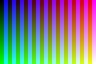
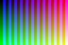
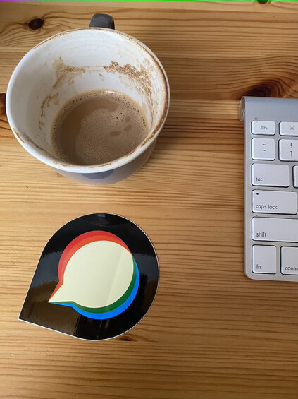

The final optimizer companion covers 154 encoded output pairs from JPEG conversion, orientation, downsize, crop, and resize. Each pair runs through the actual FileHelper optimizer with both metadata settings. This is an untimed optimizer-stage check, not a complete Rails caller or performance benchmark.

The [main results](outputs-final-c63/results.json) retain all 308 case records: 592 backend records completed, and 24 failed during the companion’s ICO metadata inspection before optimization. The separate [ICO-only results](outputs-ico-final-c63/results.json) resolve all 24 gaps by calling the actual optimizer and proving complete byte preservation with zero subprocess events. They intentionally omit decoding and pixel comparisons. The original errors remain unchanged and must not be described as successful main-run records.

| Operation | Input pairs | Main completed backend records | Main ICO inspection gaps | Successful ICO-only resolutions | Transform evidence |
| --- | ---: | ---: | ---: | ---: | --- |
| JPEG conversion | 12 | 48 | 0 | 0 | [JPEG](../jpeg/README.md) |
| Orientation | 13 | 52 | 0 | 0 | [Orientation](../orientation/README.md) |
| Downsize | 33 | 116 | 16 | 16 | [Downsize](../downsize/README.md) |
| Crop | 40 | 160 | 0 | 0 | [Crop](../crop/README.md) |
| Resize | 56 | 216 | 8 | 8 | [Resize](../resize/README.md) |

[The pair manifest](pairs-final.json) records exact transform provenance, metadata mode, paths, sizes, and expected input hashes. [Its audit](pairs-final.audit.json) records the ten exclusions: failed raw transforms, superseded SVG rows, and the unpaired JPEG stress attempt. Decoded previews and cold files are not optimizer inputs. Raster and corrected SVG source snapshots remain distinct; the collector never invents a combined measured source. For crop and resize, both optimizer settings are applied to each transform-mode output, including cross-mode combinations. Use the recorded transform mode when assessing the matching actual caller path.

Runs used the existing pinned Linux production base `discourse/base:2.0.20260812-0036`, digest `sha256:837e8ed4b5916baa36856b842ad84fe262b6b1b5550701f8844b13cc7acad7a5`, as `discourse` with Landlock required. The deployment-specific override has not been verified. The [optimizer source manifest](benchmark/source-manifest.json) identifies the FileHelper methods extracted from `056652b0cd0c71ceb2597bb2b2ab6a9e3dff3948`, wrapper hashes, dependency versions, and the exact 500000-byte threshold. The [locked standalone dependencies](benchmark/Gemfile.lock), original repository lock, scripts, and sandbox wrapper are included. No Rails boot, upload admission, transform timing, file adoption, or persistence is measured.

All 592 completed main backend records preserve dimensions. Of these, 439 change file bytes; a nil optimizer result is recorded 153 times and is not automatically an error. Command events show 228 successful jpegoptim calls, 272 successful oxipng calls, and 264 pngquant calls (108 true, 156 false). False pngquant results remain explicit candidate outcomes rather than raised exceptions. Ninety-two completed backend records have no optimizer commands: 52 WebP, 28 AVIF, and 12 GIF. Their absence of subprocess work must not be reported as execution of an optimizer for those codecs.

Metadata behavior is not uniform across formats. With stripping enabled, all 62 previously present ICC profiles and all 16 XMP records are removed; 159 EXIF records are removed, but 26 remain in WebP/AVIF outputs that have no optimizer worker. With stripping disabled, 52 ICC records remain and ten disappear after successful PNG quantization; those ten are both backends of the five profile-PNG variants. Likewise, 60 EXIF records disappear despite stripping being disabled. These observations occur in the existing optimizer stage and are not a guarantee of complete metadata retention or removal.

Normalized appearance changes in 77 completed main backend records. The largest source-to-optimized normalized MAE is 4.625/255, maximum channel difference 100, for a photograph after metadata stripping. Removing ICC changes the normalization basis, so such differences can reflect profile removal rather than changed encoded JPEG samples. No normalization errors were recorded. Post-optimizer backend differences also include differences already present in the raw transforms: the largest mean is 8.926 for the orientation 4:2:2 fixture. This companion does not attribute every final difference to the optimizer.

The [threshold-generation report](threshold-final-c63/threshold-results.json) supplies five additional genuine geometry pairs from a seeded 1024×768 RGB-noise PNG. The final c63 downsize, crop, and resize methods produced 768×576 PNGs once per backend, with no timing claim. All ten source outputs are 1,279,287–1,509,473 bytes, above the 500,000-byte exclusion threshold. The [threshold optimizer results](outputs-threshold-final-c63/results.json) cover 20 backend calls across both optimizer metadata settings: all use `allow_pngquant=false`, all run oxipng successfully, none run pngquant, all preserve dimensions, and all have zero normalized source-to-optimized pixel difference. The 264 eligible small-PNG calls in the main corpus cover the other threshold branch.

| Supplemental transform pair | ImageMagick PNG bytes before optimization | libvips PNG bytes before optimization |
| --- | ---: | ---: |
| `threshold-seeded-rgb-downsize-strip-false` | 1,300,701 | 1,279,287 |
| `threshold-seeded-rgb-crop-strip-false` | 1,330,521 | 1,310,033 |
| `threshold-seeded-rgb-crop-strip-true` | 1,330,631 | 1,309,841 |
| `threshold-seeded-rgb-resize-strip-false` | 1,506,953 | 1,310,033 |
| `threshold-seeded-rgb-resize-strip-true` | 1,509,473 | 1,309,841 |

The six ICO pairs are downsize ICO→ICO, large ICO, PNG→ICO, alpha PNG→ICO, and resize first-ICO in both transform metadata modes. Their [bounded companion manifest](pairs-ico-final.json) selects only these pairs. Across two optimizer settings and two backends, all 24 complete file hashes remain unchanged, originals remain untouched, and no optimizer commands execute. This resolves the main probe’s unsupported ICO loader without claiming new pixel evidence.

These representative images show the final optimized backend outputs. The linked operation evidence above contains the raw transformation comparisons. Original encoded outputs, metadata records, and all subprocess events remain in the complete reports.

| Case | Optimizer metadata setting | ImageMagick-derived output | libvips-derived output |
| --- | --- | --- | --- |
| jpeg: `photo.jpg` | strip=false |  |  |
| jpeg: `photo.jpg` | strip=true |  |  |
| orientation: `photo-orientation-6.jpg` | strip=true |  |  |
| orientation: `jpeg-sampling-422.jpg` | strip=false |  |  |
| downsize: `png-grid-profile` | strip=false |  |  |
| downsize: `natural-photo` | strip=true |  |  |
| crop: `profile-strip-false` | strip=false |  |  |
| crop: `alpha-strip-true` | strip=true |  |  |
| crop: `jpeg-explicit-quality-strip-true` | strip=true |  |  |
| resize: `png-grid-profile-strip-false` | strip=false |  |  |
| resize: `quality-40-strip-true` | strip=true |  |  |
| resize: `svg-to-png-strip-true` | strip=true |  |  |

[Artifact verification](verification.json) checks 671 recorded output/input hashes across the main, ICO-resolution, and threshold artifacts, plus the extracted source, repository lockfile, and recorded companion script hashes. [Reproduction commands](benchmark/README-final.md) explain the mounts, source selection, and boundaries. Original main failure records remain linked to the separate ICO resolution; previous historical optimizer results are retained in the original task bundle and are not substituted for final results.

No remaining runtime failure is concealed by a process exit code. The remaining limits are the stated inspection boundary, intentionally omitted ICO pixel metrics, cross-mode direct-stage cases, codec worker absence, and the recorded metadata/appearance differences. Formal review, final PR-head checks, and individual PR CI are separate from these artifacts.
