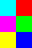
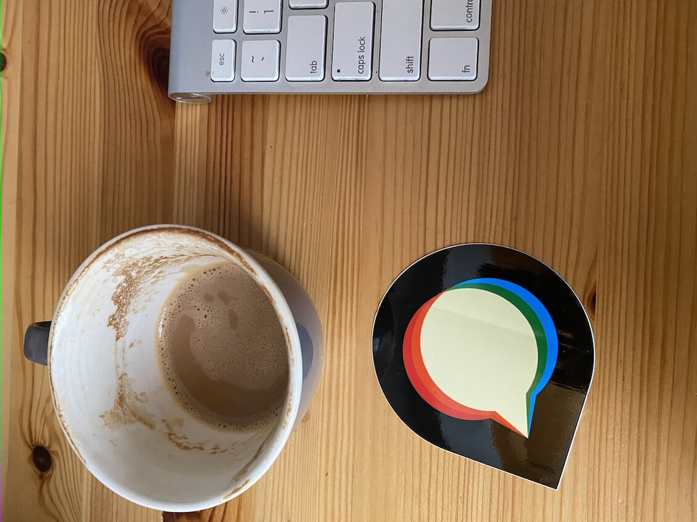

JPEG uploads with nonidentity EXIF orientation use the sandboxed libvips worker when `GlobalSetting.enable_vips_image_processing` is enabled. The caller adopts its temporary output after success and keeps the existing source-quality estimator. The flag remains default-off; `ImageMagick.image_quality` is still an ImageMagick operation pending a separate migration.

Current publication and review status: all twelve draft PRs are open and the final cumulative source passed all three selected reviewers. See [current heads](../published-prs.json), [source alignment](../current-stack-source-alignment.md), and [review verdicts](../review-final-verdicts.md). Any pending-head statements below describe the historical benchmark snapshot, not current status.

The corrected final production run covers thirteen inputs: all eight EXIF color-grid layouts, an oriented photograph, an ICC-tagged photograph, a progressive photograph, and two identity-orientation JPEGs with uncommon chroma sampling. [Raw results](final-selective/final-selective-corrected.json), [the complete runnable bundle](final-selective/), [source manifest](final-selective/source-manifest.json) and [verification record](verification.json) retain the measured evidence. Earlier [results](results.json) and [benchmark](benchmark/) remain historical. The first final run failed on an incorrect harness expectation after eleven cases; its [log, completed sample records and old manifest](final-selective/history/failed-selective-orientation-expectation/) remain separate. Both sampling fixtures actually contain orientation 1; correcting that expectation changed no production code or input bytes.

The measured source is `2ba8357019543403265a8b4cd24c906815484efe`. The later SVG-only `c63ee831d4d2e332c466f1a272793eec94d9c22d` leaves this path unchanged. The source audit found exact matches against review branch 08 head `871a32ddf21e33322c6fdab41afe89d766d9dd74` for worker `auto_orient`, `load_image_for_orientation`, `jpeg_subsample_mode`, `jpeg_sampling_factors`, `block_loaders`, and facade `auto_orient`. Client, worker-process, SafeExec and instrumentation files are byte-identical. The [source audit](final-source-alignment.md) and [detailed comparison](source-alignment-comparison.json) retain that check. This establishes source alignment, not final-head test or CI results.

Measurements ran as `discourse` with Landlock on the designated Linux server (2 CPUs, approximately 2 GiB RAM), using `discourse/base:2.0.20260812-0036` at digest `sha256:837e8ed4b5916baa36856b842ad84fe262b6b1b5550701f8844b13cc7acad7a5`. A deployment-specific image override remains unconfirmed. Runtime: Ruby 3.4.10, Linux 6.8.0-124-generic, libvips 8.18.4, ImageMagick 7.1.2-27 Q16-HDRI. The report records the exact `jpegtran` hash used to generate the progressive fixture.

Each case has one warm-up per backend and 31 timed transformations with alternating order. ImageMagick auto-orients a restored JPEG in place; libvips writes a separate JPEG through the real facade, IPC and sandbox worker. Input restoration, quality estimation, validation and output decoding are outside timing, as are caller adoption and cleanup. Source quality is estimated before timing (95 for grids, 89 for the other fixtures). Equal numeric quality does not establish equal quantization or pixels.

| Input | Output dimensions | IM median / p95 ms | libvips median / p95 ms | Median change | RGB mean / max difference | PSNR dB | Bytes IM → libvips |
| --- | --- | ---: | ---: | ---: | ---: | ---: | ---: |
| `grid-orientation-1.jpg` | 60×40 | 29.42 / 34.30 | 29.96 / 34.50 | +1.8% | 0.230 / 10 | 52.01 | 759 → 1,484 |
| `grid-orientation-2.jpg` | 60×40 | 30.68 / 37.94 | 31.98 / 35.33 | +4.3% | 0.286 / 15 | 50.60 | 783 → 1,482 |
| `grid-orientation-3.jpg` | 60×40 | 29.79 / 36.28 | 29.96 / 36.18 | +0.6% | 0.286 / 15 | 50.60 | 784 → 1,497 |
| `grid-orientation-4.jpg` | 60×40 | 28.54 / 40.10 | 30.38 / 32.39 | +6.5% | 0.230 / 10 | 52.01 | 760 → 1,470 |
| `grid-orientation-5.jpg` | 40×60 | 28.74 / 35.41 | 44.50 / 49.49 | +54.8% | 0.244 / 10 | 51.46 | 794 → 1,487 |
| `grid-orientation-6.jpg` | 40×60 | 28.44 / 34.77 | 43.34 / 50.87 | +52.4% | 0.244 / 10 | 51.46 | 794 → 1,494 |
| `grid-orientation-7.jpg` | 40×60 | 28.04 / 34.97 | 43.26 / 51.88 | +54.3% | 0.290 / 15 | 50.59 | 809 → 1,512 |
| `grid-orientation-8.jpg` | 40×60 | 30.72 / 36.31 | 43.59 / 48.05 | +41.9% | 0.289 / 15 | 50.63 | 806 → 1,515 |
| `photo-orientation-6.jpg` | 1129×846 | 115.84 / 148.08 | 89.20 / 126.34 | -23.0% | 1.543 / 29 | 41.19 | 216,035 → 185,720 |
| `photo-icc-orientation-8.jpg` | 1129×846 | 119.98 / 149.90 | 92.05 / 100.21 | -23.3% | 1.524 / 34 | 41.30 | 240,391 → 208,883 |
| `photo-progressive-orientation-6.jpg` | 1129×846 | 136.14 / 167.84 | 121.63 / 145.46 | -10.7% | 1.543 / 29 | 41.19 | 216,035 → 185,720 |
| `jpeg-sampling-422.jpg` | 96×64 | 28.63 / 34.12 | 46.91 / 52.57 | +63.8% | 8.899 / 34 | 25.94 | 1,638 → 3,706 |
| `jpeg-sampling-440.jpg` | 96×64 | 29.18 / 34.96 | 35.06 / 39.40 | +20.1% | 0.724 / 5 | 47.53 | 1,656 → 4,259 |

Ten of thirteen native medians are slower; the three photograph cases are faster. The same ten native outputs are larger, while the photographs are smaller. Five fresh-worker conversions took 347.87–529.62 ms (median 404.15 ms), including worker startup and conversion with a warm filesystem. There is no paired cold ImageMagick measurement.

All eight grids have the expected rotated/mirrored color layout, and both backends produce the expected dimensions and orientation 1. Every output retains its source ICC bytes; three photo inputs contain nonempty profiles. Both backends convert the progressive input to baseline JPEG, matching the legacy behavior rather than preserving progressive encoding. General metadata parity is not established.

The uncommon 422/440 cases use identity orientation solely to isolate source-sampling behavior; the production caller normally skips an identity transform. Native output uses 444 to avoid adding chroma loss on another axis, while ImageMagick retains 422/440. These larger outputs deliberately differ in encoding. [Final sampling evidence](../jpeg-sampling/README.md) documents this policy across all five operations and its source-relative fidelity limits.

Pixels in this report were independently decoded through ImageMagick to PNG, then compared in sRGB. The sampling companion uses libvips JPEG decoding, so its numerical differences can vary even for identical JPEG files. The measurements do not imply pixel identity or perceptual equivalence.

[All thirteen production before/after pairs and decoded previews](samples.md) are retained.

| Production output | ImageMagick | libvips |
| --- | --- | --- |
| Orientation 6 grid |  |  |
| Orientation 8 photo with ICC |  |  |

To rerun, use a writable copy of `final-selective/` as `/benchmark` in the recorded Linux image, install the locked bundle, and run as the unprivileged `discourse` user:

```sh
cd /benchmark
bundle install
RESULT_PATH=/benchmark/rerun.json bundle exec ruby boot.rb
```

The harness verifies its manifest, regenerates the progressive fixture and executes all thirteen cases. It overwrites that copy’s `outputs-final-selective/`; preserve the checked-in artifacts untouched. Review-head regression tests, final lint and CI remain separate pending checks.
