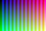
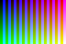
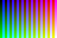

All final production outputs. Decoder previews are the actual PNGs used for pixel comparison.

| Input | ImageMagick JPEG | libvips JPEG | Decoded PNG previews |
| --- | --- | --- | --- |
| [grid-orientation-1.jpg](final-selective/inputs/grid-orientation-1.jpg) |  |  | [IM](final-selective/outputs-final-selective/grid-orientation-1.jpg-imagemagick-decoded.png) / [native](final-selective/outputs-final-selective/grid-orientation-1.jpg-libvips-decoded.png) |
| [grid-orientation-2.jpg](final-selective/inputs/grid-orientation-2.jpg) |  |  | [IM](final-selective/outputs-final-selective/grid-orientation-2.jpg-imagemagick-decoded.png) / [native](final-selective/outputs-final-selective/grid-orientation-2.jpg-libvips-decoded.png) |
| [grid-orientation-3.jpg](final-selective/inputs/grid-orientation-3.jpg) |  |  | [IM](final-selective/outputs-final-selective/grid-orientation-3.jpg-imagemagick-decoded.png) / [native](final-selective/outputs-final-selective/grid-orientation-3.jpg-libvips-decoded.png) |
| [grid-orientation-4.jpg](final-selective/inputs/grid-orientation-4.jpg) |  |  | [IM](final-selective/outputs-final-selective/grid-orientation-4.jpg-imagemagick-decoded.png) / [native](final-selective/outputs-final-selective/grid-orientation-4.jpg-libvips-decoded.png) |
| [grid-orientation-5.jpg](final-selective/inputs/grid-orientation-5.jpg) |  |  | [IM](final-selective/outputs-final-selective/grid-orientation-5.jpg-imagemagick-decoded.png) / [native](final-selective/outputs-final-selective/grid-orientation-5.jpg-libvips-decoded.png) |
| [grid-orientation-6.jpg](final-selective/inputs/grid-orientation-6.jpg) |  |  | [IM](final-selective/outputs-final-selective/grid-orientation-6.jpg-imagemagick-decoded.png) / [native](final-selective/outputs-final-selective/grid-orientation-6.jpg-libvips-decoded.png) |
| [grid-orientation-7.jpg](final-selective/inputs/grid-orientation-7.jpg) |  |  | [IM](final-selective/outputs-final-selective/grid-orientation-7.jpg-imagemagick-decoded.png) / [native](final-selective/outputs-final-selective/grid-orientation-7.jpg-libvips-decoded.png) |
| [grid-orientation-8.jpg](final-selective/inputs/grid-orientation-8.jpg) |  |  | [IM](final-selective/outputs-final-selective/grid-orientation-8.jpg-imagemagick-decoded.png) / [native](final-selective/outputs-final-selective/grid-orientation-8.jpg-libvips-decoded.png) |
| [photo-orientation-6.jpg](final-selective/inputs/photo-orientation-6.jpg) |  |  | [IM](final-selective/outputs-final-selective/photo-orientation-6.jpg-imagemagick-decoded.png) / [native](final-selective/outputs-final-selective/photo-orientation-6.jpg-libvips-decoded.png) |
| [photo-icc-orientation-8.jpg](final-selective/inputs/photo-icc-orientation-8.jpg) |  |  | [IM](final-selective/outputs-final-selective/photo-icc-orientation-8.jpg-imagemagick-decoded.png) / [native](final-selective/outputs-final-selective/photo-icc-orientation-8.jpg-libvips-decoded.png) |
| [photo-progressive-orientation-6.jpg](final-selective/inputs/photo-progressive-orientation-6.jpg) |  |  | [IM](final-selective/outputs-final-selective/photo-progressive-orientation-6.jpg-imagemagick-decoded.png) / [native](final-selective/outputs-final-selective/photo-progressive-orientation-6.jpg-libvips-decoded.png) |
| [jpeg-sampling-422.jpg](final-selective/inputs/jpeg-sampling-422.jpg) |  |  | [IM](final-selective/outputs-final-selective/jpeg-sampling-422.jpg-imagemagick-decoded.png) / [native](final-selective/outputs-final-selective/jpeg-sampling-422.jpg-libvips-decoded.png) |
| [jpeg-sampling-440.jpg](final-selective/inputs/jpeg-sampling-440.jpg) |  |  | [IM](final-selective/outputs-final-selective/jpeg-sampling-440.jpg-imagemagick-decoded.png) / [native](final-selective/outputs-final-selective/jpeg-sampling-440.jpg-libvips-decoded.png) |
