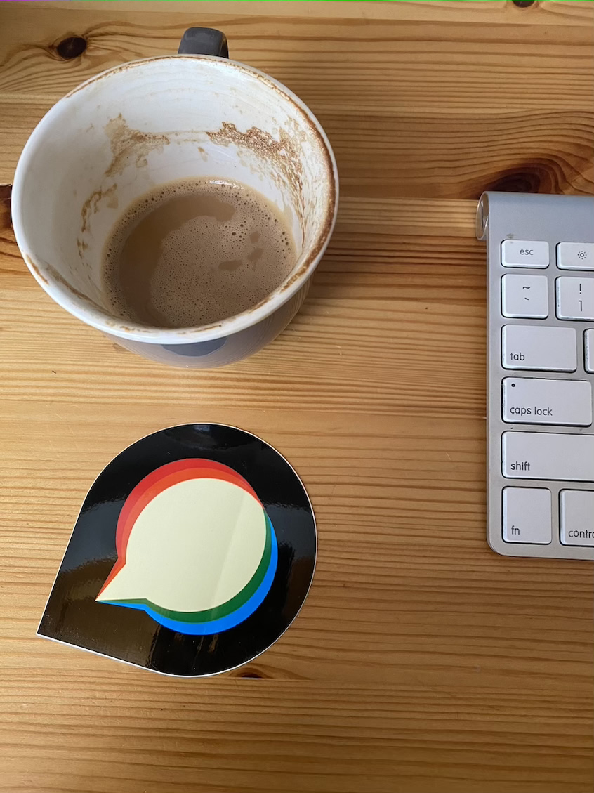

# Image quality query evidence

All 26 representative outcomes matched: 25 returned the same integer and JXL failed with the expected unsupported-format errors in both backends. All 500 generated JPEGs also returned the same estimates. Input hashes stayed unchanged.

The final benchmark ran as UID/GID 1000 in `discourse/base:2.0.20260812-0036`, pinned to `sha256:837e8ed4b5916baa36856b842ad84fe262b6b1b5550701f8844b13cc7acad7a5`, on the supplied Linux host. Each supported case has 31 alternating warm measurements per backend. Times include the actual public helper, process/worker communication and Landlock sandbox; they exclude fixture generation, Rails boot, format discovery and image optimization.

Thirteen native medians were faster and twelve were slower. Fresh native photo queries, including worker startup, had a median of 395.63 ms across five observations. These are scoped measurements, not a universal speedup claim.

| Sample | ImageMagick value | libvips value | IM median / p95 ms | libvips median / p95 ms |
| --- | --- | --- | --- | --- |
| [jpeg-photo](inputs/jpeg-photo.jpg) | 89 | 89 | 32.88 / 37.72 | 30.22 / 37.91 |
| [jpeg-grayscale](inputs/jpeg-grayscale.jpg) | 95 | 95 | 34.11 / 38.27 | 30.95 / 43.44 |
| [jpeg-progressive](inputs/jpeg-progressive.jpg) | 89 | 89 | 35.14 / 38.51 | 31.61 / 35.38 |
| [jpeg-matrix-source](inputs/jpeg-matrix-source.jpg) | 95 | 95 | 34.64 / 38.28 | 30.42 / 50.67 |
| [jpeg-logo](inputs/jpeg-logo.jpg) | 94 | 94 | 34.74 / 41.12 | 30.13 / 32.52 |
| [png](inputs/png.png) | 92 | 92 | 33.97 / 36.24 | 25.26 / 27.67 |
| [svg](inputs/svg.svg) | 92 | 92 | 39.86 / 46.31 | 30.06 / 39.22 |
| [gif-static](inputs/gif-static.gif) | 92 | 92 | 33.67 / 40.99 | 40.03 / 45.08 |
| [gif-animated](inputs/gif-animated.gif) | 9292929292929292929292929292929292929292 | 9292929292929292929292929292929292929292 | 35.60 / 41.11 | 41.27 / 46.68 |
| [gif-tiny-animated](inputs/gif-tiny-animated.gif) | 9292 | 9292 | 32.42 / 37.37 | 39.87 / 55.31 |
| [webp-static](inputs/webp-static.webp) | 92 | 92 | 33.13 / 50.48 | 44.97 / 95.62 |
| [webp-animated](inputs/webp-animated.webp) | 92929292929292929292929292929292929292929292929292929292929292929292929292929292929292929292929292929292929292929292929292929292929292 | 92929292929292929292929292929292929292929292929292929292929292929292929292929292929292929292929292929292929292929292929292929292929292 | 40.25 / 45.00 | 34.24 / 46.00 |
| [webp-lossless-static](inputs/webp-lossless-static.webp) | 100 | 100 | 31.79 / 37.51 | 30.39 / 35.49 |
| [webp-lossless-animated](inputs/webp-lossless-animated.webp) | 9292 | 9292 | 34.21 / 42.90 | 31.07 / 40.12 |
| [avif-static](inputs/avif-static.avif) | 92 | 92 | 32.29 / 35.39 | 30.50 / 33.59 |
| [avif-multipage](inputs/avif-multipage.avif) | 9292 | 9292 | 32.84 / 37.98 | 30.78 / 34.45 |
| [ico-single](inputs/ico-single.ico) | 92 | 92 | 34.69 / 41.15 | 42.86 / 50.19 |
| [ico-multi](inputs/ico-multi.ico) | 9292 | 9292 | 36.07 / 43.22 | 45.76 / 58.17 |
| [jxl](inputs/jxl.jxl) | Unsupported format error | Unsupported format error | Not timed | Not timed |
| [webp-inheritance-first-100-then-ordinary](inputs/webp-inheritance-first-100-then-ordinary.webp) | 100100 | 100100 | 33.69 / 36.51 | 32.89 / 36.93 |
| [webp-inheritance-ordinary-then-100](inputs/webp-inheritance-ordinary-then-100.webp) | 92100 | 92100 | 32.63 / 39.56 | 33.25 / 39.73 |
| [webp-inheritance-later-100-not-sticky](inputs/webp-inheritance-later-100-not-sticky.webp) | 9210092 | 9210092 | 34.10 / 38.54 | 36.72 / 48.53 |
| [webp-inheritance-ordinary-control](inputs/webp-inheritance-ordinary-control.webp) | 9292 | 9292 | 32.12 / 39.57 | 47.96 / 55.60 |
| [jpeg-default](generated/jpeg-default.jpg) | 95 | 95 | 35.16 / 50.77 | 50.57 / 97.65 |
| [jpeg-custom-table](generated/jpeg-custom-table.jpg) | 95 | 95 | 40.50 / 55.35 | 60.04 / 77.21 |
| [jpegli-quality-75](generated/jpegli-quality-75.jpg) | 52 | 52 | 34.79 / 41.26 | 50.95 / 58.84 |

## Sample gallery

This operation reads metadata and does not transform pixels. Each preview links to the exact input used for both before and after values. Original formats are retained; browser support for ICO, AVIF and JXL varies.

### jpeg-photo

[Original input](inputs/jpeg-photo.jpg) · 296,310 bytes

### jpeg-grayscale

[Original input](inputs/jpeg-grayscale.jpg) · 487 bytes

### jpeg-progressive

[Original input](inputs/jpeg-progressive.jpg) · 276,716 bytes

### jpeg-matrix-source

[Original input](inputs/jpeg-matrix-source.jpg) · 718 bytes

### jpeg-logo

[Original input](inputs/jpeg-logo.jpg) · 26,729 bytes

### png

[Original input](inputs/png.png) · 67 bytes

### svg

[Original input](inputs/svg.svg) · 141 bytes

### gif-static

[Original input](inputs/gif-static.gif) · 62 bytes

### gif-animated

[Original input](inputs/gif-animated.gif) · 309,071 bytes

### gif-tiny-animated

[Original input](inputs/gif-tiny-animated.gif) · 91 bytes

### webp-static

[Original input](inputs/webp-static.webp) · 280 bytes

### webp-animated

[Original input](inputs/webp-animated.webp) · 531,018 bytes

### webp-lossless-static

[Original input](inputs/webp-lossless-static.webp) · 294 bytes

### webp-lossless-animated

[Original input](inputs/webp-lossless-animated.webp) · 140 bytes

### avif-static

[Original input](inputs/avif-static.avif) · 534 bytes

### avif-multipage

[Original input](inputs/avif-multipage.avif) · 851 bytes

### ico-single

[Original input](inputs/ico-single.ico) · 70 bytes

### ico-multi

[Original input](inputs/ico-multi.ico) · 7,737 bytes

### jxl

[Original input](inputs/jxl.jxl) · 75 bytes

### webp-inheritance-first-100-then-ordinary

[Original input](inputs/webp-inheritance-first-100-then-ordinary.webp) · 640 bytes

### webp-inheritance-ordinary-then-100

[Original input](inputs/webp-inheritance-ordinary-then-100.webp) · 640 bytes

### webp-inheritance-later-100-not-sticky

[Original input](inputs/webp-inheritance-later-100-not-sticky.webp) · 938 bytes

### webp-inheritance-ordinary-control

[Original input](inputs/webp-inheritance-ordinary-control.webp) · 640 bytes

### jpeg-default

[Original input](generated/jpeg-default.jpg) · 723 bytes

### jpeg-custom-table

[Original input](generated/jpeg-custom-table.jpg) · 723 bytes

### jpegli-quality-75

[Original input](generated/jpegli-quality-75.jpg) · 1,314 bytes

## Reproduction and limits

- [Raw representative timings and returned values](quality-results.json), [500-case matrix](matrix-results.json), [corpus and generation recipes](corpus.json), and [source hashes](source-manifest.json).
- The JPEG matrix covers Q1–100 for color/grayscale, baseline/progressive ImageMagick encodings and ruby-vips JPEG encoding. Requested encoder quality is not assumed to equal the estimated value.
- Animated and multi-page quality strings are concatenated before integer conversion, matching the existing helper. These results may exceed 100.
- The four WebP compatibility fixtures retain valid frame data. Their [generator](reference/generate_webp_quality_inheritance.rb) and [decoding proof](reference/webp-quality-inheritance-fixtures/manifest.json) are retained.
- JPEG quality uses the approved compatible estimator and its pinned license/notice. JXL remains unsupported because the pinned ImageMagick build has no decoder for it.
- The production image is the verified launcher default; a deployment-specific override has not been verified. The initial root-user experiment is retained outside this final bundle and is not used for these timing claims.
- This does not prove every custom JPEG quantization table, malformed input, or full Rails upload/adoption path. Caller regression tests and independent review complement these measurements.
