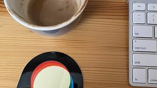

Image resize requests currently use ImageMagick to cover a requested canvas, center the image, and sharpen the result before the existing optimizer runs.

This commit routes `OptimizedImage.resize` through the sandboxed libvips worker when `GlobalSetting.enable_vips_image_processing` is enabled. It preserves center-cover geometry, exact output dimensions, first-frame and orientation handling, metadata modes, and the caller’s optimization boundary. It also removes the unused `colors` option, as approved for this migration; historical colors-option measurements remain excluded from performance results. The flag remains default-off. Source quality still uses `ImageMagick.image_quality`; replacing that probe requires a separate decision.

All 58 displayed outcomes come from one measured snapshot with base commit `c63ee831d4d2e332c466f1a272793eec94d9c22d`. The base commit alone does not identify the working-tree contents; [the source manifest](benchmark/source-manifest.json) and [raw results](results.json) record exact source-file hashes. This snapshot includes selective JPEG sampling and the SVG white-background correction. The earlier run remains unchanged under [historical evidence](historical/README.md).

There are 56 successful pairs with matching dimensions, decoded depth, and ICC hashes. Two SVG-output requests fail in both backends: the measured ImageMagick installation cannot run the `potrace` delegate, and libvips explicitly rejects SVG output. Those cases are recorded once and receive no warm timings. Their legacy `svg-blocked` case names come from an earlier development environment; this production failure is an output-delegate failure, not a demonstrated SVG-input policy restriction.

Measurements ran on the designated Linux server (2 CPUs, approximately 2 GiB RAM), as `discourse` with Landlock enabled, in `discourse/base:2.0.20260812-0036` at digest `sha256:837e8ed4b5916baa36856b842ad84fe262b6b1b5550701f8844b13cc7acad7a5`. The deployment-specific image override has not been verified. Runtime: Ruby 3.4.10, libvips 8.18.4, ImageMagick 7.1.2-27 Q16-HDRI.

Each successful pair has 31 alternating warm iterations after an initial validation. The timed core includes the wrapper, IPC, sandbox child, priority 10, decode, resize, center crop/extent, sharpen, and encode. It excludes Rails boot, source-quality probing, evidence decoding, and `FileHelper` optimization. Source-quality probes take 26.42–48.36 ms outside the transform clock; the photograph probes take 28.13 ms with metadata retention and 26.42 ms with stripping. Quality is explicit in the native request: caller quality wins; otherwise use estimated source JPEG quality or lossless WebP quality 100, then JPEG 92, WebP 75, or AVIF 50. These are not complete upload timings. The [standalone harness](benchmark/geometry_evidence.rb) runs through `OPERATION=resize RESULT_PATH=<fresh-path> bundle exec ruby boot.rb` from its bundle directory.

Both `strip_image_metadata` modes are measured. The 16-bit PNG stays `ushort` with retention and becomes `uchar` with stripping, matching the recorded legacy behavior. Ten profile-bearing pairs retain exact ICC bytes, including the profile grids, explicit-quality JPEGs, and photograph in both metadata modes. The worker retains ICC when stripping other metadata; the existing optimizer’s final codec-specific stripping is outside these measurements. The CMYK fixture has no decoded output ICC in either backend, and the production ImageMagick image reports missing LCMS support. These comparisons do not establish colorimetric accuracy across arbitrary profiles.

Native output adds 180 bytes of decoded EXIF for first-frame WebP and SVG when metadata retention is enabled; ImageMagick records none. With stripping enabled, both record zero decoded EXIF. SVG outputs differ in encoding despite equal pixels: ImageMagick writes 1-bit grayscale PNG while libvips writes 8-bit RGB PNG. Both decode to `uchar`.

SVG→PNG is pixel- and alpha-identical over black and white in both metadata modes at 30×20. The separate [50-case SVG geometry proof](../svg-geometry/README.md) covers namespace variants, colored and partially transparent shapes, backgrounds, and all three geometry operations. Its background/alpha checks pass, while colored-edge rasterization still differs (worst case MAE 1.498/max channel 23); this does not establish universal pixel identity for SVG content.

Raster alpha edges remain different: maximum alpha errors are 5/7 for PNG/WebP/lossless-WebP grids, 15/26 for AVIF, and 9/12 for first-frame WebP (metadata false/true). Both GIF-output alpha masks are exact. Visible error uses the worse of black and white composites; hidden RGB under transparent pixels is excluded. AVIF strip-true has visible MAE 2.653/max 29. No blanket alpha-parity claim is supported.

JPEG sampling now matches quality 90 outputs at 4:2:0 and photograph outputs at 4:4:4 in both modes. Pixels still differ: quality 90 visible MAE is 2.519/2.496, max 17; quality 40 remains 8.653/8.626, max 79; the JPEG grid is 4.874/4.738, max 33/39. The photograph is 2.547/2.638, max 32/37, and the orientation fixture is 4.027/4.089, max 41/42. Centered geometry grids have max error 1 except the 1×1 reduction (max 4/3); the constant tiny-image enlargement cases are pixel-identical.

Of the 56 successful pairs, 48 have slower libvips warm medians. Tiny 29×21 PNG outputs take 42.60→70.85 ms with retention and 37.43→62.96 ms with stripping. The 45×45 avatar takes 54.54→75.01 ms or 51.31→59.85 ms; the 120×120 avatar also regresses. Larger examples improve: the 359×359 avatar takes 181.05→98.96 ms or 171.55→79.91 ms; the 846×1129 photograph resized to 320×180 takes 171.25→85.27 ms or 171.47→88.91 ms. First-frame GIF and WebP improve in both modes. Correct SVG output is slightly slower at 332.66→337.23 ms or 347.34→360.48 ms.

Five fresh-worker photograph calls with metadata retention succeed in 396.00–531.69 ms (median 473.41 ms), including startup plus conversion with warm filesystem caches. No paired cold ImageMagick series was measured.

All 58 outcomes are listed below. Timings are median / p95 milliseconds; pixel differences are measured after evidence decoding to 8-bit sRGB. Names ending in `strip-false` and `strip-true` identify metadata mode. Matching decoded depth and ICC does not imply identical file encoding, metadata, or pixels.

| Case | Output dimensions | Quality | IM median / p95 ms | libvips median / p95 ms | Visible MAE / max | Alpha max | Outcome |
| --- | --- | ---: | ---: | ---: | ---: | ---: | --- |
| `png-grid-strip-false` | 29×21 | — | 42.60 / 54.76 | 70.85 / 86.82 | 0.600 / 14 | 0 | Dimensions/ICC/decoded depth match |
| `png-grid-alpha-strip-false` | 29×21 | — | 42.20 / 46.92 | 70.70 / 80.75 | 0.201 / 5 | 5 | Dimensions/ICC/decoded depth match |
| `png-grid-16bit-strip-false` | 29×21 | — | 40.29 / 45.74 | 60.95 / 70.98 | 0.530 / 5 | 0 | Dimensions/ICC/decoded depth match |
| `png-grid-profile-strip-false` | 29×21 | — | 39.39 / 49.12 | 66.23 / 75.84 | 0.600 / 14 | 0 | Dimensions/ICC/decoded depth match |
| `jpg-grid-strip-false` | 29×21 | 74 | 40.48 / 58.29 | 67.41 / 118.63 | 4.874 / 33 | 0 | Dimensions/ICC/decoded depth match |
| `jpg-grid-profile-strip-false` | 29×21 | 74 | 38.69 / 48.53 | 69.03 / 91.91 | 4.874 / 33 | 0 | Dimensions/ICC/decoded depth match |
| `jpg-grid-cmyk-profile-strip-false` | 29×21 | 87 | 65.14 / 71.80 | 98.56 / 118.16 | 2.267 / 34 | 0 | Dimensions/ICC/decoded depth match |
| `webp-grid-strip-false` | 29×21 | 75 | 45.45 / 53.03 | 79.32 / 89.73 | 1.885 / 26 | 5 | Dimensions/ICC/decoded depth match |
| `webp-grid-lossless-strip-false` | 29×21 | 100 | 42.28 / 47.41 | 76.92 / 84.07 | 0.201 / 5 | 5 | Dimensions/ICC/decoded depth match |
| `avif-grid-strip-false` | 29×21 | 50 | 53.43 / 68.87 | 95.46 / 106.05 | 1.227 / 22 | 15 | Dimensions/ICC/decoded depth match |
| `first-gif-strip-false` | 120×90 | — | 237.03 / 299.67 | 132.80 / 193.04 | 0.075 / 7 | 0 | Dimensions/ICC/decoded depth match |
| `first-webp-strip-false` | 120×90 | 75 | 209.54 / 238.52 | 109.27 / 123.10 | 1.443 / 30 | 9 | Dimensions/ICC/decoded depth match |
| `first-ico-strip-false` | 30×20 | — | 40.43 / 48.47 | 72.74 / 80.35 | 0.653 / 8 | 0 | Dimensions/ICC/decoded depth match |
| `svg-blocked-strip-false` | — | — | — | — | — | — | Both fail; no warm timing |
| `quality-40-strip-false` | 29×21 | 40 | 36.97 / 41.76 | 68.34 / 77.55 | 8.653 / 79 | 0 | Dimensions/ICC/decoded depth match |
| `quality-90-strip-false` | 29×21 | 90 | 36.15 / 42.05 | 66.06 / 73.78 | 2.519 / 17 | 0 | Dimensions/ICC/decoded depth match |
| `geometry-50x50-strip-false` | 50×50 | — | 45.30 / 74.56 | 67.10 / 96.05 | 0.027 / 1 | 0 | Dimensions/ICC/decoded depth match |
| `geometry-51x25-strip-false` | 51×25 | — | 40.01 / 49.76 | 69.18 / 77.68 | 0.040 / 1 | 0 | Dimensions/ICC/decoded depth match |
| `geometry-31x19-strip-false` | 31×19 | — | 37.66 / 44.37 | 65.93 / 71.79 | 0.214 / 1 | 0 | Dimensions/ICC/decoded depth match |
| `geometry-103x53-strip-false` | 103×53 | — | 42.51 / 51.21 | 72.77 / 85.39 | 0.016 / 1 | 0 | Dimensions/ICC/decoded depth match |
| `geometry-1x1-strip-false` | 1×1 | — | 35.08 / 43.75 | 68.37 / 75.69 | 1.667 / 4 | 0 | Dimensions/ICC/decoded depth match |
| `enlarge-1x1-strip-false` | 16×12 | — | 34.03 / 42.54 | 60.34 / 70.37 | 0.000 / 0 | 0 | Dimensions/ICC/decoded depth match |
| `enlarge-3x7-strip-false` | 20×30 | — | 39.26 / 49.39 | 68.69 / 78.78 | 0.000 / 0 | 0 | Dimensions/ICC/decoded depth match |
| `letter-avatar-45-strip-false` | 45×45 | — | 54.54 / 64.39 | 75.01 / 86.65 | 0.480 / 18 | 0 | Dimensions/ICC/decoded depth match |
| `letter-avatar-120-strip-false` | 120×120 | — | 103.35 / 192.16 | 149.17 / 200.33 | 0.123 / 10 | 0 | Dimensions/ICC/decoded depth match |
| `letter-avatar-359-strip-false` | 359×359 | — | 181.05 / 218.86 | 98.96 / 137.19 | 0.039 / 9 | 0 | Dimensions/ICC/decoded depth match |
| `png-grid-strip-true` | 29×21 | — | 37.43 / 45.04 | 62.96 / 68.78 | 0.670 / 16 | 0 | Dimensions/ICC/decoded depth match |
| `png-grid-alpha-strip-true` | 29×21 | — | 35.81 / 43.52 | 64.10 / 71.05 | 0.583 / 7 | 7 | Dimensions/ICC/decoded depth match |
| `png-grid-16bit-strip-true` | 29×21 | — | 37.61 / 45.33 | 67.01 / 76.85 | 0.670 / 16 | 0 | Dimensions/ICC/decoded depth match |
| `png-grid-profile-strip-true` | 29×21 | — | 39.91 / 55.15 | 64.76 / 93.03 | 0.670 / 16 | 0 | Dimensions/ICC/decoded depth match |
| `jpg-grid-strip-true` | 29×21 | 74 | 40.24 / 44.90 | 68.11 / 77.42 | 4.738 / 39 | 0 | Dimensions/ICC/decoded depth match |
| `jpg-grid-profile-strip-true` | 29×21 | 74 | 36.88 / 43.69 | 64.56 / 74.88 | 4.738 / 39 | 0 | Dimensions/ICC/decoded depth match |
| `jpg-grid-cmyk-profile-strip-true` | 29×21 | 87 | 65.33 / 70.74 | 93.36 / 106.63 | 2.354 / 36 | 0 | Dimensions/ICC/decoded depth match |
| `webp-grid-strip-true` | 29×21 | 75 | 42.54 / 51.84 | 68.35 / 78.28 | 2.153 / 37 | 7 | Dimensions/ICC/decoded depth match |
| `webp-grid-lossless-strip-true` | 29×21 | 100 | 39.09 / 47.13 | 63.60 / 72.58 | 0.583 / 7 | 7 | Dimensions/ICC/decoded depth match |
| `avif-grid-strip-true` | 29×21 | 50 | 50.48 / 62.06 | 78.83 / 84.78 | 2.653 / 29 | 26 | Dimensions/ICC/decoded depth match |
| `first-gif-strip-true` | 120×90 | — | 241.41 / 312.58 | 102.17 / 173.06 | 0.071 / 9 | 0 | Dimensions/ICC/decoded depth match |
| `first-webp-strip-true` | 120×90 | 75 | 211.14 / 235.38 | 89.06 / 104.30 | 1.600 / 32 | 12 | Dimensions/ICC/decoded depth match |
| `first-ico-strip-true` | 30×20 | — | 39.45 / 46.98 | 61.87 / 67.96 | 0.593 / 12 | 0 | Dimensions/ICC/decoded depth match |
| `svg-blocked-strip-true` | — | — | — | — | — | — | Both fail; no warm timing |
| `quality-40-strip-true` | 29×21 | 40 | 35.91 / 42.30 | 56.19 / 62.42 | 8.626 / 79 | 0 | Dimensions/ICC/decoded depth match |
| `quality-90-strip-true` | 29×21 | 90 | 37.56 / 44.85 | 58.06 / 65.51 | 2.496 / 17 | 0 | Dimensions/ICC/decoded depth match |
| `geometry-50x50-strip-true` | 50×50 | — | 41.93 / 58.62 | 53.94 / 72.63 | 0.033 / 1 | 0 | Dimensions/ICC/decoded depth match |
| `geometry-51x25-strip-true` | 51×25 | — | 38.22 / 46.02 | 53.82 / 59.78 | 0.046 / 1 | 0 | Dimensions/ICC/decoded depth match |
| `geometry-31x19-strip-true` | 31×19 | — | 40.73 / 46.28 | 56.62 / 64.92 | 0.197 / 1 | 0 | Dimensions/ICC/decoded depth match |
| `geometry-103x53-strip-true` | 103×53 | — | 42.88 / 50.11 | 55.10 / 61.08 | 0.054 / 1 | 0 | Dimensions/ICC/decoded depth match |
| `geometry-1x1-strip-true` | 1×1 | — | 40.15 / 44.04 | 56.44 / 63.06 | 1.333 / 3 | 0 | Dimensions/ICC/decoded depth match |
| `enlarge-1x1-strip-true` | 16×12 | — | 39.56 / 44.04 | 50.29 / 55.87 | 0.000 / 0 | 0 | Dimensions/ICC/decoded depth match |
| `enlarge-3x7-strip-true` | 20×30 | — | 37.57 / 44.26 | 51.71 / 56.82 | 0.000 / 0 | 0 | Dimensions/ICC/decoded depth match |
| `letter-avatar-45-strip-true` | 45×45 | — | 51.31 / 60.56 | 59.85 / 66.92 | 0.599 / 34 | 0 | Dimensions/ICC/decoded depth match |
| `letter-avatar-120-strip-true` | 120×120 | — | 62.85 / 80.14 | 65.05 / 71.77 | 0.272 / 33 | 0 | Dimensions/ICC/decoded depth match |
| `letter-avatar-359-strip-true` | 359×359 | — | 171.55 / 230.33 | 79.91 / 116.94 | 0.042 / 10 | 0 | Dimensions/ICC/decoded depth match |
| `natural-photo-strip-false` | 320×180 | 89 | 171.25 / 202.81 | 85.27 / 96.54 | 2.547 / 32 | 0 | Dimensions/ICC/decoded depth match |
| `orientation-added-strip-false` | 29×21 | 74 | 35.10 / 42.85 | 51.69 / 58.46 | 4.027 / 41 | 0 | Dimensions/ICC/decoded depth match |
| `natural-photo-strip-true` | 320×180 | 89 | 171.47 / 226.50 | 88.91 / 106.57 | 2.638 / 37 | 0 | Dimensions/ICC/decoded depth match |
| `orientation-added-strip-true` | 29×21 | 74 | 40.17 / 57.82 | 56.19 / 76.25 | 4.089 / 42 | 0 | Dimensions/ICC/decoded depth match |
| `svg-to-png-strip-false` | 30×20 | — | 332.66 / 376.78 | 337.23 / 361.49 | 0.000 / 0 | 0 | Dimensions/ICC/decoded depth match |
| `svg-to-png-strip-true` | 30×20 | — | 347.34 / 405.50 | 360.48 / 484.09 | 0.000 / 0 | 0 | Dimensions/ICC/decoded depth match |

Every successful pair is shown to expose both metadata modes, tiny geometry edges, and format-specific differences. Previews are the retained decoded PNGs; original encoded files and hashes remain in results.json.

| Case | ImageMagick | libvips |
| --- | --- | --- |
| `png-grid-strip-false` |  |  |
| `png-grid-alpha-strip-false` |  |  |
| `png-grid-16bit-strip-false` |  |  |
| `png-grid-profile-strip-false` |  |  |
| `jpg-grid-strip-false` |  |  |
| `jpg-grid-profile-strip-false` |  |  |
| `jpg-grid-cmyk-profile-strip-false` |  |  |
| `webp-grid-strip-false` |  |  |
| `webp-grid-lossless-strip-false` |  |  |
| `avif-grid-strip-false` |  |  |
| `first-gif-strip-false` |  |  |
| `first-webp-strip-false` |  |  |
| `first-ico-strip-false` |  |  |
| `quality-40-strip-false` |  |  |
| `quality-90-strip-false` |  |  |
| `geometry-50x50-strip-false` |  |  |
| `geometry-51x25-strip-false` |  |  |
| `geometry-31x19-strip-false` |  |  |
| `geometry-103x53-strip-false` |  |  |
| `geometry-1x1-strip-false` |  |  |
| `enlarge-1x1-strip-false` |  |  |
| `enlarge-3x7-strip-false` |  |  |
| `letter-avatar-45-strip-false` |  |  |
| `letter-avatar-120-strip-false` |  |  |
| `letter-avatar-359-strip-false` |  |  |
| `png-grid-strip-true` |  |  |
| `png-grid-alpha-strip-true` |  |  |
| `png-grid-16bit-strip-true` |  |  |
| `png-grid-profile-strip-true` |  |  |
| `jpg-grid-strip-true` |  |  |
| `jpg-grid-profile-strip-true` |  |  |
| `jpg-grid-cmyk-profile-strip-true` |  |  |
| `webp-grid-strip-true` |  |  |
| `webp-grid-lossless-strip-true` |  |  |
| `avif-grid-strip-true` |  |  |
| `first-gif-strip-true` |  |  |
| `first-webp-strip-true` |  |  |
| `first-ico-strip-true` |  |  |
| `quality-40-strip-true` |  |  |
| `quality-90-strip-true` |  |  |
| `geometry-50x50-strip-true` |  |  |
| `geometry-51x25-strip-true` |  |  |
| `geometry-31x19-strip-true` |  |  |
| `geometry-103x53-strip-true` |  |  |
| `geometry-1x1-strip-true` |  |  |
| `enlarge-1x1-strip-true` |  |  |
| `enlarge-3x7-strip-true` |  |  |
| `letter-avatar-45-strip-true` |  |  |
| `letter-avatar-120-strip-true` |  |  |
| `letter-avatar-359-strip-true` |  |  |
| `natural-photo-strip-false` |  |  |
| `orientation-added-strip-false` |  |  |
| `natural-photo-strip-true` |  |  |
| `orientation-added-strip-true` |  |  |
| `svg-to-png-strip-false` |  |  |
| `svg-to-png-strip-true` |  |  |

[Artifact verification](verification.json) checks the exact source, manifest, harness, inputs, encoded outputs, cold-run files, and all raw timing distributions. This is source-snapshot evidence; final formatted-head checks, formal review, individual PR CI, and complete caller/post-optimizer evidence remain separate.

Publication sequence: `tgxworld/vips-review-10-resize` targets `tgxworld/vips-review-09-downsize`. The immutable evidence commit is pending.
