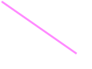
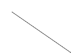

Previously, SVG logos and other SVG assets used by topic Open Graph cards were rasterized through ImageMagick.

Current publication and review status: all twelve draft PRs are open and the final cumulative source passed all three selected reviewers. See [current heads](../published-prs.json), [source alignment](../current-stack-source-alignment.md), and [review verdicts](../review-final-verdicts.md). Any pending-head statements below describe the historical benchmark snapshot, not current status.

This commit rasterizes those assets through the existing sandboxed libvips worker when `GlobalSetting.enable_vips_image_processing` is enabled. It retains intrinsic sizing, white flattening, and the existing 10-second timeout.

The measured source is `074eb1c476555694fc135c99a6e391deeeef908a`. This operation depends on the SVG dimension loader and is separate from full Open Graph card rendering. No explicit output size or PNG compression override is added. The worker rejects identical input/output files and retains narrowly scoped input, output, and font access.

The benchmark ran as `discourse` on the designated Linux server (2 CPUs, 2 GiB RAM), with Landlock enabled, in `discourse/base:2.0.20260812-0036` at `sha256:837e8ed4b5916baa36856b842ad84fe262b6b1b5550701f8844b13cc7acad7a5`. This is the official launcher default image; confirmation against the deployed production image remains pending. Runtime: Ruby 3.4.10, libvips 8.18.4, ImageMagick 7.1.2-27 Q16-HDRI.

All ten measured samples completed in both backends with matching dimensions. They cover fixed dimensions, physical units, viewBox-only dimensions, leading whitespace in viewBox, zero width/height, transparency, and a gradient logo. [Raw results](results.json) record input/output hashes and every timing. [The standalone bundle](benchmark/) includes exact source files, fixtures, and locked dependencies.

Each warm measurement includes the operation wrapper, IPC, sandbox child, and renderer. Backends alternate over 31 iterations per input. Rails boot, full card generation, and upload persistence are excluded. PNG byte counts and pixel rendering may differ even when dimensions match; this benchmark does not assert pixel identity.

| Sample | Dimensions | ImageMagick median / p95 (ms) | libvips median / p95 (ms) | Median change | PNG bytes, before → after |
| --- | --- | ---: | ---: | ---: | ---: |
| `fixed` | 120×80 | 31.92 / 39.39 | 32.53 / 38.03 | +1.9% | 306 → 467 |
| `gradient-logo` | 240×100 | 335.84 / 470.32 | 316.87 / 446.44 | -5.6% | 7,131 → 4,018 |
| `image` | 100×50 | 329.56 / 363.35 | 291.83 / 373.28 | -11.4% | 304 → 399 |
| `leading-whitespace-viewbox` | 120×90 | 31.66 / 42.03 | 35.55 / 42.19 | +12.3% | 308 → 488 |
| `tiny` | 115×86 | 34.80 / 40.96 | 34.05 / 44.53 | -2.2% | 1,439 → 1,081 |
| `transparency` | 12×4 | 34.23 / 42.47 | 34.32 / 46.48 | +0.2% | 329 → 294 |
| `viewbox` | 120×90 | 34.63 / 43.04 | 34.98 / 41.36 | +1.0% | 308 → 488 |
| `zero-height` | 80×90 | 35.00 / 40.73 | 37.13 / 45.10 | +6.1% | 304 → 395 |
| `zero-width` | 120×60 | 33.05 / 41.36 | 35.23 / 43.21 | +6.6% | 305 → 424 |
| `zero_sized` | 120×90 | 39.92 / 44.40 | 41.18 / 44.43 | +3.2% | 1,171 → 1,235 |

Positive median changes are regressions. Seven of ten measured samples are slower with libvips in this run, including the simple dimension/viewBox cases. The gradient logo and namespace-less image improve, while the physical-unit sample changes little. Output files are larger for several small fixtures.

Five fresh-worker gradient-logo calls measured 651.12–718.64 ms (median 687.51 ms). These include rendering plus startup; no paired cold ImageMagick measurement was recorded.

`massive.svg`, the 75-megapixel dimension-probe fixture, is explicitly excluded in results.json because it is not a representative OG asset. No large-SVG stress performance or resource-bound conclusion is supported by this run.

The PNG pairs below are the returned Linux benchmark outputs. Transparency is flattened onto white to preserve existing asset behavior. Renderer-specific differences in gradients, text, and edge rasterization still require visual review; the full OG benchmark separately records missing CJK glyphs in this base image.

| Sample | ImageMagick | libvips |
| --- | --- | --- |
| `fixed` |  |  |
| `gradient-logo` |  |  |
| `image` |  |  |
| `leading-whitespace-viewbox` |  |  |
| `tiny` |  |  |
| `transparency` |  |  |
| `viewbox` |  |  |
| `zero-height` |  |  |
| `zero-width` |  |  |
| `zero_sized` |  |  |

The flag remains default-off. These measurements describe the recorded source snapshot and do not claim that the final PR head passes tests or CI. Final source alignment, caller verification, lint at push time, and PR CI remain pending.

Review source: `tgxworld/vips-review-03-svg-assets`, base `4a9d9de44a95a7a0801430616181323cbf80c3dc`, head `a24b98fcca894948bd3ac0c993b974c6005426fe`. Source commits: `074eb1c476555694fc135c99a6e391deeeef908a`. The complete operation stack is recorded in [review-stack-manifest.json](../review-stack-manifest.json). Benchmark snapshots and extracted review heads have separate identities; measured results do not imply that this exact head passed tests or CI.
