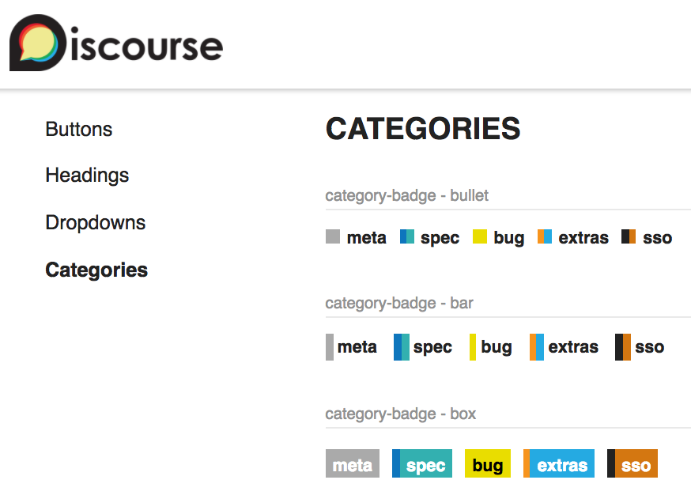

# styleguide

Adds a URL of `/styleguide` to discourse that renders widgets in various
configurations to aid in styling.



## Code examples

Discourse's build pipeline allows adding `?source=file` or `?source=template` to
a module import. This provides a string of the raw source code for the entire
file, or just for the `<template>`. Put the example in its own module under
`examples/`, import it twice, and pass the string to `@code`:

```gjs
import StyleguideExample from "discourse/plugins/styleguide/discourse/components/styleguide-example";
import CharCounterExample from "../../examples/molecules/char-counter";
import charCounterSource from "../../examples/molecules/char-counter?source=file";

export default <template>
  <StyleguideExample @title="<DCharCounter>" @code={{charCounterSource}}>
    <CharCounterExample />
  </StyleguideExample>
</template>
```

The import must resolve within the same plugin or theme bundle, and
`?source=template` requires the module to contain exactly one `<template>`.

### Criteria

Samples typed by hand drift from the code they describe. These rules keep that
from being possible.

1. Every `<StyleguideExample>` that passes `@code` passes a `?source=` import,
   never a hand-written string.

2. Each example is its own module under `examples/`. A module may back several
   examples when the variants differ only in the data passed in.

3. Use `?source=file` when the module has imports or JS, so the reader sees
   what to paste into a new file. Use `?source=template` when it is pure markup.

4. The example module holds only the API being taught. Styleguide-only chrome
   stays in the section file, wrapping the example.

5. An example receives only what it cannot build itself. Store-backed records
   come in as named args; literal fixtures, state and callbacks the example
   owns. Examples never take `@dummy` itself.

6. An example demonstrating a design token, a color or a type scale does not
   need `@code` at all.

7. A hand-written `@code` string is admissible only when the sample cannot be a
   module that renders on this page: it is computed from the page's live
   controls, or the block is a gallery rather than a usage example. It must
   carry a comment saying which.

### Layout

```
examples/<category>/<section>/<name>.gjs
examples/<category>/<name>.gjs          # flat, for a section with few examples
```

`<category>` is `atoms`, `molecules` or `organisms`; `<section>` is the section
file name without its numeric prefix; and `<name>` is a kebab-case slug for the
variant. Both shapes are in use: a section with only a handful of examples keeps
them flat under `<category>`, named for the example rather than the section, and
a section with enough of them to be worth grouping gets its own directory.
Import with a relative specifier and no file extension, and name the bindings
`<Name>Example` and `<name>Source`.

When a section is split into groups (see below), put the group slug between the
section and the name so the source tree stays correlated with the page's
navigation. No section does this yet, so this level is a convention for the
first one that adopts groups rather than a rule the tree currently follows:

```
examples/<category>/<section>/<group>/<name>.gjs
```

## Card anatomy

`<StyleguideExample>` has a fixed set of slots, each on its own row, so cards in
a group line up with each other rather than drifting with the prose above them.
All of `@description`, `@tryThis` and `@note` take either a string or a named
block; a block wins when both are given.

| Slot | What belongs there |
| --- | --- |
| `@title` | The capability being shown. |
| `@description` | What this example proves. Prefer supplying one. |
| `@tryThis` | Something the reader can do to see it happen. Omit when there is nothing to do. |
| default block | The live component. |
| `@note` | What to notice afterwards. Give a list in the block the class `styleguide-example__note-list`. |
| `@code` | The `?source=` import, revealed by a toggle. |

Backticks render as inline `<code>` in the three prose slots — `@description`,
`@tryThis` and `@note` — so an argument or block name can sit in a sentence
without splitting it across keys. `@title` and the group heading and description
render their text as-is.

```yaml
some_key: "never mutates `@value`"
```

`@headingLevel` defaults to `2`, which suits an ungrouped page whose only
heading above the card is the page's own `h1`.

Two opt-in classes are available to markup an example yields:
`styleguide-example__result`, for the element a demo writes its output into,
which belongs in the default block; and `styleguide-example__note-list`, for a
list, which belongs in a `note` block. A card may also take `class="--wide"` to
span a whole grid row; put a wide card first in its group, since the grid places
cards sparsely and a wide card elsewhere sits flush only when the cards before
it happen to fill their row.

## Groups

A long section can be split into named groups reachable from a sticky subnav,
with the active group carried in a `?group=` query param so a link addresses one
group rather than a whole page. Pass an ordered manifest of
`{ id, title, description }`; it is the single source of truth for both the
subnav and the group order. The pills are real links, not tabs. Pass
`@ariaLabel` too — the subnav is a `<nav>` landmark and needs a name.

`StyleguideGroup` yields a `StyleguideExample` already curried to
`@headingLevel={{3}}`, so a grouped page keeps a correct `h1` → `h2` → `h3`
outline without each call site restating it:

```gjs
<StyleguideGroups
  @groups={{this.groups}}
  @section={{@section}}
  @active={{@group}}
  @ariaLabel={{i18n "styleguide.sections.thing.groups.aria_label"}}
  as |Group|
>
  <Group @id="start" as |Example|>
    <Example @title="<DThing>" @code={{thingSource}}>
      <ThingExample />
    </Example>
  </Group>
</StyleguideGroups>
```
