# TangyZen 后台管理系统集成指南

## 📋 配置信息

### 后台管理地址
```
https://tangyzen.com/admin/config/site-admin
```

### API密钥
```
API Key: 1c2e073f39301b3c088ac83a3608e6462945a0b9910b81e7f9941d41bf5eba21
```

### GitHub仓库
```
https://github.com/lucy-web-dev/discourse.git
```

---

## 🔧 后台配置步骤

### 步骤1: 在Discourse后台配置API密钥

1. 访问 `https://tangyzen.com/admin/config/site-admin`
2. 查找 "TangyZen Plugin Settings" 或创建自定义设置
3. 配置以下参数:

```yaml
# TangyZen Plugin Configuration
tangyzen:
  api_key: "1c2e073f39301b3c088ac83a3608e6462945a0b9910b81e7f9941d41bf5eba21"
  admin_url: "https://tangyzen.com/admin"
  
  # OpenSea Configuration
  opensea:
    api_key: "3bfaca9964d74c08b42958d9319208e3"
    base_url: "https://api.opensea.io/api/v2"
    enabled: true
  
  # Content Type Settings
  content_types:
    deals:
      enabled: true
      auto_approve: false
      require_moderation: true
    
    gaming:
      enabled: true
      auto_approve: false
      max_rating: 10
    
    music:
      enabled: true
      require_cover: true
    
    movies:
      enabled: true
      require_poster: true
    
    reviews:
      enabled: true
      min_rating: 1
      max_rating: 5
    
    art:
      enabled: true
      max_images: 10
    
    blogs:
      enabled: true
      min_words: 100
  
  # Web3 Configuration
  web3:
    enabled: true
    auto_sync_nfts: true
    sync_interval: 3600
    featured_collections:
      - "bored-ape-yacht-club"
      - "azuki"
      - "doodles-official"
```

### 步骤2: 创建后台管理控制器

#### 文件: `app/controllers/tangyzen/admin_controller.rb`

```ruby
# frozen_string_literal: true

module Tangyzen
  class AdminController < ::ApplicationController
    requires_plugin 'tangyzen-plugin'
    
    before_action :ensure_admin
    before_action :verify_api_key
    
    # GET /admin/plugins/tangyzen/overview
    def overview
      render_json({
        stats: {
          total_deals: Tangyzen::Deal.count,
          total_gaming: Tangyzen::Gaming.count,
          total_music: Tangyzen::Music.count,
          total_movies: Tangyzen::Movie.count,
          total_reviews: Tangyzen::Review.count,
          total_art: Tangyzen::Art.count,
          total_blogs: Tangyzen::Blog.count,
          total_users: User.joins(:user_custom_fields)
            .where(user_custom_fields: { name: 'tangyzen_member' })
            .count,
          total_views: calculate_total_views,
          total_likes: calculate_total_likes
        },
        recent_activity: recent_activity,
        trending_content: trending_content
      })
    end
    
    # GET /admin/plugins/tangyzen/content/:type
    def content_list
      type = params[:type].downcase
      
      unless Tangyzen::CONTENT_TYPES.include?(type)
        return render_json_error("Invalid content type", 400)
      end
      
      klass = "Tangyzen::#{type.classify}".constantize
      
      scope = klass.all
      scope = scope.where(status: params[:status]) if params[:status].present?
      scope = scope.where(featured: true) if params[:featured] == 'true'
      
      page = params[:page] || 1
      per_page = params[:per_page] || 20
      
      paginated = scope.page(page).per(per_page)
      
      render_json({
        items: ActiveModel::ArraySerializer.new(
          paginated,
          each_serializer: "Tangyzen::#{type.classify}Serializer".constantize
        ),
        meta: {
          current_page: page,
          total_pages: paginated.total_pages,
          total_count: paginated.total_count,
          per_page: per_page
        }
      })
    end
    
    # PATCH /admin/plugins/tangyzen/content/:type/:id
    def update_content
      type = params[:type].downcase
      id = params[:id]
      
      klass = "Tangyzen::#{type.classify}".constantize
      content = klass.find_by(id: id)
      
      unless content
        return render_json_error("Content not found", 404)
      end
      
      if content.update(permitted_content_params)
        render_json(success: true, message: "Content updated successfully")
      else
        render_json_error(content.errors.full_messages.join(', '), 422)
      end
    end
    
    # DELETE /admin/plugins/tangyzen/content/:type/:id
    def delete_content
      type = params[:type].downcase
      id = params[:id]
      
      klass = "Tangyzen::#{type.classify}".constantize
      content = klass.find_by(id: id)
      
      unless content
        return render_json_error("Content not found", 404)
      end
      
      if content.destroy
        render_json(success: true, message: "Content deleted successfully")
      else
        render_json_error("Failed to delete content", 422)
      end
    end
    
    # POST /admin/plugins/tangyzen/content/:type/:id/feature
    def feature_content
      type = params[:type].downcase
      id = params[:id]
      
      klass = "Tangyzen::#{type.classify}".constantize
      content = klass.find_by(id: id)
      
      unless content
        return render_json_error("Content not found", 404)
      end
      
      if content.update(featured: true, featured_at: Time.now)
        render_json(success: true, message: "Content featured successfully")
      else
        render_json_error("Failed to feature content", 422)
      end
    end
    
    # POST /admin/plugins/tangyzen/content/:type/:id/unfeature
    def unfeature_content
      type = params[:type].downcase
      id = params[:id]
      
      klass = "Tangyzen::#{type.classify}".constantize
      content = klass.find_by(id: id)
      
      unless content
        return render_json_error("Content not found", 404)
      end
      
      if content.update(featured: false, featured_at: nil)
        render_json(success: true, message: "Content unfeatured successfully")
      else
        render_json_error("Failed to unfeature content", 422)
      end
    end
    
    # GET /admin/plugins/tangyzen/users
    def users_list
      users = User.joins(:user_custom_fields)
        .where(user_custom_fields: { name: 'tangyzen_member', value: 'true' })
      
      page = params[:page] || 1
      per_page = params[:per_page] || 20
      
      paginated = users.page(page).per(per_page)
      
      render_json({
        users: paginated.map do |user|
          {
            id: user.id,
            username: user.username,
            email: user.email,
            created_at: user.created_at,
            trust_level: user.trust_level,
            post_count: user.post_count,
            topics_created: user.topics.count,
            total_contributions: calculate_contributions(user)
          }
        end,
        meta: {
          current_page: page,
          total_pages: paginated.total_pages,
          total_count: paginated.total_count,
          per_page: per_page
        }
      })
    end
    
    # GET /admin/plugins/tangyzen/analytics
    def analytics
      render_json({
        period: params[:period] || '7d',
        metrics: {
          views: calculate_views_by_period,
          likes: calculate_likes_by_period,
          submissions: calculate_submissions_by_period,
          active_users: calculate_active_users_by_period,
          content_by_type: content_distribution,
          engagement_rate: calculate_engagement_rate,
          top_categories: top_categories,
          trending_tags: trending_tags
        },
        charts: {
          daily_views: daily_views_data,
          daily_submissions: daily_submissions_data,
          content_growth: content_growth_data
        }
      })
    end
    
    # POST /admin/plugins/tangyzen/web3/sync
    def sync_web3_data
      return render_json_error("Web3 is not enabled", 403) unless SiteSetting.tangyzen_web3_enabled
      
      SyncWeb3Job.perform_later(
        collections: params[:collections],
        force_refresh: params[:force_refresh]
      )
      
      render_json(success: true, message: "Web3 sync job started")
    end
    
    # GET /admin/plugins/tangyzen/settings
    def settings
      render_json({
        api_key: SiteSetting.tangyzen_api_key,
        opensea_enabled: SiteSetting.tangyzen_opensea_enabled,
        opensea_api_key: SiteSetting.tangyzen_opensea_api_key&.mask_api_key,
        content_types: content_type_settings,
        moderation_settings: moderation_settings,
        web3_settings: web3_settings
      })
    end
    
    # PUT /admin/plugins/tangyzen/settings
    def update_settings
      params.permit!.each do |key, value|
        setting_key = "tangyzen_#{key}"
        if SiteSetting.respond_to?(setting_key + "=")
          SiteSetting.send("#{setting_key}=", value)
        end
      end
      
      render_json(success: true, message: "Settings updated successfully")
    end
    
    private
    
    def ensure_admin
      raise Discourse::InvalidAccess.new unless current_user.admin?
    end
    
    def verify_api_key
      api_key = request.headers['X-Tangyzen-API-Key'] || params[:api_key]
      expected_key = SiteSetting.tangyzen_api_key
      
      if expected_key.present? && api_key != expected_key
        raise Discourse::InvalidAccess.new("Invalid API key")
      end
    end
    
    def permitted_content_params
      params.permit(
        :status,
        :featured,
        :featured_at,
        :like_count,
        :view_count,
        # Add type-specific fields as needed
      )
    end
    
    def calculate_total_views
      Tangyzen::CONTENT_TYPES.sum do |type|
        klass = "Tangyzen::#{type.classify}".constantize
        klass.sum(:view_count)
      end
    end
    
    def calculate_total_likes
      Tangyzen::CONTENT_TYPES.sum do |type|
        klass = "Tangyzen::#{type.classify}".constantize
        klass.sum(:like_count)
      end
    end
    
    def recent_activity
      # Return recent submissions, likes, comments
      []
    end
    
    def trending_content
      # Return trending content based on engagement
      []
    end
    
    def calculate_contributions(user)
      Tangyzen::CONTENT_TYPES.sum do |type|
        klass = "Tangyzen::#{type.classify}".constantize
        klass.where(user_id: user.id).count
      end
    end
    
    def calculate_views_by_period
      # Calculate views based on period (7d, 30d, 90d)
      0
    end
    
    def calculate_likes_by_period
      0
    end
    
    def calculate_submissions_by_period
      0
    end
    
    def calculate_active_users_by_period
      0
    end
    
    def content_distribution
      Tangyzen::CONTENT_TYPES.each_with_object({}) do |type, hash|
        klass = "Tangyzen::#{type.classify}".constantize
        hash[type] = klass.count
      end
    end
    
    def calculate_engagement_rate
      # (likes + comments + saves) / views
      0
    end
    
    def top_categories
      # Return top performing categories
      []
    end
    
    def trending_tags
      # Return trending tags
      []
    end
    
    def daily_views_data
      # Array of daily view counts
      []
    end
    
    def daily_submissions_data
      # Array of daily submission counts
      []
    end
    
    def content_growth_data
      # Array of cumulative content counts
      []
    end
    
    def content_type_settings
      Tangyzen::CONTENT_TYPES.each_with_object({}) do |type, hash|
        hash[type] = {
          enabled: SiteSetting.send("tangyzen_#{type}_enabled", true),
          auto_approve: SiteSetting.send("tangyzen_#{type}_auto_approve", false)
        }
      end
    end
    
    def moderation_settings
      {
        require_moderation: SiteSetting.tangyzen_require_moderation,
        moderation_queue_enabled: SiteSetting.tangyzen_moderation_queue_enabled,
        auto_flag_threshold: SiteSetting.tangyzen_auto_flag_threshold
      }
    end
    
    def web3_settings
      {
        enabled: SiteSetting.tangyzen_web3_enabled,
        auto_sync_nfts: SiteSetting.tangyzen_web3_auto_sync,
        sync_interval: SiteSetting.tangyzen_web3_sync_interval,
        featured_collections: SiteSetting.tangyzen_web3_featured_collections
      }
    end
    
    def render_json(object, status = 200)
      render json: object, status: status
    end
    
    def render_json_error(message, status = 400)
      render json: { error: message, success: false }, status: status
    end
  end
end
```

### 步骤3: 添加后台管理路由

更新 `config/routes.rb`:

```ruby
get 'admin/plugins/tangyzen' => 'tangyzen/admin#overview'
get 'admin/plugins/tangyzen/content' => 'tangyzen/admin#content_list'
get 'admin/plugins/tangyzen/content/:type' => 'tangyzen/admin#content_list'
patch 'admin/plugins/tangyzen/content/:type/:id' => 'tangyzen/admin#update_content'
delete 'admin/plugins/tangyzen/content/:type/:id' => 'tangyzen/admin#delete_content'
post 'admin/plugins/tangyzen/content/:type/:id/feature' => 'tangyzen/admin#feature_content'
post 'admin/plugins/tangyzen/content/:type/:id/unfeature' => 'tangyzen/admin#unfeature_content'
get 'admin/plugins/tangyzen/users' => 'tangyzen/admin#users_list'
get 'admin/plugins/tangyzen/analytics' => 'tangyzen/admin#analytics'
post 'admin/plugins/tangyzen/web3/sync' => 'tangyzen/admin#sync_web3_data'
get 'admin/plugins/tangyzen/settings' => 'tangyzen/admin#settings'
put 'admin/plugins/tangyzen/settings' => 'tangyzen/admin#update_settings'
```

### 步骤4: 添加Site Settings

创建 `config/settings.yml`:

```yaml
plugins:
  tangyzen_plugin:
    client: true
    type: "list"
    list_type: "compact"
    default: ""
    refresh: true
    valid_values: "tangyzen_plugin"
    hidden: false

  tangyzen_api_key:
    default: ""
    client: false
    hidden: true

  tangyzen_opensea_enabled:
    default: true
    client: true

  tangyzen_opensea_api_key:
    default: "3bfaca9964d74c08b42958d9319208e3"
    client: false
    hidden: true

  tangyzen_web3_enabled:
    default: true
    client: true

  tangyzen_web3_auto_sync:
    default: true
    client: true

  tangyzen_web3_sync_interval:
    default: 3600
    client: false

  tangyzen_web3_featured_collections:
    default: "bored-ape-yacht-club,azuki,doodles-official"
    client: false
    type: "list"
    list_type: "simple"

  tangyzen_require_moderation:
    default: false
    client: true

  tangyzen_moderation_queue_enabled:
    default: true
    client: true

  tangyzen_auto_flag_threshold:
    default: 3
    client: false

  # Content type settings
  tangyzen_deals_enabled:
    default: true
    client: true

  tangyzen_deals_auto_approve:
    default: false
    client: true

  tangyzen_gaming_enabled:
    default: true
    client: true

  tangyzen_gaming_auto_approve:
    default: false
    client: true

  tangyzen_music_enabled:
    default: true
    client: true

  tangyzen_music_auto_approve:
    default: false
    client: true

  tangyzen_movies_enabled:
    default: true
    client: true

  tangyzen_movies_auto_approve:
    default: false
    client: true

  tangyzen_reviews_enabled:
    default: true
    client: true

  tangyzen_reviews_auto_approve:
    default: false
    client: true

  tangyzen_art_enabled:
    default: true
    client: true

  tangyzen_art_auto_approve:
    default: false
    client: true

  tangyzen_blogs_enabled:
    default: true
    client: true

  tangyzen_blogs_auto_approve:
    default: false
    client: true
```

### 步骤5: 创建后台管理前端组件

#### 文件: `assets/javascripts/discourse/tangyzen/admin.js.es6`

```javascript
import { withPluginApi } from 'discourse/lib/plugin-api';
import { ajax } from 'discourse/lib/ajax';
import I18n from 'I18n';

export default {
  name: 'tangyzen-admin',
  
  initialize(container) {
    withPluginApi('0.8.31', api => {
      // Add admin menu item
      api.addAdminMenuLink({
        label: 'tangyzen.admin.menu',
        route: 'adminPlugins.tangyzen',
        icon: 'chart-bar'
      });
      
      // Add admin route
      api.addAdminSidebarSectionLink(
        'tangyzen',
        {
          label: 'tangyzen.admin.overview',
          route: 'adminPlugins.tangyzen',
          icon: 'chart-pie'
        }
      );
    });
  }
};
```

### 步骤6: 创建后台管理页面模板

#### 文件: `assets/javascripts/discourse/tangyzen/templates/admin-overview.hbs`

```handlebars
<div class="tangyzen-admin">
  <div class="tangyzen-admin-header">
    <h2>{{i18n "tangyzen.admin.title"}}</h2>
    <div class="admin-actions">
      <button class="btn btn-primary" {{action "syncWeb3Data"}}>
        {{d-icon "sync"}} {{i18n "tangyzen.admin.sync_web3"}}
      </button>
    </div>
  </div>

  <div class="tangyzen-admin-content">
    <!-- Stats Cards -->
    <div class="stats-grid">
      {{#each stats as |stat|}}
        <div class="stat-card">
          <div class="stat-icon">{{stat.icon}}</div>
          <div class="stat-value">{{stat.value}}</div>
          <div class="stat-label">{{stat.label}}</div>
        </div>
      {{/each}}
    </div>

    <!-- Content Distribution Chart -->
    <div class="chart-section">
      <h3>{{i18n "tangyzen.admin.content_distribution"}}</h3>
      {{!-- Add chart component here --}}
    </div>

    <!-- Recent Activity -->
    <div class="activity-section">
      <h3>{{i18n "tangyzen.admin.recent_activity"}}</h3>
      <ul class="activity-list">
        {{#each recentActivity as |activity|}}
          <li class="activity-item">
            <span class="activity-icon">{{activity.icon}}</span>
            <span class="activity-text">{{activity.text}}</span>
            <span class="activity-time">{{activity.time}}</span>
          </li>
        {{/each}}
      </ul>
    </div>
  </div>
</div>
```

### 步骤7: 创建数据同步Job

#### 文件: `app/jobs/regular/sync_web3_job.rb`

```ruby
module Jobs
  class SyncWeb3Job < ::Jobs::Base
    sidekiq_options queue: 'low', retry: true
    
    def execute(args)
      return unless SiteSetting.tangyzen_web3_enabled
      
      collections = args[:collections] || []
      force_refresh = args[:force_refresh] || false
      
      collections.each do |collection_slug|
        begin
          sync_collection(collection_slug, force_refresh)
        rescue StandardError => e
          Rails.logger.error("Failed to sync collection #{collection_slug}: #{e.message}")
        end
      end
    end
    
    private
    
    def sync_collection(collection_slug, force_refresh)
      client = Tangyzen::OpenSeaClient.new
      
      # Get collection data
      collection = client.get_collection(collection_slug)
      nfts = client.get_collection_nfts(collection_slug, limit: 20)
      
      # Create deals from NFTs
      nfts.each do |nft|
        create_nft_deal(nft, collection)
      end
    end
    
    def create_nft_deal(nft, collection)
      # Check if deal already exists
      existing = Tangyzen::Deal.find_by(opensea_token_id: nft['identifier'])
      return if existing
      
      # Create new deal from NFT
      Tangyzen::Deal.create!(
        title: nft['name'] || "#{collection['name']} ##{nft['identifier']}",
        description: nft['description'] || collection['description'],
        original_price: nft['current_price'] || 0,
        discounted_price: nft['current_price'] || 0,
        discount_percentage: 0,
        store: 'OpenSea',
        product_url: nft['opensea_url'],
        image_url: nft['image_url'],
        expiry_date: nil,
        user_id: Discourse.system_user.id,
        category_id: Tangyzen::NFT_CATEGORY_ID,
        opensea_token_id: nft['identifier'],
        opensea_collection_slug: collection['slug'],
        featured: collection['stats']['one_day_volume'] > 10
      )
    end
  end
end
```

---

## 📊 API接口文档

### 通用API响应格式

```json
{
  "success": true,
  "data": {},
  "meta": {},
  "errors": []
}
```

### 管理概览 API

**请求**
```http
GET /admin/plugins/tangyzen
X-Tangyzen-API-Key: 1c2e073f39301b3c088ac83a3608e6462945a0b9910b81e7f9941d41bf5eba21
```

**响应**
```json
{
  "stats": {
    "total_deals": 150,
    "total_gaming": 45,
    "total_music": 32,
    "total_movies": 28,
    "total_reviews": 67,
    "total_art": 89,
    "total_blogs": 56,
    "total_users": 1234,
    "total_views": 45000,
    "total_likes": 8900
  },
  "recent_activity": [],
  "trending_content": []
}
```

### 内容列表 API

**请求**
```http
GET /admin/plugins/tangyzen/content/gaming?page=1&per_page=20&status=published
X-Tangyzen-API-Key: 1c2e073f39301b3c088ac83a3608e6462945a0b9910b81e7f9941d41bf5eba21
```

**响应**
```json
{
  "items": [],
  "meta": {
    "current_page": 1,
    "total_pages": 3,
    "total_count": 45,
    "per_page": 20
  }
}
```

### 更新内容 API

**请求**
```http
PATCH /admin/plugins/tangyzen/content/gaming/123
X-Tangyzen-API-Key: 1c2e073f39301b3c088ac83a3608e6462945a0b9910b81e7f9941d41bf5eba21
Content-Type: application/json

{
  "status": "published",
  "featured": true
}
```

**响应**
```json
{
  "success": true,
  "message": "Content updated successfully"
}
```

### 分析数据 API

**请求**
```http
GET /admin/plugins/tangyzen/analytics?period=7d
X-Tangyzen-API-Key: 1c2e073f39301b3c088ac83a3608e6462945a0b9910b81e7f9941d41bf5eba21
```

**响应**
```json
{
  "period": "7d",
  "metrics": {
    "views": 15000,
    "likes": 3200,
    "submissions": 150,
    "active_users": 850,
    "content_by_type": {
      "deals": 45,
      "gaming": 32,
      "music": 28
    },
    "engagement_rate": 0.21,
    "top_categories": [],
    "trending_tags": []
  },
  "charts": {
    "daily_views": [],
    "daily_submissions": [],
    "content_growth": []
  }
}
```

---

## 🔐 安全配置

### 1. API密钥管理

```ruby
# 在 Site Settings 中配置
SiteSetting.tangyzen_api_key = "1c2e073f39301b3c088ac83a3608e6462945a0b9910b81e7f9941d41bf5eba21"
```

### 2. CORS配置

在 Discourse 配置文件中添加:

```ruby
# config/initializers/cors.rb
Rails.application.config.middleware.insert_before 0, Rack::Cors do
  allow do
    origins 'https://tangyzen.com'
    resource '/admin/plugins/tangyzen/*',
      headers: :any,
      methods: [:get, :post, :put, :patch, :delete, :options],
      credentials: true
  end
end
```

### 3. 速率限制

```ruby
# lib/tangyzen/rate_limiter.rb
module Tangyzen
  class RateLimiter
    MAX_REQUESTS_PER_HOUR = 1000
    
    def initialize(user)
      @user = user
    end
    
    def check_rate_limit!
      cache_key = "tangyzen_api_rate_limit:#{@user.id}"
      count = Rails.cache.read(cache_key) || 0
      
      if count >= MAX_REQUESTS_PER_HOUR
        raise RateLimitExceeded.new("API rate limit exceeded")
      end
      
      Rails.cache.write(cache_key, count + 1, expires_in: 1.hour)
    end
  end
end
```

---

## 🔄 数据同步流程

### 1. Web3数据同步

```mermaid
graph LR
    A[触发同步] --> B[获取热门集合]
    B --> C[遍历集合]
    C --> D[获取NFT列表]
    D --> E[检查是否已存在]
    E --> F[创建Deal]
    F --> G[标记为精选]
    G --> H[更新统计]
```



### 2. 数据一致性保证

```ruby
# app/models/concerns/tangyzen/has_consistency_checks.rb
module Tangyzen
  module HasConsistencyChecks
    extend ActiveSupport::Concern
    
    included do
      before_save :validate_consistency
      after_save :update_statistics
    end
    
    private
    
    def validate_consistency
      # Ensure topic exists
      errors.add(:topic, "must exist") unless topic
      
      # Ensure user exists
      errors.add(:user, "must exist") unless user
      
      # Validate content type specific fields
      validate_content_type_fields
    end
    
    def update_statistics
      # Update daily/monthly statistics
      UpdateStatsJob.perform_later(self.class.name, id)
    end
  end
end
```

---

## 📝 部署检查清单

- [ ] 配置Site Settings
- [ ] 添加API密钥到环境变量
- [ ] 配置CORS设置
- [ ] 设置速率限制
- [ ] 启用Web3同步
- [ ] 配置OpenSea API密钥
- [ ] 测试所有API端点
- [ ] 验证数据一致性
- [ ] 设置监控和日志
- [ ] 配置备份策略

---

## 🆘 故障排除

### 常见问题

**Q: API返回401 Unauthorized**
A: 检查API密钥是否正确配置在Site Settings中

**Q: Web3同步不工作**
A: 确认 `tangyzen_web3_enabled` 设置为 true，并检查OpenSea API密钥

**Q: 数据不一致**
A: 运行 `rake tangyzen:verify_consistency` 检查数据完整性

**Q: 后台页面加载失败**
A: 检查浏览器控制台错误，确认所有JavaScript文件已加载

---

## 📞 支持

如有问题，请联系：
- 后台管理: https://tangyzen.com/admin/config/site-admin
- GitHub Issues: https://github.com/lucy-web-dev/discourse/issues
- 文档: https://github.com/lucy-web-dev/discourse/tree/main/plugins/tangyzen/docs
